# behave-lint — Software Architecture

> **Status:** Canonical architecture specification.
> **Audience:** Core maintainers, contributors, plugin authors, and
> downstream consumers.
> **Scope:** Internal architecture of behave-lint. This document defines
> *how* the software is organized, *how* components interact, and *why*
> each architectural decision was made. It does not define the public
> API, concrete rules, or folder structure — those belong to later
> phases.

---

## Table of Contents

1. [Executive Overview](#1-executive-overview)
2. [Architectural Goals](#2-architectural-goals)
3. [High-Level Architecture](#3-high-level-architecture)
4. [Architectural Layers](#4-architectural-layers)
5. [Domain Model Integration](#5-domain-model-integration)
6. [Lint Engine](#6-lint-engine)
7. [Rule Engine](#7-rule-engine)
8. [Visitors](#8-visitors)
9. [Diagnostics](#9-diagnostics)
10. [Reporting Layer](#10-reporting-layer)
11. [Configuration Layer](#11-configuration-layer)
12. [CLI Layer](#12-cli-layer)
13. [Extension System](#13-extension-system)
14. [Error Handling](#14-error-handling)
15. [Performance](#15-performance)
16. [Logging](#16-logging)
17. [Dependency Strategy](#17-dependency-strategy)
18. [Testing Architecture](#18-testing-architecture)
19. [Security](#19-security)
20. [Future Evolution](#20-future-evolution)

---

## 1. Executive Overview

### Architecture Philosophy

behave-lint is a static analysis tool for Gherkin `.feature` files
within the Behave ecosystem. Its architecture is founded on a single
governing principle: **behave-model is the canonical source of truth.**
behave-lint never parses feature files, never constructs an AST, and
never duplicates domain logic that belongs to `behave-model`. Instead,
it consumes the parsed domain model produced by `behave-model` and
applies a set of analytical rules to produce diagnostics.

This principle drives every architectural decision in the project. By
delegating parsing to `behave-model`, behave-lint achieves:

- **Correctness:** Parsing logic is maintained in one place by domain
  experts. behave-lint inherits all parser improvements, bug fixes, and
  Gherkin version updates automatically.
- **Separation of concerns:** behave-lint focuses exclusively on
  analysis — detecting anti-patterns, enforcing conventions, and
  reporting issues. It does not concern itself with lexing, parsing, or
  tree construction.
- **Ecosystem coherence:** All Behave ecosystem tools (behave-format,
  behave-lint, report generators) share the same domain model,
  ensuring consistency in how Gherkin elements are represented and
  interpreted.

The architecture follows a **layered, pipeline-oriented design** in
which data flows in one direction: from the file system through
`behave-model`'s loader, into the lint engine, through registered
rules, producing diagnostics, and out through reporters. Each layer
has a single responsibility and communicates with adjacent layers
through well-defined contracts.

### Design Principles

The architecture adheres to the following principles, ordered by
priority:

1. **Correctness over performance.** A fast tool that produces wrong
   results is worse than a slow tool that produces right results.
   Performance optimizations are applied only after correctness is
   established and verified.

2. **Composition over inheritance.** Components are composed at
   runtime through dependency injection and registry patterns, not
   through class hierarchies. This reduces coupling and makes
   components independently testable.

3. **Explicit over implicit.** All behavior is explicit — no hidden
   side effects, no global state, no implicit imports. Configuration
   is declarative. Rule registration is explicit.

4. **Stability over flexibility.** Internal interfaces are designed to
   be stable across minor versions. Flexibility is provided through
   well-defined extension points, not through exposing internal
   implementation details.

5. **Determinism over convenience.** The same inputs always produce
   the same outputs. No time-based behavior, no random ordering, no
   environment-dependent diagnostics.

6. **Fail gracefully.** Every failure mode is anticipated. A single
   rule failure does not crash the engine. A single parse error does
   not prevent analysis of other files. Configuration errors are
   reported clearly, not cryptically.

### Design Validation

**Why this approach?** The pipeline architecture is the natural fit
for a static analysis tool. Data flows in one direction, each stage
has a clear input and output, and stages can be tested independently.
The "behave-model as source of truth" principle eliminates the most
common source of bugs in linters: parser drift.

**Alternatives considered:**

- *Self-contained parser:* behave-lint could include its own Gherkin
  parser. This was rejected because it would duplicate `behave-model`'s
  functionality, create maintenance burden, and risk parser drift
  between tools. The Behave ecosystem explicitly created `behave-model`
  to prevent this duplication.

- *Plugin-based parser:* behave-lint could allow pluggable parsers.
  This was rejected because it adds complexity without clear benefit.
  The ecosystem has one canonical parser (`behave-model`), and
  supporting alternatives would fragment the user experience.

- *AST visitor vs. rule pipeline:* A pure visitor pattern (where rules
  are visitors that traverse the tree) was considered. While visitors
  are used internally for tree traversal, the rule pipeline provides
  better control over execution order, parallelism, and caching. The
  architecture uses visitors *within* rules, not as a replacement for
  the rule pipeline.

**Trade-offs:**

- behave-lint is tightly coupled to `behave-model`'s API surface. This
  is an accepted trade-off: the coupling is intentional and
  beneficial within the ecosystem.
- The pipeline architecture is less flexible than an event-driven
  architecture for complex inter-rule dependencies. This is acceptable
  because rules are designed to be independent.

**Future impact:** The layered pipeline design allows future
replacement of individual layers (e.g., a Rust-based rule executor)
without affecting adjacent layers. The extension system (Section 13)
is designed to accommodate future plugin types without restructuring
the core architecture.

---

## 2. Architectural Goals

### Performance

behave-lint must be fast enough for interactive use (pre-commit hooks,
IDE integration) and scalable enough for enterprise repositories
(thousands of feature files).

**Target metrics:**

| Project size | Cold run | Warm run (cached) |
|---|---|---|
| 10 files | < 100ms | < 30ms |
| 100 files | < 500ms | < 100ms |
| 1,000 files | < 2s | < 500ms |
| 5,000 files | < 10s | < 2s |

**Architectural implications:**

- The lint engine must support parallel rule execution for
  single-file rules.
- A caching layer must avoid re-parsing unchanged files.
- Rule execution must be lazy where possible — rules that are
  disabled by configuration must not be loaded or executed.
- The reporting layer must stream output for large diagnostic sets
  rather than buffering everything in memory.

**Design validation:** Performance targets are based on Ruff's
observed performance for Python linting and the assumption that
`behave-model` parsing is the dominant cost (approximately 60% of
total execution time). The architecture prioritizes caching and
parallelism as the primary performance levers.

### Maintainability

The codebase must remain maintainable for years with minimal technical
debt accumulation.

**Architectural implications:**

- Every component has a single responsibility.
- Components communicate through interfaces, not concrete types.
- Internal contracts are documented and tested.
- The architecture is layered to prevent dependency cycles.
- New rules can be added without modifying the engine.
- New output formats can be added without modifying the diagnostic
  system.

**Design validation:** Maintainability is achieved through SOLID
principles applied at the architectural level. The Single
Responsibility Principle ensures that each layer can be understood in
isolation. The Open/Closed Principle ensures that new rules and
reporters can be added without modifying existing code. The
Dependency Inversion Principle ensures that high-level policy (the
lint engine) does not depend on low-level details (file I/O,
configuration parsing).

### Extensibility

The architecture must support extension at every layer without
requiring changes to the core.

**Extension points:**

- **Rules:** New rules can be added as plugins (via entry points)
  or as built-in rules (via registration).
- **Reporters:** New output formats can be added as plugins.
- **Configuration:** Plugins can declare configuration options.
- **Visitors:** Custom visitor patterns can be composed for complex
  rules.

**Design validation:** The extension system uses Python entry points
(the standard mechanism used by pytest, flake8, and other tools).
This was chosen over a custom plugin loader because entry points are
well-understood, well-supported by packaging tools, and require no
custom infrastructure. The trade-off is that plugins must be
installed via `pip` — they cannot be loaded from arbitrary file
paths. This is acceptable because it aligns with Python packaging
conventions and ensures plugin isolation.

### Reliability

The tool must produce deterministic, repeatable results and handle
all error conditions gracefully.

**Architectural implications:**

- Rule execution is deterministic: same input, same output, same
  order.
- Rule execution is isolated: a failure in one rule does not affect
  others.
- Parse errors are non-fatal: files that fail to parse are reported
  but do not prevent analysis of other files.
- Configuration errors are detected early and reported clearly.
- Cache corruption is detected and handled by falling back to a full
  analysis.

**Design validation:** Reliability is achieved through isolation
(rules are independent), defense in depth (every layer validates its
inputs), and graceful degradation (every failure has a fallback). The
architecture rejects "fail fast" for rule execution — instead, it
"fails isolated," continuing with other rules even if one fails.

### Developer Experience

The tool must be pleasant to use and contribute to.

**Architectural implications:**

- Zero-configuration defaults: the tool works out of the box.
- Clear, actionable error messages.
- Self-documenting rules (metadata drives CLI and documentation).
- Fast feedback loop for contributors (tests run in seconds).
- Simple mental model: pipeline with clear stages.

**Design validation:** Developer experience is a first-class
architectural goal, not an afterthought. The pipeline architecture
provides a simple mental model that contributors can understand
quickly. The rule metadata system ensures that documentation is
generated, not manually maintained. The testing architecture (Section
18) ensures that contributors can verify their changes quickly.

---

## 3. High-Level Architecture

### Architecture Overview

behave-lint is organized as a **linear pipeline** with **parallel
execution** within a stage. Data flows from the file system through
the loader, into the lint engine, through rules, and out through
reporters. The CLI layer orchestrates the pipeline and manages
configuration, exit codes, and user interaction.

### High-Level Pipeline Diagram

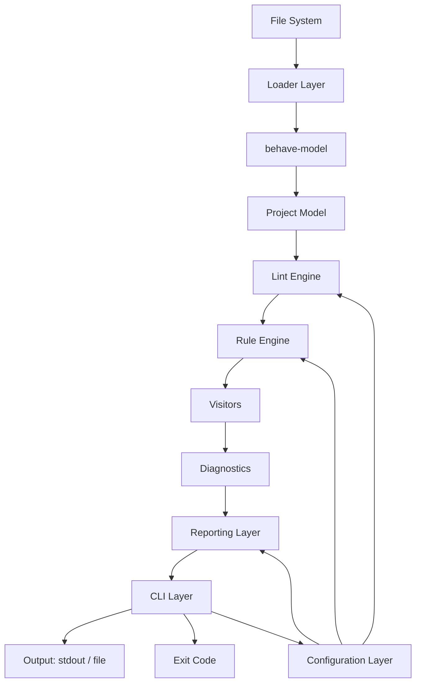
```mermaid
graph TD
    FS[File System] --> LOADER[Loader Layer]
    LOADER --> BM[behave-model]
    BM --> PROJECT[Project Model]
    PROJECT --> ENGINE[Lint Engine]
    ENGINE --> RULES[Rule Engine]
    RULES --> VISITORS[Visitors]
    VISITORS --> DIAGNOSTICS[Diagnostics]
    DIAGNOSTICS --> REPORTERS[Reporting Layer]
    REPORTERS --> CLI[CLI Layer]
    CLI --> OUTPUT[Output: stdout / file]
    CLI --> EXIT[Exit Code]

    CONFIG[Configuration Layer] --> ENGINE
    CONFIG --> RULES
    CONFIG --> REPORTERS
    CLI --> CONFIG
```

### Execution Flow

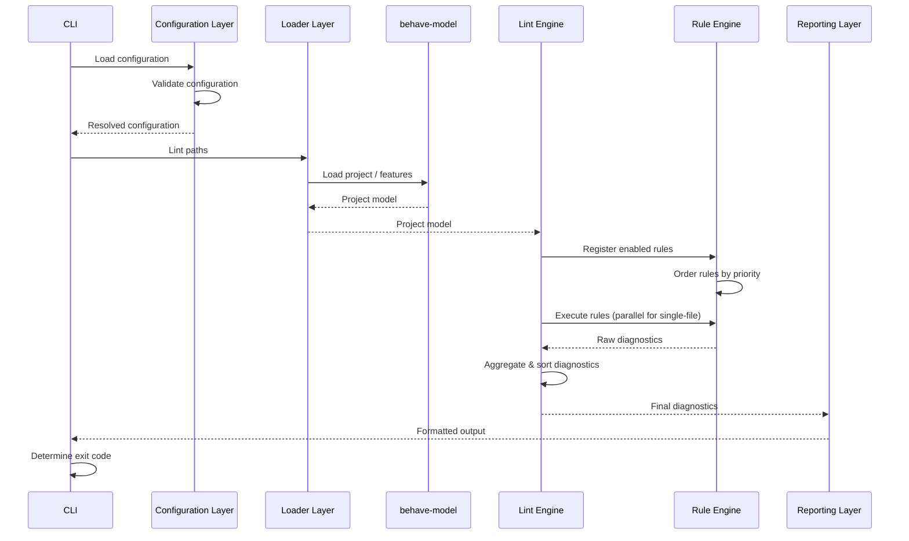
```mermaid
sequenceDiagram
    participant CLI
    participant Config as Configuration Layer
    participant Loader as Loader Layer
    participant BM as behave-model
    participant Engine as Lint Engine
    participant Rules as Rule Engine
    participant Reporters as Reporting Layer

    CLI->>Config: Load configuration
    Config->>Config: Validate configuration
    Config-->>CLI: Resolved configuration

    CLI->>Loader: Lint paths
    Loader->>BM: Load project / features
    BM-->>Loader: Project model
    Loader-->>Engine: Project model

    Engine->>Rules: Register enabled rules
    Rules->>Rules: Order rules by priority
    Engine->>Rules: Execute rules (parallel for single-file)
    Rules-->>Engine: Raw diagnostics
    Engine->>Engine: Aggregate & sort diagnostics
    Engine-->>Reporters: Final diagnostics
    Reporters-->>CLI: Formatted output
    CLI->>CLI: Determine exit code
```

### Layer Summary

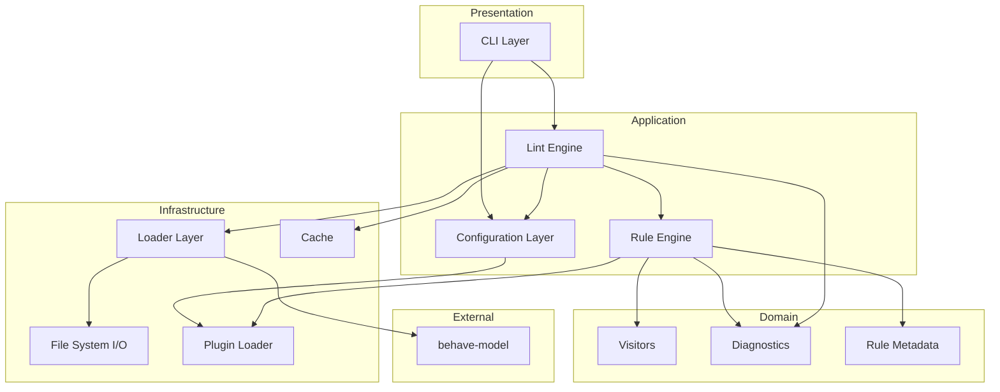
```mermaid
graph TB
    subgraph Presentation
        CLI[CLI Layer]
    end

    subgraph Application
        ENGINE[Lint Engine]
        RULES[Rule Engine]
        CONFIG[Configuration Layer]
    end

    subgraph Domain
        VISITORS[Visitors]
        DIAGNOSTICS[Diagnostics]
        RULE_META[Rule Metadata]
    end

    subgraph Infrastructure
        LOADER[Loader Layer]
        CACHE[Cache]
        FS[File System I/O]
        PLUGINS[Plugin Loader]
    end

    subgraph External
        BM[behave-model]
    end

    CLI --> ENGINE
    CLI --> CONFIG
    ENGINE --> RULES
    ENGINE --> CONFIG
    RULES --> VISITORS
    RULES --> DIAGNOSTICS
    RULES --> RULE_META
    ENGINE --> DIAGNOSTICS
    ENGINE --> LOADER
    ENGINE --> CACHE
    LOADER --> BM
    LOADER --> FS
    CONFIG --> PLUGINS
    RULES --> PLUGINS
```

### Layer Descriptions

| Layer | Responsibility | Depends on |
|---|---|---|
| CLI | Argument parsing, orchestration, exit codes | Application layer |
| Lint Engine | Pipeline orchestration, rule scheduling, diagnostic aggregation | Domain, Infrastructure |
| Rule Engine | Rule registration, discovery, execution, isolation | Domain |
| Configuration | Loading, validation, merging, defaults | Infrastructure |
| Visitors | Tree traversal, node dispatching | behave-model |
| Diagnostics | Creation, aggregation, filtering, sorting | Domain |
| Reporting | Output formatting (console, JSON, Markdown, SARIF) | Diagnostics |
| Loader | File discovery, behave-model invocation, caching | behave-model, File System |
| Cache | Content hashing, cache storage, invalidation | File System |

### Design Validation

**Why a pipeline?** A linear pipeline is the simplest architecture
that satisfies the requirements. Each stage has one responsibility,
stages are independently testable, and data flows in one direction.
The pipeline is easy to reason about, easy to parallelize, and easy
to extend (new stages can be inserted without affecting existing
ones).

**Alternatives considered:**

- *Event-driven architecture:* Rules could subscribe to events
  emitted during tree traversal. This was rejected because it makes
  execution order non-deterministic, complicates caching, and makes
  debugging difficult. The pipeline provides explicit control over
  execution order.

- *Microkernel architecture:* The core could be a minimal kernel
  with all functionality provided by plugins. This was rejected for
  v1 because it adds complexity without clear benefit. The
  architecture supports plugins (Section 13) but does not require
  everything to be a plugin.

- *Actor model:* Rules could be actors communicating via message
  passing. This was rejected because it adds concurrency complexity
  without clear benefit for a CPU-bound workload. The simpler
  thread-pool parallelism model is sufficient.

**Trade-offs:** The pipeline architecture is less flexible than
event-driven or actor-based approaches for complex inter-rule
dependencies. However, rules are designed to be independent (each
rule is a pure function of project + configuration), so this
limitation does not affect the rule set.

**Future impact:** The pipeline can be extended with new stages
(e.g., a fix-application stage for auto-fix) without restructuring.
Parallelism can be increased by parallelizing additional stages. The
pipeline can be split across processes for distributed analysis
(future).

---

## 4. Architectural Layers

### Layer Overview

The architecture is organized into five logical layers, each with a
distinct responsibility and dependency direction. Dependencies flow
**inward and downward** — outer layers depend on inner layers, never
the reverse.

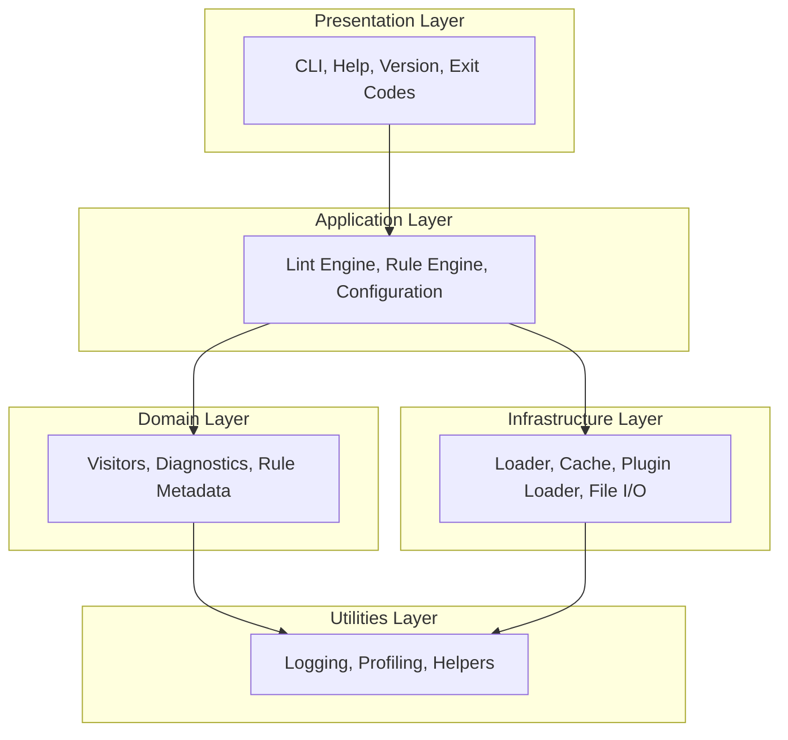
```mermaid
graph TB
    subgraph "Presentation Layer"
        P[CLI, Help, Version, Exit Codes]
    end

    subgraph "Application Layer"
        A[Lint Engine, Rule Engine, Configuration]
    end

    subgraph "Domain Layer"
        D[Visitors, Diagnostics, Rule Metadata]
    end

    subgraph "Infrastructure Layer"
        I[Loader, Cache, Plugin Loader, File I/O]
    end

    subgraph "Utilities Layer"
        U[Logging, Profiling, Helpers]
    end

    P --> A
    A --> D
    A --> I
    D --> U
    I --> U
```

### Presentation Layer

**Responsibility:** User interaction. Parses CLI arguments, displays
output, determines exit codes. This is the only layer that interacts
with the terminal.

**Components:**

- Argument parser
- Help text renderer
- Version printer
- Exit code manager
- Output dispatcher (routes to reporters)

**Dependencies:** Application layer (lint engine, configuration),
reporting layer (for output formatting).

**Communication:** The presentation layer receives user input (CLI
arguments), translates it into configuration and execution requests,
passes them to the application layer, and renders the results.

**Design validation:** The presentation layer is thin — it contains
no business logic. This ensures that the tool can be embedded in
other contexts (e.g., a library, an LSP server) without dragging in
CLI-specific code. The alternative — embedding CLI logic in the
engine — was rejected because it would prevent reuse in non-CLI
contexts.

### Application Layer

**Responsibility:** Orchestrates the linting process. Manages the
lifecycle of the lint engine, rule registration, configuration
resolution, and diagnostic aggregation.

**Components:**

- Lint engine (pipeline orchestrator)
- Rule engine (rule registry, scheduler, executor)
- Configuration manager (loader, validator, merger)

**Dependencies:** Domain layer (visitors, diagnostics, rule
metadata), infrastructure layer (loader, cache, plugin loader).

**Communication:** The application layer receives a lint request
(paths + configuration) from the presentation layer, coordinates
the loader, rule engine, and diagnostic aggregation, and returns a
diagnostic set to the presentation layer.

**Design validation:** The application layer contains the "policy" —
*what* to do and *in what order*. It does not contain "mechanism" —
*how* to parse files, *how* to traverse trees, *how* to format
output. This separation ensures that policy can change (e.g.,
reordering rules, adding caching) without affecting mechanisms.

### Domain Layer

**Responsibility:** Defines the core domain concepts of behave-lint:
visitors (tree traversal patterns), diagnostics (issue
representation), and rule metadata (rule identity and
documentation).

**Components:**

- Visitor abstractions
- Diagnostic model
- Rule metadata model
- Severity and category definitions

**Dependencies:** Utilities layer only. This layer has no
dependencies on infrastructure or application layers. It depends on
`behave-model` for type references but not for runtime behavior.

**Communication:** The domain layer is passive — it defines data
structures and interfaces that the application and infrastructure
layers use. It does not initiate communication.

**Design validation:** The domain layer is the most stable layer —
its concepts change rarely. By isolating domain concepts from
infrastructure, the architecture ensures that changes to I/O,
caching, or plugin loading do not affect the core domain model. This
is the Dependency Inversion Principle applied at the architectural
level.

### Infrastructure Layer

**Responsibility:** Provides technical capabilities that support the
application layer: file system access, caching, plugin discovery,
and `behave-model` integration.

**Components:**

- Loader (file discovery, `behave-model` invocation)
- Cache (content hashing, storage, invalidation)
- Plugin loader (entry point discovery, registration)
- File system utilities

**Dependencies:** `behave-model` (external), utilities layer, domain
layer (for type references).

**Communication:** The infrastructure layer is invoked by the
application layer. It returns domain objects (project models,
diagnostics) to the application layer. It never invokes the
application layer directly.

**Design validation:** Infrastructure is isolated from application
logic. This ensures that infrastructure changes (e.g., switching
from `pickle` to `msgpack` for cache serialization) do not affect
the lint engine or rule engine. The alternative — embedding
infrastructure in the application layer — was rejected because it
creates tight coupling and makes testing difficult (you cannot mock
the file system if it's embedded in the engine).

### Utilities Layer

**Responsibility:** Cross-cutting concerns used by all layers:
logging, profiling, timing, path normalization, and other helper
functionality.

**Components:**

- Logger
- Profiler
- Timer
- Path utilities
- String utilities

**Dependencies:** None (this layer depends only on the Python
standard library).

**Communication:** Utilities are passive — they are imported and
used by other layers. They do not communicate upward.

**Design validation:** The utilities layer is the innermost layer
and has no dependencies on other layers. This prevents dependency
cycles. The alternative — using third-party utilities — was rejected
to minimize the dependency footprint and ensure the tool can run in
restricted environments.

### Dependency Rules

1. **Dependencies flow inward.** Outer layers may depend on inner
   layers. Inner layers may not depend on outer layers.
2. **No skip-level dependencies.** The presentation layer depends on
   the application layer, not directly on the domain or
   infrastructure layers.
3. **No circular dependencies.** If a cycle is detected, it
   indicates a design error and must be resolved by extracting a
   shared component into a lower layer.
4. **External dependencies are isolated.** `behave-model` is accessed
   only through the infrastructure layer. No other layer imports
   `behave-model` directly.

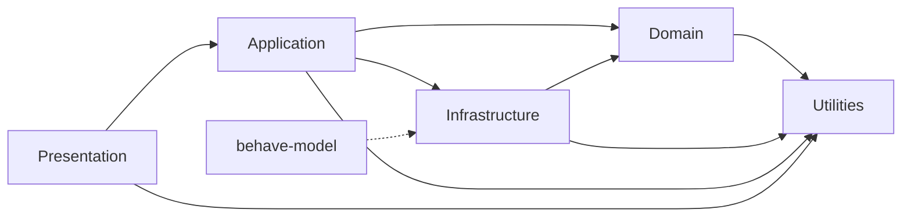
```mermaid
graph LR
    P[Presentation] --> A[Application]
    A --> D[Domain]
    A --> I[Infrastructure]
    I --> D
    D --> U[Utilities]
    I --> U
    A --> U
    P --> U

    BM[behave-model] -.-> I
```

---

## 5. Domain Model Integration

### Integration Principle

behave-lint integrates with `behave-model` through **composition, not
inheritance**. The loader layer calls `behave-model`'s loading
functions and receives a parsed `Project` (or individual `Feature`
objects). These objects are passed to the lint engine and rules as
read-only inputs.

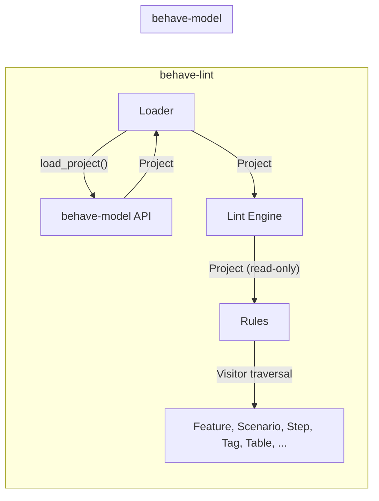
```mermaid
graph LR
    subgraph "behave-lint"
        LOADER[Loader] --> |"load_project()"| BM
        BM --> |"Project"| LOADER
        LOADER --> |"Project"| ENGINE[Lint Engine]
        ENGINE --> |"Project (read-only)"| RULES[Rules]
        RULES --> |"Visitor traversal"| BM_TYPES[behave-model types]
    end

    subgraph "behave-model"
        BM[behave-model API]
        BM_TYPES[Feature, Scenario, Step, Tag, Table, ...]
    end
```

### What behave-lint Uses from behave-model

| behave-model export | Usage in behave-lint |
|---|---|
| `load_project` / `load_feature` | Loader layer calls these to parse `.feature` files. |
| `Project`, `Feature`, `Scenario`, `Step`, `Tag`, `Table`, `DocString` | Domain types used by rules for analysis. |
| `Visitor` pattern | Rules use visitors to traverse the project tree. |
| `ValidationRule`, `ValidationIssue`, `Validator` | behave-lint extends these with richer metadata, configuration, and plugin support. |

### What behave-lint Does NOT Do

- **Never parses `.feature` files directly.** All parsing is
  delegated to `behave-model`.
- **Never constructs domain objects.** behave-lint consumes the
  objects produced by `behave-model`; it never creates `Feature`,
  `Scenario`, or `Step` instances.
- **Never modifies the project tree.** Rules receive a read-only
  reference to the project. The architecture enforces this by
  convention (rules are designed as pure functions) and may enforce
  it technically in the future (immutable wrappers).
- **Never duplicates Gherkin knowledge.** Gherkin grammar rules,
  keyword mappings, and language support are `behave-model`'s
  responsibility.

### Validation Framework Extension

`behave-model` provides a `ValidationRule` base class and a
`Validator` orchestrator. behave-lint extends this framework:

- `behave-model`'s `ValidationRule` provides a `check` method that
  receives a project element and returns `ValidationIssue` objects.
- behave-lint's rule engine wraps this concept with additional
  metadata (rule ID, category, severity, configuration, lifecycle
  state, auto-fix capability) and a richer execution model
  (parallel execution, caching, isolation).
- `behave-model`'s `ValidationIssue` is extended with additional
  fields (suggestion, doc_url, end_line, end_column) to support
  richer diagnostics and machine-readable output.

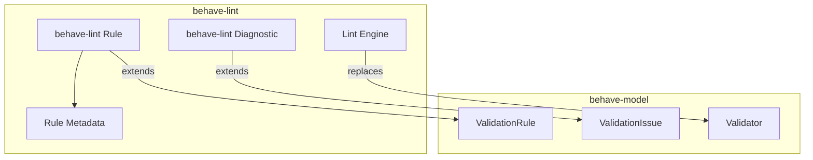
```mermaid
graph TB
    subgraph "behave-model"
        VRule[ValidationRule]
        VIssue[ValidationIssue]
        Validator[Validator]
    end

    subgraph "behave-lint"
        BLRule[behave-lint Rule]
        BLIssue[behave-lint Diagnostic]
        BLEngine[Lint Engine]
        BLMeta[Rule Metadata]

        BLRule -->|extends| VRule
        BLIssue -->|extends| VIssue
        BLEngine -->|replaces| Validator
        BLRule --> BLMeta
    end
```

### Design Validation

**Why composition?** Composition allows behave-lint to use
`behave-model`'s types without being tightly coupled to its
implementation. If `behave-model` changes its internal representation,
behave-lint is unaffected as long as the public API remains stable.

**Alternatives considered:**

- *Inheritance:* behave-lint's rules could inherit from
  `behave-model`'s `ValidationRule`. This is partially used (behave-lint
  rules extend the concept), but deep inheritance hierarchies are
  avoided in favor of composition for the engine itself.

- *Adapter pattern:* An adapter could wrap `behave-model`'s types to
  insulate behave-lint from API changes. This was rejected because it
  adds an indirection layer with no clear benefit — the
  `behave-model` API is designed to be stable, and an adapter would
  duplicate its type surface.

- *Forking:* behave-lint could fork `behave-model` and embed it. This
  was emphatically rejected — it would violate the ecosystem's core
  principle of a single source of truth.

**Trade-offs:** behave-lint is dependent on `behave-model`'s API
stability. If `behave-model` makes breaking changes, behave-lint must
adapt. This is mitigated by co-maintainership and version pinning.

**Future impact:** If `behave-model` adds new domain types (e.g.,
`ExampleBlock` for Gherkin v7), behave-lint can immediately use them
without changes to the loader or engine — only new rules need to be
written.

---

## 6. Lint Engine

### Responsibility

The lint engine is the **pipeline orchestrator**. It coordinates the
entire linting process from project loading through diagnostic
aggregation. It does not contain rule logic or output formatting —
it delegates to the rule engine and reporting layer respectively.

### Lifecycle

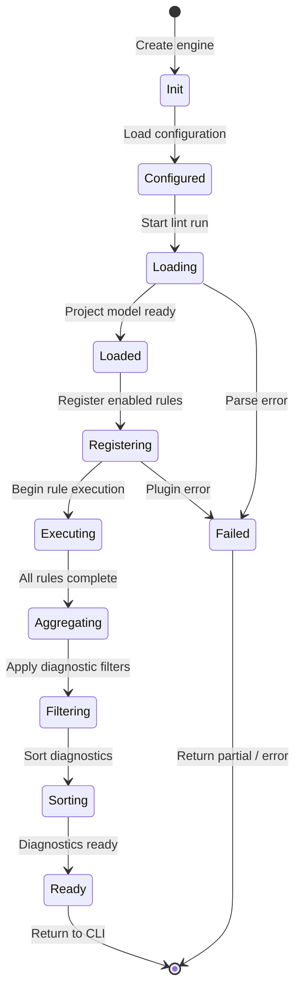
```mermaid
stateDiagram-v2
    [*] --> Init: Create engine
    Init --> Configured: Load configuration
    Configured --> Loading: Start lint run
    Loading --> Loaded: Project model ready
    Loaded --> Registering: Register enabled rules
    Registering --> Executing: Begin rule execution
    Executing --> Aggregating: All rules complete
    Aggregating --> Filtering: Apply diagnostic filters
    Filtering --> Sorting: Sort diagnostics
    Sorting --> Ready: Diagnostics ready
    Ready --> [*]: Return to CLI
    Loading --> Failed: Parse error
    Registering --> Failed: Plugin error
    Failed --> [*]: Return partial / error
```

### Execution Flow

The lint engine executes the following steps in order:

1. **Initialize:** Create the engine with a resolved configuration.
2. **Load:** Invoke the loader to discover `.feature` files and parse
   them via `behave-model`. The loader returns a `Project` object
   (or a collection of `Feature` objects for partial loading).
3. **Register:** Query the rule engine for all enabled rules (based
   on configuration). The rule engine returns an ordered list of
   rule instances with their metadata.
4. **Execute:** Run rules according to the execution strategy
   (parallel for single-file rules, sequential for cross-file rules).
   Each rule receives the project model (or a subset) and returns
   raw diagnostics.
5. **Aggregate:** Collect all raw diagnostics from all rules into a
   single set.
6. **Filter:** Apply diagnostic filters (severity thresholds, inline
   disable comments, file-level exclusions).
7. **Sort:** Sort diagnostics by file path, line number, rule ID.
8. **Return:** Pass the final diagnostic set to the reporting layer.

### Registration

Rules are registered with the rule engine, not the lint engine. The
lint engine queries the rule engine for enabled rules at the start
of each run. This separation ensures that rule registration is
independent of the execution lifecycle — rules can be registered at
import time (built-in rules) or at plugin load time (plugin rules).

### Rule Execution Strategy

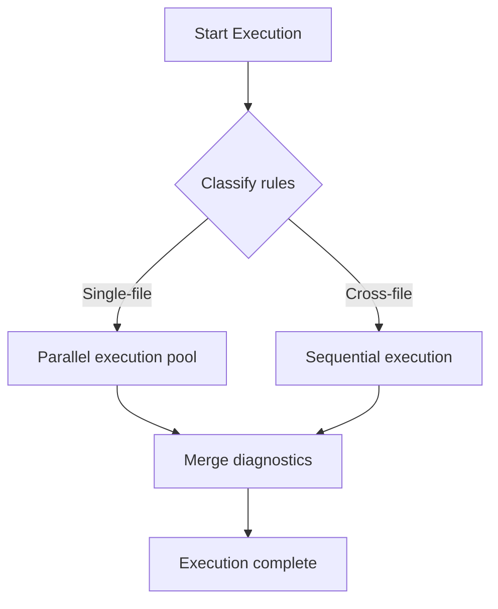
```mermaid
graph TD
    START[Start Execution] --> CLASSIFY{Classify rules}
    CLASSIFY -->|Single-file| PARALLEL[Parallel execution pool]
    CLASSIFY -->|Cross-file| SEQUENTIAL[Sequential execution]
    PARALLEL --> MERGE[Merge diagnostics]
    SEQUENTIAL --> MERGE
    MERGE --> DONE[Execution complete]
```

Rules are classified into two categories for execution:

- **Single-file rules:** Rules that analyze one feature file at a
  time. These can be executed in parallel — each rule+feature pair
  is an independent unit of work. This is the majority of rules.
- **Cross-file rules:** Rules that require access to all features
  simultaneously (e.g., duplicate step detection, tag taxonomy
  consistency). These are executed sequentially after all
  single-file rules complete.

The execution strategy uses a thread pool for parallel execution.
The number of workers is configurable (default: CPU core count).
Parallel execution is deterministic — results are merged in a
stable order regardless of completion timing.

### Caching

The lint engine integrates with the cache layer to avoid re-analyzing
unchanged files. The cache operates at the file level:

- **Cache key:** File content hash + configuration hash + behave-model
  version + behave-lint version.
- **Cache value:** Diagnostics produced for that file under that
  configuration.
- **Cache invalidation:** Automatic when any component of the cache
  key changes.

Cross-file rules are not cached at the file level — they require the
full project. The cache stores their results at the project level
(project hash + configuration hash).

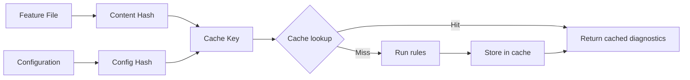
```mermaid
graph LR
    FILE[Feature File] --> HASH[Content Hash]
    CONFIG[Configuration] --> CHASH[Config Hash]
    HASH --> KEY[Cache Key]
    CHASH --> KEY
    KEY --> LOOKUP{Cache lookup}
    LOOKUP -->|Hit| RETURN[Return cached diagnostics]
    LOOKUP -->|Miss| ANALYZE[Run rules]
    ANALYZE --> STORE[Store in cache]
    STORE --> RETURN
```

### Future Extensibility

The lint engine is designed to support future features without
structural changes:

- **Auto-fix:** A new stage between execution and aggregation that
  applies fixes to the project model (or a copy of it).
- **Incremental execution:** Only re-run rules for files that changed
  since the last run (requires cache support for rule-level
  invalidation).
- **Distributed execution:** The parallel execution pool can be
  replaced with a distributed task queue for very large repositories.
- **Watch mode:** The engine can be invoked repeatedly with a
  subset of changed files, reusing cached results for unchanged
  files.

### Design Validation

**Why a separate engine and rule engine?** The lint engine handles
*orchestration* (what happens when), while the rule engine handles
*rule management* (which rules exist, how they are registered, how
they are discovered). Separating these concerns allows the
orchestration logic to change (e.g., adding caching, parallelism)
without affecting rule management, and vice versa.

**Alternatives considered:**

- *Monolithic engine:* A single engine that handles both
  orchestration and rule management. Rejected because it violates
  the Single Responsibility Principle and makes both concerns harder
  to test independently.

- *Event-driven execution:* Rules could be triggered by events
  emitted during tree traversal. Rejected because it makes execution
  order non-deterministic and complicates caching.

**Trade-offs:** The two-engine design adds a layer of indirection.
The lint engine must query the rule engine for rules, which is a
minor overhead. This is acceptable because it occurs once per run,
not once per file.

**Future impact:** The separation enables future replacement of the
rule engine (e.g., a Rust-based rule executor) without affecting the
lint engine's orchestration logic.

---

## 7. Rule Engine

### Responsibility

The rule engine manages the **lifecycle of rules** — discovery,
registration, metadata, execution, and isolation. It is the
component that knows *which rules exist* and *how to run them*. It
does not know *what* the rules check — that is the responsibility of
individual rules.

### Rule Discovery

Rules are discovered through two mechanisms:

1. **Built-in rules:** Discovered at import time through explicit
   registration. The rule engine maintains a registry of all
   built-in rules, keyed by rule ID.
2. **Plugin rules:** Discovered through Python entry points. The
   plugin loader scans installed packages for behave-lint rule entry
   points and registers them with the rule engine.

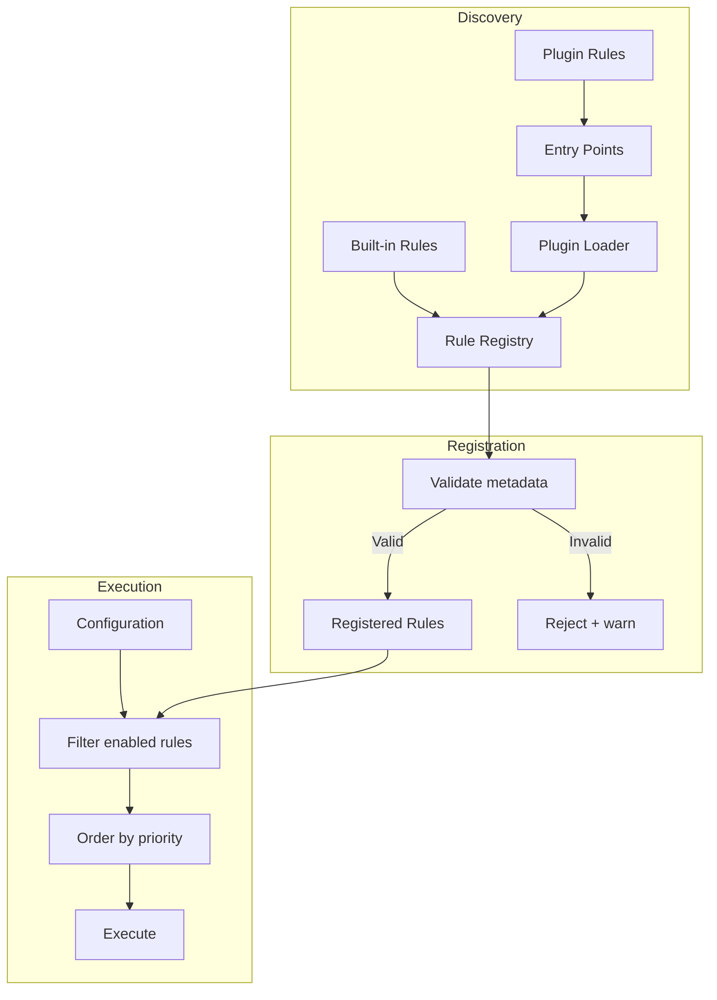
```mermaid
graph TD
    subgraph "Discovery"
        BUILTIN[Built-in Rules] --> REGISTRY[Rule Registry]
        PLUGINS[Plugin Rules] --> ENTRY[Entry Points]
        ENTRY --> LOADER[Plugin Loader]
        LOADER --> REGISTRY
    end

    subgraph "Registration"
        REGISTRY --> VALIDATE[Validate metadata]
        VALIDATE -->|Valid| REGISTERED[Registered Rules]
        VALIDATE -->|Invalid| REJECT[Reject + warn]
    end

    subgraph "Execution"
        CONFIG[Configuration] --> FILTER[Filter enabled rules]
        REGISTERED --> FILTER
        FILTER --> ORDER[Order by priority]
        ORDER --> EXEC[Execute]
    end
```

### Rule Registration

When a rule is registered, the rule engine validates its metadata:

- **Rule ID:** Must be unique, must follow the naming convention
  (`B<category><number>` for built-in, `<prefix><number>` for
  plugins).
- **Category:** Must be a known category (correctness, style,
  complexity, consistency, pedantic, step definitions).
- **Severity:** Must be one of: error, warning, info, off.
- **Name:** Must be non-empty.
- **Description:** Must be non-empty.
- **Since:** Must be a valid version string.

If metadata is invalid, the rule is rejected and a warning is
emitted. Invalid rules do not prevent the tool from running.

### Rule Metadata

Each rule carries metadata that drives:

- **Configuration:** Rule ID, category, default severity, and
  configurable parameters.
- **Documentation:** Name, description, rationale, examples, auto-fix
  capability, since version, deprecation status.
- **Execution:** Scope (single-file vs. cross-file), priority
  (execution order within a category), dependencies (rules that must
  run first).
- **Reporting:** Rule ID, category, severity, doc_url.

Metadata is immutable once a rule is stable. Changes to metadata
require a new rule ID (for behavior changes) or a minor version bump
(for documentation changes).

### Rule Execution

The rule engine executes rules according to the strategy defined by
the lint engine:

1. **Filter:** Only enabled rules (based on configuration) are
   executed. Disabled rules are not loaded, not instantiated, and not
   executed.
2. **Order:** Rules are ordered by category (correctness first, then
   style, complexity, consistency, pedantic, step definitions) and
   then by rule ID within each category.
3. **Classify:** Rules are classified as single-file or cross-file.
4. **Execute:** Single-file rules are executed in parallel. Cross-file
   rules are executed sequentially after all single-file rules
   complete.
5. **Collect:** Diagnostics from all rules are collected and returned
   to the lint engine.

### Rule Isolation

Rules are isolated from each other:

- **No shared state:** Rules do not communicate with each other. Each
  rule receives the project model and its own configuration.
- **No side effects:** Rules must not modify the project model. The
  architecture enforces this by convention and may enforce it
  technically in the future (immutable wrappers or deep copies).
- **Failure isolation:** If a rule raises an exception, the rule
  engine catches it, logs the error, and continues with other rules.
  The failed rule produces no diagnostics for that run.
- **Output isolation:** Each rule produces its own diagnostics. The
  rule engine merges diagnostics from all rules but does not allow
  rules to modify or filter each other's diagnostics.

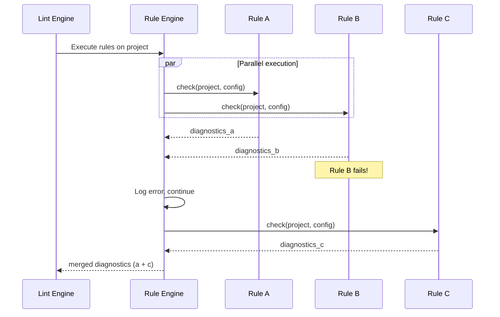
```mermaid
sequenceDiagram
    participant Engine as Lint Engine
    participant RuleEngine as Rule Engine
    participant Rule1 as Rule A
    participant Rule2 as Rule B
    participant Rule3 as Rule C

    Engine->>RuleEngine: Execute rules on project
    par Parallel execution
        RuleEngine->>Rule1: check(project, config)
        RuleEngine->>Rule2: check(project, config)
    end
    Rule1-->>RuleEngine: diagnostics_a
    Rule2-->>RuleEngine: diagnostics_b
    Note over Rule2: Rule B fails!
    RuleEngine->>RuleEngine: Log error, continue
    RuleEngine->>Rule3: check(project, config)
    Rule3-->>RuleEngine: diagnostics_c
    RuleEngine-->>Engine: merged diagnostics (a + c)
```

### Rule Dependencies

Rules are designed to be independent. However, the architecture
supports optional rule dependencies for future use:

- A rule may declare that it depends on another rule having run
  first. The rule engine ensures dependency order.
- Circular dependencies are detected at registration time and
  rejected.
- Dependencies are a future feature. In v1, all rules are
  independent.

### Rule Versioning

- Each rule has a `since` version (when it was introduced).
- Rule behavior changes (not bug fixes) require a new rule ID. The
  old rule is deprecated; the new rule is introduced with a new ID.
- Bug fixes (where a rule was not doing what it was supposed to do)
  do not require a new rule ID.
- Deprecated rules remain functional but emit a deprecation warning.
- Removed rules (removed in a major version) have their IDs
  permanently retired.

### Rule Lifecycle

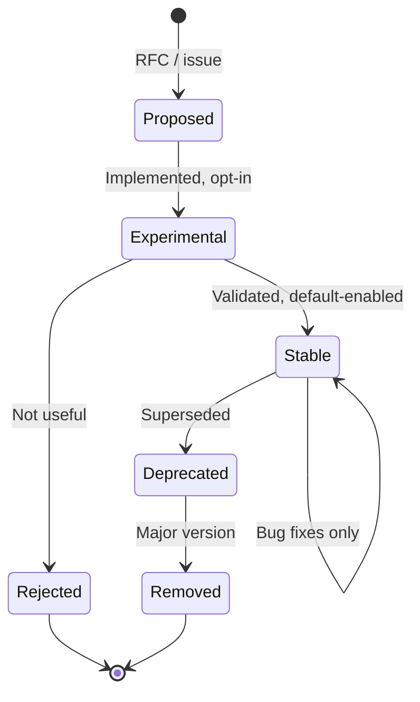
```mermaid
stateDiagram-v2
    [*] --> Proposed: RFC / issue
    Proposed --> Experimental: Implemented, opt-in
    Experimental --> Stable: Validated, default-enabled
    Experimental --> Rejected: Not useful
    Stable --> Deprecated: Superseded
    Deprecated --> Removed: Major version
    Stable --> Stable: Bug fixes only
    Rejected --> [*]
    Removed --> [*]
```

### Rule Categories and Identifiers

| Category | Code | Description | Default severity |
|---|---|---|---|
| Correctness | `C` | Definitively wrong structures | error |
| Style | `S` | Stylistic conventions | warning |
| Complexity | `X` | Overly complex specifications | warning |
| Consistency | `K` | Cross-file consistency | warning |
| Pedantic | `P` | Strict best practices (opt-in) | off |
| Step Definitions | `D` | Cross-reference with step defs | warning |

Rule IDs: `B<category><number>` (e.g., `BC001`). Plugin rules use
their own prefix (e.g., `ACME001`).

### Priorities

Within a category, rules are ordered by rule ID (ascending). The
architecture supports explicit priority overrides in configuration,
but this is rarely needed and not exposed in v1.

### Auto-Fix Capability

Each rule's metadata declares its auto-fix capability:

- **Not fixable:** The issue requires human judgment.
- **Safe fixable:** The fix does not change semantics (e.g.,
  normalizing keyword casing).
- **Unsafe fixable:** The fix may change semantics (e.g., removing
  unused tags). Requires `--unsafe-fixes`.

Auto-fix is a future feature (Phase 5). The metadata is defined now
to ensure rules are designed with auto-fix in mind.

### Future Plugin Rules

The rule engine is designed to accept plugin rules transparently:

- Plugin rules use the same interface as built-in rules.
- Plugin rules are discovered via entry points.
- Plugin rules are registered with the same validation.
- Plugin rules execute in the same pipeline.
- Plugin rules can be enabled/disabled in configuration using their
  plugin-prefixed ID.

The only difference between built-in and plugin rules is
distribution — built-in rules ship with behave-lint, plugin rules
ship as separate packages.

### Design Validation

**Why a separate rule engine?** The rule engine encapsulates all
rule management logic — discovery, registration, validation,
ordering, isolation. This keeps the lint engine focused on
orchestration and allows the rule engine to evolve independently
(e.g., adding new discovery mechanisms, changing execution strategy).

**Alternatives considered:**

- *Rules as functions:* Rules could be simple functions rather than
  objects with metadata. Rejected because metadata (ID, category,
  severity, description, examples) is essential for documentation,
  configuration, and CLI features (`--explain`, `--list-rules`).
  Functions cannot carry rich metadata naturally.

- *Rules as visitors:* Rules could be visitors that are called
  during tree traversal. Rejected because it conflates traversal
  (infrastructure) with analysis (domain). The architecture uses
  visitors *within* rules — a rule may use a visitor to traverse the
  tree, but the rule itself is not a visitor.

**Trade-offs:** The object-based rule design has slightly more
boilerplate than a function-based design. This is acceptable because
metadata is valuable and the boilerplate is minimal.

**Future impact:** The rule engine's separation from the lint engine
enables future features like rule profiling (measuring execution time
per rule), rule dependency graphs, and rule marketplace integration.

---

## 8. Visitors

### Responsibility

Visitors handle **tree traversal** — walking the `behave-model` project
tree and dispatching nodes to rules for analysis. The visitor
architecture provides a structured way to traverse Gherkin elements
without each rule implementing its own traversal logic.

### Traversal Model

behave-lint uses `behave-model`'s visitor pattern for tree traversal.
The visitor traverses the project tree in a deterministic order:

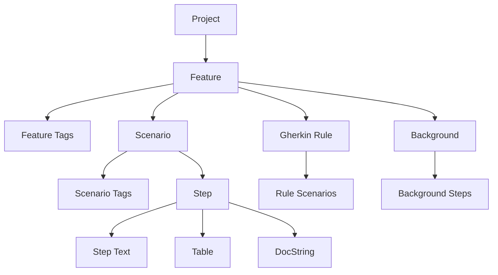
```mermaid
graph TD
    PROJECT[Project] --> FEATURE[Feature]
    FEATURE --> FEATURE_TAGS[Feature Tags]
    FEATURE --> BACKGROUND[Background]
    FEATURE --> RULE[Gherkin Rule]
    FEATURE --> SCENARIO[Scenario]
    SCENARIO --> SCENARIO_TAGS[Scenario Tags]
    SCENARIO --> STEP[Step]
    STEP --> STEP_TEXT[Step Text]
    STEP --> TABLE[Table]
    STEP --> DOCSTRING[DocString]
    RULE --> RULE_SCENARIOS[Rule Scenarios]
    BACKGROUND --> BG_STEPS[Background Steps]
```

The traversal order is:

1. Project → Feature
2. Feature → Tags
3. Feature → Background → Steps
4. Feature → Rule (if present) → Scenarios → Steps
5. Feature → Scenario → Tags → Steps → Table/DocString

This order is deterministic and documented. Rules that depend on
traversal order (e.g., a rule that checks step sequence) can rely on
it.

### Node Dispatching

The visitor dispatches nodes to handlers based on node type. Each
node type (Feature, Scenario, Step, Tag, Table, DocString) has a
corresponding handler method. Rules register handlers for the node
types they are interested in.

The dispatcher uses a type-based lookup:

- The visitor determines the node type.
- It looks up registered handlers for that type.
- It calls each handler with the node and the rule's context.
- Handlers return diagnostics (or none).

### Performance

Visitor performance is critical because the tree is traversed once
per rule (or once for all rules, depending on the execution
strategy). The architecture optimizes visitor performance through:

- **Single traversal:** When multiple rules need the same node types,
  the visitor traverses the tree once and dispatches to all
  interested rules. This is the default mode.
- **Early termination:** A rule can signal that it does not need to
  visit further nodes (e.g., a rule that only checks feature-level
  tags can skip the rest of the tree).
- **Lazy evaluation:** Nodes are visited only if at least one enabled
  rule has registered a handler for that node type. If no rule cares
  about `DocString` nodes, they are not visited.

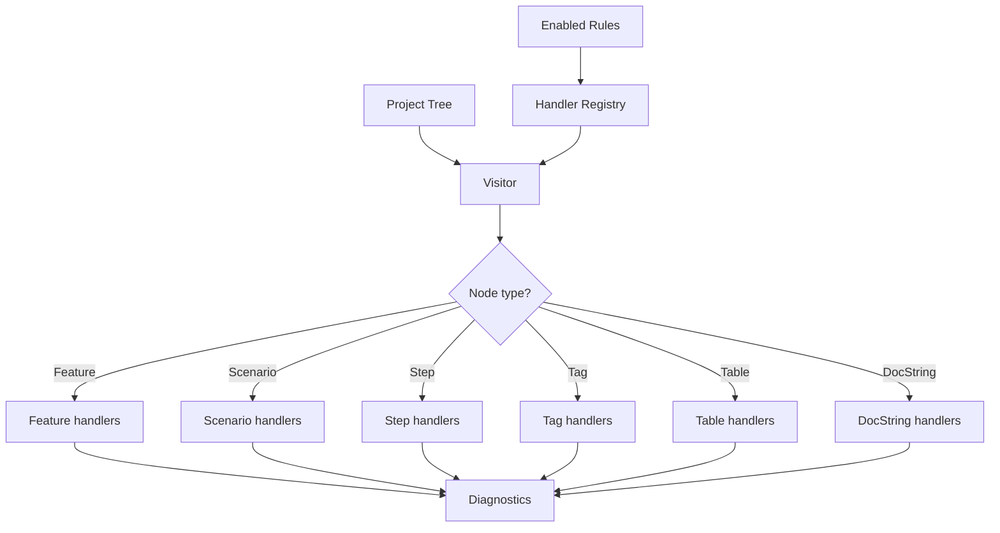
```mermaid
graph TD
    TREE[Project Tree] --> VISITOR[Visitor]
    CONFIG[Enabled Rules] --> HANDLERS[Handler Registry]
    HANDLERS --> VISITOR
    VISITOR --> NODE{Node type?}
    NODE -->|Feature| FH[Feature handlers]
    NODE -->|Scenario| SH[Scenario handlers]
    NODE -->|Step| STH[Step handlers]
    NODE -->|Tag| TH[Tag handlers]
    NODE -->|Table| TBH[Table handlers]
    NODE -->|DocString| DH[DocString handlers]
    FH --> DIAG[Diagnostics]
    SH --> DIAG
    STH --> DIAG
    TH --> DIAG
    TBH --> DIAG
    DH --> DIAG
```

### Custom Visitors

Rules can implement custom traversal logic for complex analysis that
does not fit the standard visitor pattern:

- A rule may traverse the tree multiple times (e.g., first pass to
  collect all step texts, second pass to check for duplicates).
- A rule may traverse a subset of the tree (e.g., only scenarios
  with a specific tag).
- A rule may use `behave-model`'s query API instead of visitors
  (e.g., querying all steps across all features).

Custom visitors are implemented by the rule itself. The visitor
architecture provides the standard traversal; rules are free to
implement their own traversal when needed.

### Visitor Lifecycle

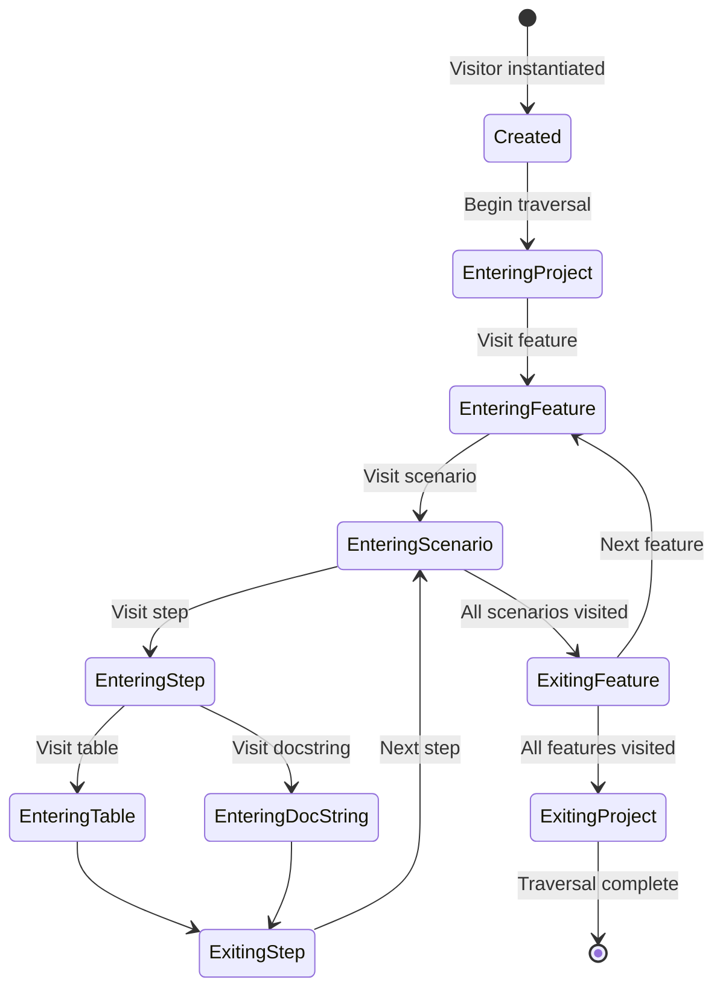
```mermaid
stateDiagram-v2
    [*] --> Created: Visitor instantiated
    Created --> EnteringProject: Begin traversal
    EnteringProject --> EnteringFeature: Visit feature
    EnteringFeature --> EnteringScenario: Visit scenario
    EnteringScenario --> EnteringStep: Visit step
    EnteringStep --> EnteringTable: Visit table
    EnteringStep --> EnteringDocString: Visit docstring
    EnteringTable --> ExitingStep
    EnteringDocString --> ExitingStep
    ExitingStep --> EnteringScenario: Next step
    EnteringScenario --> ExitingFeature: All scenarios visited
    ExitingFeature --> EnteringFeature: Next feature
    ExitingFeature --> ExitingProject: All features visited
    ExitingProject --> [*]: Traversal complete
```

### Design Validation

**Why use behave-model's visitor pattern?** `behave-model` already
provides a visitor pattern for tree traversal. Using it ensures
consistency with the ecosystem and avoids duplicating traversal
logic. The visitor pattern is well-suited for tree-structured data
and allows rules to focus on analysis rather than traversal.

**Alternatives considered:**

- *Rules traverse independently:* Each rule could traverse the tree
  itself. Rejected because it duplicates traversal logic and is
  slower (N traversals for N rules instead of 1 traversal for all
  rules).

- *Event-based dispatch:* The tree could be traversed once, emitting
  events for each node type. Rules could subscribe to events.
  Rejected because it is functionally equivalent to the visitor
  pattern but adds event infrastructure complexity.

- *Query API only:* Rules could use `behave-model`'s query API
  instead of visitors. This is supported (rules can use the query
  API for specific lookups), but visitors are more efficient for
  rules that need to examine every node of a type.

**Trade-offs:** The shared visitor traversal means all rules that
need the same node type are executed during the same traversal. This
is faster but means rules cannot short-circuit traversal for other
rules. The architecture mitigates this by allowing rules to signal
early termination for their own analysis.

**Future impact:** The visitor architecture can be extended to
support new node types (e.g., if Gherkin v7 adds new constructs)
without changing the rule interface. Rules that do not handle the
new node type are unaffected.

---

## 9. Diagnostics

### Responsibility

The diagnostics subsystem defines **how issues are represented,
collected, filtered, sorted, and serialized**. It is the data
backbone of the tool — every rule produces diagnostics, every
reporter consumes them.

### Diagnostic Lifecycle

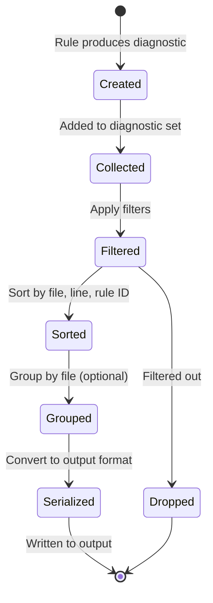
```mermaid
stateDiagram-v2
    [*] --> Created: Rule produces diagnostic
    Created --> Collected: Added to diagnostic set
    Collected --> Filtered: Apply filters
    Filtered --> Sorted: Sort by file, line, rule ID
    Sorted --> Grouped: Group by file (optional)
    Grouped --> Serialized: Convert to output format
    Serialized --> [*]: Written to output
    Filtered --> Dropped: Filtered out
    Dropped --> [*]
```

### Creation

Diagnostics are created by rules during execution. Each diagnostic
contains:

| Field | Required | Description |
|---|---|---|
| `rule_id` | Yes | Stable rule identifier (e.g., `BC001`). |
| `severity` | Yes | One of: error, warning, info. |
| `message` | Yes | Human-readable description. |
| `file_path` | Yes | Path to the `.feature` file. |
| `line` | Yes | 1-based line number. |
| `column` | Optional | 1-based column number. |
| `end_line` | Optional | End line for multi-line issues. |
| `end_column` | Optional | End column for multi-line issues. |
| `suggestion` | Optional | Human-readable fix suggestion. |
| `doc_url` | Optional | URL to rule documentation. |
| `category` | Yes | Rule category. |

Diagnostics are immutable once created. This ensures that filtering,
sorting, and serialization do not accidentally modify diagnostic
content.

### Aggregation

The lint engine aggregates diagnostics from all rules into a single
diagnostic set. Aggregation is a simple concatenation — no
deduplication or merging is performed at this stage.

### Filtering

After aggregation, diagnostics are filtered:

- **Severity threshold:** Diagnostics below the configured failure
  severity are retained in output but do not affect the exit code.
- **Inline disable comments:** Diagnostics suppressed by
  `# behave-lint: off` comments in feature files are removed.
- **File-level exclusions:** Diagnostics from files matching
  exclusion patterns are removed.
- **Rule-level exclusions:** Diagnostics from disabled rules are
  never produced (rules are not executed), but this filter serves as
  a safety net.

### Sorting

Diagnostics are sorted deterministically:

1. By file path (lexicographic).
2. By line number (ascending).
3. By column number (ascending, if present).
4. By rule ID (lexicographic).

This sort order is stable and documented. It ensures that output is
deterministic regardless of rule execution order or parallelism.

### Grouping

For output formats that benefit from grouping (e.g., Markdown,
HTML), diagnostics can be grouped by file. Grouping is a
presentation concern and is performed by the reporting layer, not
the diagnostic subsystem.

### Serialization

Diagnostics are serialized to output formats by the reporting layer.
The diagnostic subsystem provides a canonical representation that
reporters consume. Reporters are responsible for format-specific
serialization (JSON, console, Markdown, SARIF).

The diagnostic subsystem provides a stable, versioned schema for
machine-readable formats (JSON, SARIF). The schema version is
independent of the tool version.

### Design Validation

**Why immutable diagnostics?** Immutability prevents accidental
modification during filtering, sorting, or serialization. It also
ensures that the same diagnostic set can be consumed by multiple
reporters without interference.

**Alternatives considered:**

- *Mutable diagnostics with copy-on-write:* More complex with no
  clear benefit. Immutability is simpler and safer.

- *Streaming diagnostics (emit as produced):* Diagnostics could be
  streamed to reporters as they are produced, rather than buffered.
  Rejected for v1 because sorting requires the full set. Streaming
  is a future optimization for large projects (see Section 15).

**Trade-offs:** Buffering all diagnostics in memory has a memory
cost proportional to the number of issues. For typical projects
(hundreds of diagnostics), this is negligible. For projects with
thousands of diagnostics, streaming may be needed in the future.

**Future impact:** The diagnostic schema is designed to be
extensible — new fields can be added in minor versions without
breaking consumers. Consumers that do not understand a field must
ignore it gracefully.

---

## 10. Reporting Layer

### Responsibility

The reporting layer transforms diagnostic sets into **output
formats** consumed by humans, machines, and CI systems. Each
reporter is responsible for one output format.

### Reporter Architecture

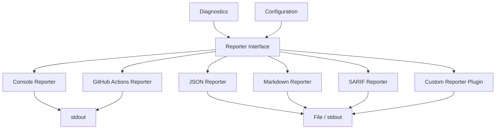
```mermaid
graph TD
    DIAG[Diagnostics] --> REPORTER[Reporter Interface]
    CONFIG[Configuration] --> REPORTER

    REPORTER --> CONSOLE[Console Reporter]
    REPORTER --> JSON[JSON Reporter]
    REPORTER --> MD[Markdown Reporter]
    REPORTER --> SARIF[SARIF Reporter]
    REPORTER --> GH[GitHub Actions Reporter]
    REPORTER --> CUSTOM[Custom Reporter Plugin]

    CONSOLE --> STDOUT[stdout]
    JSON --> FILE[File / stdout]
    MD --> FILE
    SARIF --> FILE
    GH --> STDOUT
    CUSTOM --> FILE
```

### Reporter Interface

All reporters implement the same interface:

- **Input:** Diagnostic set + summary metadata (tool version,
  configuration, timing, file count).
- **Output:** Formatted text written to a destination (stdout or
  file).
- **Contract:** The same diagnostic set always produces the same
  output for a given reporter.

Reporters do not modify diagnostics. They are pure transformations
from the canonical diagnostic representation to a specific format.

### Console Reporter

**Purpose:** Human-readable output for terminal use.

**Characteristics:**

- Colored severity labels (red, yellow, blue) with text fallback.
- `file:line:column` location format.
- Rule ID for quick identification.
- Summary line with counts and timing.
- Respects `--color` / `--no-color` and terminal detection.
- Output to stdout only.

**Design considerations:** The console reporter must handle
terminals of varying width (80+ columns). Long messages are wrapped
at the terminal width. The reporter detects whether stdout is a
terminal to enable/disable color automatically.

### JSON Reporter

**Purpose:** Machine-readable output for CI dashboards and custom
integrations.

**Characteristics:**

- Stable, versioned schema (`schemaVersion` field).
- Complete diagnostic information.
- Summary with counts by severity, rule, and category.
- Execution metadata (tool version, configuration, timing).
- Pretty-print or compact mode.
- Output to file or stdout.

**Design considerations:** The JSON schema is versioned
independently of the tool. Schema changes require a schema version
bump. Consumers must check `schemaVersion` and handle unknown
versions gracefully.

### Markdown Reporter

**Purpose:** Human-readable output for GitHub Actions summaries, PR
comments, and wikis.

**Characteristics:**

- Summary table with counts by severity.
- Diagnostic table with file, line, rule, severity, message.
- Collapsible sections for long lists.
- Links to rule documentation.
- Output to file or stdout.

### SARIF Reporter (Future)

**Purpose:** Standardized output for GitHub Code Scanning and
security platforms.

**Characteristics:**

- SARIF v2.1.0 compliant.
- Rule metadata embedded in the report.
- Inline location information.
- Output to file.

### GitHub Actions Reporter (Future)

**Purpose:** Inline PR annotations using GitHub Actions workflow
commands.

**Characteristics:**

- `::error` and `::warning` workflow commands.
- File, line, and column information.
- Limited to 10 annotations per file (GitHub limit).

### Future Formats

- **HTML:** Visual lint report with filtering and search.
- **JUnit XML:** For CI systems that consume JUnit results.
- **CSV:** For spreadsheet analysis.
- **Custom:** Via plugin reporters (entry points).

### Reporter Selection

Reporters are selected via configuration or CLI:

- `--output <format>` or `--output <format1>,<format2>` for multiple
  formats.
- `--output-file <path>` for file output (applies to non-console
  formats).
- `--json` as a shortcut for `--output json`.
- `--sarif` as a shortcut for `--output sarif`.

Multiple reporters can be active simultaneously (e.g., console to
stdout + JSON to file).

### Design Validation

**Why a reporter interface?** A common interface ensures that all
reporters receive the same data and produce deterministic output.
New reporters can be added without modifying the diagnostic system
or the lint engine.

**Alternatives considered:**

- *Template-based output:* Output could be generated from templates
  (e.g., Jinja2). Rejected because it adds a template dependency and
  templates are harder to test than code. The architecture may
  support template-based custom reporters in the future.

- *Single reporter with format flag:* One reporter with conditional
  logic for each format. Rejected because it violates the Single
  Responsibility Principle and makes testing difficult.

**Trade-offs:** Each reporter is a separate component, which means
more code. This is acceptable because each reporter is simple,
focused, and independently testable.

**Future impact:** The reporter interface enables plugin reporters
(Section 13). A plugin can register a new output format via entry
points, and the reporting layer will use it transparently.

---

## 11. Configuration Layer

### Responsibility

The configuration layer handles **loading, validating, merging, and
providing configuration** to all other layers. It is the single
source of truth for *what* the tool should do (which rules to
enable, what output format to use, where to look for files).

### Configuration Sources

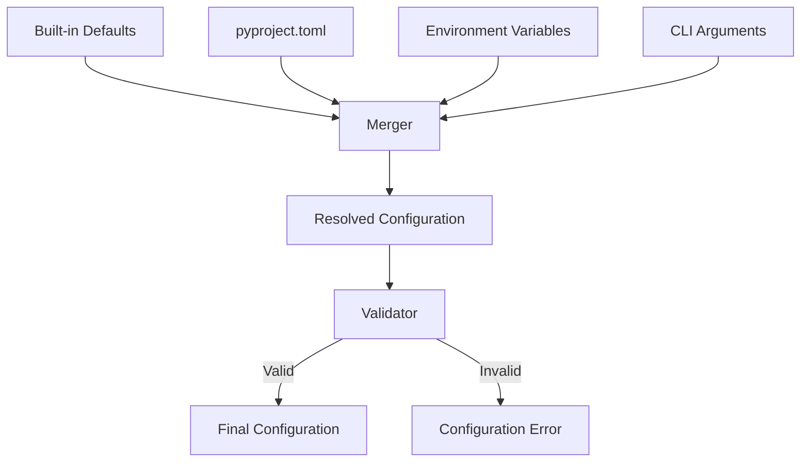
```mermaid
graph TD
    DEFAULTS[Built-in Defaults] --> MERGE[Merger]
    FILE[pyproject.toml] --> MERGE
    ENV[Environment Variables] --> MERGE
    CLI[CLI Arguments] --> MERGE
    MERGE --> RESOLVED[Resolved Configuration]
    RESOLVED --> VALIDATE[Validator]
    VALIDATE -->|Valid| FINAL[Final Configuration]
    VALIDATE -->|Invalid| ERROR[Configuration Error]
```

### Configuration Precedence

Precedence (highest to lowest):

1. **CLI arguments** — most explicit, most ephemeral.
2. **Environment variables** — useful for CI, less explicit than CLI.
3. **`pyproject.toml`** — project-level, version-controlled.
4. **Built-in defaults** — sensible fallbacks.

Precedence is **per-key**, not global. A CLI argument for output
format does not override a configuration file value for rule
selection.

### Configuration Loading

The configuration loader:

1. Locates `pyproject.toml` in the current directory or nearest
   ancestor.
2. Reads the `[tool.behave-lint]` section.
3. Reads environment variables with `BEHAVE_LINT_` prefix.
4. Receives CLI arguments from the presentation layer.
5. Merges all sources according to precedence.
6. Validates the merged configuration.

### Configuration Validation

Validation occurs at load time:

- **Unknown keys:** Produce a warning (forward compatibility).
- **Invalid values:** Produce an error with a clear message (e.g.,
  "Invalid severity 'critical'. Expected one of: error, warning,
  info, off").
- **Unknown rule IDs:** Produce a warning with a suggestion (e.g.,
  "Unknown rule 'B999'. Did you mean 'B009'?").
- **Missing required parameters:** Produce an error.

Configuration errors cause the tool to exit with code 2 and print
a clear, actionable error message to stderr. No diagnostics are
produced.

### Configuration Schema

The configuration schema includes:

- **Rule selection:** `select`, `ignore`, `severity` (per-rule
  overrides).
- **Rule parameters:** Rule-specific settings under
  `[tool.behave-lint.rules.<rule-id>]`.
- **Output:** `output` (format), `output-file` (path).
- **Paths:** `paths` (default lint paths), `step-definitions`
  (step defs directory).
- **Cache:** `cache` (enable/disable), `cache-dir`.
- **Plugins:** `[tool.behave-lint.plugins]` (enable/disable).

### Configuration Inheritance (Future)

v1 does not support configuration inheritance or presets. The
architecture is designed to support them in the future:

- **Presets:** `extends = "strict"` would inherit from a named
  preset.
- **Per-directory overrides:** Configuration could vary by
  directory (e.g., stricter rules for `features/critical/`).
- **Composition:** Multiple configuration files could be merged
  with explicit precedence.

These features are deferred to avoid premature complexity. The flat
configuration model is sufficient for v1 and can be extended without
breaking changes.

### Design Validation

**Why `pyproject.toml`?** It is the modern standard for Python tool
configuration, used by Ruff, Black, mypy, pytest, and
`behave-format`. Using it ensures consistency with the ecosystem and
reduces configuration file proliferation.

**Alternatives considered:**

- *`.behave-lint.toml`:* A dedicated configuration file. Rejected
  because it adds a new file to the project root and does not
  integrate with existing tooling.

- *`.editorconfig:* Too limited for rule configuration. Suitable
  for formatting conventions but not for rule selection and
  parameters.

- *YAML configuration:* Rejected because TOML is the Python
  standard and YAML adds a parsing dependency.

**Trade-offs:** `pyproject.toml` may not exist in projects that do
not use modern Python packaging. The tool handles this gracefully —
if no `pyproject.toml` is found, built-in defaults are used.

**Future impact:** The configuration layer is designed to support
additional sources (e.g., a dedicated `.behave-lint.toml` for
non-Python projects) without restructuring.

---

## 12. CLI Layer

### Responsibility

The CLI layer is the **presentation layer** — it parses user input,
orchestrates the linting process, and presents results. It contains
no business logic.

### Architecture

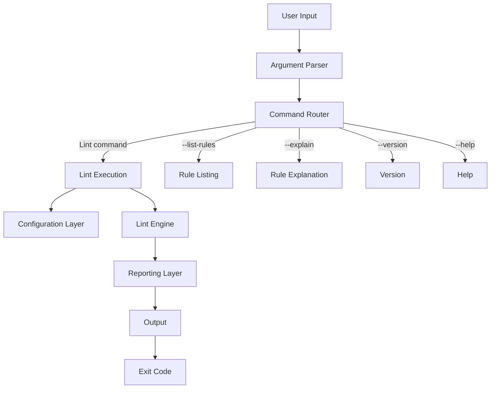
```mermaid
graph TD
    USER[User Input] --> PARSER[Argument Parser]
    PARSER --> ROUTER[Command Router]

    ROUTER -->|Lint command| LINT[Lint Execution]
    ROUTER -->|--list-rules| LIST[Rule Listing]
    ROUTER -->|--explain| EXPLAIN[Rule Explanation]
    ROUTER -->|--version| VERSION[Version]
    ROUTER -->|--help| HELP[Help]

    LINT --> CONFIG[Configuration Layer]
    LINT --> ENGINE[Lint Engine]
    ENGINE --> REPORTERS[Reporting Layer]
    REPORTERS --> OUTPUT[Output]
    OUTPUT --> EXIT[Exit Code]
```

### Command Routing

The CLI layer routes commands based on user input:

- **Lint command (default):** If paths or no special flags are
  provided, the CLI executes a lint run.
- **`--list-rules`:** Lists all available rules and exits. No
  linting is performed.
- **`--explain <rule-id>`:** Shows documentation for a specific rule
  and exits. No linting is performed.
- **`--version`:** Prints the tool version and exits.
- **`--help`:** Prints help text and exits.

### Argument Parsing

The argument parser processes:

- **Positional arguments:** Paths to lint (files or directories).
- **Flags:** `--select`, `--ignore`, `--output`, `--output-file`,
  `--color`, `--no-color`, `--quiet`, `--verbose`, `--statistics`,
  `--fix` (future), `--config`, `--no-cache`, `--clear-cache`.
- **Shortcuts:** `--json` (shortcut for `--output json`), `--sarif`
  (shortcut for `--output sarif`).

The parser is strict — unknown flags produce an error. This catches
typos early.

### Execution

For the lint command, the CLI layer:

1. Parses arguments.
2. Loads configuration (delegates to configuration layer).
3. Creates the lint engine with the resolved configuration.
4. Invokes the lint engine with the specified paths.
5. Receives diagnostics from the lint engine.
6. Passes diagnostics to the selected reporter(s).
7. Writes output to the specified destination(s).
8. Determines and returns the exit code.

### Error Handling

The CLI layer handles errors from all layers:

- **Configuration errors:** Print error to stderr, exit 2.
- **Parse errors:** Reported as diagnostics (rule `B000`), continue
  linting other files.
- **Internal errors:** Print error to stderr with guidance for
  filing a bug report, exit 2.
- **Rule execution errors:** Logged, continue with other rules,
  exit 0 or 1 based on remaining diagnostics.

### Exit Codes

| Code | Meaning |
|---|---|
| 0 | No diagnostics at or above the failure severity. |
| 1 | Diagnostics at or above the failure severity (default: error). |
| 2 | Internal error (configuration, parse, unexpected exception). |

### Design Validation

**Why a thin CLI layer?** The CLI layer contains no business logic
so that the same functionality can be accessed from other contexts
(library, LSP server, watch mode) without duplicating logic. The
alternative — embedding logic in the CLI — would prevent reuse.

**Alternatives considered:**

- *Subcommands (e.g., `behave-lint lint`, `behave-lint list-rules`):*
  Rejected for v1 because the tool has a single primary command
  (lint). Subcommands add complexity without benefit. The
  architecture supports adding subcommands in the future if needed.

- *Interactive CLI:* A REPL or interactive configuration wizard.
  Rejected for v1. The tool is designed for automation (CI, pre-
  commit). Interactive features may be added in the future.

**Trade-offs:** The thin CLI layer means that all logic is in lower
layers, which are accessible programmatically. This is a benefit for
embeddability but means the CLI is not the only entry point — the
library API must also be stable.

**Future impact:** The thin CLI design enables future LSP
integration (the LSP server uses the same application layer as the
CLI) and watch mode (the CLI can invoke the engine repeatedly
without restarting).

---

## 13. Extension System

### Responsibility

The extension system provides **plugin support** — allowing external
packages to add rules, reporters, and configuration options to
behave-lint without modifying the core codebase.

### Plugin Architecture

```mermaid
graph TD
    subgraph "behave-lint Core"
        ENGINE[Lint Engine]
        RULE_ENGINE[Rule Engine]
        REPORTING[Reporting Layer]
        CONFIG[Configuration Layer]
    end

    subgraph "Plugin Discovery"
        ENTRY[Python Entry Points]
        LOADER[Plugin Loader]
        ENTRY --> LOADER
    end

    subgraph "Plugin Types"
        RULE_PLUGIN[Rule Plugin]
        REPORTER_PLUGIN[Reporter Plugin]
        CONFIG_PLUGIN[Configuration Plugin]
    end

    LOADER --> RULE_PLUGIN
    LOADER --> REPORTER_PLUGIN
    LOADER --> CONFIG_PLUGIN

    RULE_PLUGIN --> RULE_ENGINE
    REPORTER_PLUGIN --> REPORTING
    CONFIG_PLUGIN --> CONFIG
```

### Plugin Discovery

Plugins are discovered through Python entry points — the standard
mechanism used by pytest, flake8, and other Python tools:

- **Entry point group:** `behave_lint.rules` for rule plugins,
  `behave_lint.reporters` for reporter plugins,
  `behave_lint.config` for configuration plugins.
- **Discovery time:** At startup, before configuration is loaded.
- **Discovery cost:** Entry point discovery is fast (metadata-only,
  no imports). Plugin modules are imported lazily — only when their
  rules/reporters are enabled.

### Plugin Registration

When a plugin is discovered:

1. The plugin loader reads the entry point metadata.
2. The plugin module is imported (lazily, only if needed).
3. The plugin's registration function is called.
4. The plugin registers its rules/reporters/config options with the
   appropriate engine.
5. Registration is validated (same validation as built-in
   components).
6. If registration fails, a warning is emitted and the plugin is
   skipped. The tool continues without the plugin.

### Plugin Isolation

- **Load failure isolation:** If a plugin fails to load (import
  error, registration error), the tool continues without it. A
  warning is emitted.
- **Execution isolation:** Plugin rules execute in the same pipeline
  as built-in rules and are subject to the same isolation (failure
  in one rule does not affect others).
- **Configuration isolation:** Plugin configuration keys are
  namespaced (e.g., `plugins.my-plugin.*`) to avoid collisions with
  built-in configuration.

### External Rules

Plugin rules are identical to built-in rules in interface and
execution. The only differences are:

- **Discovery:** Plugin rules are discovered via entry points; built-
  in rules are registered at import time.
- **Rule ID prefix:** Plugin rules use a custom prefix (e.g.,
  `ACME001`) to avoid collisions with built-in rules (`BC001`).
- **Configuration:** Plugin rules may declare custom configuration
  options under their namespaced section.

### External Reporters

Plugin reporters implement the same reporter interface as built-in
reporters. They are selected via `--output <plugin-format-name>`.

### External Configuration

Plugins can declare configuration options that are validated by the
configuration layer and passed to the plugin's rules. This allows
plugin rules to be parameterized without hardcoding options in the
core configuration schema.

### SDK

A future SDK will provide:

- A stable API for plugin development.
- Base classes and utilities for common plugin patterns.
- Documentation and examples.
- A plugin template for quick scaffolding.

The SDK is not required for v1 — plugins can use the same interfaces
as built-in components. The SDK will abstract common patterns and
provide a smoother developer experience.

### API Stability

- The plugin interface (rule interface, reporter interface) is
  stable within a major version.
- Breaking changes to the plugin interface require a major version
  bump and a migration guide.
- Plugins developed for v1.x will work with v1.y without
  modification.
- Plugins may need modification for v2.0.

### Design Validation

**Why entry points?** Entry points are the Python standard for
plugin discovery. They are well-understood, well-supported by
packaging tools (pip, hatch, flit), and require no custom
infrastructure. The alternative — a custom plugin loader that scans
directories — was rejected because it is slower, less secure, and
non-standard.

**Alternatives considered:**

- *File-based plugins:* Plugins loaded from a directory (like
  ESLint's `plugins` directory). Rejected because it bypasses
  Python's package management and creates security concerns
  (arbitrary code execution from untrusted directories).

- *Hook specifications (pluggy):* Using `pluggy` (pytest's plugin
  framework) for hook-based plugins. Rejected for v1 because it
  adds a dependency and the entry-point-based approach is
  sufficient. `pluggy` may be considered in the future if the
  plugin system needs more sophisticated hook patterns.

**Trade-offs:** Entry points require plugins to be installed via
`pip` — they cannot be loaded from arbitrary file paths. This is
acceptable because it aligns with Python packaging conventions and
ensures plugin isolation.

**Future impact:** The extension system is designed to accommodate
future plugin types (e.g., fix providers, metric collectors)
without restructuring. The entry-point-based discovery mechanism
scales to hundreds of plugins.

---

## 14. Error Handling

### Responsibility

The error handling architecture defines **how failures are detected,
classified, reported, and recovered** across all layers. It ensures
that the tool is reliable in real-world conditions where inputs may
be malformed, plugins may crash, and configuration may be invalid.

### Error Classification

```mermaid
graph TD
    ERROR[Error] --> CLASSIFY{Classify}
    CLASSIFY -->|Config error| CONFIG_ERR[Configuration Error]
    CLASSIFY -->|Parse error| PARSE_ERR[Parse Error]
    CLASSIFY -->|Rule error| RULE_ERR[Rule Execution Error]
    CLASSIFY -->|Plugin error| PLUGIN_ERR[Plugin Load Error]
    CLASSIFY -->|Internal error| INTERNAL_ERR[Internal Error]
    CLASSIFY -->|Output error| OUTPUT_ERR[Output Error]

    CONFIG_ERR --> EXIT2[Exit 2]
    PARSE_ERR --> DIAG_B000[Diagnostic B000 + continue]
    RULE_ERR --> LOG[Log + continue]
    PLUGIN_ERR --> WARN[Warn + continue]
    INTERNAL_ERR --> EXIT2
    OUTPUT_ERR --> FALLBACK[Fallback to stderr]
```

### Recoverable Errors

Recoverable errors are errors that do not prevent the tool from
continuing analysis. They are logged, and the tool proceeds with
remaining work.

| Error type | Detection | Behaviour | Recovery |
|---|---|---|---|
| Parse error | `behave-model` raises | Report as diagnostic `B000` | Skip file, continue others |
| Rule execution error | Rule raises exception | Log error, skip rule | Continue other rules |
| Plugin load error | Import or registration fails | Warn, skip plugin | Continue without plugin |
| Cache corruption | Cache read fails | Discard cache | Re-analyze from scratch |
| Output error (non-critical) | Reporter fails for one format | Log error | Try other reporters |

### Fatal Errors

Fatal errors prevent the tool from running. They cause an immediate
exit with code 2 and a clear error message.

| Error type | Detection | Behaviour |
|---|---|---|
| Configuration error | Validation fails | Print error to stderr, exit 2 |
| No files found | No `.feature` files in paths | Print message, exit 0 |
| Internal error | Unexpected exception | Print error + stack trace (verbose), exit 2 |

### Configuration Errors

Configuration errors are detected at load time by the configuration
layer. They are fatal because the tool cannot determine which rules
to run or how to format output without valid configuration.

Error messages must be **actionable**:

- Include the configuration file path.
- Include the invalid key or value.
- Include the expected format.
- Include a suggestion for fixing it.

### Internal Errors

Internal errors are unexpected exceptions that indicate a bug in the
tool. They are fatal but include guidance for filing a bug report:

- Error message with context (what operation was being performed).
- Stack trace in verbose mode.
- Link to GitHub Issues.
- Tool version and platform information.

### Graceful Degradation

The tool degrades gracefully in all error scenarios:

```mermaid
graph TD
    START[Start Lint Run] --> LOAD{Load files}
    LOAD -->|Success| RULES{Execute rules}
    LOAD -->|Some files fail| PARTIAL_LOAD[Load successful files]
    PARTIAL_LOAD --> RULES
    RULES -->|Some rules fail| PARTIAL_RULES[Continue with remaining rules]
    RULES -->|All rules fail| REPORT_ERR[Report error]
    PARTIAL_RULES --> REPORT{Generate output}
    REPORT -->|Success| DONE[Done]
    REPORT -->|Reporter fails| FALLBACK[Fallback: print to stderr]
    FALLBACK --> DONE
    REPORT_ERR --> DONE
```

### Design Validation

**Why "fail isolated" instead of "fail fast"?** A linter's primary
value is providing comprehensive feedback. If one file fails to
parse, the user still wants feedback on the other 99 files. "Fail
fast" would deprive the user of valuable information. "Fail
isolated" maximizes the feedback the tool provides.

**Alternatives considered:**

- *Fail fast:* All errors are fatal. Rejected because it provides
  poor user experience — a single malformed file would prevent any
  feedback.

- *Silent recovery:* Errors are silently ignored. Rejected because
  silent errors are worse than no errors — the user does not know
  that something went wrong.

**Trade-offs:** "Fail isolated" adds complexity to error handling —
each layer must catch and report errors independently. This is
acceptable because the user experience benefit outweighs the
implementation cost.

**Future impact:** The error handling architecture supports future
features like partial results mode (emit diagnostics from
successful rules even if some rules failed) and error analytics
(aggregate error patterns for debugging).

---

## 15. Performance

### Responsibility

The performance architecture ensures that behave-lint is **fast
enough for interactive use** (pre-commit, IDE) and **scalable enough
for enterprise repositories** (thousands of files).

### Performance Architecture Overview

```mermaid
graph TD
    FILES[Feature Files] --> DISCOVERY[File Discovery]
    DISCOVERY --> HASH[Content Hashing]
    HASH --> CACHE_CHECK{Cache check}
    CACHE_CHECK -->|Hit| CACHED_DIAG[Cached diagnostics]
    CACHE_CHECK -->|Miss| PARSE[Parse via behave-model]
    PARSE --> ANALYZE[Rule Analysis]
    ANALYZE --> CACHE_STORE[Store in cache]
    CACHE_STORE --> AGGREGATE[Aggregate diagnostics]
    CACHED_DIAG --> AGGREGATE
    AGGREGATE --> OUTPUT[Generate output]
```

### Large Repositories

For repositories with 5,000+ feature files:

- **File discovery** is O(n) and fast (directory listing).
- **Content hashing** is O(n) in file size, parallelized.
- **Parsing** is the dominant cost (~60% of total time). Only
  changed files are parsed (cache).
- **Rule execution** is parallelized for single-file rules (~30% of
  total time).
- **Output generation** is O(d) in diagnostic count (~10% of total
  time).

The tool must be interruptible (Ctrl+C) and clean up gracefully
(temporary files, cache locks).

### Caching

The cache is the primary performance optimization:

- **Cache key:** File content hash + configuration hash +
  behave-model version + behave-lint version.
- **Cache value:** Diagnostics for that file under that
  configuration.
- **Cache location:** `.behave-lint-cache/` in the project root
  (configurable).
- **Cache invalidation:** Automatic when any cache key component
  changes.
- **Cache corruption:** Detected by checksum; corrupt entries are
  discarded and re-analyzed.

Cross-file rules are cached at the project level (project hash +
configuration hash).

```mermaid
graph LR
    subgraph "Cache Key"
        FHASH[File Hash]
        CHASH[Config Hash]
        BMVER[behave-model Version]
        BLVER[behave-lint Version]
    end

    FHASH --> KEY[Combined Key]
    CHASH --> KEY
    BMVER --> KEY
    BLVER --> KEY

    KEY --> LOOKUP{Cache Lookup}
    LOOKUP -->|Hit| RETURN[Return cached result]
    LOOKUP -->|Miss| RUN[Run analysis]
    RUN --> STORE[Store result]
    STORE --> RETURN
```

### Lazy Loading

- **Rules:** Only enabled rules are loaded and instantiated.
  Disabled rules are never imported.
- **Plugins:** Plugin modules are imported lazily — only when their
  rules/reporters are enabled.
- **Visitors:** Node types with no interested rules are not visited.
- **Reporters:** Only selected reporters are instantiated.

### Parallel Execution

- **Single-file rules:** Executed in parallel using a thread pool.
  Each (rule, file) pair is an independent work unit.
- **Cross-file rules:** Executed sequentially after all single-file
  rules complete.
- **File loading:** Files can be loaded (parsed by `behave-model`)
  in parallel.
- **Worker count:** Configurable (default: CPU core count).

Parallel execution is deterministic — results are merged in a
stable order regardless of completion timing.

### Memory Optimization

- **Streaming output:** For large diagnostic sets, reporters can
  stream output instead of buffering everything in memory.
- **Lazy parsing:** Files are parsed only when needed (cache miss).
- **Object reuse:** The project model is shared across all rules
  (read-only). No deep copies are made.
- **Diagnostic deduplication:** Not performed (rules are expected
  to produce unique diagnostics). If deduplication is needed in the
  future, it will be opt-in.

### Incremental Execution

Incremental execution (future) will further optimize performance:

- **File-level incrementality:** Only re-run rules for files that
  changed since the last run.
- **Rule-level incrementality:** Only re-run rules that are affected
  by a file change (e.g., a cross-file rule that checks duplicate
  steps needs to re-run if any step changed).
- **Watch mode:** The engine is invoked repeatedly with changed
  files, reusing cached results for unchanged files.

### Design Validation

**Why caching at the file level?** File-level caching provides the
best granularity for incremental analysis. When a developer changes
one file, only that file is re-parsed and re-analyzed. The
alternative — project-level caching — would require re-analyzing
everything when any file changes.

**Alternatives considered:**

- *No caching:* Simpler but too slow for interactive use. Rejected.

- *Process-level caching (in-memory):* Faster but does not persist
  across runs. Useful for watch mode (future) but insufficient for
  pre-commit and CI.

- *Content-addressed parsing cache:* Cache the parsed AST (from
  `behave-model`) separately from diagnostics. This would allow
  sharing parsed ASTs across different configurations. Future
  optimization.

**Trade-offs:** File-level caching requires a cache directory on
disk. This is acceptable in all modern development environments. The
cache is gitignored by default.

**Future impact:** The caching architecture supports future remote
caching (share cache across CI runs) and distributed analysis
(split work across multiple machines).

---

## 16. Logging

### Responsibility

The logging architecture provides **observable, debuggable
execution** without affecting diagnostic output or performance.

### Architecture

```mermaid
graph TD
    COMPONENTS[All Components] --> LOGGER[Logger]
    LOGGER --> LEVELS{Log Level}
    LEVELS -->|Error| ERR_DEST[stderr]
    LEVELS -->|Warning| WARN_DEST[stderr]
    LEVELS -->|Info| INFO_DEST[stderr / suppressed]
    LEVELS -->|Debug| DEBUG_DEST[stderr / suppressed]
    LEVELS -->|Trace| TRACE_DEST[stderr / suppressed]
```

### Log Levels

| Level | Purpose | Default visibility |
|---|---|---|
| `error` | Fatal errors, internal failures | Always |
| `warning` | Non-fatal issues (unknown rules, plugin failures) | Always |
| `info` | Progress information (files loaded, rules executed) | `--verbose` |
| `debug` | Detailed execution info (cache hits/misses, rule timing) | `--verbose` |
| `trace` | Maximum detail (visitor traversal, node dispatching) | Not exposed in v1 |

### Log Destination

- **Errors and warnings:** stderr (never stdout — stdout is reserved
  for diagnostic output).
- **Info and debug:** stderr when `--verbose` is enabled.
- **Trace:** stderr when `BEHAVE_LINT_TRACE=1` is set (developer
  mode, not documented for users).

### Debug Mode

`--verbose` enables info and debug logging:

- Loaded configuration (effective values after merging all sources).
- Rule execution times (per rule, per file).
- Cache hits and misses.
- Plugin discovery and loading.
- File discovery and parsing times.

### Tracing

Tracing is a developer-only feature for debugging rule behavior:

- Visitor traversal steps (which nodes are visited, in what order).
- Node dispatching (which handlers are called for each node).
- Diagnostic creation (which rule produced which diagnostic, with
  context).

Tracing is enabled via environment variable, not CLI flag, to avoid
cluttering the CLI interface.

### Profiling

Profiling measures execution time per component:

- **File loading time:** Time spent in `behave-model` parsing.
- **Rule execution time:** Time per rule, per file.
- **Diagnostic aggregation time:** Time for filtering, sorting.
- **Output generation time:** Time per reporter.

Profiling data is available in `--verbose` mode and in the JSON
output's `summary.timing` field.

### Design Validation

**Why separate logging from diagnostic output?** Diagnostics are
the tool's product — they go to stdout or a file. Logs are
operational metadata — they go to stderr. Mixing them would make
machine-readable output unreliable and would complicate piping.

**Alternatives considered:**

- *Structured logging (JSON):* Logs could be emitted as JSON for
  machine consumption. Rejected for v1 because logs are primarily
  for human debugging. Structured logging may be added in the
  future.

- *Third-party logging framework (structlog, loguru):* Rejected to
  minimize dependencies. The standard `logging` module is
  sufficient.

**Trade-offs:** The standard `logging` module is less feature-rich
than third-party alternatives. This is acceptable because logging
needs are simple (level-based filtering, stderr output).

**Future impact:** The logging architecture supports future
structured logging and remote log aggregation without restructuring.

---

## 17. Dependency Strategy

### Responsibility

The dependency strategy defines **what the tool depends on, how
dependencies are managed, and how compatibility is ensured**.

### Internal Dependencies

Internal dependencies follow the layered architecture (Section 4):

- **Direction:** Dependencies flow inward and downward. Outer layers
  depend on inner layers, never the reverse.
- **No cycles:** Circular dependencies are design errors and must be
  resolved.
- **Interface-based:** Layers communicate through interfaces, not
  concrete types. This enables testing with mocks and future
  replacement of implementations.

```mermaid
graph TD
    CLI[CLI Layer] --> APP[Application Layer]
    APP --> DOMAIN[Domain Layer]
    APP --> INFRA[Infrastructure Layer]
    INFRA --> DOMAIN
    DOMAIN --> UTIL[Utilities Layer]
    INFRA --> UTIL
    APP --> UTIL
    CLI --> UTIL
```

### External Dependencies

| Dependency | Type | Purpose | Required? |
|---|---|---|---|
| `behave-model` | Runtime | Domain model, parsing, validation | Yes |
| Python stdlib | Runtime | All other functionality | Yes |
| `hatchling` | Build | Package building | Dev only |
| `pytest` | Dev | Testing | Dev only |
| `ruff` | Dev | Linting behave-lint itself | Dev only |

### Versioning

- **`behave-model`:** Pinned to a compatible version range
  (`>=x.y,<x.z`). The range is updated when `behave-model` releases
  new versions.
- **Python:** Minimum version 3.11 (matching `behave-model`).
- **Dev dependencies:** Not pinned to specific versions (latest
  compatible).

### Compatibility

- **behave-model compatibility:** Each behave-lint release is tested
  against all compatible `behave-model` versions.
- **Python compatibility:** Each release is tested against all
  supported Python versions (3.11, 3.12, 3.13).
- **Platform compatibility:** Tested on Windows, macOS, and Linux.

A compatibility matrix is published with each release.

### Design Validation

**Why minimal dependencies?** Minimal dependencies reduce the attack
surface, maintenance burden, and installation time. The tool depends
on `behave-model` (required for parsing) and the Python standard
library. No additional runtime dependencies are needed for v1.

**Alternatives considered:**

- *Rich (for console output):* The `rich` library provides
  excellent terminal formatting. Rejected for v1 to minimize
  dependencies. ANSI color codes from the standard library are
  sufficient. `rich` may be considered in the future if console
  output needs become more complex.

- *Click/Typer (for CLI):* These libraries provide excellent CLI
  parsing. Rejected for v1 because `argparse` (stdlib) is
  sufficient. Click/Typer may be considered if the CLI becomes
  significantly more complex.

**Trade-offs:** Using only the standard library means more code for
console output and CLI parsing. This is acceptable because the code
is simple and the dependency savings are significant.

**Future impact:** The minimal dependency strategy ensures the tool
can run in restricted environments (air-gapped CI, minimal
containers). Future dependencies will be added only when justified
by clear benefit.

---

## 18. Testing Architecture

### Responsibility

The testing architecture defines **how the tool is tested** to
ensure correctness, prevent regressions, and enable confident
refactoring.

### Testing Pyramid

```mermaid
graph TD
    UNIT[Unit Tests] --> INT[Integration Tests]
    INT --> GOLDEN[Golden Tests]
    GOLDEN --> PERF[Performance Tests]
    PERF --> ARCH[Architecture Tests]
```

### Unit Tests

**Scope:** Individual components in isolation.

**What is tested:**

- Each rule (given a project model, produces expected diagnostics).
- Each reporter (given a diagnostic set, produces expected output).
- Configuration loading and validation.
- Cache key computation and invalidation.
- Diagnostic sorting and filtering.
- Error handling paths.

**How:** Components are tested with mock inputs (constructed project
models, mock file systems). No real `.feature` files are needed for
unit tests.

**Coverage target:** 90%+ for core components (engine, rule engine,
configuration, diagnostics).

### Integration Tests

**Scope:** Multiple components working together.

**What is tested:**

- Full pipeline: file → load → parse → lint → report → output.
- Configuration loading from `pyproject.toml`.
- Plugin discovery and loading.
- Cache behavior (store, retrieve, invalidate).
- CLI argument parsing and execution.
- Exit code determination.

**How:** Integration tests use real `.feature` files (test fixtures)
and real `behave-model` parsing. They verify the end-to-end
behavior of the tool.

### Golden Tests

**Scope:** Output stability across versions.

**What is tested:**

- Console output for a set of representative feature files.
- JSON output schema and content.
- Markdown output structure and content.

**How:** Golden test fixtures contain expected output for known
inputs. If output changes (due to a rule change or format update),
the golden test fails and the fixture must be explicitly updated.
This prevents accidental output changes.

### Snapshot Tests

**Scope:** Diagnostic stability.

**What is tested:**

- The set of diagnostics produced for a set of representative
  feature files.
- Diagnostic content (message, severity, location).

**How:** Similar to golden tests but focused on diagnostics rather
than output format. Snapshot tests ensure that rule changes do not
accidentally alter diagnostics for existing inputs.

### Performance Tests

**Scope:** Execution time and memory usage.

**What is tested:**

- Execution time for benchmark projects (10, 100, 1000, 5000
  files).
- Memory usage for benchmark projects.
- Cache hit rate and cache overhead.

**How:** Performance tests run against generated benchmark projects
of varying sizes. They measure execution time and memory usage and
compare against targets. Performance regressions trigger a warning
in CI.

### Regression Tests

**Scope:** Bug fixes.

**What is tested:**

- Each bug fix includes a test that reproduces the bug and verifies
  the fix.
- Regression tests are never deleted, even if the rule is removed
  (they become no-ops or are moved to a "legacy" test suite).

**How:** Regression tests use the same infrastructure as unit tests
but are tagged with the issue/PR number for traceability.

### Architecture Testing

**Scope:** Architectural rules (dependency direction, layer
separation).

**What is tested:**

- No circular imports.
- Inner layers do not import outer layers.
- `behave-model` is only imported by the infrastructure layer.
- No global mutable state.

**How:** Architecture tests use import inspection to verify
dependency rules. They run in CI and fail if architectural rules
are violated.

### Design Validation

**Why multiple test types?** Each test type catches a different
class of bug:

- Unit tests catch logic errors in individual components.
- Integration tests catch interaction errors between components.
- Golden tests catch unintended output changes.
- Snapshot tests catch unintended diagnostic changes.
- Performance tests catch performance regressions.
- Regression tests catch reintroduced bugs.
- Architecture tests catch architectural violations.

**Alternatives considered:**

- *Only unit tests:* Insufficient for catching integration issues.

- *Only integration tests:* Insufficient for isolating component
  bugs.

- *Mutation testing:* Testing that tests catch code mutations. A
  future enhancement, not needed for v1.

**Trade-offs:** Multiple test types mean more test code and longer
CI runs. This is acceptable because correctness is the top priority.

**Future impact:** The testing architecture supports future
property-based testing (hypothesis), mutation testing, and
fuzzing.

---

## 19. Security

### Responsibility

The security architecture ensures that behave-lint is **safe to run
in any environment** — CI pipelines, developer machines, shared
servers — without risk of code execution, data exfiltration, or
other security issues.

### Safe Execution

behave-lint is a **static analysis tool** — it reads files and
produces reports. It does not execute code, does not make network
requests, and does not write to files (except the cache and
explicitly requested output files).

```mermaid
graph TD
    subgraph "What behave-lint does"
        READ[Read .feature files]
        PARSE[Parse via behave-model]
        ANALYZE[Run rules]
        WRITE_CACHE[Write to cache]
        WRITE_OUTPUT[Write to output file]
    end

    subgraph "What behave-lint does NOT do"
        NO_EXEC[No code execution]
        NO_NET[No network requests]
        NO_IMPORT[No step definition import]
        NO_EVAL[No eval/exec]
        NO_SUBPROCESS[No subprocess calls]
        NO_TELEMETRY[No telemetry]
    end
```

### No Arbitrary Execution

- **Step definition analysis:** Uses Python's `ast` module (standard
  library) to parse Python files without importing or executing
  them. This is safe — AST parsing is a read-only operation that
  does not execute code.
- **No `eval` or `exec`:** The tool never evaluates arbitrary
  strings as code.
- **No `subprocess`:** The tool never spawns subprocesses.
- **No dynamic imports:** The tool does not import user-provided
  modules (except plugins, which are explicitly installed via
  `pip`).

### Dependency Isolation

- **`behave-model` is the only runtime dependency.** Its security
  posture is inherited. behave-lint does not add additional attack
  surface.
- **Dev dependencies** (pytest, ruff, hatchling) are not installed
  in production environments.
- **Plugin trust model:** Plugins are Python packages installed via
  `pip install`. This is the same trust model as any Python
  package. Users are responsible for vetting plugins before
  installation.

### Plugin Safety

- Plugins are loaded from installed packages only (entry points).
  The tool does not load plugins from arbitrary file paths.
- Plugin load failures are isolated — a malicious or buggy plugin
  cannot crash the tool.
- Future: Plugin permission model (plugins declare required
  permissions: file access, network access, etc.).
- Future: Plugin sandboxing (restrict plugin capabilities).

### Data Safety

- **No telemetry:** The tool does not collect, store, or transmit
  usage data.
- **No network access:** The tool does not make any network
  requests.
- **File access:** The tool reads `.feature` files and Python step
  definition files. It writes only to the cache directory and
  explicitly requested output files. All file access is
  documented.
- **Cache safety:** The cache contains only diagnostic results and
  file hashes. It does not contain source code or sensitive data.

### Design Validation

**Why AST parsing for step definitions?** Importing step definition
modules would execute arbitrary code (module-level statements,
decorator calls). This is unsafe in a linting context and may fail
due to missing dependencies. AST parsing is safe (no code
execution) and sufficient for extracting step patterns.

**Alternatives considered:**

- *Import step definitions:* Would execute arbitrary code. Rejected
  for security and reliability reasons.

- *Regex-based parsing:* Would miss complex step patterns (e.g.,
  multi-line decorators, string concatenation). AST parsing is more
  accurate.

- *No step definition analysis:* Would miss a valuable feature.
  AST parsing provides the feature safely.

**Trade-offs:** AST parsing cannot detect dynamically registered
steps (e.g., steps registered at runtime via `register_step`).
This limitation is documented.

**Future impact:** The security architecture supports future
features like plugin sandboxing and a plugin permission model
without restructuring.

---

## 20. Future Evolution

### Responsibility

The future evolution section identifies **extension points** in the
architecture that enable future features without restructuring. The
architecture is designed to evolve gracefully over years.

### Extension Points

```mermaid
graph TD
    subgraph "Current Extension Points"
        RULES[Rule Plugins]
        REPORTERS[Reporter Plugins]
        CONFIG[Configuration Plugins]
    end

    subgraph "Future Extension Points"
        FIX[Fix Providers]
        METRICS[Metric Collectors]
        LSP[LSP Server]
        WATCH[Watch Mode]
        REMOTE[Remote Execution]
        AI[AI Rule Engine]
        MARKET[Rule Marketplace]
    end

    RULES --> FIX
    RULES --> METRICS
    RULES --> AI
    REPORTERS --> MARKET
    ENGINE[Lint Engine] --> WATCH
    ENGINE --> REMOTE
    ENGINE --> LSP
```

### LSP Integration

The thin CLI layer (Section 12) and the application layer are
designed to be embeddable. An LSP (Language Server Protocol) server
can be built on top of the application layer:

- The LSP server receives file change notifications.
- It invokes the lint engine for the changed file(s).
- It returns diagnostics as LSP diagnostic messages.
- It provides hover information for rules (using rule metadata).
- It provides code actions for auto-fixable rules (future).

The LSP server does not duplicate any logic — it uses the same
application layer as the CLI. This ensures consistency between CLI
and IDE feedback.

```mermaid
graph TD
    EDITOR[Editor / IDE] --> LSP[LSP Server]
    LSP --> APP[Application Layer]
    CLI[CLI] --> APP
    APP --> ENGINE[Lint Engine]
    APP --> CONFIG[Configuration]
    APP --> REPORTERS[Reporters]
```

### IDE Integration

IDE integration builds on the LSP server:

- **VS Code extension:** Uses the LSP server for real-time feedback.
  Provides configuration UI, rule explorer, and quick-fix actions.
- **PyCharm plugin:** Uses the LSP server (or a custom integration)
  for IntelliJ-based IDEs.
- **Neovim/Emacs:** Use the LSP server directly via LSP client
  plugins.

### Remote Execution

For very large repositories or distributed teams:

- **Remote caching:** Share the cache across CI runs and developers
  using a remote cache backend (e.g., S3, GCS).
- **Distributed analysis:** Split the file set across multiple
  workers (machines) for parallel analysis. The lint engine's
  parallel execution architecture (Section 6) extends naturally to
  distributed execution.
- **Server mode:** A long-running process that accepts lint requests
  over a protocol (HTTP, gRPC). Useful for IDE integration (avoid
  cold-start latency) and CI (avoid re-installation).

### AI Rule Engine

Future versions may support AI-assisted rule creation:

- **Rule suggestions:** Analyze a project's feature files and
  suggest custom rules based on detected patterns.
- **Natural language rules:** Define rules using natural language
  descriptions that are translated to rule implementations.
- **Anomaly detection:** Use ML to detect unusual patterns in
  feature files that may indicate issues.

The rule engine's metadata-driven design (Section 7) supports this
future — AI-generated rules would be registered through the same
interface as manual rules.

### Custom Rule SDK

A future SDK will provide:

- Base classes for common rule patterns.
- Utilities for tree traversal, text matching, and diagnostic
  creation.
- Testing utilities (test fixtures, assertion helpers).
- Documentation generation from rule metadata.
- A plugin template for quick scaffolding.

The SDK reduces the barrier to entry for plugin development and
ensures consistent quality across plugins.

### Rule Marketplace

A future rule marketplace would allow:

- Discovering and installing community rules via `pip install`.
- Browsing rules by category, popularity, and compatibility.
- Rating and reviewing rules.
- Automatic compatibility checking.

The entry-point-based plugin system (Section 13) is compatible with
a marketplace — marketplace rules are standard Python packages
discovered via entry points.

### Cloud Execution

A future cloud execution mode would allow:

- Running behave-lint in a cloud environment without local
  installation.
- Integrating with cloud-based code review platforms.
- Providing lint results via an API.

The thin CLI layer and the application layer's embeddability
(Section 12) support this — the application layer can be invoked
from a cloud function or API handler.

### Design Validation

**Why design for future evolution?** Architecture that cannot
evolve becomes a liability. The layered, pipeline-oriented design
with well-defined extension points ensures that future features
can be added without restructuring. Each extension point is a
place where new functionality can be plugged in without modifying
existing code.

**Alternatives considered:**

- *YAGNI (You Aren't Gonna Need It):* Do not design for future
  features until they are needed. Rejected because architectural
  decisions are expensive to reverse. Designing extension points
  is cheap; restructuring the architecture is expensive.

- *Over-engineering:* Design for every conceivable future feature.
  Rejected because it adds complexity without clear benefit. The
  architecture designs for *likely* future features (LSP, auto-fix,
  watch mode, plugins) and leaves *unlikely* features (AI rules,
  marketplace) as possibilities without specific architectural
  support.

**Trade-offs:** Designing for evolution adds some complexity
(interfaces, registries, extension points). This is acceptable
because the complexity is bounded and the benefit (years of
maintainable evolution) is significant.

**Future impact:** The extension points identified here are the
foundation for behave-lint's long-term evolution. Each future
feature (LSP, auto-fix, watch mode, marketplace) can be
implemented by extending the architecture at the appropriate
extension point without modifying the core pipeline.
