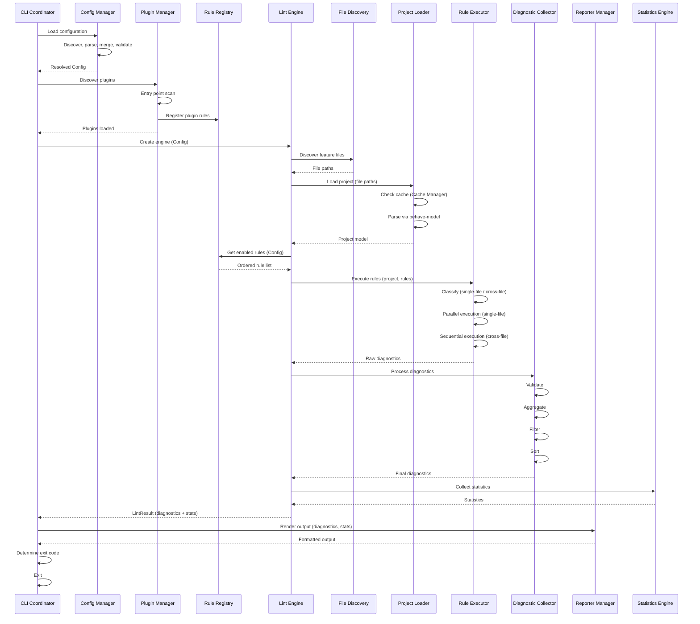
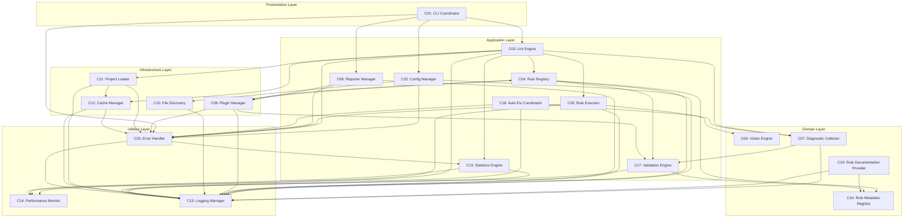

# behave-lint — Component Design

> **Status:** Canonical internal component architecture specification.
> **Audience:** Core maintainers, contributors, plugin authors, and
> engineering teams implementing behave-lint.
> **Scope:** Every major software component inside behave-lint — its
> purpose, responsibilities, interfaces, dependencies, lifecycle,
> state, concurrency, performance, and evolution path. This document
> does not define implementation, code, folder structure, or concrete
> rules.
> **Dependencies:** This document follows VISION.md, SPECIFICATION.md,
> ARCHITECTURE.md, API.md, RULE_ENGINE.md, DIAGNOSTIC_ENGINE.md, and
> CONFIGURATION_SYSTEM.md. PLUGIN_SYSTEM.md is referenced but does
> not yet exist (Phase 07). Inconsistencies, if any, are reported in
> **Appendix A**.

---

## Table of Contents

1. [Executive Overview](#1-executive-overview)
2. [Component Map](#2-component-map)
3. [Responsibilities](#3-responsibilities)
4. [Component Interactions](#4-component-interactions)
5. [Lifecycle](#5-lifecycle)
6. [Dependency Graph](#6-dependency-graph)
7. [Shared Services](#7-shared-services)
8. [Cross-Cutting Concerns](#8-cross-cutting-concerns)
9. [State Management](#9-state-management)
10. [Performance](#10-performance)
11. [Extensibility](#11-extensibility)
12. [Testing](#12-testing)
13. [Error Handling](#13-error-handling)
14. [Future Evolution](#14-future-evolution)
15. [Architectural Validation](#15-architectural-validation)

---

## 1. Executive Overview

### Internal Architecture Philosophy

behave-lint is internally organized as a **component-based pipeline
architecture**. The system is decomposed into discrete components,
each with a single responsibility, well-defined inputs and outputs,
and explicit dependencies. Components are composed at runtime
through dependency injection and registry patterns, not through
class hierarchies (ARCHITECTURE.md Section 2: "Composition over
inheritance").

The component design follows five architectural layers (ARCHITECTURE.md
Section 4):

1. **Presentation Layer** — CLI, help, exit codes.
2. **Application Layer** — Lint engine, rule engine, configuration.
3. **Domain Layer** — Visitors, diagnostics, rule metadata.
4. **Infrastructure Layer** — Loader, cache, plugin loader, file I/O.
5. **Utilities Layer** — Logging, profiling, helpers.

Dependencies flow **inward and downward**: outer layers depend on
inner layers, never the reverse. No circular dependencies. No
skip-level dependencies. External dependencies (`behave-model`) are
isolated behind the infrastructure layer.

### Why Component-Based Design

A component-based architecture was selected over alternatives for
the following reasons:

- **Testability:** Each component can be tested in isolation by
  mocking its dependencies. Components have explicit interfaces,
  making test doubles straightforward.
- **Replaceability:** Components can be replaced without affecting
  others (e.g., a Rust-based rule executor can replace the Python
  rule executor if interfaces are respected).
- **Parallel development:** Multiple engineers can work on different
  components simultaneously without conflicts, as long as interfaces
  are respected.
- **Long-term maintainability:** Components evolve independently.
  A change to caching does not require touching the rule engine.
  This is critical for a project that must remain maintainable for
  10+ years.
- **Observability:** Each component is a natural boundary for
  metrics, logging, and tracing. Component-level observability
  makes performance debugging tractable.

### Design Validation

**Why component-based over monolithic?** A monolithic design entangles concerns, making testing difficult and evolution risky. Component-based design enforces separation of concerns at the architectural level.

**Why component-based over microservices?** behave-lint is a single-process CLI tool. Microservices add distribution complexity without benefit.

**Alternatives considered:**

- *Monolithic:* Rejected — violates SRP, makes testing and evolution difficult.
- *Microkernel:* Rejected for v1 — adds complexity without benefit (ARCHITECTURE.md Section 3).
- *Event-driven:* Rejected — non-deterministic execution order, complicates caching.

**Trade-offs:** Component-based design adds indirection (interfaces vs. direct calls). Acceptable — overhead is negligible, benefits (testability, replaceability, maintainability) are significant.

**Long-term impact:** New features are added as new components, not modifications to a monolith.

---

## 2. Component Map

### Complete Component Inventory

The following table identifies every major component in behave-lint,
its architectural layer, and a one-line purpose.

| # | Component | Layer | Purpose |
|---|---|---|---|
| C01 | CLI Coordinator | Presentation | Parses arguments, orchestrates the pipeline, manages exit codes. |
| C02 | Configuration Manager | Application | Loads, validates, merges, and provides configuration. |
| C03 | Lint Engine | Application | Orchestrates the lint pipeline from loading to diagnostic output. |
| C04 | Rule Registry | Application | Maintains the catalog of discovered and registered rules. |
| C05 | Rule Executor | Application | Schedules and executes rules, manages parallelism and isolation. |
| C06 | Visitor Engine | Domain | Provides tree traversal abstractions for rules. |
| C07 | Diagnostic Collector | Domain | Aggregates, filters, sorts, and deduplicates diagnostics. |
| C08 | Reporter Manager | Application | Selects, instantiates, and coordinates output reporters. |
| C09 | Plugin Manager | Infrastructure | Discovers, loads, validates, and isolates plugins. |
| C10 | File Discovery | Infrastructure | Finds `.feature` files in the specified paths. |
| C11 | Project Loader | Infrastructure | Invokes `behave-model` to parse feature files into the project model. |
| C12 | Cache Manager | Infrastructure | Stores and retrieves cached analysis results. |
| C13 | Statistics Engine | Application | Collects and aggregates run-level metrics (counts, timing). |
| C14 | Performance Monitor | Utilities | Provides timing, profiling, and resource tracking. |
| C15 | Logging Manager | Utilities | Provides structured logging across all components. |
| C16 | Rule Metadata Registry | Domain | Stores and provides rule metadata for documentation and validation. |
| C17 | Validation Engine | Application | Validates rules at registration time and diagnostics at creation time. |
| C18 | Auto-Fix Coordinator | Application | Coordinates fix application, conflict resolution, and rollback (future). |
| C19 | Rule Documentation Provider | Domain | Generates and serves rule documentation for CLI and IDE. |
| C20 | Error Handler | Application | Classifies, routes, and reports errors across all components. |

### Component Categorization

Components are categorized by their role in the pipeline:

- **Orchestrators:** CLI Coordinator, Lint Engine, Rule Executor.
  These components control *what happens when*.
- **Providers:** Configuration Manager, Rule Registry, Rule Metadata
  Registry, Plugin Manager, File Discovery, Project Loader. These
  components *supply data* to the pipeline.
- **Processors:** Visitor Engine, Diagnostic Collector, Validation
  Engine, Auto-Fix Coordinator, Statistics Engine. These components
  *transform data* within the pipeline.
- **Outputs:** Reporter Manager, Rule Documentation Provider. These
  components *produce output* from the pipeline.
- **Support:** Cache Manager, Performance Monitor, Logging Manager,
  Error Handler. These components *support the pipeline* without
  being part of the data flow.

### Design Validation

**Why 20 components?** Each has a distinct responsibility that cannot be subsumed by another without violating SRP. Fewer would merge unrelated concerns; more would over-fragment.

**Why separate Rule Registry and Rule Metadata Registry?** The Rule Registry manages *which rules exist and are enabled* (runtime). The Rule Metadata Registry manages *what rules are* (documentation, categories — design-time). Separating them allows documentation generation without loading the rule engine.

**Alternatives considered:**

- *Fewer components (merge related):* Merging Configuration Manager and Validation Engine mixes configuration loading with rule validation. Rejected — violates SRP.
- *More components (split large ones):* Splitting Lint Engine into Pipeline Orchestrator and Stage Coordinator. Rejected — already single-responsibility. Further splitting adds indirection without clarity.

**Trade-offs:** 20 components is a moderate count. New contributors need to learn the component map, mitigated by clear documentation and the layered architecture.

**Long-term impact:** The component map is stable. New components are added for new features without restructuring existing ones.

---

## 3. Responsibilities

This section defines every component in detail.

---

### C01: CLI Coordinator

**Purpose:** Entry point for command-line usage. Parses arguments,
orchestrates the pipeline, and manages exit codes.

**Responsibilities:**

- Parse command-line arguments (paths, flags, options).
- Route commands (lint, list-rules, explain, version, help).
- Load configuration via Configuration Manager.
- Create and invoke the Lint Engine.
- Pass diagnostics to the Reporter Manager.
- Determine and return the exit code.

**Non-responsibilities:**

- Does not contain business logic (delegates to Application layer).
- Does not format output (delegates to Reporter Manager).
- Does not load files (delegates to Lint Engine, which delegates to
  Project Loader).

**Inputs:** Command-line arguments (string array), environment
variables.

**Outputs:** Exit code (integer), formatted output to stdout/stderr.

**Dependencies:** Configuration Manager (C02), Lint Engine (C03),
Reporter Manager (C08), Error Handler (C20).

**Lifecycle:** Created at process start. Single-use — orchestrates
one lint run and exits. Future: reusable for watch mode (multiple
runs in one process).

**State:** Stateless between runs. During a run, holds the resolved
configuration and the lint result.

**Concurrency:** Single-threaded. The CLI Coordinator is the
top-level orchestrator; parallelism happens within the Lint Engine.

**Performance:** Argument parsing < 1ms. Configuration loading < 5ms.
Total overhead (excluding lint execution) < 10ms.

---

### C02: Configuration Manager

**Purpose:** Loads, validates, merges, and provides configuration
from all sources (CONFIGURATION_SYSTEM.md Section 2).

**Responsibilities:**

- Discover configuration files (pyproject.toml, parent search).
- Parse TOML configuration.
- Merge configuration sources (defaults < pyproject.toml < env < CLI).
- Validate configuration (schema, types, unknown keys, deprecated
  keys).
- Provide the resolved `Config` object to all components.
- Cache the resolved configuration for the process lifetime.

**Non-responsibilities:**

- Does not interpret rule parameters (rules interpret their own
  parameters).
- Does not validate rule IDs against the registry (that is the
  Validation Engine's job).

**Inputs:** Configuration file paths, environment variables, CLI
arguments.

**Outputs:** Resolved `Config` object (frozen dataclass, API.md
Section 4).

**Dependencies:** File Discovery (C10, for config file search),
Logging Manager (C15), Error Handler (C20).

**Lifecycle:** Created early in startup. Configuration is loaded
once and cached. In watch mode (future), reloaded on file change.

**State:** Holds the resolved `Config` object (immutable). Holds
the configuration file path and modification time for cache
invalidation.

**Concurrency:** Thread-safe after initialization. The `Config`
object is immutable and can be shared across threads.

**Performance:** TOML parsing < 1ms for typical files. Merge and
validation < 1ms. Total < 5ms.

---

### C03: Lint Engine

**Purpose:** Pipeline orchestrator. Coordinates the entire linting
process from project loading through diagnostic aggregation
(ARCHITECTURE.md Section 6).

**Responsibilities:**

- Invoke Project Loader to parse feature files.
- Query Rule Registry for enabled rules.
- Delegate rule execution to Rule Executor.
- Receive raw diagnostics from Rule Executor.
- Delegate diagnostic processing to Diagnostic Collector.
- Return the final diagnostic set to the CLI Coordinator.
- Manage the cache integration (via Cache Manager).

**Non-responsibilities:**

- Does not contain rule logic (delegates to Rule Executor).
- Does not format output (delegates to Reporter Manager).
- Does not load configuration (receives it from CLI Coordinator).

**Inputs:** Resolved `Config` object, paths to lint.

**Outputs:** `LintResult` (API.md Section 4) containing diagnostics,
statistics, and metadata.

**Dependencies:** Project Loader (C11), Rule Registry (C04), Rule
Executor (C05), Diagnostic Collector (C07), Cache Manager (C12),
Statistics Engine (C13), Performance Monitor (C14), Error Handler
(C20).

**Lifecycle:** Created per lint run with a resolved configuration.
Steps: Initialize → Load → Register → Execute → Aggregate → Filter
→ Sort → Return (ARCHITECTURE.md Section 6).

**State:** Holds the current pipeline state (loading, executing,
aggregating, etc.). Holds the project model and raw diagnostics
during execution. State is transient — cleared after each run.

**Concurrency:** Orchestrates parallel execution via Rule Executor.
The engine itself is single-threaded; parallelism is delegated.

**Performance:** Orchestration overhead < 5ms. Dominant cost is
rule execution (delegated to Rule Executor) and parsing (delegated
to Project Loader).

---

### C04: Rule Registry

**Purpose:** Maintains the catalog of discovered and registered
rules (RULE_ENGINE.md Section 3).

**Responsibilities:**

- Register rules (built-in at import time, plugin via entry points).
- Store rule metadata (ID, category, severity, name, description,
  etc.).
- Provide rule lookup by ID, by category, by tag.
- Filter rules based on configuration (select, ignore).
- Provide the ordered list of enabled rules to the Rule Executor.

**Non-responsibilities:**

- Does not execute rules (delegates to Rule Executor).
- Does not validate rule behavior (delegates to Validation Engine).
- Does not discover plugins (delegates to Plugin Manager).

**Inputs:** Rule classes (from built-in registration or Plugin
Manager), `Config` object (for filtering).

**Outputs:** Ordered list of enabled rule instances with metadata.

**Dependencies:** Rule Metadata Registry (C16), Validation Engine
(C17), Plugin Manager (C09, for plugin rule registration), Logging
Manager (C15).

**Lifecycle:** Populated at startup (built-in rules) and during
plugin loading. Queried at the start of each lint run. Immutable
during a run.

**State:** Holds the registry dict (rule ID → rule class + metadata).
Thread-safe after population (read-only during execution).

**Concurrency:** Read-only during execution. Thread-safe for
concurrent lookups. Population is single-threaded at startup.

**Performance:** Registration is O(1) per rule. Lookup is O(1)
(dict). Filtering is O(n) where n is total rules. All operations
are < 1ms for typical rule counts (50–200 rules).

---

### C05: Rule Executor

**Purpose:** Schedules and executes rules, managing parallelism,
isolation, and failure handling (RULE_ENGINE.md Section 6).

**Responsibilities:**

- Classify rules as single-file or cross-file.
- Schedule single-file rules for parallel execution (thread pool).
- Execute cross-file rules sequentially.
- Provide each rule with its execution context (Rule Context,
  RULE_ENGINE.md Section 8).
- Collect raw diagnostics from each rule.
- Isolate rule failures (log error, skip rule, continue others).
- Enforce timeouts (future) and retries (none in v1).

**Non-responsibilities:**

- Does not decide which rules to run (receives list from Rule
  Registry).
- Does not filter or sort diagnostics (delegates to Diagnostic
  Collector).
- Does not manage the project model (receives it from Lint Engine).

**Inputs:** Ordered list of enabled rules, project model, `Config`
object.

**Outputs:** Raw diagnostics from all rules (unfiltered, unsorted).

**Dependencies:** Visitor Engine (C06), Performance Monitor (C14),
Logging Manager (C15), Error Handler (C20).

**Lifecycle:** Created per lint run. Executes rules in order.
Destroyed after execution. Results are passed to the Lint Engine.

**State:** Holds the thread pool, execution queue, and in-flight
rule executions. Transient — cleared after execution.

**Concurrency:** Multi-threaded (thread pool for single-file rules).
Thread-safe by design — each rule execution is independent (no
shared state between rules, RULE_ENGINE.md Section 6).

**Performance:** Dominant cost. Parallel execution reduces wall
time. Target: < 2s for 1,000 files (ARCHITECTURE.md Section 2).

---

### C06: Visitor Engine

**Purpose:** Provides tree traversal abstractions for rules
(ARCHITECTURE.md Section 7).

**Responsibilities:**

- Provide visitor base patterns (FeatureVisitor, ScenarioVisitor,
  StepVisitor, TagVisitor, TableVisitor).
- Dispatch visitor callbacks to the appropriate model elements.
- Support pre-order, post-order, and selective traversal.
- Compose multiple visitors for complex rules.

**Non-responsibilities:**

- Does not contain rule logic (rules use visitors as tools).
- Does not produce diagnostics (rules produce diagnostics).
- Does not modify the model (read-only traversal).

**Inputs:** `behave-model` project/feature objects, visitor
instances.

**Outputs:** Traversal callbacks (side-effect: rules collect
diagnostics during traversal).

**Dependencies:** `behave-model` types (via infrastructure layer).

**Lifecycle:** Stateless utility. Visitors are created per rule
execution and discarded after.

**State:** Stateless. No state persists between traversals.

**Concurrency:** Thread-safe (stateless). Each rule execution
creates its own visitor instances.

**Performance:** O(n) where n is the number of model elements.
Typically < 1ms per feature file.

---

### C07: Diagnostic Collector

**Purpose:** Aggregates, filters, sorts, and deduplicates
diagnostics (DIAGNOSTIC_ENGINE.md Section 2).

**Responsibilities:**

- Aggregate raw diagnostics from all rules into a single set.
- Filter diagnostics (severity threshold, inline disable comments,
  file-level exclusions, rule-level exclusions).
- Sort diagnostics deterministically (file, line, column, rule ID).
- Deduplicate diagnostics (future — same rule + same location +
  same message).
- Provide the final diagnostic set to the Lint Engine.

**Non-responsibilities:**

- Does not create diagnostics (rules create them).
- Does not format output (delegates to Reporter Manager).
- Does not group diagnostics (grouping is a reporter concern,
  DIAGNOSTIC_ENGINE.md Section 10).

**Inputs:** Raw diagnostics from Rule Executor, `Config` object
(for filters).

**Outputs:** Sorted, filtered list of `Diagnostic` objects.

**Dependencies:** Validation Engine (C17, for diagnostic
validation), Logging Manager (C15).

**Lifecycle:** Created per lint run. Processes diagnostics after
rule execution. Transient.

**State:** Holds the diagnostic list during processing. Transient
— cleared after returning results.

**Concurrency:** Aggregation is single-threaded (after parallel
rule execution completes). Filtering and sorting are
single-threaded. O(d log d) for sorting where d is diagnostic
count.

**Performance:** O(d) for aggregation and filtering. O(d log d)
for sorting. < 50ms for 10,000 diagnostics
(DIAGNOSTIC_ENGINE.md Section 14).

---

### C08: Reporter Manager

**Purpose:** Selects, instantiates, and coordinates output
reporters (ARCHITECTURE.md Section 10).

**Responsibilities:**

- Select reporters based on configuration (`output` key).
- Instantiate reporter instances.
- Pass the diagnostic set and statistics to each reporter.
- Coordinate multiple reporters (e.g., console + JSON).
- Handle reporter failures (log error, try other reporters).

**Non-responsibilities:**

- Does not produce diagnostics (receives them from Lint Engine).
- Does not determine exit codes (CLI Coordinator does).
- Does not filter or sort diagnostics (Diagnostic Collector does).

**Inputs:** Sorted diagnostic list, statistics, `Config` object.

**Outputs:** Formatted output (to stdout, file, or both).

**Dependencies:** Plugin Manager (C09, for reporter plugins),
Logging Manager (C15), Error Handler (C20).

**Lifecycle:** Created per lint run. Instantiates reporters on
demand. Transient.

**State:** Holds reporter instances. Transient.

**Concurrency:** Reporters can run in parallel if writing to
different destinations. In v1, reporters run sequentially (output
is typically a single format).

**Performance:** O(d) per reporter. < 50ms for JSON, < 10ms for
console (1,000 diagnostics, DIAGNOSTIC_ENGINE.md Section 14).

---

### C09: Plugin Manager

**Purpose:** Discovers, loads, validates, and isolates plugins
(ARCHITECTURE.md Section 13).

**Responsibilities:**

- Discover plugins via Python entry points (`behave_lint.rules`,
  `behave_lint.reporters`, `behave_lint.config`).
- Import plugin modules lazily (only if enabled).
- Call plugin registration functions.
- Validate registered rules/reporters (same validation as built-in).
- Isolate plugin failures (load failure, registration failure,
  execution failure).
- Provide plugin metadata to Configuration Manager (for plugin
  configuration sections).

**Non-responsibilities:**

- Does not execute rules (delegates to Rule Executor).
- Does not manage configuration (delegates to Configuration
  Manager).
- Does not install plugins (users install via pip).

**Inputs:** Entry point metadata, `Config` object (for plugin
enable/disable).

**Outputs:** Registered rules, reporters, configuration sections.

**Dependencies:** Rule Registry (C04, for rule registration),
Validation Engine (C17, for plugin validation), Logging Manager
(C15), Error Handler (C20).

**Lifecycle:** Discovery at startup. Lazy import during
configuration. Registration during engine initialization.

**State:** Holds discovered plugin metadata. Holds loaded plugin
modules. Immutable after initialization.

**Concurrency:** Discovery is single-threaded at startup. Plugin
execution is part of the normal rule execution pipeline
(multi-threaded).

**Performance:** Entry point discovery < 10ms. Lazy import < 5ms
per plugin. Registration < 1ms per rule.

---

### C10: File Discovery

**Purpose:** Finds `.feature` files in the specified paths
(ARCHITECTURE.md Section 11).

**Responsibilities:**

- Walk the specified paths (files or directories).
- Filter by `.feature` extension.
- Apply exclude patterns (glob).
- Return the list of feature file paths.

**Non-responsibilities:**

- Does not parse files (delegates to Project Loader).
- Does not cache file contents (delegates to Cache Manager).
- Does not read file contents (only discovers paths).

**Inputs:** Paths (from `Config`), exclude patterns (from `Config`).

**Outputs:** List of file paths (strings).

**Dependencies:** Logging Manager (C15).

**Lifecycle:** Invoked once per lint run. Transient.

**State:** Stateless. No state between invocations.

**Concurrency:** Single-threaded (file discovery is I/O-bound but
fast for typical path counts). Future: parallel directory walking
for large repositories.

**Performance:** O(n) where n is the number of entries in the
scanned directories. < 50ms for 1,000 files.

---

### C11: Project Loader

**Purpose:** Invokes `behave-model` to parse feature files into the
project model (ARCHITECTURE.md Section 5).

**Responsibilities:**

- Call `behave-model`'s `load_project` or `load_feature` functions.
- Handle parse errors (report as diagnostic `B000`, continue other
  files).
- Provide the parsed `Project` (or collection of `Feature` objects)
  to the Lint Engine.
- Integrate with Cache Manager (check cache before parsing, store
  after parsing).

**Non-responsibilities:**

- Does not discover files (delegates to File Discovery).
- Does not analyze the model (delegates to Rule Executor).
- Does not parse Gherkin (delegates to `behave-model`).

**Inputs:** List of file paths, `Config` object.

**Outputs:** `Project` model (from `behave-model`).

**Dependencies:** `behave-model` (external), Cache Manager (C12),
File Discovery (C10), Logging Manager (C15), Error Handler (C20).

**Lifecycle:** Invoked once per lint run (or per file for partial
loading). Transient.

**State:** Holds the parsed project model during the run.
Transient.

**Concurrency:** Parsing can be parallelized (each file is
independent). In v1, parsing is single-threaded (behave-model
parses sequentially). Future: parallel parsing.

**Performance:** Dominant cost (~60% of total execution time,
ARCHITECTURE.md Section 2). < 2s for 1,000 files (cold), < 500ms
(cached).

---

### C12: Cache Manager

**Purpose:** Stores and retrieves cached analysis results
(ARCHITECTURE.md Section 6).

**Responsibilities:**

- Compute cache keys (file content hash + config hash + version
  hash).
- Store cached diagnostics per file.
- Retrieve cached diagnostics on cache hit.
- Detect cache corruption and fall back to full analysis.
- Manage cache lifecycle (clear, invalidate, size limits).
- Store cross-file rule results at the project level.

**Non-responsibilities:**

- Does not analyze files (provides cached results or misses).
- Does not manage configuration (receives config hash from
  Configuration Manager).

**Inputs:** File paths, file contents (for hashing), `Config`
object (for config hash).

**Outputs:** Cached diagnostics (on hit) or cache miss signal.

**Dependencies:** File system I/O, Logging Manager (C15), Error
Handler (C20).

**Lifecycle:** Created at startup. Persists across runs (on-disk
cache). In-memory cache for the current run.

**State:** Holds the on-disk cache directory and in-memory cache
map. Thread-safe for concurrent access.

**Concurrency:** Thread-safe (concurrent reads, single-writer for
cache updates). Uses file-level locking for on-disk cache.

**Performance:** Cache lookup < 1ms (in-memory). Cache read < 5ms
(on-disk). Cache write < 5ms (on-disk).

---

### C13: Statistics Engine

**Purpose:** Collects and aggregates run-level metrics
(ARCHITECTURE.md Section 10).

**Responsibilities:**

- Count diagnostics by severity, category, rule, file.
- Track timing (total, parsing, rule execution, reporting).
- Track cache hits/misses.
- Track files analyzed, files with issues.
- Provide statistics to reporters and the CLI Coordinator.

**Non-responsibilities:** Does not produce diagnostics, format output, or track per-rule performance (Performance Monitor's job).

**Inputs:** Diagnostic list, timing data from Performance Monitor.

**Outputs:** `Statistics` object (counts, timing, cache metrics).

**Dependencies:** Performance Monitor (C14), Logging Manager (C15).

**Lifecycle:** Created per lint run. Finalized after diagnostic processing.

**State:** Accumulates counts and timing. Transient.

**Concurrency:** Thread-safe (atomic counters). Finalized after parallel execution.

**Performance:** O(d) for counting. < 1ms for aggregation.

---

### C14: Performance Monitor

**Purpose:** Provides timing, profiling, and resource tracking
(ARCHITECTURE.md Section 15).

**Responsibilities:**

- Time each pipeline stage (loading, execution, filtering, sorting,
  reporting).
- Time individual rule executions.
- Track memory usage (peak, current).
- Track CPU usage.
- Provide timing data to Statistics Engine.
- Support `--trace` flag for detailed profiling output.

**Non-responsibilities:** Does not collect diagnostic counts or format output.

**Inputs:** Pipeline stage markers (start/stop timing calls).

**Outputs:** Timing data (per-stage, per-rule), memory/CPU metrics.

**Dependencies:** None (Python standard library: `time`, `tracemalloc`).

**Lifecycle:** Created at startup. Active throughout the run.

**State:** Timing data and resource metrics. Transient.

**Concurrency:** Thread-safe (per-thread timers, merged at end).

**Performance:** < 0.1ms per timing call. Negligible overhead.

---

### C15: Logging Manager

**Purpose:** Provides structured logging across all components
(ARCHITECTURE.md Section 16).

**Responsibilities:**

- Provide a logger interface to all components.
- Format log messages (structured, with component name, timestamp,
  severity).
- Route logs to the appropriate destination (stderr, file, null).
- Support log levels (DEBUG, INFO, WARNING, ERROR).
- Support `--verbose` and `--quiet` flags.

**Non-resposibilities:** Does not produce user-facing output (Reporter Manager's job) or collect metrics (Statistics Engine's job).

**Inputs:** Log messages from all components, log level configuration.

**Outputs:** Formatted log messages to stderr or file.

**Dependencies:** None (Python standard library: `logging`).

**Lifecycle:** Created at startup. Active throughout the run.

**State:** Logger configuration and handlers. Thread-safe.

**Concurrency:** Thread-safe (Python `logging` module).

**Performance:** < 0.1ms per call (disabled). < 0.5ms (enabled).

---

### C16: Rule Metadata Registry

**Purpose:** Stores and provides rule metadata for documentation
and validation (RULE_ENGINE.md Section 4).

**Responsibilities:**

- Store rule metadata (ID, name, description, category, severity,
  tags, since, author, can_fix, experimental, deprecated, doc_url,
  aliases, dependencies, conflicts).
- Provide metadata lookup by rule ID.
- Provide metadata for documentation generation (CLI `--explain`,
  `--list-rules`).
- Provide metadata for validation (duplicate ID detection, category
  validation).

**Non-responsibilities:** Does not register rules, execute rules, or generate documentation.

**Inputs:** Rule metadata (from rule classes at registration time).

**Outputs:** Metadata objects for lookup, documentation, validation.

**Dependencies:** None (pure data store).

**Lifecycle:** Populated at startup. Immutable during a run.

**State:** Metadata dict (rule ID → metadata). Read-only after population.

**Concurrency:** Thread-safe (read-only).

**Performance:** O(1) lookup. < 1ms.

---

### C17: Validation Engine

**Purpose:** Validates rules at registration time and diagnostics
at creation time (RULE_ENGINE.md Section 12, DIAGNOSTIC_ENGINE.md
Section 2).

**Responsibilities:**

- Validate rule metadata at registration (required fields, unique
  IDs, valid categories, valid severities, valid since version).
- Validate diagnostics at creation (required fields, valid
  severity, valid file path, positive line number, category
  matches producing rule).
- Validate configuration (unknown keys, invalid types, unknown
  rule IDs, invalid severities).
- Provide actionable error messages with suggestions.

**Non-responsibilities:** Does not register rules, create diagnostics, or load configuration.

**Inputs:** Rule metadata, diagnostic objects, configuration objects.

**Outputs:** Validation results (valid/invalid + error messages).

**Dependencies:** Rule Metadata Registry (C16), Logging Manager (C15).

**Lifecycle:** Invoked at registration and diagnostic creation time.

**State:** Stateless (pure functions).

**Concurrency:** Thread-safe (stateless).

**Performance:** O(1) per validation. < 0.1ms.

---

### C18: Auto-Fix Coordinator

**Purpose:** Coordinates fix application, conflict resolution, and
rollback (RULE_ENGINE.md Section 9, DIAGNOSTIC_ENGINE.md Section 7).

**Status:** Future component (not in v1). Designed but deferred.

**Responsibilities:**

- Collect fixable diagnostics from the diagnostic set.
- Order fixes by file (bottom-to-top) and by rule execution order.
- Detect conflicts (multiple fixes for the same location).
- Apply safe fixes (with `--fix`).
- Apply unsafe fixes (with `--unsafe-fixes`).
- Preview fixes (with `--fix --dry-run`).
- Rollback on failure (atomic per-file writes).
- Record audit trail (applied, skipped, failed fixes).

**Non-responsibilities:** Does not produce diagnostics or define fix logic (rules define their own fixes).

**Inputs:** Diagnostic set (with fix metadata), `Config` object.

**Outputs:** Modified files, fix audit trail.

**Dependencies:** Diagnostic Collector (C07), Logging Manager (C15), Error Handler (C20).

**Lifecycle:** Invoked after diagnostic processing (future pipeline stage).

**State:** Fix queue and applied fix log. Transient.

**Concurrency:** Per-file parallel; within a file, sequential (bottom-to-top).

**Performance:** O(d) for fix collection. O(f) for application.

---

### C19: Rule Documentation Provider

**Purpose:** Generates and serves rule documentation for CLI and
IDE (RULE_ENGINE.md Section 11, DIAGNOSTIC_ENGINE.md Section 13).

**Responsibilities:**

- Generate rule documentation from metadata (name, description,
  rationale, examples, references, fix info, configuration,
  related rules, version history, deprecation).
- Format documentation for CLI (`--explain <rule-id>`).
- Format documentation for `--list-rules` output.
- Provide documentation URLs for diagnostics (`doc_url` field).
- Generate documentation for IDE (future, via LSP).

**Non-responsibilities:** Does not store metadata, execute rules, or produce diagnostics.

**Inputs:** Rule metadata (from Rule Metadata Registry).

**Outputs:** Formatted documentation (text for CLI, markdown for web, JSON for IDE).

**Dependencies:** Rule Metadata Registry (C16), Logging Manager (C15).

**Lifecycle:** Invoked on demand. Transient.

**State:** Stateless.

**Concurrency:** Thread-safe (stateless).

**Performance:** O(1) per rule. < 5ms for `--list-rules` (200 rules).

---

### C20: Error Handler

**Purpose:** Classifies, routes, and reports errors across all
components (ARCHITECTURE.md Section 14).

**Responsibilities:**

- Classify errors (configuration, parse, rule execution, plugin,
  internal, output).
- Route recoverable errors to logging (continue execution).
- Route fatal errors to the CLI Coordinator (exit with code 2).
- Provide error message formatting (clear, actionable, with
  suggestions).
- Track error counts for statistics.

**Non-responsibilities:** Does not execute rules, produce diagnostics, or determine exit codes.

**Inputs:** Exceptions from all components.

**Outputs:** Error classification, formatted error messages, recovery signals.

**Dependencies:** Logging Manager (C15), Statistics Engine (C13).

**Lifecycle:** Active throughout the run. Invoked on exceptions.

**State:** Error counts. Transient.

**Concurrency:** Thread-safe (atomic counters, thread-safe logging).

**Performance:** < 0.1ms per error classification.

---

## 4. Component Interactions

### Communication Patterns

Components communicate through three patterns:

1. **Direct invocation:** A component calls another component's
   method directly. This is the most common pattern. Example: CLI
   Coordinator calls `Lint Engine.run()`.

2. **Registry lookup:** A component queries a registry for
   information. Example: Lint Engine queries Rule Registry for
   enabled rules.

3. **Event notification (future):** A component emits an event that
   other components subscribe to. Not in v1. Example: Cache Manager
   emits "cache miss" event that Statistics Engine listens to.

### Allowed Dependencies

Dependencies follow the layered architecture (ARCHITECTURE.md
Section 4):

- **Presentation → Application:** CLI Coordinator depends on
  Configuration Manager, Lint Engine, Reporter Manager.
- **Application → Domain:** Lint Engine depends on Diagnostic
  Collector. Rule Executor depends on Visitor Engine.
- **Application → Infrastructure:** Lint Engine depends on Project
  Loader, Cache Manager. Configuration Manager depends on File
  Discovery.
- **Domain → Utilities:** All domain components depend on Logging
  Manager.
- **Infrastructure → Domain:** Project Loader returns domain
  objects. Cache Manager stores domain objects.
- **All → Utilities:** All components depend on Logging Manager,
  Performance Monitor, Error Handler.

### Forbidden Dependencies

- **Domain → Application:** Domain components must not depend on
  application components. Domain is passive.
- **Domain → Infrastructure:** Domain components must not depend on
  infrastructure. Domain is pure.
- **Infrastructure → Application:** Infrastructure must not depend
  on application logic. Infrastructure provides services, not
  policy.
- **Any → Presentation:** No component may depend on the CLI
  Coordinator. The CLI is the top of the dependency graph.
- **Circular:** No component may depend on a component that
  (directly or transitively) depends on it.

### Data Ownership

| Data | Owner | Consumers | Mutability |
|---|---|---|---|
| `Config` | Configuration Manager | All components | Immutable |
| `Project` model | Project Loader | Lint Engine, Rule Executor | Immutable (read-only) |
| Raw diagnostics | Rule Executor | Diagnostic Collector | Immutable |
| Final diagnostics | Diagnostic Collector | Reporter Manager, CLI | Immutable |
| Statistics | Statistics Engine | Reporter Manager, CLI | Mutable during run |
| Cache | Cache Manager | Project Loader, Lint Engine | Mutable |
| Rule metadata | Rule Metadata Registry | All (read-only) | Immutable after registration |

### Coordination

The **Lint Engine** is the central coordinator. It drives the
pipeline and invokes components in order. No component invokes the
Lint Engine — it is invoked by the CLI Coordinator and drives all
other components.

The **Error Handler** is a cross-cutting coordinator for error
situations. It does not participate in the normal data flow but is
invoked on exceptions from any component.

### Design Validation

**Why direct invocation over event-driven?** Direct invocation is explicit, deterministic, and easy to trace. Event-driven communication makes execution order non-deterministic and complicates debugging (ARCHITECTURE.md Section 3).

**Why registry pattern for rules?** Rules are discovered and registered dynamically (built-in + plugins). A registry provides a stable lookup interface regardless of how rules were discovered.

**Alternatives considered:**

- *Event bus:* Rejected — non-deterministic, hard to debug.
- *Service locator:* Rejected — hides dependencies, makes testing harder.
- *DI container:* Considered for v2.0+ — v1 uses manual injection (simpler, explicit).

**Trade-offs:** Direct invocation creates tighter coupling than events. Acceptable because the dependency graph is acyclic and well-documented (Section 6).

**Long-term impact:** Supports future event notification (metrics, tracing) without changing the core data flow.

---

## 5. Lifecycle

### Complete Pipeline Lifecycle

The following sequence diagram shows the complete lifecycle of a
lint run, from process start to exit:

### Startup Phase

1. **Process start:** Python interpreter starts, imports behave-lint
   package.
2. **Built-in rule registration:** Rules are registered at import
   time (Rule Registry populated).
3. **CLI argument parsing:** CLI Coordinator parses arguments.
4. **Configuration loading:** Configuration Manager discovers,
   parses, merges, and validates configuration.
5. **Plugin discovery:** Plugin Manager scans entry points, imports
   enabled plugins, registers their rules.
6. **Engine creation:** CLI Coordinator creates Lint Engine with
   the resolved configuration.

### Execution Phase

7. **File discovery:** File Discovery finds `.feature` files.
8. **Project loading:** Project Loader parses files via
   `behave-model` (with cache integration).
9. **Rule filtering:** Rule Registry filters rules based on
   configuration.
10. **Rule execution:** Rule Executor runs rules (parallel for
    single-file, sequential for cross-file).
11. **Diagnostic processing:** Diagnostic Collector validates,
    aggregates, filters, and sorts diagnostics.
12. **Statistics collection:** Statistics Engine aggregates counts
    and timing.

### Reporting Phase

13. **Reporter selection:** Reporter Manager selects reporters
    based on configuration.
14. **Output rendering:** Reporters format and write output.
15. **Exit code determination:** CLI Coordinator determines exit
    code based on diagnostics and configuration.

### Shutdown Phase

16. **Resource cleanup:** Cache Manager flushes cache. Logging Manager flushes logs. Thread pool is shut down. File handles closed (context managers).
17. **Process exit:** CLI Coordinator returns exit code.

### Design Validation

**Why a linear lifecycle?** The pipeline is linear — each stage depends on the previous stage's output. A linear lifecycle is the simplest correct model for a batch analysis tool.

**Why separate startup and execution?** Startup (registration, configuration, plugin loading) is done once. Execution (parsing, rule execution, diagnostic processing) is done per run. Separating them allows future reuse (watch mode: startup once, execute multiple times).

**Alternatives considered:**

- *Interleaved startup and execution:* Rejected — adds complexity, saves negligible time.
- *Lazy startup:* Rejected — makes error detection late and debugging difficult. Eager startup catches errors early.

**Trade-offs:** Eager startup adds < 50ms fixed cost per run. Acceptable — catches errors early, simplifies execution phase.

**Long-term impact:** The lifecycle supports watch mode (repeated
execution without restart) and LSP mode (long-running process with
on-demand execution) without restructuring.

---

## 6. Dependency Graph

### Component Dependency Diagram

### Dependency Direction

Dependencies flow **inward and downward** (ARCHITECTURE.md Section
4):

- Presentation → Application → Domain/Infrastructure → Utilities
- No upward dependencies.
- No circular dependencies.
- No skip-level dependencies (Presentation does not depend on
  Domain directly).

### Layering Rules

1. **Presentation depends on Application only.** The CLI Coordinator
   does not access Domain or Infrastructure directly.
2. **Application depends on Domain and Infrastructure.** The Lint
   Engine uses Domain concepts (diagnostics) and Infrastructure
   services (loader, cache).
3. **Domain depends on Utilities only.** Domain is pure — no I/O,
   no infrastructure.
4. **Infrastructure depends on Domain (types) and Utilities.**
   Infrastructure returns Domain objects but does not contain
   Domain logic.
5. **Utilities depend on nothing.** The innermost layer.

### Cycle Prevention

The dependency graph is acyclic by design. If a cycle is detected
during development, it indicates a design error and must be
resolved by:

1. Extracting the shared dependency into a lower layer.
2. Introducing an interface (Dependency Inversion) to break the
   cycle.
3. Merging the cyclic components if they are tightly coupled.

### Design Validation

**Why strict layering?** Prevents dependency cycles, ensures testability (each layer tested with mocks of the layer below), provides a clear mental model for contributors.

**Why no skip-level dependencies?** Skip-level dependencies (e.g., Presentation → Domain) bypass the Application layer's orchestration, making the architecture harder to reason about.

**Alternatives considered:**

- *Relaxed layering:* Simpler rules but leads to tangled dependencies. Rejected.
- *No layering (flat graph):* Maximum flexibility but no structural guarantees. Rejected.

**Trade-offs:** Strict layering may require pass-through calls. Minor indirection, but preserves architectural integrity.

**Long-term impact:** New components are placed in the appropriate layer and follow the dependency rules, ensuring the codebase remains structured.

---

## 7. Shared Services

### Identified Shared Services

Shared services are components used by multiple layers. They are
placed in the Utilities layer and are available to all components.

| Service | Component | Consumers | Ownership |
|---|---|---|---|
| Configuration | C02: Configuration Manager | All components | Application layer (singleton per run) |
| Logging | C15: Logging Manager | All components | Utilities layer (singleton per process) |
| Metrics | C13: Statistics Engine | CLI, Reporters | Application layer (one per run) |
| Caching | C12: Cache Manager | Project Loader, Lint Engine | Infrastructure layer (shared across runs) |
| Error Handling | C20: Error Handler | All components | Application layer (singleton per run) |
| Performance | C14: Performance Monitor | Lint Engine, Rule Executor, Statistics | Utilities layer (singleton per run) |
| Validation | C17: Validation Engine | Rule Registry, Diagnostic Collector, Configuration Manager | Application layer (stateless) |
| Documentation | C19: Rule Documentation Provider | CLI, IDE (future) | Domain layer (stateless) |

### Ownership Model

- **Configuration:** Owned by the Configuration Manager. The
  resolved `Config` object is created once and passed to all
  components. Components receive it as a constructor parameter or
  method argument — they do not access the Configuration Manager
  directly.

- **Logging:** Owned by the Logging Manager. All components
  obtain a logger via the Logging Manager. The Logging Manager
  is a process-level singleton.

- **Metrics:** Owned by the Statistics Engine. Components report
  metrics to the Statistics Engine via method calls. The Statistics
  Engine is created per run.

- **Caching:** Owned by the Cache Manager. The Project Loader and
  Lint Engine interact with the Cache Manager. The Cache Manager
  persists across runs (on-disk cache).

- **Error Handling:** Owned by the Error Handler. Components
  delegate error classification to the Error Handler. The Error
  Handler is a per-run singleton.

### Service Access Pattern

Components access shared services through **dependency injection**:
services are passed to components as constructor parameters or
method arguments. This makes dependencies explicit and testable.

No component uses a global singleton or service locator. All
dependencies are visible in the component's interface.

### Design Validation

**Why dependency injection over global singletons?** Dependency
injection makes dependencies explicit, testable, and replaceable.
Global singletons hide dependencies, make testing difficult (cannot
mock), and create implicit coupling.

**Why not a full DI container?** A DI container manages component lifecycle and injection automatically. Rejected for v1 — manual injection is simpler, explicit, and sufficient for 20 components. May be considered for v2.0+.

**Alternatives considered:**

- *Global singletons:* Rejected — hide dependencies, make testing difficult.
- *Service locator:* Rejected — hides dependencies, makes testing harder.

**Trade-offs:** Manual DI requires more boilerplate. Acceptable for 20 components — makes the dependency graph explicit.

**Long-term impact:** Supports future container-based injection without changing interfaces.

---

## 8. Cross-Cutting Concerns

### Logging

**Approach:** Structured logging via Python's `logging` module.
Each component obtains a named logger (`behave_lint.lint_engine`,
`behave_lint.rule_executor`, etc.). Log levels: DEBUG, INFO,
WARNING, ERROR.

**Configuration:** Log level controlled by `--verbose` (DEBUG),
default (INFO), `--quiet` (WARNING). `--trace` enables
per-component timing in addition to DEBUG logging.

**Output:** Logs go to stderr (never stdout — stdout is reserved
for diagnostic output). This ensures logs do not interfere with
machine-readable output (JSON, SARIF).

### Tracing

**Approach:** The Performance Monitor provides per-component
timing. `--trace` flag enables detailed tracing output (per-rule
execution time, per-stage timing, cache hit/miss).

**Output:** Tracing output goes to stderr (structured format).
Future: OpenTelemetry-compatible tracing for distributed
execution.

### Telemetry (Optional, Future)

**Approach:** Opt-in, anonymous usage telemetry. Collects:
behave-lint version, Python version, rule count, diagnostic count,
execution time. Does NOT collect: file contents, file paths,
project names, user identifiers.

**Privacy:** Telemetry is opt-in (disabled by default). Users are
prompted to enable it on first run. Telemetry data is sent to a
central server for aggregate analysis. No individual user data is
collected or stored.

**Status:** Not in v1. Designed for future versions.

### Performance Monitoring

**Approach:** The Performance Monitor tracks per-stage and per-rule
timing. Data is available to the Statistics Engine for summary
output and to the CLI for `--trace` output.

### Configuration

**Approach:** The Configuration Manager provides the resolved
`Config` object to all components. Configuration is immutable
during a run. No component reads configuration files directly.

### Error Handling

**Approach:** The Error Handler classifies errors and determines
recovery strategy. Recoverable errors are logged; fatal errors
cause exit. All components delegate error handling to the Error
Handler (Section 13).

### Security

**Approach:** No code execution from configuration (CONFIGURATION_SYSTEM.md
Section 17). Plugin isolation via namespaced configuration and
entry-point discovery. No arbitrary file access (only paths
specified by the user). No network access in v1.

### Caching

**Approach:** The Cache Manager provides file-level caching of
analysis results. Cache keys include file content hash,
configuration hash, and version hashes. Cache is transparent to
components (Project Loader checks cache, Rule Executor is unaware
of caching).

### Localization

**Approach:** All user-facing messages (diagnostics, errors, help
text) are in English in v1. Future versions may support
localization via message catalogs. The architecture isolates
messages in the Reporter Manager and Error Handler, making future
localization feasible.

### Design Validation

**Why stderr for logs?** stdout is reserved for diagnostic output (JSON, SARIF). Mixing logs and diagnostics on stdout would break machine-readable output.

**Why opt-in telemetry?** Privacy. Users should control whether their data is collected.

**Alternatives considered:**

- *No logging:* Rejected — essential for debugging.
- *stdout for logs:* Rejected — breaks machine-readable output.
- *Opt-out telemetry:* Rejected — privacy concern.

**Trade-offs:** Structured logging adds < 0.5ms per call. Negligible compared to rule execution.

**Long-term impact:** Supports future features (OpenTelemetry, localization) without restructuring.

---

## 9. State Management

### Stateless Components

The following components are stateless — they hold no state
between invocations:

- C06: Visitor Engine (stateless utility)
- C10: File Discovery (stateless utility)
- C14: Performance Monitor (stateless between runs)
- C15: Logging Manager (stateless configuration)
- C17: Validation Engine (pure functions)
- C19: Rule Documentation Provider (stateless generation)

Stateless components are inherently thread-safe and require no
synchronization.

### Stateful Components

The following components hold state during a run:

| Component | State | Lifetime | Thread Safety |
|---|---|---|---|
| C01: CLI Coordinator | Resolved config, lint result | Per run | Single-threaded |
| C02: Configuration Manager | Resolved `Config` object | Per run (cached) | Immutable after creation |
| C03: Lint Engine | Pipeline state, project model | Per run | Single-threaded orchestration |
| C04: Rule Registry | Rule catalog | Process lifetime | Read-only during execution |
| C05: Rule Executor | Thread pool, execution queue | Per run | Multi-threaded (thread-safe) |
| C07: Diagnostic Collector | Diagnostic list | Per run | Single-threaded (post-execution) |
| C08: Reporter Manager | Reporter instances | Per run | Single-threaded |
| C09: Plugin Manager | Discovered plugins | Process lifetime | Read-only after initialization |
| C11: Project Loader | Parsed project model | Per run | Single-threaded (v1) |
| C12: Cache Manager | In-memory + on-disk cache | Cross-run | Thread-safe (locking) |
| C13: Statistics Engine | Counts, timing | Per run | Thread-safe (atomic counters) |
| C16: Rule Metadata Registry | Metadata catalog | Process lifetime | Read-only after population |
| C18: Auto-Fix Coordinator | Fix queue, audit trail | Per run (future) | Per-file parallel |
| C20: Error Handler | Error counts | Per run | Thread-safe (atomic counters) |

### Immutable Data

The following data is immutable once created:

- `Config` object (frozen dataclass, API.md Section 4).
- `Diagnostic` objects (frozen dataclass, API.md Section 4).
- `RuleMetadata` objects (immutable after registration).
- `Project` model (from `behave-model`, frozen dataclasses).

Immutability prevents accidental modification during filtering,
sorting, and serialization. It also enables safe sharing across
threads.

### Shared State

No state is shared between rule executions. Each rule execution
receives its own Rule Context (RULE_ENGINE.md Section 8) with
read-only access to the project model and a diagnostic factory.
Rules do not have access to other rules' state.

The only shared mutable state is:

- **Statistics Engine:** Atomic counters updated by rule
  executions. Thread-safe.
- **Cache Manager:** In-memory cache map. Thread-safe (locking).
- **Error Handler:** Error counts. Thread-safe (atomic counters).

### Concurrency Model

- **Pipeline orchestration:** Single-threaded (Lint Engine).
- **Rule execution:** Multi-threaded (thread pool, Rule Executor).
- **Diagnostic processing:** Single-threaded (after parallel
  execution completes).
- **Reporting:** Single-threaded (sequential reporter invocation).
- **Cache access:** Thread-safe (locking on disk, concurrent map
  in memory).

### Thread Safety Guarantees

- Immutable data (`Config`, `Diagnostic`, `RuleMetadata`): Safe to
  share across threads without synchronization.
- Read-only registries (Rule Registry, Rule Metadata Registry):
  Safe for concurrent reads after population.
- Atomic counters (Statistics Engine, Error Handler): Safe for
  concurrent updates.
- Cache Manager: Thread-safe via file-level locking and concurrent
  map.
- Rule Executor: Thread pool with isolated rule executions.

### Future Distributed Execution

The concurrency model is designed to support future distributed
execution:

- Rules are independent (no shared state between rules).
- The project model is immutable and serializable (can be sent to
  workers).
- Diagnostics are immutable and serializable (can be received from
  workers).
- The thread pool can be replaced with a distributed task queue
  (e.g., Celery, Dask) without changing the Rule Executor
  interface.

### Design Validation

**Why immutable data?** Prevents accidental modification, enables safe sharing across threads, simplifies reasoning. Core principle (ARCHITECTURE.md Section 1: "Explicit over implicit").

**Why no shared state between rules?** Shared state creates implicit dependencies, making parallelization unsafe. Rule isolation is a core principle (RULE_ENGINE.md Section 6).

**Alternatives considered:**

- *Mutable diagnostics:* Rejected — risks accidental modification during filtering/sorting.
- *Shared rule state (with locking):* Rejected — adds complexity, reduces parallelism, deadlock risk.

**Trade-offs:** Immutability requires new objects for modifications (e.g., filtering creates a new list). Acceptable — list creation is O(n).

**Long-term impact:** Supports future distributed execution without fundamental changes.

---

## 10. Performance

### Per-Component Performance Profile

| Component | Complexity | Memory | Notes |
|---|---|---|---|
| C01: CLI Coordinator | O(1) | < 1 KB | Argument parsing overhead. |
| C02: Configuration Manager | O(1) | < 10 KB | TOML parsing + merge. |
| C03: Lint Engine | O(n + r + d) | O(project + d) | Orchestration overhead < 5ms. |
| C04: Rule Registry | O(1) lookup, O(n) filter | O(r) | r = rule count. |
| C05: Rule Executor | O(n × r) parallel | O(d) | Dominant cost. Parallelized. |
| C06: Visitor Engine | O(elements) | O(1) | Per traversal. |
| C07: Diagnostic Collector | O(d log d) sort | O(d) | d = diagnostic count. |
| C08: Reporter Manager | O(d) per reporter | O(d) | Per format. |
| C09: Plugin Manager | O(p) | O(p) | p = plugin count. Discovery < 10ms. |
| C10: File Discovery | O(files) | O(file count) | < 50ms for 1,000 files. |
| C11: Project Loader | O(n) | O(project) | Dominant cost (~60%). |
| C12: Cache Manager | O(1) lookup | O(cache size) | < 1ms in-memory. |
| C13: Statistics Engine | O(d) | O(1) | < 1ms. |
| C14: Performance Monitor | O(1) per call | O(stages + rules) | < 0.1ms per call. |
| C15: Logging Manager | O(1) per call | O(1) | < 0.5ms per call. |
| C16: Rule Metadata Registry | O(1) lookup | O(r) | < 1ms. |
| C17: Validation Engine | O(1) per validation | O(1) | < 0.1ms per validation. |
| C18: Auto-Fix Coordinator | O(d) | O(f) | Future. f = fixable diagnostics. |
| C19: Rule Documentation Provider | O(1) per rule | O(1) | < 5ms for --list-rules. |
| C20: Error Handler | O(1) per error | O(1) | < 0.1ms per error. |

### Scalability

| Project size | Total time | Bottleneck |
|---|---|---|
| 10 files | < 100ms | Parsing (behave-model). |
| 100 files | < 500ms | Parsing + rule execution. |
| 1,000 files | < 2s | Parsing + rule execution (parallel). |
| 5,000 files | < 10s | Parsing + rule execution + I/O. |

### Caching Strategy

- **File-level cache:** Diagnostics per file (content hash + config
  hash + version hash). Avoids re-parsing and re-analyzing
  unchanged files.
- **Project-level cache:** Cross-file rule results (project hash +
  config hash). Avoids re-running cross-file rules on unchanged
  projects.
- **Config cache:** Resolved configuration (file modification
  time). Avoids re-parsing configuration on every run.

### Lazy Evaluation

- **Plugin loading:** Plugin modules are imported lazily (only if
  enabled).
- **Rule parameters:** Per-rule parameter sections are parsed lazily
  (only if the rule is enabled).
- **Reporter instantiation:** Reporters are instantiated lazily
  (only if selected).

### Streaming (Future)

- **Diagnostic streaming:** For projects with > 50,000 diagnostics,
  stream diagnostics to reporters instead of buffering
  (DIAGNOSTIC_ENGINE.md Section 14).
- **File streaming:** Parse files in a streaming fashion (future
  behave-model feature).

### Parallel Execution

- **Rule execution:** Single-file rules are executed in parallel
  (thread pool). Each (rule, file) pair is an independent work
  unit.
- **File parsing:** Future — parallel file parsing (each file is
  independent).
- **Reporter execution:** Future — parallel reporters (if writing
  to different destinations).

### Memory Optimization

- **Immutable data:** Shared across threads without copying.
- **Diagnostic model:** Small objects (~200–500 bytes each).
- **Project model:** Owned by `behave-model`; behave-lint holds a
  reference, not a copy.
- **Cache:** Bounded by cache directory size (configurable).

### Design Validation

**Why is parsing the bottleneck?** `behave-model` parses Gherkin files (lexing, parsing, tree construction — CPU-intensive). Rule execution is comparatively fast. The 60% estimate is from ARCHITECTURE.md Section 2.

**Why file-level caching?** Best granularity — unchanged files skip both parsing and rule execution. Coarser (project-level) re-analyzes all files if one changes. Finer (rule-level) requires per-rule cache keys.

**Alternatives considered:**

- *No caching:* Rejected — too slow for large projects.
- *Rule-level caching:* More granular but more complex. Considered for v1.1+ (incremental execution).

**Trade-offs:** File-level caching requires a cache directory (default: `.behave-lint-cache`). Users can disable (`--no-cache`) or clear (`--clear-cache`).

**Long-term impact:** The performance model supports future
optimizations (parallel parsing, incremental execution, streaming)
without changing component interfaces.

---

## 11. Extensibility

### Adding New Components

New components can be added without modifying existing ones if:

1. The new component has a single responsibility.
2. The new component is placed in the appropriate architectural
   layer.
3. The new component follows the dependency rules (inward and
   downward).
4. The new component has a well-defined interface.
5. The new component is testable in isolation.

**Process:**

1. Identify the need (e.g., "we need a component to generate HTML
   reports").
2. Determine the layer (HTML report generation is a reporter →
   Application layer, or a plugin → Infrastructure layer).
3. Define the interface (inputs, outputs, dependencies).
4. Implement the component.
5. Wire it into the pipeline (e.g., register it with the Reporter
   Manager).
6. Add tests.

### Evolving Existing Components

Existing components can evolve without breaking dependents if:

1. New methods are additive (not breaking).
2. Method signatures are backward-compatible (new parameters have
   defaults).
3. Deprecated methods remain functional for one minor version.
4. Breaking changes require a major version bump.

### Compatibility

- **Internal interfaces:** Stable within a major version. Breaking
  changes require a major version bump.
- **Plugin interfaces:** Stable within a major version (ARCHITECTURE.md
  Section 13). Plugins developed for v1.x work with v1.y.
- **Configuration schema:** Follows semver (CONFIGURATION_SYSTEM.md
  Section 15).

### Versioning

- **Component versioning:** Components do not have individual
  versions. They evolve with the tool version.
- **Interface versioning:** Internal interfaces are versioned with
  the tool. Plugin interfaces may have separate version markers
  (future).

### Deprecation

- Deprecated components remain functional for one minor version.
- Deprecation is announced in the changelog and via runtime
  warnings.
- Removed in the next major version.

### Design Validation

**Why additive evolution?** Breaking changes to internal
interfaces ripple through all dependents. Additive changes
(new methods, new parameters with defaults) are non-breaking and
allow gradual migration.

**Why no individual component versioning?** Components are
internal — they are not independently consumable. Versioning them
individually adds complexity without benefit. The tool version is
sufficient.

**Alternatives considered:**

- *Individual component versioning:* Rejected (see above).
- *No deprecation policy (remove immediately):* Rejected —
  surprises users and contributors.

**Trade-offs:** Additive evolution can lead to interface bloat
over time. This is mitigated by periodic cleanup (removing
deprecated methods in major versions).

**Long-term impact:** The extensibility model ensures that the
component architecture can grow without breaking existing
components or plugins.

---

## 12. Testing

### Testing Strategy

The testing strategy follows the pyramid model:

1. **Unit tests:** Test each component in isolation.
2. **Integration tests:** Test component interactions.
3. **Contract tests:** Test interface conformance.
4. **Performance tests:** Test performance targets.
5. **Regression tests:** Test for known bugs.

### Unit Tests

Each component has a dedicated test suite. Dependencies are mocked.

| Component | Test focus | Mocking |
|---|---|---|
| C01: CLI Coordinator | Argument parsing, exit codes, routing | Mock Lint Engine, Config Manager |
| C02: Configuration Manager | Loading, merging, validation | Mock file system |
| C03: Lint Engine | Pipeline orchestration, stage ordering | Mock all dependencies |
| C04: Rule Registry | Registration, lookup, filtering | Mock rule classes |
| C05: Rule Executor | Parallel execution, isolation, failure | Mock rules, Visitor Engine |
| C06: Visitor Engine | Traversal correctness | Use real behave-model objects |
| C07: Diagnostic Collector | Filtering, sorting, deduplication | Mock diagnostics |
| C08: Reporter Manager | Reporter selection, coordination | Mock reporters |
| C09: Plugin Manager | Discovery, loading, isolation | Mock entry points |
| C10: File Discovery | Path walking, glob matching | Mock file system |
| C11: Project Loader | Parsing, cache integration, error handling | Mock behave-model, Cache Manager |
| C12: Cache Manager | Key computation, hit/miss, corruption | Mock file system |
| C13: Statistics Engine | Counting, timing aggregation | Mock Performance Monitor |
| C14: Performance Monitor | Timing accuracy | None (pure utility) |
| C15: Logging Manager | Log routing, formatting | None (pure utility) |
| C16: Rule Metadata Registry | Storage, lookup | None (pure data store) |
| C17: Validation Engine | Validation rules, error messages | None (pure functions) |
| C18: Auto-Fix Coordinator | Fix ordering, conflicts, rollback | Mock diagnostics |
| C19: Rule Documentation Provider | Documentation generation | Mock metadata |
| C20: Error Handler | Classification, routing | Mock Logging Manager |

### Integration Tests

Integration tests verify that components work together correctly:

- **Full pipeline test:** CLI → Config → Engine → Loader → Rules →
  Diagnostics → Reporter → Output. Uses real components (no
  mocking). Uses small test feature files.
- **Plugin integration:** Load a test plugin, verify rules are
  registered and executed.
- **Cache integration:** Run twice, verify second run uses cache.
- **Error integration:** Trigger each error type, verify correct
  handling and exit codes.

### Contract Tests

Contract tests verify that components conform to their interfaces:

- **Rule interface:** Every rule (built-in and plugin) must
  implement the rule interface. A contract test suite verifies
  this.
- **Reporter interface:** Every reporter must implement the
  reporter interface. A contract test suite verifies this.
- **Configuration schema:** Configuration validation is tested
  against the schema.

### Performance Tests

Performance tests verify that the tool meets performance targets
(ARCHITECTURE.md Section 2):

- **Small project (10 files):** < 100ms cold, < 30ms warm.
- **Medium project (100 files):** < 500ms cold, < 100ms warm.
- **Large project (1,000 files):** < 2s cold, < 500ms warm.

Performance tests run in CI with a fixed dataset and are monitored
for regressions.

### Regression Tests

Regression tests are added for every bug fix:

- The bug is reproduced in a test case.
- The fix is applied.
- The test case verifies the fix.
- The test case remains in the suite to prevent regression.

### Design Validation

**Why mock dependencies in unit tests?** Mocking isolates the
component under test. Without mocks, a unit test for the Lint
Engine would also test the Project Loader, Rule Executor, etc.
This makes failures hard to localize.

**Why use real behave-model objects in Visitor Engine tests?** The
Visitor Engine's behavior depends on `behave-model`'s tree
structure. Mocking the tree would test the mock, not the visitor.
Using real objects ensures the visitor works with the actual
domain model.

**Alternatives considered:**

- *No unit tests (integration only):* Rejected — failures are hard
  to localize.
- *No integration tests (unit only):* Rejected — component
  interactions are not tested.

**Trade-offs:** Maintaining 5 test types requires effort. Each
type catches different bugs. The investment is justified by the
reduced debugging time.

**Long-term impact:** The testing strategy ensures that the
component architecture remains correct as it evolves. Contract
tests are especially important for plugin compatibility.

---

## 13. Error Handling

### Component Failure Modes

| Component | Failure mode | Classification | Recovery |
|---|---|---|---|
| C02: Configuration Manager | Invalid TOML, unknown keys, type errors | Fatal (config error) | Exit 2. |
| C02: Configuration Manager | Unknown rule IDs | Non-fatal (warning) | Skip unknown rules. |
| C05: Rule Executor | Rule raises exception | Non-fatal (rule error) | Log, skip rule, continue. |
| C09: Plugin Manager | Import error, registration error | Non-fatal (plugin error) | Warn, skip plugin, continue. |
| C11: Project Loader | Parse error (behave-model raises) | Non-fatal (parse error) | Report as diagnostic B000, skip file. |
| C12: Cache Manager | Cache corruption, read/write error | Non-fatal (cache error) | Discard cache, re-analyze. |
| C08: Reporter Manager | Reporter fails for one format | Non-fatal (output error) | Log, try other reporters. |
| C03: Lint Engine | Unexpected exception | Fatal (internal error) | Exit 2 with stack trace. |
| C01: CLI Coordinator | No files found | Non-fatal | Print message, exit 0. |

### Recovery Strategy

The overall recovery strategy is **fail isolated** (ARCHITECTURE.md
Section 14):

- **Rule failures:** The failing rule is skipped. Other rules
  continue. The failure is logged. The exit code is unaffected
  (unless the failing rule would have produced error-level
  diagnostics).
- **Plugin failures:** The failing plugin is skipped. Other
  plugins continue. The failure is logged.
- **Parse failures:** The failing file is skipped. Other files
  continue. The failure is reported as a diagnostic (rule `B000`).
- **Cache failures:** The cache is discarded. Full analysis is
  performed. The failure is logged.
- **Configuration failures:** Fatal. The tool cannot determine
  which rules to run. Exit 2.
- **Internal errors:** Fatal. An unexpected exception indicates a
  bug. Exit 2 with stack trace (verbose mode).

### Isolation

Each component is isolated from others' failures:

- A rule failure does not affect other rules (Rule Executor
  catches exceptions per rule).
- A plugin failure does not affect other plugins (Plugin Manager
  catches exceptions per plugin).
- A file parse failure does not affect other files (Project Loader
  catches exceptions per file).
- A reporter failure does not affect other reporters (Reporter
  Manager catches exceptions per reporter).

### Fallback

- **Cache fallback:** If the cache is corrupt or unavailable,
  fall back to full analysis.
- **Reporter fallback:** If a reporter fails, fall back to stderr
  output.
- **Plugin fallback:** If a plugin fails, fall back to built-in
  rules only.

### Graceful Degradation

The tool degrades gracefully:

- Missing plugin → fewer rules, but tool works.
- Corrupt cache → slower (full analysis), but tool works.
- Parse error in one file → fewer files analyzed, but tool works.
- Rule crash → fewer diagnostics, but tool works.

The only non-recoverable situations are configuration errors and
internal errors (bugs).

### Design Validation

**Why fail isolated instead of fail fast?** Fail fast is
appropriate for configuration errors (the tool cannot run
correctly). Fail isolated is appropriate for rule/plugin/file
failures (the tool can produce useful results for the remaining
rules/plugins/files). This maximizes value for the user.

**Why report parse errors as diagnostics?** Parse errors are
issues in the user's feature files. Reporting them as diagnostics
(rule `B000`) integrates them into the normal diagnostic pipeline
(filtering, sorting, output). This is more useful than printing an
error message and exiting.

**Alternatives considered:**

- *Fail fast (exit on any error):* Rejected — a single rule crash
  would prevent all other rules from running.
- *Silent failure (log but don't report):* Rejected — users would
  not know that rules were skipped.

**Trade-offs:** Fail isolated means the user may not notice that
some rules were skipped. This is mitigated by logging (visible
with `--verbose`) and by the statistics summary (which shows the
number of rules executed vs. expected).

**Long-term impact:** The error handling model ensures that the
tool is reliable in real-world conditions where inputs are
malformed, plugins crash, and configuration is invalid.

---

## 14. Future Evolution

### Future Components

The following components are designed but not implemented in v1.
Each is a natural extension of the existing architecture.

#### LSP Server

**Purpose:** Provide IDE integration via the Language Server
Protocol.

**Layer:** Presentation (alternative to CLI Coordinator).

**Dependencies:** Lint Engine, Configuration Manager, Reporter
Manager.

**Design:** The LSP Server wraps the Lint Engine and exposes it
via LSP. It publishes diagnostics, provides hover information,
and offers code actions (fixes). The LSP Server is a long-running
process that re-runs the engine on file changes.

**Target:** v2.0+.

#### Cloud Execution Coordinator

**Purpose:** Coordinate distributed rule execution across cloud
workers.

**Layer:** Application (replaces Rule Executor for distributed
mode).

**Dependencies:** Lint Engine, Configuration Manager, network
infrastructure.

**Design:** The Cloud Execution Coordinator distributes
(rule, file) pairs to cloud workers. Workers analyze and return
diagnostics. The coordinator merges results. The interface is
identical to the Rule Executor, enabling transparent switching.

**Target:** v2.0+.

#### AI Assistant

**Purpose:** Provide AI-generated diagnostic explanations and fix
suggestions.

**Layer:** Application (post-diagnostic processing).

**Dependencies:** Diagnostic Collector, AI model API.

**Design:** The AI Assistant consumes diagnostics and generates
enriched explanations (DIAGNOSTIC_ENGINE.md Section 16). It is an
optional component that enhances diagnostics with contextual
guidance.

**Target:** v2.0+.

#### Remote Diagnostics Provider

**Purpose:** Fetch diagnostics from a remote service (cloud
linting).

**Layer:** Infrastructure (alternative to Project Loader + Rule
Executor).

**Dependencies:** Network infrastructure, Configuration Manager.

**Design:** The Remote Diagnostics Provider sends files to a
remote service and receives diagnostics. The interface is
identical to the local pipeline, enabling transparent switching.

**Target:** v2.0+.

#### Rule Marketplace

**Purpose:** Discover, install, and manage plugin rules from a
central marketplace.

**Layer:** Infrastructure (extends Plugin Manager).

**Dependencies:** Plugin Manager, network infrastructure.

**Design:** The Rule Marketplace extends the Plugin Manager with
marketplace discovery (search, browse, install). Plugins are
installed via pip (standard Python packaging).

**Target:** v2.0+.

#### Incremental Analysis Engine

**Purpose:** Re-analyze only changed files for near-instant
feedback.

**Layer:** Application (extends Lint Engine).

**Dependencies:** Lint Engine, Cache Manager.

**Design:** The Incremental Analysis Engine tracks file changes
(watch mode or git diff) and re-runs rules only for changed files.
Unchanged files use cached results. The pipeline interface is
unchanged — the engine decides what to re-analyze.

**Target:** v1.1+.

#### Dashboard Backend

**Purpose:** Serve diagnostics and statistics to a web dashboard.

**Layer:** Presentation (alternative to CLI Coordinator).

**Dependencies:** Lint Engine, Statistics Engine, HTTP server.

**Design:** The Dashboard Backend wraps the Lint Engine and
exposes results via a REST API. The dashboard frontend (separate
project) consumes the API.

**Target:** v2.0+.

#### History Service

**Purpose:** Persist diagnostics across runs for trend analysis.

**Layer:** Infrastructure (extends Cache Manager).

**Dependencies:** Cache Manager, storage backend.

**Design:** The History Service stores diagnostic snapshots with
run metadata (timestamp, configuration hash, file set). Trend
analysis compares snapshots across runs (DIAGNOSTIC_ENGINE.md
Section 16).

**Target:** v2.0+.

#### Trend Analyzer

**Purpose:** Analyze diagnostic trends over time.

**Layer:** Application.

**Dependencies:** History Service, Statistics Engine.

**Design:** The Trend Analyzer compares diagnostic snapshots
across runs, identifying new issues, resolved issues, and
persistent issues. Results are presented in reports and dashboards.

**Target:** v2.0+.

#### Workspace Manager

**Purpose:** Manage configuration and execution across multiple
repositories in a workspace.

**Layer:** Application (extends Configuration Manager and Lint
Engine).

**Dependencies:** Configuration Manager, Lint Engine, File
Discovery.

**Design:** The Workspace Manager discovers projects in a
workspace, loads workspace-level configuration, and coordinates
linting across projects. Project-level configuration overrides
workspace-level configuration (CONFIGURATION_SYSTEM.md Section 18).

**Target:** v2.0+.

### Design Validation

**Why design future components now?** The component architecture
must support years of evolution. Designing future components
ensures that extension points exist and that interfaces are
compatible. The cost of designing is low; the cost of
restructuring is high.

**Why not implement future components now?** Each future component
requires infrastructure (LSP protocol, cloud service, AI model,
marketplace platform). The v1 component architecture provides the
foundation; future components are built on top.

**Alternatives considered:**

- *YAGNI (no future design):* Rejected — the architecture must
  support 10+ years of evolution. Designing extension points is
  cheap; restructuring is expensive.
- *Implement all now:* Rejected — premature. Each component needs
  real-world validation.

**Trade-offs:** Designing future components adds design overhead
in v1. This is acceptable because it prevents architectural debt
and ensures smooth evolution.

**Long-term impact:** The future component design ensures that
behave-lint can evolve into an IDE-integrated, cloud-capable,
AI-enhanced platform without fundamental restructuring.

---

## 15. Architectural Validation

### Per-Component Validation

The following table validates every component against six criteria:
why it exists, whether it can be split, reused, replaced, evolve
independently, and its primary risk.

| Component | Why exists | Split? | Reused? | Replaced? | Evolve? | Risk (mitigation) |
|---|---|---|---|---|---|---|
| C01 CLI Coordinator | Separates user interaction from business logic. | No | Yes (LSP, library) | Yes (any presentation) | Yes | CLI logic creeping into Application (thin CLI design). |
| C02 Config Manager | Centralizes config loading, merging, validation. | No | Yes (LSP) | Yes (cloud config) | Yes | Schema bloat (opinionated philosophy). |
| C03 Lint Engine | Orchestrates the pipeline. | No | Yes (LSP, watch, library) | Yes (distributed engine) | Yes | God component (delegates to specialists). |
| C04 Rule Registry | Decouples rule discovery from execution. | No | Yes (docs provider) | Yes (remote marketplace) | Yes | Duplicate IDs (Validation Engine). |
| C05 Rule Executor | Separates scheduling from rule logic. | No | Yes (built-in + plugins) | Yes (distributed executor) | Yes | Thread safety bugs (rule isolation). |
| C06 Visitor Engine | Reusable tree traversal patterns. | No | Yes (rules compose freely) | Yes (alternative patterns) | Yes | Coupling to behave-model types (infra isolation). |
| C07 Diagnostic Collector | Centralizes filtering, sorting, dedup. | No | Yes (all reporters) | No (canonical) | Yes | Performance for large sets (O(d log d), streaming). |
| C08 Reporter Manager | Decouples output from processing. | No | Yes (CLI, LSP) | Yes (plugin reporters) | Yes | Reporter failures (per-reporter isolation). |
| C09 Plugin Manager | Isolates plugin discovery/loading from core. | No | Yes (rules, reporters, config) | Yes (marketplace loader) | Yes | Malicious plugins (entry points, namespacing). |
| C10 File Discovery | Separates file discovery from parsing. | No | Yes (config discovery) | Yes (git-based list) | Yes | Large directory performance (glob exclusion). |
| C11 Project Loader | Isolates behave-model integration. | No | Yes (all lint runs) | Yes (remote loader) | Yes | behave-model API changes (version pinning). |
| C12 Cache Manager | Avoids re-parsing/analyzing unchanged files. | No | Yes (persists across runs) | Yes (remote cache) | Yes | Cache corruption (detection + fallback). |
| C13 Statistics Engine | Collects run-level metrics. | No | Yes (all reporters) | No (canonical) | Yes | Collection overhead (atomic counters). |
| C14 Performance Monitor | Per-component timing for profiling. | No | Yes (all components) | Yes (OpenTelemetry) | Yes | Overhead (< 0.1ms per call). |
| C15 Logging Manager | Consistent structured logging. | No | Yes (all components) | Yes (structured logging libs) | Yes | Log volume (levels, --quiet). |
| C16 Rule Metadata Registry | Separates metadata from runtime behavior. | No | Yes (docs, validation) | No (canonical) | Yes | Metadata drift (Validation Engine). |
| C17 Validation Engine | Centralizes validation for rules, diagnostics, config. | No | Yes (registry, collector, config) | No (canonical) | Yes | False positives (comprehensive tests). |
| C18 Auto-Fix Coordinator | Coordinates safe fix application. | No | Yes (CLI, LSP) | Yes (alternative strategies) | Yes | Data loss (atomic writes, preview, rollback). |
| C19 Rule Documentation Provider | Generates docs from metadata (no drift). | No | Yes (CLI, web, IDE) | Yes (alternative formats) | Yes | Incomplete metadata (Validation Engine). |
| C20 Error Handler | Centralizes error classification and recovery. | No | Yes (all components) | No (canonical) | Yes | Over-recovery (fatal/non-fatal classification). |

### Overall Architecture Validation

- **Why 20 components?** Each component has a distinct
  responsibility. The count is a natural consequence of the
  pipeline architecture and SOLID principles.
- **Can the architecture be simplified?** Merging components would
  violate SRP. The current decomposition is the minimum that
  respects SRP.
- **Can the architecture be extended?** Yes — new components can
  be added (Section 11, Section 14) without restructuring.
- **Risks?** Over-engineering (too many components for a simple
  tool). Mitigated by the fact that each component is simple and
  the pipeline architecture is straightforward.

---

## Appendix A: Consistency Check

The following consistency checks were performed against VISION.md,
SPECIFICATION.md, ARCHITECTURE.md, API.md, RULE_ENGINE.md,
DIAGNOSTIC_ENGINE.md, and CONFIGURATION_SYSTEM.md:

1. **Architectural layers:** COMPONENT_DESIGN.md defines 5 layers
   matching ARCHITECTURE.md Section 4 (Presentation, Application,
   Domain, Infrastructure, Utilities). **Consistent.**

2. **Pipeline architecture:** COMPONENT_DESIGN.md defines a linear
   pipeline matching ARCHITECTURE.md Section 3. **Consistent.**

3. **Lint Engine:** COMPONENT_DESIGN.md (C03) defines the Lint
   Engine as the pipeline orchestrator matching ARCHITECTURE.md
   Section 6. **Consistent.**

4. **Rule Engine:** COMPONENT_DESIGN.md splits the Rule Engine into
   Rule Registry (C04) and Rule Executor (C05), matching
   ARCHITECTURE.md Section 7 (Rule Engine manages discovery,
   registration, metadata, execution, isolation). **Consistent
   (refinement).**

5. **Diagnostics:** COMPONENT_DESIGN.md (C07) defines the
   Diagnostic Collector matching DIAGNOSTIC_ENGINE.md Section 2
   (aggregate, filter, sort, deduplicate). **Consistent.**

6. **Configuration:** COMPONENT_DESIGN.md (C02) defines the
   Configuration Manager matching CONFIGURATION_SYSTEM.md Section 2
   (4 sources, merge by precedence). **Consistent.**

7. **Plugin system:** COMPONENT_DESIGN.md (C09) defines the Plugin
   Manager matching ARCHITECTURE.md Section 13 (entry points, lazy
   loading, isolation). **Consistent.**

8. **CLI layer:** COMPONENT_DESIGN.md (C01) defines the CLI
   Coordinator matching ARCHITECTURE.md Section 12 (thin CLI,
   no business logic). **Consistent.**

9. **Error handling:** COMPONENT_DESIGN.md (C20) defines the Error
   Handler matching ARCHITECTURE.md Section 14 (classification,
   recovery, fail isolated). **Consistent.**

10. **Cache:** COMPONENT_DESIGN.md (C12) defines the Cache Manager
    matching ARCHITECTURE.md Section 6 (file-level cache, content
    hash + config hash + version hash). **Consistent.**

11. **Performance targets:** COMPONENT_DESIGN.md references the
    same performance targets as ARCHITECTURE.md Section 2. 
    **Consistent.**

12. **Auto-fix:** COMPONENT_DESIGN.md (C18) defines the Auto-Fix
    Coordinator as a future component, matching RULE_ENGINE.md
    Section 9 and DIAGNOSTIC_ENGINE.md Section 7 (future, Phase 5).
    **Consistent.**

13. **Visitor pattern:** COMPONENT_DESIGN.md (C06) defines the
    Visitor Engine matching ARCHITECTURE.md Section 7 (visitors
    within rules, not as replacement for pipeline). **Consistent.**

14. **PLUGIN_SYSTEM.md:** Referenced in the request but does not
    exist. Plugin-related design is consistent with ARCHITECTURE.md
    Section 13. **Noted (document does not exist).**

15. **Future components:** COMPONENT_DESIGN.md Section 14 defines
    future components (LSP, cloud, AI, marketplace) consistent with
    RULE_ENGINE.md Section 15, DIAGNOSTIC_ENGINE.md Section 16, and
    CONFIGURATION_SYSTEM.md Section 18. **Consistent.**

**No inconsistencies detected.** PLUGIN_SYSTEM.md does not exist
but is not contradicted — plugin design is consistent with
ARCHITECTURE.md Section 13.
