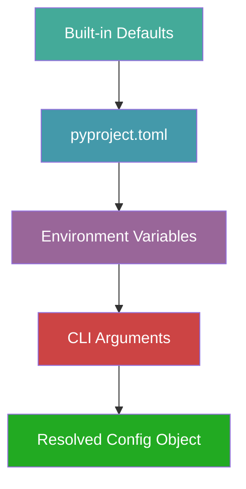

# behave-lint — Configuration System Design

> **Status:** Canonical configuration system specification.
> **Audience:** Core maintainers, plugin authors, CI engineers, and
> enterprise users.
> **Scope:** The complete configuration philosophy, source hierarchy,
> schema, validation, and evolution strategy for behave-lint. This
> document does not define implementation, code, or folder structure.
> **Dependencies:** This document follows VISION.md, SPECIFICATION.md,
> ARCHITECTURE.md, API.md, RULE_ENGINE.md, and DIAGNOSTIC_ENGINE.md.
> Inconsistencies, if any, are reported in **Appendix A**.

---

## Table of Contents

1. [Philosophy](#1-philosophy)
2. [Configuration Sources](#2-configuration-sources)
3. [Configuration Discovery](#3-configuration-discovery)
4. [Configuration Precedence](#4-configuration-precedence)
5. [Configuration Schema](#5-configuration-schema)
6. [Rule Configuration](#6-rule-configuration)
7. [Profiles](#7-profiles)
8. [Include / Exclude](#8-include--exclude)
9. [Overrides](#9-overrides)
10. [Environment Variables](#10-environment-variables)
11. [CLI Overrides](#11-cli-overrides)
12. [Validation](#12-validation)
13. [Error Handling](#13-error-handling)
14. [Extensibility](#14-extensibility)
15. [Versioning](#15-versioning)
16. [Performance](#16-performance)
17. [Security](#17-security)
18. [Future Evolution](#18-future-evolution)

---

## 1. Philosophy

### Why Configuration Exists

Configuration exists to let users adapt behave-lint to their
project's conventions, constraints, and quality standards. Without
configuration, the tool would impose a single set of rules and
severities on every project — appropriate for some, wrong for most.

Configuration is the bridge between the tool's **opinionated
defaults** and the user's **project-specific needs**. The tool
ships with sensible defaults that work for most projects. Users
who need different behavior configure only what they want to
change.

### How Much Configuration Is Desirable

**As little as possible, as much as necessary.**

The ideal configuration experience is **zero configuration** — the
user runs `behave-lint` and gets useful, correct results. This is
the experience for most projects. Configuration is needed only when
the user's standards differ from the defaults.

The configuration surface should be:

- **Small:** Few top-level keys. Each key has a clear purpose.
  Users should not need to read documentation to understand what a
  key does.
- **Composable:** Keys combine predictably. `select` + `ignore` +
  `severity` overrides have clear, documented interaction.
- **Progressive:** Simple needs require simple configuration
  (one key). Complex needs can use advanced features (overrides,
  profiles, per-rule parameters) without learning everything at
  once.

### When Configuration Becomes Harmful

Configuration becomes harmful when:

- **It is required for basic use.** If a user must configure
  behave-lint to get any useful output, the defaults are wrong.
- **It is unclear.** If a user cannot predict what a configuration
  change will do, the configuration model is too complex.
- **It is contradictory.** If two keys interact in surprising ways
  (e.g., `select` and `ignore` have unclear precedence), users
  lose trust in the tool.
- **It is excessive.** If the configuration schema has 50 keys,
  users are overwhelmed. Most users need 3–5 keys.

behave-lint avoids these pitfalls by keeping the top-level schema
small (under 15 keys), documenting every interaction, and providing
sensible defaults for every key.

### Opinionated vs. Configurable

behave-lint is **opinionated with escape hatches**:

- The default rule set, severities, and categories are opinionated.
  They represent the maintainers' best judgment for most projects.
- Every opinion is overridable. Users can enable, disable, and
  re-severity any rule.
- The configuration model does not impose structure (e.g., it does
  not require users to define rule groups or profiles). Users who
  want structure can use profiles (future) or define their own
  conventions.

This approach is inspired by Black (opinionated, minimal
configuration), Ruff (opinionated defaults, extensive
configurability), and ESLint (highly configurable, opinionated
presets).

### Design Validation

**Why this philosophy?** A configuration system that is too complex
alienates new users. A system that is too simple frustrates
advanced users. The "opinionated with escape hatches" approach
serves both: new users get zero-config utility, advanced users get
full control.

**Alternatives considered:**

- *Fully opinionated (no configuration):* Like Black's early
  approach. Rejected because linting needs more customization than
  formatting (different teams have different rule preferences).

- *Fully configurable (no defaults):* Like ESLint's early approach
  (require explicit rule configuration). Rejected because it
  creates a poor first-run experience.

**Trade-offs:** Maintaining good defaults requires ongoing
judgment from maintainers. If defaults are wrong, users must
configure around them. This is mitigated by making defaults
overridable.

**Long-term impact:** The philosophy ensures that the
configuration system remains approachable as it grows. New keys
are added only when justified by real user needs.

---

## 2. Configuration Sources

### Supported Sources

behave-lint supports the following configuration sources, listed
from lowest to highest precedence:

| Priority | Source | Description |
|---|---|---|
| 1 (lowest) | Built-in defaults | Hardcoded defaults in the tool. |
| 2 | `pyproject.toml` | `[tool.behave-lint]` section. Primary configuration file. |
| 3 | Environment variables | `BEHAVE_LINT_*` variables. For CI and containers. |
| 4 (highest) | CLI arguments | Command-line flags. For temporary overrides. |

### `pyproject.toml`

The primary configuration source. behave-lint reads the
`[tool.behave-lint]` section from `pyproject.toml` in the project
root. This follows the Python ecosystem convention established by
Ruff, Black, pytest, and mypy.

**Why `pyproject.toml`?** It is the standard location for Python
project configuration. Centralizing configuration in one file
reduces clutter and aligns with modern Python packaging practices.

**Why not a separate `.behave-lint.toml`?** A separate file adds
clutter without benefit for most projects. However, a separate
`behave-lint.toml` may be supported as a fallback for projects
that do not use `pyproject.toml` (future consideration, not v1).

### Environment Variables

Environment variables override `pyproject.toml` values. They are
primarily for CI/CD pipelines, containers, and cloud execution
where modifying configuration files is impractical.

All environment variables use the `BEHAVE_LINT_` prefix and map to
configuration keys (Section 10).

### CLI Arguments

CLI arguments have the highest precedence. They override all other
sources. CLI arguments are for temporary, per-invocation overrides
— they are not persisted and do not modify configuration files.

### Future Sources

| Source | Target | Description |
|---|---|---|
| `behave-lint.toml` | v1.1+ | Standalone configuration file for non-Python projects. |
| Workspace configuration | v2.0+ | Shared configuration across multiple repositories in a workspace. |
| IDE configuration | v2.0+ | IDE-specific overrides (via LSP settings). |
| Cloud configuration | v2.0+ | Remote configuration fetched from a cloud service. |

### Design Validation

**Why four sources?** Each source serves a distinct audience:
defaults (everyone), `pyproject.toml` (project maintainers),
environment variables (CI engineers), CLI (individual developers).
Fewer sources would limit flexibility; more sources would
complicate precedence.

**Why not support `.editorconfig`?** `.editorconfig` is for
editor formatting, not linting rules. Mixing the two would confuse
users. behave-lint may read `.editorconfig` for formatting-related
rules in the future, but not as a configuration source.

**Alternatives considered:**

- *Single source (pyproject.toml only):* Simpler but insufficient
  for CI and containers. Rejected.

- *INI/YAML/JSON configuration files:* Rejected in favor of TOML,
  which is the Python ecosystem standard (PEP 518).

**Trade-offs:** Supporting multiple sources requires a merge
strategy (Section 4). This is acceptable because the merge is
well-defined and deterministic.

**Long-term impact:** The source hierarchy supports future sources
(workspace, IDE, cloud) without restructuring. New sources are
inserted at the appropriate precedence level.

---

## 3. Configuration Discovery

### Discovery Order

When behave-lint starts, it discovers configuration in the
following order:

1. **Explicit path:** If the user provides `--config <path>`, that
   file is used. No search is performed.
2. **Current directory:** Search for `pyproject.toml` in the
   current working directory.
3. **Parent directories:** If not found in the current directory,
   search parent directories up to the workspace root.
4. **Defaults:** If no configuration file is found, use built-in
   defaults.

### Parent Directory Search

The parent directory search walks up from the current directory
until it finds a `pyproject.toml` with a `[tool.behave-lint]`
section or reaches the filesystem root.

```
/home/user/my-project/
├── pyproject.toml          ← Found first (has [tool.behave-lint])
├── features/
│   ├── login.feature
│   └── subdirectory/
│       └── cart.feature    ← Running from here, search finds
│                              /home/user/my-project/pyproject.toml
```

**Why parent directory search?** Users may run behave-lint from
subdirectories. Without parent search, the tool would use defaults
instead of the project's configuration, producing surprising
results.

### Workspace Boundaries

The search stops at the first `pyproject.toml` that contains a
`[tool.behave-lint]` section. A `pyproject.toml` without this
section does not stop the search — the tool continues to parent
directories.

This allows projects that share a `pyproject.toml` (e.g., a
monorepo with a root `pyproject.toml` for packaging) to have
behave-lint configuration in a different file (future:
`behave-lint.toml`).

### Multiple Repositories

In a monorepo with multiple sub-projects, each sub-project may
have its own `pyproject.toml`. The discovery rules are:

- Running from a sub-project directory uses that sub-project's
  configuration.
- Running from the root uses the root configuration.
- Sub-project configuration does not inherit from root
  configuration (no merge across files in v1).

**Future:** Configuration inheritance across files (`extends`
key) may be supported in v1.1+.

### Nested Projects

If a project contains a vendored dependency with its own
`pyproject.toml`, the vendored configuration is not used.
Discovery starts from the user's working directory, not from the
file being linted. This prevents vendored projects from
accidentally affecting the linting of the host project.

### Design Validation

**Why search parent directories?** Users frequently run tools from
subdirectories. Without parent search, the tool would silently use
defaults, producing confusing results.

**Why stop at the first `[tool.behave-lint]` section?** Merging
configuration from multiple files adds complexity (precedence,
conflict resolution). A single configuration file per project is
simpler and sufficient for v1. Cross-file inheritance is a future
feature.

**Alternatives considered:**

- *No parent search (current directory only):* Simpler but
  surprising for users who run from subdirectories. Rejected.

- *Merge all found configurations:* Too complex for v1. Rejected.
  May be considered for workspace configuration (v2.0+).

**Trade-offs:** Parent directory search may find a configuration
file the user did not intend (e.g., a parent project's
configuration). This is mitigated by the `--config` flag, which
allows explicit specification.

**Long-term impact:** The discovery algorithm supports future
workspace configuration (multiple files, inheritance) without
fundamental changes.

---

## 4. Configuration Precedence

### Precedence Model

Configuration from all sources is merged into a single `Config`
object. The merge follows strict precedence:



**Higher precedence overrides lower precedence.** The merge is
performed key-by-key:

- **Scalar values** (strings, booleans, numbers): The highest-
  precedence source wins. No merging.
- **Lists** (e.g., `select`, `ignore`): The highest-precedence
  source **replaces** the lower-precedence list. No concatenation.
  This is intentional — concatenation would make it impossible to
  remove a rule that a profile enabled.
- **Dicts** (e.g., `severity`, `rule_params`): The highest-
  precedence source **merges** into the lower-precedence dict.
  This allows overriding specific keys without redefining the
  entire dict.

### Why This Order?

**CLI > Environment > Project > Defaults:**

- **CLI is highest** because it is the most explicit and temporary.
  A user who passes `--select BC001` expects only `BC001` to run,
  regardless of project configuration.
- **Environment is next** because it represents the execution
  context (CI, container, cloud). CI pipelines set environment
  variables to override project defaults without modifying files.
- **Project configuration** is the primary source. It represents
  the team's agreed-upon standards.
- **Defaults are lowest** because they are the tool's opinion. They
  should be overridable by any source.

### Determinism

The merge is **deterministic** — the same sources always produce
the same resolved configuration. There is no runtime randomness,
no file-system-dependent ordering, and no implicit state.

### Design Validation

**Why replace lists instead of concatenating?** Concatenation
makes it impossible to remove items. If a profile enables `BC001`
and the user wants to disable it, they must be able to set
`ignore = ["BC001"]` without the profile re-adding it. Replacement
gives the user full control.

**Why merge dicts instead of replacing?** Dicts (like `severity`
overrides) are typically partial — the user overrides a few rules,
not all. Replacing would require the user to re-specify all
overrides. Merging is more ergonomic.

**Alternatives considered:**

- *Concatenate lists:* More additive but less controllable.
  Rejected.

- *Replace dicts:* More predictable but less ergonomic. Rejected.

- *Deep merge (merge all nested structures):* Too complex and
  unpredictable. Rejected for v1.

**Trade-offs:** The replace-lists / merge-dicts model requires
users to understand the distinction. This is documented and
consistent with Ruff's approach.

**Long-term impact:** The precedence model supports future sources
(workspace, cloud) by inserting them at the appropriate level
without changing the merge logic.

---

## 5. Configuration Schema

### Top-Level Schema

The configuration schema is defined in `[tool.behave-lint]` in
`pyproject.toml`. It matches SPECIFICATION.md Appendix B and
API.md Section 6.

| Key | Type | Default | Description |
|---|---|---|---|
| `select` | `list[str]` | `[]` | Rule IDs to enable (empty = all defaults). |
| `ignore` | `list[str]` | `[]` | Rule IDs to disable. |
| `severity` | `dict[str, str]` | `{}` | Per-rule severity overrides. |
| `output` | `str` | `"console"` | Output format(s), comma-separated. |
| `output-file` | `str` | `""` | Output file path (empty = stdout). |
| `paths` | `list[str]` | `["features/"]` | Default paths to lint. |
| `step-definitions` | `str` | `""` | Step definitions directory. |
| `exclude` | `list[str]` | `[]` | Glob patterns to exclude. |
| `cache` | `bool` | `true` | Enable caching. |
| `cache-dir` | `str` | `".behave-lint-cache"` | Cache directory. |
| `extends` | `str` | `""` | Profile to extend (future). |
| `fail-on` | `str` | `"error"` | Severity that causes non-zero exit. |

### Sections

#### General

Top-level keys (`select`, `ignore`, `severity`, `paths`, `exclude`,
`fail-on`) control the overall behavior of the lint run.

#### Rules

Per-rule parameters are defined in `[tool.behave-lint.rules.<ID>]`
sections:

```toml
[tool.behave-lint.rules.BX001]
max-steps = 10

[tool.behave-lint.rules.BX002]
max-scenarios = 50
```

Each rule declares its own parameters (RULE_ENGINE.md Section 10).
Unknown parameters for a rule produce a `ConfigError`.

#### Output

`output` and `output-file` control how diagnostics are presented.
Multiple output formats can be specified as a comma-separated
string: `output = "console,json"`.

#### Performance

`cache` and `cache-dir` control caching behavior. Caching is
enabled by default for performance. See Section 16 for details.

#### Plugins

Plugin enable/disable is defined in
`[tool.behave-lint.plugins]`:

```toml
[tool.behave-lint.plugins]
"my-plugin" = { enabled = true }
"legacy-plugin" = { enabled = false }
```

Plugins are discovered via entry points (RULE_ENGINE.md Section 3).
The `plugins` section controls which discovered plugins are
loaded.

#### Reporting (Future)

Future reporting configuration (e.g., custom report templates,
output verbosity) will be in `[tool.behave-lint.reporting]`.

#### Future Sections

| Section | Target | Description |
|---|---|---|
| `[tool.behave-lint.overrides]` | v1.1+ | Per-path configuration overrides. |
| `[tool.behave-lint.profiles]` | v1.1+ | Custom profile definitions. |
| `[tool.behave-lint.groups]` | v1.1+ | Custom rule groups. |
| `[tool.behave-lint.lsp]` | v2.0+ | LSP server configuration. |

### Design Validation

**Why under 15 top-level keys?** A small schema is easy to learn
and document. Users can scan the schema and understand what each
key does. Larger schemas (ESLint has 30+ top-level keys) overwhelm
new users.

**Why `[tool.behave-lint]` and not `[tool.behavelint]`?** The hyphen
matches the package name (`behave-lint`). TOML keys with hyphens
are standard (Ruff uses `[tool.ruff]`, Black uses `[tool.black]`).

**Alternatives considered:**

- *Flat schema (no sections):* All keys at the top level. Rejected
  because per-rule parameters need namespacing.

- *Nested schema (deep nesting):* More structured but harder to
  write and read. Rejected — the current two-level structure
  (top-level keys + per-rule sections) is sufficient.

**Trade-offs:** The two-level structure means per-rule parameters
are in a separate section, which is slightly less discoverable.
This is acceptable because per-rule parameters are advanced usage.

**Long-term impact:** The schema supports future sections
(overrides, profiles, groups) without restructuring. New sections
are additive.

---

## 6. Rule Configuration

### Enable / Disable

Rules are enabled and disabled via `select` and `ignore`:

```toml
[tool.behave-lint]
select = ["BC001", "BS001"]    # Enable specific rules
ignore = ["BX001"]              # Disable specific rules
```

**Semantics (matching API.md Section 6 and RULE_ENGINE.md Section
10):**

- If `select` is non-empty, only the listed rules are enabled.
- If `select` is empty (default), all default-enabled rules are
  enabled.
- `ignore` removes rules from the enabled set, regardless of
  `select`.
- Both accept rule IDs and rule names (aliases are resolved).

### Severity Override

Per-rule severity overrides via the `severity` dict:

```toml
[tool.behave-lint]
severity = { BC001 = "error", BS001 = "info", BX001 = "off" }
```

Severity overrides do not enable or disable rules — they change
the severity of already-enabled rules. Setting severity to `"off"`
effectively disables the rule (no diagnostics are produced).

### Rule Groups (Future)

Users may define custom rule groups:

```toml
[tool.behave-lint.groups]
my-team-rules = ["BC001", "BS001", "BK001"]
style-rules = ["BS001", "BS002", "BS003"]
```

Groups can be used in `select` and `ignore`:

```toml
[tool.behave-lint]
select = ["my-team-rules"]
ignore = ["style-rules"]
```

Groups are not implemented in v1 but the schema is designed to
accommodate them.

### Presets (Future)

Presets are plugin-provided configuration bundles:

```toml
[tool.behave-lint]
extends = "acme:strict"
```

A preset enables specific rules with specific parameters. Presets
are not implemented in v1.

### Profiles (Future)

Profiles are predefined configuration bundles (Section 7). They
are activated via `extends`:

```toml
[tool.behave-lint]
extends = "strict"
```

Profiles are not implemented in v1 but the schema reserves the
`extends` key.

### Experimental Rules

Experimental rules are not in the default-enabled set. Users must
explicitly select them:

```toml
[tool.behave-lint]
select = ["BC001", "BP001"]  # BP001 is experimental
```

The tool emits an informational message when experimental rules are
enabled, reminding the user that the rule's behavior may change.

### Deprecated Rules

Deprecated rules remain functional but emit a `DeprecationWarning`
when executed. Users can suppress the warning by removing the rule
from `select` or adding it to `ignore`.

### Custom Parameters

Per-rule parameters are defined in
`[tool.behave-lint.rules.<ID>]` sections (Section 5). Parameters
are rule-specific and validated against the rule's declared
parameters.

### Design Validation

**Why `select` + `ignore` instead of per-rule `enabled` flags?**
Two lists are more composable and match Ruff/ESLint conventions.
Per-rule enable flags would require a section per rule, which is
verbose.

**Why does `severity = "off"` disable a rule?** It is intuitive —
if the severity is "off," no diagnostics are produced. This is an
alternative to `ignore` for users who think in terms of severity.

**Alternatives considered:**

- *Regex-based selection:* `select = ["BC.*"]`. Considered for v1.1+.
  Not in v1 because category-based defaults are sufficient.

- *Category-based selection:* `select = ["correctness"]`. Considered
  for v1.1+. Not in v1 because the default-enabled set covers this.

**Trade-offs:** The `select`/`ignore` model requires users to know
rule IDs. This is acceptable because rule IDs are stable and
discoverable via `behave-lint rules`.

**Long-term impact:** The rule configuration model supports future
features (groups, presets, profiles, regex selection) without
breaking changes.

---

## 7. Profiles

### Purpose

Profiles are predefined configuration bundles that enable a
curated set of rules with specific severities. They provide a
one-line way to adopt a comprehensive rule set without enumerating
individual rules.

Profiles are **not implemented in v1** but the `extends` key is
reserved and the `Config` object is designed to support them
(API.md Section 6).

### Standard Profiles

| Profile | Description | Target User |
|---|---|---|
| `default` | All stable rules at their default severities. Equivalent to no configuration. | New users, most projects. |
| `recommended` | All stable rules plus selected pedantic rules at elevated severities. | Teams wanting thorough checking. |
| `strict` | All rules (including experimental) at `ERROR` severity. | Regulated industries, strict CI. |
| `legacy` | A reduced rule set for projects migrating from other tools. Gradually tightens. | Projects new to linting. |
| `enterprise` | Comprehensive rule set with step-definition checking and cross-file consistency. | Large organizations. |
| `ci` | Optimized for CI: JSON output, cache enabled, fail on warnings. | CI/CD pipelines. |
| `education` | Pedantic rules at `INFO` severity. Educational, not blocking. | Learning Gherkin best practices. |

### Profile Activation

```toml
[tool.behave-lint]
extends = "strict"
```

Profile settings are merged with project configuration. Project
configuration overrides profile settings (project > profile >
defaults).

### Profile Composition

Profiles can extend other profiles:

```toml
# Internal definition (not user-facing)
[profile.strict]
extends = "recommended"
severity = { BP001 = "error", BP002 = "error" }
```

This allows building a hierarchy of profiles without duplication.

### Custom Profiles (Future)

Users may define custom profiles:

```toml
[tool.behave-lint.profiles.my-team]
extends = "recommended"
ignore = ["BX001"]
severity = { BS001 = "info" }
```

And activate them:

```toml
[tool.behave-lint]
extends = "my-team"
```

Custom profiles are not implemented in v1.

### Design Validation

**Why profiles?** Enumerating individual rules is tedious for
large rule sets. Profiles provide curated bundles that match common
use cases. Users who want fine-grained control can still configure
individual rules.

**Why not implement profiles in v1?** The v1 rule set is small
enough that the default-enabled set is sufficient. Profiles become
valuable as the rule set grows (50+ rules). Defining the `extends`
key now prevents naming collisions later.

**Alternatives considered:**

- *No profiles (rules only):* Simpler but tedious for large rule
  sets. Rejected for long-term usability.

- *Profiles in v1:* Premature — the v1 rule set does not justify
  the complexity. Deferred to v1.1+.

**Trade-offs:** Reserving `extends` without implementing it means
the key is accepted but ignored in v1. This is acceptable — users
who set `extends` get a warning ("profiles not yet supported") and
the default rule set.

**Long-term impact:** Profiles provide a scalable configuration
mechanism as the rule set grows. The profile hierarchy supports
community-contributed profiles (future marketplace).

---

## 8. Include / Exclude

### Include Paths

The `paths` key specifies which directories or files to lint:

```toml
[tool.behave-lint]
paths = ["features/"]
```

Default: `["features/"]`. Multiple paths are supported:

```toml
[tool.behave-lint]
paths = ["features/", "specs/", "tests/acceptance/"]
```

### Exclude Paths

The `exclude` key specifies glob patterns for files to exclude:

```toml
[tool.behave-lint]
exclude = ["features/legacy/**", "**/wip.feature", "**/*.bak"]
```

### Glob Support

Exclude patterns use glob syntax:

| Pattern | Matches |
|---|---|
| `**` | Any number of directories. |
| `*` | Any characters within a path segment. |
| `?` | A single character. |
| `[abc]` | One of the characters in the bracket. |

Glob patterns are matched against the relative path from the
project root.

### Regex Support (Future)

Future versions may support regex exclusion patterns:

```toml
[tool.behave-lint]
exclude-regex = ["^features/legacy/.*\\.feature$"]
```

Regex support is not in v1 — glob patterns are sufficient for
most use cases.

### Ignore Files (Future)

Future versions may support `.behave-lint-ignore` files (similar
to `.gitignore`):

```
# .behave-lint-ignore
features/legacy/
*.wip.feature
```

Ignore files are not in v1 — the `exclude` key is sufficient.

### Generated Files

Generated feature files (e.g., produced by a code generator) can
be excluded via `exclude`. There is no automatic detection of
generated files in v1. Future versions may support a
`generated-markers` key:

```toml
[tool.behave-lint]
generated-markers = ["# Auto-generated", "# DO NOT EDIT"]
```

Files containing any of the markers would be excluded. Not in v1.

### Vendor Directories

Vendor directories (e.g., `vendor/`, `third_party/`) should be
excluded via `exclude`:

```toml
[tool.behave-lint]
exclude = ["vendor/**", "third_party/**"]
```

### Temporary Files

Temporary files (e.g., `*.tmp.feature`, `*.bak`) are excluded via
`exclude`:

```toml
[tool.behave-lint]
exclude = ["**/*.tmp.feature", "**/*.bak"]
```

### Design Validation

**Why glob and not regex?** Glob is simpler, more widely
understood, and sufficient for most exclusion patterns. Regex is
powerful but error-prone and harder to document.

**Why no `.behave-lint-ignore` file?** The `exclude` key in
`pyproject.toml` is sufficient. A separate ignore file adds
clutter. May be reconsidered if users request it.

**Alternatives considered:**

- *Regex only:* Too complex for common patterns. Rejected.

- *No exclude (lint everything):* Too aggressive. Users need to
  exclude legacy, vendor, and WIP files. Rejected.

**Trade-offs:** Glob patterns may not cover all edge cases (e.g.,
conditional exclusion based on file content). Regex and ignore
files are future fallbacks.

**Long-term impact:** The include/exclude model supports future
features (generated file detection, ignore files) without
restructuring.

---

## 9. Overrides

### Purpose

Overrides allow per-path configuration changes. For example, a
project may want to enforce stricter rules in `features/critical/`
than in `features/experimental/`.

Overrides are **not implemented in v1** but the schema is designed
to accommodate them in v1.1+.

### Per-Directory Overrides

```toml
[[tool.behave-lint.overrides]]
path = "features/critical/**"
severity = { BS001 = "error" }
fail-on = "warning"

[[tool.behave-lint.overrides]]
path = "features/experimental/**"
ignore = ["BC001", "BS001"]
```

### Per-File Overrides

```toml
[[tool.behave-lint.overrides]]
path = "features/legacy/login.feature"
ignore = ["*"]
```

### Per-Pattern Overrides

```toml
[[tool.behave-lint.overrides]]
path = "**/*.wip.feature"
ignore = ["*"]
```

### Override Semantics

- Overrides are applied in order (first match wins).
- An override's `select`, `ignore`, and `severity` **replace** the
  base configuration for matching files.
- Multiple overrides can match the same file; the first matching
  override is applied.
- Overrides do not cascade — a file matches at most one override.

### Conditional Overrides (Future)

Future versions may support conditional overrides:

```toml
[[tool.behave-lint.overrides]]
path = "features/**"
condition = "branch == 'main'"
severity = { BS001 = "error" }
```

Conditional overrides are not in v1.

### Workspace Overrides (Future)

In a workspace with multiple projects, overrides may be defined at
the workspace level and applied to all projects. Not in v1.

### Design Validation

**Why per-path overrides?** Different parts of a project may have
different standards. Without overrides, users must either accept
one standard for all files or split the project into multiple
lint runs. Overrides provide a single-run solution.

**Why first-match-wins?** Cascading overrides (applying all
matching overrides in order) is complex and unpredictable. First-
match-wins is simple and deterministic.

**Why not implement in v1?** Overrides add complexity (path
matching, merge semantics). The v1 use case (single standard per
project) does not justify them. Defining the schema now prevents
naming collisions.

**Alternatives considered:**

- *Cascading overrides:* All matching overrides are applied in
  order. Rejected — too complex and unpredictable.

- *No overrides:* Users run multiple lint commands for different
  paths. Rejected — inconvenient and does not produce a unified
  report.

**Trade-offs:** First-match-wins means that a file matches at most
one override. Users who need multiple overrides for the same file
must combine them into a single override. This is acceptable.

**Long-term impact:** The override model supports future features
(conditional overrides, workspace overrides) without
restructuring.

---

## 10. Environment Variables

### Supported Variables

| Variable | Maps to | Type | Example |
|---|---|---|---|
| `BEHAVE_LINT_OUTPUT` | `output` | `str` | `BEHAVE_LINT_OUTPUT=json` |
| `BEHAVE_LINT_OUTPUT_FILE` | `output-file` | `str` | `BEHAVE_LINT_OUTPUT_FILE=results.json` |
| `BEHAVE_LINT_NO_CACHE` | `cache` | `bool` | `BEHAVE_LINT_NO_CACHE=1` |
| `BEHAVE_LINT_CACHE_DIR` | `cache-dir` | `str` | `BEHAVE_LINT_CACHE_DIR=/tmp/cache` |
| `BEHAVE_LINT_CONFIG` | (CLI `--config`) | `str` | `BEHAVE_LINT_CONFIG=custom.toml` |
| `BEHAVE_LINT_FAIL_ON` | `fail-on` | `str` | `BEHAVE_LINT_FAIL_ON=warning` |
| `BEHAVE_LINT_TRACE` | (internal) | `bool` | `BEHAVE_LINT_TRACE=1` |

### Override Strategy

Environment variables override `pyproject.toml` values but are
overridden by CLI arguments (Section 4). The mapping is:

- String variables replace the corresponding config key.
- Boolean variables use `1`/`true`/`yes` for true and `0`/`false`/
  `no`/empty for false.
- Path variables are used as-is (no path expansion beyond what the
  shell provides).

### CI Compatibility

Environment variables are the primary mechanism for CI
customization:

- **GitHub Actions:** Set via `env:` in workflow steps.
- **GitLab CI:** Set via `variables` in `.gitlab-ci.yml`.
- **Jenkins:** Set via `environment` in pipeline.
- **CircleCI:** Set via `environment` in config.

### Containers

In containerized environments, environment variables are set in
the Dockerfile or docker-compose:

```dockerfile
ENV BEHAVE_LINT_OUTPUT=json
ENV BEHAVE_LINT_OUTPUT_FILE=/results/lint.json
```

### Cloud Execution

In cloud execution (future), environment variables are set by the
cloud provider. This allows cloud-based linting without modifying
project files.

### Design Validation

**Why environment variables?** They are the standard mechanism for
CI/container customization. They do not require modifying project
files, making them ideal for ephemeral environments.

**Why the `BEHAVE_LINT_` prefix?** Prefixing prevents collisions
with other tools' environment variables. It is the convention used
by most Python tools (`RUFF_*`, `BLACK_*`, `PYTEST_*`).

**Alternatives considered:**

- *No environment variables:* Insufficient for CI. Rejected.

- *Separate config file for CI:* More explicit but less flexible.
  Environment variables are the CI standard.

**Trade-offs:** Environment variables are less discoverable than
configuration file keys. Users must read documentation to learn
them. This is acceptable because they are primarily for CI
engineers, not end users.

**Long-term impact:** The environment variable model supports
future cloud execution without changes. New variables are
additive.

---

## 11. CLI Overrides

### Temporary Configuration

CLI arguments provide per-invocation overrides. They are not
persisted and do not modify configuration files. This makes them
ideal for:

- Trying a rule without modifying project configuration.
- Running a one-off check with different output.
- Debugging configuration issues.

### Supported Overrides

| Flag | Maps to | Description |
|---|---|---|
| `--select <ids>` | `select` | Enable specific rules. |
| `--ignore <ids>` | `ignore` | Disable specific rules. |
| `--output <fmt>` | `output` | Output format. |
| `--output-file <path>` | `output-file` | Output file. |
| `--config <path>` | (discovery) | Explicit config file path. |
| `--no-cache` | `cache = false` | Disable cache. |
| `--clear-cache` | (action) | Clear cache before running. |
| `--fail-on <sev>` | `fail-on` | Severity for non-zero exit. |
| `--color` / `--no-color` | (output) | Force color on/off. |
| `--verbose` | (output) | Verbose output. |
| `--quiet` | (output) | Suppress non-error output. |

### Session Overrides

CLI overrides apply only to the current session (process
lifetime). They do not affect future runs. This is by design —
CLI overrides are temporary.

### Profile Selection (Future)

```bash
behave-lint --profile strict features/
```

The `--profile` flag activates a profile for the current session.
Not implemented in v1.

### Rule Selection

```bash
behave-lint --select BC001,BS001 features/
behave-lint --ignore BX001 features/
```

Multiple rule IDs are comma-separated. Both flags accept rule IDs
and rule names (aliases are resolved).

### Output Selection

```bash
behave-lint --output json --output-file results.json features/
behave-lint --output console,json features/
```

Multiple output formats are comma-separated. The tool writes to
each format (console to stdout, JSON to file or stdout).

### Precedence

CLI arguments have the highest precedence (Section 4). They
override environment variables and project configuration. If a
CLI argument is not provided, the lower-precedence source is used.

### Design Validation

**Why are CLI overrides temporary?** Persistent CLI overrides would
create hidden state (a user might forget that they passed `--select
BC001` last time and be confused when other rules do not run).
Temporary overrides are explicit and predictable.

**Why comma-separated and not repeated flags?** Comma-separated
(`--select BC001,BS001`) is more concise than repeated flags
(`--select BC001 --select BS001`). Both are common; behave-lint
uses comma-separated for consistency with Ruff.

**Alternatives considered:**

- *Repeated flags:* More explicit but verbose. Not used for
  multi-value flags.

- *No CLI overrides (config file only):* Insufficient for
  temporary use. Rejected.

**Trade-offs:** CLI overrides are not persisted, so users must
re-specify them on each run. This is acceptable — users who want
persistent configuration use `pyproject.toml`.

**Long-term impact:** The CLI override model supports future flags
(`--profile`, `--fix`, `--unsafe-fixes`) without changing the
precedence model.

---

## 12. Validation

### Schema Validation

Configuration is validated at load time by the `load_config()`
function (API.md Section 5). Validation checks:

### Unknown Options

Unknown keys in `[tool.behave-lint]` produce a **warning** (not an
error). This is forward-compatible — a future version may support
the key. The warning includes the key name and a suggestion if a
similar key exists:

```
Warning: Unknown configuration key 'ouput'. Did you mean 'output'?
```

### Deprecated Options

Deprecated keys produce a `DeprecationWarning` with migration
guidance:

```
DeprecationWarning: 'output-file' is deprecated. Use 'output_file' instead.
```

Deprecated keys remain functional for at least one minor version.

### Type Validation

Each configuration key has an expected type. Invalid types produce
a `ConfigError` with an actionable message:

```
ConfigError: Invalid type for key 'select'. Expected list of strings, got string ("BC001").
Hint: Use select = ["BC001"] instead of select = "BC001".
```

### Version Compatibility

If a configuration key requires a newer version of behave-lint
(e.g., a key introduced in v1.2 is used with v1.0), the tool emits
a warning:

```
Warning: Configuration key 'extends' requires behave-lint >= 1.1.0 (running 1.0.0).
```

### Migration Warnings

When a deprecated key is used, the tool suggests the migration:

```
DeprecationWarning: 'cache-dir' is deprecated. Use 'cache_dir' instead.
This key will be removed in behave-lint 2.0.
```

### Helpful Error Messages

All validation errors include:

- **What went wrong:** A clear description of the error.
- **Where:** The file and section where the error was found.
- **How to fix:** A suggestion or hint for fixing the error.
- **Example:** A correct example if applicable.

### Design Validation

**Why are unknown keys warnings, not errors?** Forward
compatibility — a user who upgrades behave-lint should not get
errors for keys that a future version supports. Warnings inform
the user without blocking.

**Why are type errors fatal?** A type error (e.g., `select = 123`)
indicates a misunderstanding of the schema. Proceeding with
incorrect types would produce confusing behavior. Fatal errors
force the user to fix the configuration.

**Alternatives considered:**

- *Strict mode (all validation failures are fatal):* Poor user
  experience for minor issues. Rejected.

- *No validation:* Confusing runtime errors. Rejected.

**Trade-offs:** Warning-based validation means that invalid
configuration may be silently ignored. Users who do not read
warnings may not notice. A future `--strict` flag could treat
warnings as errors.

**Long-term impact:** The validation model supports future `--strict`
mode without restructuring.

---

## 13. Error Handling

### Invalid Files

If the configuration file cannot be read (permissions, missing
file), the tool:

1. Emits an error message with the file path.
2. Falls back to built-in defaults.
3. Continues with the lint run.

This is non-fatal — the user gets a warning and the tool runs with
defaults.

### Broken TOML

If the configuration file contains invalid TOML (syntax error),
the tool:

1. Emits an error with the parse error location (line, column).
2. Raises `ConfigError` with the error message.
3. Exits with code 2 (internal error).

This is fatal — invalid TOML means the configuration cannot be
parsed, and proceeding with defaults would ignore the user's
intent.

### Unknown Rules

If `select` or `ignore` references an unknown rule ID:

1. A warning is emitted with a fuzzy-match suggestion.
2. The unknown rule ID is ignored.
3. The tool continues.

This is non-fatal — unknown rule IDs may be from a plugin that is
not installed or a future version.

### Invalid Severities

If `severity` contains an invalid value (not one of `error`,
`warning`, `info`, `off`):

1. `ConfigError` is raised with the invalid value and expected
   values.
2. The tool exits with code 2.

This is fatal — an invalid severity is a clear configuration error
that cannot be recovered automatically.

### Conflicting Options

If `select` and `ignore` overlap (a rule is in both):

1. `ignore` wins (a rule in both is disabled).
2. A warning is emitted informing the user of the conflict.

This is non-fatal — the conflict is resolved deterministically
(`ignore` wins) and the user is informed.

### Recovery Strategy

The overall recovery strategy is:

- **Parse errors (broken TOML):** Fatal. Cannot proceed.
- **Type errors (wrong type for a key):** Fatal. Cannot guess the
  intended value.
- **Value errors (invalid severity, unknown rule):** Non-fatal
  for unknown rules (warning + skip). Fatal for invalid severities
  (cannot guess the intended severity).
- **Conflicts (select + ignore overlap):** Non-fatal. Resolved
  deterministically with a warning.
- **File errors (cannot read file):** Non-fatal. Fall back to
  defaults.

### Design Validation

**Why is broken TOML fatal but unknown rules non-fatal?** Broken
TOML means the entire configuration is unparseable — there is no
way to recover the user's intent. Unknown rules are a minor issue
(a typo or a missing plugin) that does not affect the rest of the
configuration.

**Why does `ignore` win over `select`?** `ignore` is the more
specific intent — the user explicitly does not want the rule.
`select` may include the rule as part of a broader selection.
Disabling is safer than enabling.

**Alternatives considered:**

- *All errors fatal:* Poor user experience. Rejected.

- *All errors non-fatal:* Dangerous — the tool might run with
  incorrect configuration and produce misleading results. Rejected.

**Trade-offs:** The mixed fatal/non-fatal strategy requires users
to understand which errors are blocking. This is documented in
error messages (each error states whether it is fatal).

**Long-term impact:** The error handling model supports future
`--strict` mode (treat all warnings as errors) without
restructuring.

---

## 14. Extensibility

### Future Plugin Configuration

Plugins may declare configuration sections:

```toml
[tool.behave-lint.plugins.my-plugin]
enabled = true
custom-key = "value"
```

Plugin configuration is namespaced under
`[tool.behave-lint.plugins.<plugin-name>]`. The plugin receives
its configuration section via the rule context (RULE_ENGINE.md
Section 8).

### Namespacing

All plugin configuration is namespaced. Plugins cannot define
top-level keys — they must use their namespace. This prevents
plugins from colliding with each other or with core keys.

### Custom Configuration Sections

Future versions may support custom configuration sections for
non-plugin extensions (e.g., reporter-specific configuration):

```toml
[tool.behave-lint.reporting.html]
theme = "dark"
include-summary = true
```

Custom sections are not in v1 but the schema is designed to
accommodate them.

### SDK Support

Plugin authors can declare configuration schema for their plugins
(future). The tool validates plugin configuration against the
declared schema, providing type checking and helpful error
messages for plugin users.

### Design Validation

**Why namespacing?** Without namespacing, plugins could define
keys that collide with core keys or other plugins. Namespacing
ensures isolation and prevents conflicts.

**Why not allow plugins to define top-level keys?** Top-level keys
are part of the core schema and are stable. Allowing plugins to
add them would make the schema unpredictable and break
forward compatibility.

**Alternatives considered:**

- *Flat plugin configuration (no namespacing):* Simpler but
  collision-prone. Rejected.

- *No plugin configuration:* Too restrictive — plugins need
  configuration. Rejected.

**Trade-offs:** Namespaced configuration is slightly more verbose
for users. This is acceptable for the safety it provides.

**Long-term impact:** The namespacing model supports a future
plugin SDK with schema validation without restructuring.

---

## 15. Versioning

### Configuration Evolution

The configuration schema follows Semantic Versioning:

- **Non-breaking changes (minor version):** Adding a new key,
  adding a new value to an enum, deprecating a key. Existing
  configurations continue to work.
- **Breaking changes (major version):** Removing a key, changing a
  key's type, changing default behavior. Existing configurations
  may need migration.

### Deprecation

Deprecated keys follow this lifecycle:

1. **Deprecated (minor version):** The key produces a
   `DeprecationWarning` with migration guidance. The key remains
   functional.
2. **Removed (next major version):** The key is removed. Using it
   produces an "unknown key" warning.

### Migration

For each major version:

- A migration guide is published in the changelog.
- Deprecated keys from the prior major version are removed.
- Automated migration tools are provided when feasible (e.g., a
  `behave-lint migrate` command that rewrites `pyproject.toml`).

### Compatibility

Within a major version:

- All existing keys remain functional.
- New keys may be added (with defaults).
- Default values may change in minor versions (with a warning and
  migration guide).

### Design Validation

**Why follow semver for configuration?** Configuration is part of
the public API. Users build CI pipelines and project templates
around it. Breaking changes without a major version bump would
silently break user pipelines.

**Why may defaults change in minor versions?** Defaults are
opinionated and may need adjustment as the tool evolves. Changing
a default in a minor version is acceptable if:
- The change is documented in the changelog.
- The old behavior can be restored via configuration.
- A migration guide is provided.

**Alternatives considered:**

- *Never change defaults:* Too rigid. The tool cannot evolve.
  Rejected.

- *Change defaults in patch versions:* Too surprising. Users
  expect patch versions to be bug-fix-only. Rejected.

**Trade-offs:** Changing defaults in minor versions may surprise
users who upgrade. This is mitigated by clear changelog entries
and migration guides.

**Long-term impact:** The versioning strategy ensures that users
can upgrade confidently within a major version and migrate
explicitly across major versions.

---

## 16. Performance

### Configuration Caching

Configuration is parsed once per run and cached in memory. The
`Config` object is immutable (API.md Section 6) and can be safely
shared across threads.

For repeated runs (watch mode, LSP), the configuration file's
modification time is checked. If the file has not changed, the
cached `Config` object is reused. If it has changed, the
configuration is reloaded.

### Incremental Reload

When the configuration file changes, only the changed keys are
reloaded (future optimization). In v1, the entire configuration is
reloaded. The performance cost is negligible (TOML parsing is
fast, typically < 1ms for a small file).

### Workspace Reuse

In a workspace with multiple projects (future), the workspace-
level configuration is loaded once and shared across projects.
Project-level configuration is loaded per project and merged with
the workspace configuration.

### Lazy Loading

- **Plugin configuration:** Plugin configuration sections are not
  parsed until the plugin is loaded (lazy). This avoids parsing
  configuration for disabled plugins.
- **Rule parameters:** Per-rule parameter sections are not parsed
  until the rule is enabled. This avoids parsing configuration for
  disabled rules.

### Design Validation

**Why cache configuration in memory?** The `Config` object is
accessed by every component (rule engine, diagnostic engine,
reporters). Caching avoids re-parsing the TOML file on each
access.

**Why check modification time?** In watch mode or LSP mode, the
configuration may change between runs. Checking the modification
time is the simplest way to detect changes without file system
watching.

**Alternatives considered:**

- *No caching (re-parse every time):* Wasteful. TOML parsing is
  fast but unnecessary if the file has not changed.

- *File system watching:* More responsive but adds complexity and
  platform-specific dependencies. Not needed for v1 (CLI mode).

**Trade-offs:** Modification time checking may miss changes if the
file is written within the same second (modification time
resolution is 1 second on some file systems). This is acceptable
for v1 — the user can re-run the tool.

**Long-term impact:** The caching model supports watch mode and
LSP mode without fundamental changes. File system watching can be
added as a refinement.

---

## 17. Security

### Safe Parsing

Configuration is parsed using a standard TOML parser. No code
execution occurs during parsing. The TOML parser does not support
`include` directives or arbitrary code execution.

### No Code Execution

Configuration values are treated as data, not code. No
configuration value is ever evaluated as Python code. This
prevents arbitrary code execution via configuration.

### No Arbitrary Imports

Configuration cannot specify Python modules to import. Plugin
discovery is via entry points (RULE_ENGINE.md Section 3), not via
configuration. The `plugins` section enables/disables discovered
plugins — it does not specify import paths.

### Plugin Isolation

Plugin configuration is namespaced (Section 14). Plugins receive
only their own configuration section — they cannot access other
plugins' configuration or core configuration. This prevents
plugins from interfering with each other.

### Threat Model

- **Malicious configuration file:** A malicious `pyproject.toml`
  cannot execute code. It can only set configuration values to
  invalid or unexpected values, which are caught by validation.
- **Malicious plugin:** A malicious plugin package (installed via
  `pip`) can execute arbitrary code when loaded. This is the same
  threat model as any Python package — users are responsible for
  vetting plugins before installation.
- **Configuration injection:** If an attacker can modify
  `pyproject.toml`, they can change linting behavior (e.g., disable
  rules). This is a project security concern, not a tool security
  concern. The tool does not mitigate against malicious
  configuration file modifications.

### Design Validation

**Why is configuration safe?** TOML is a data format, not a code
format. behave-lint does not support any configuration feature
that executes code (no `include`, no `eval`, no `import`).

**Why not support `include` directives?** `include` directives
would allow configuration files to include other files, potentially
from untrusted paths. This is a security risk and adds complexity.
Users who need shared configuration can use profiles (future) or
symlinks.

**Alternatives considered:**

- *Support `include` directives:* Rejected for security and
  complexity reasons.

- *Support Python-based configuration:* Rejected — Python
  configuration files (like pytest's `conftest.py`) execute code
  and are a security risk. TOML is safer.

**Trade-offs:** Not supporting `include` means users with complex
configuration needs must use a single file or profiles (future).
This is acceptable for v1.

**Long-term impact:** The security model ensures that
configuration is always safe to parse, even from untrusted
sources. This supports future cloud configuration (fetching
configuration from a remote server) without additional risk.

---

## 18. Future Evolution

### Workspace Configuration

A workspace (monorepo) may have shared configuration across
multiple projects:

```toml
# workspace-root/behave-lint.toml
[tool.behave-lint]
select = ["BC001", "BS001"]
exclude = ["vendor/**"]
```

Each project inherits the workspace configuration and can override
it:

```toml
# workspace-root/project-a/pyproject.toml
[tool.behave-lint]
ignore = ["BS001"]
```

Workspace configuration is not in v1. The `extends` key and
discovery algorithm are designed to support it.

### Cloud Configuration

Future versions may support fetching configuration from a cloud
service:

```toml
[tool.behave-lint]
extends = "cloud:my-org-policy"
```

Cloud configuration is fetched at startup, cached locally, and
merged with project configuration. This enables organization-wide
policy enforcement without modifying each project's
configuration.

### Shared Profiles

Profiles can be shared across projects and organizations:

- **Community profiles:** Published as Python packages and
  installed via `pip`.
- **Organization profiles:** Published to an internal package
  registry.
- **Team profiles:** Defined in a shared repository and referenced
  via `extends`.

### Remote Profiles

Remote profiles are fetched from a URL:

```toml
[tool.behave-lint]
extends = "https://internal.acme.com/lint-profiles/strict.toml"
```

Remote profiles are cached locally with a TTL. If the remote is
unavailable, the cached version is used. If no cached version
exists, the tool falls back to defaults with a warning.

### Organization Presets

Organizations may publish preset bundles that include rules,
configuration, and documentation:

```toml
[tool.behave-lint]
extends = "acme:enterprise-v2"
```

Presets are versioned and can be pinned:

```toml
[tool.behave-lint]
extends = "acme:enterprise-v2@1.5.0"
```

### Enterprise Policies

Enterprise policies enforce mandatory configuration that cannot be
overridden by projects:

- Certain rules are always enabled.
- Certain severities are always `ERROR`.
- Certain exclude patterns are forbidden.

Enterprise policies are enforced at the workspace or organization
level. Projects cannot override them. This is a future feature
requiring authentication and policy infrastructure.

### Design Validation

**Why design for future evolution?** Configuration systems are
long-lived. Projects keep the same configuration format for years.
Designing for future features (workspace, cloud, shared profiles)
ensures that the configuration model can grow without breaking
changes.

**Why not implement these features now?** Each future feature
requires infrastructure (workspace detection, cloud service,
package registry, policy enforcement). The v1 configuration model
provides the foundation; the features are built on top.

**Alternatives considered:**

- *YAGNI (no future design):* Rejected — configuration systems are
  expensive to change. Designing extension points is cheap;
  restructuring is expensive.

- *Implement all features now:* Rejected — premature. Each feature
  needs real-world validation before implementation.

**Trade-offs:** Designing for evolution adds reserved keys
(`extends`) and future sections (overrides, profiles, groups) that
are unused in v1. This is acceptable because the cost is low
(reserved keys are ignored) and the benefit (years of stable
evolution) is high.

**Long-term impact:** The configuration model supports years of
evolution (workspace, cloud, shared profiles, enterprise policies)
without breaking changes. Each future feature extends the model at
the appropriate extension point.

---

## Appendix A: Consistency Check

The following consistency checks were performed against VISION.md,
SPECIFICATION.md, ARCHITECTURE.md, API.md, RULE_ENGINE.md, and
DIAGNOSTIC_ENGINE.md:

1. **Configuration sources:** CONFIGURATION_SYSTEM.md defines 4
   sources (defaults, pyproject.toml, env vars, CLI) matching
   API.md Section 6. **Consistent.**

2. **Precedence order:** CONFIGURATION_SYSTEM.md defines
   CLI > Environment > pyproject.toml > defaults, matching API.md
   Section 6. **Consistent.**

3. **Configuration schema:** CONFIGURATION_SYSTEM.md top-level keys
   match SPECIFICATION.md Appendix B and API.md Section 6
   (`select`, `ignore`, `severity`, `output`, `output-file`,
   `paths`, `step-definitions`, `cache`, `cache-dir`, `plugins`).
   Additional keys (`exclude`, `extends`, `fail-on`) are additive
   and do not contradict. **Consistent (superset).**

4. **Environment variables:** CONFIGURATION_SYSTEM.md defines the
   same variables as API.md Section 6 (`BEHAVE_LINT_OUTPUT`,
   `BEHAVE_LINT_OUTPUT_FILE`, `BEHAVE_LINT_NO_CACHE`,
   `BEHAVE_LINT_CACHE_DIR`, `BEHAVE_LINT_TRACE`). Additional
   variables (`BEHAVE_LINT_CONFIG`, `BEHAVE_LINT_FAIL_ON`) are
   additive. **Consistent (superset).**

5. **Validation behavior:** CONFIGURATION_SYSTEM.md defines
   unknown keys as warnings, invalid values as `ConfigError`,
   unknown rule IDs as warnings with fuzzy-match, matching API.md
   Section 6. **Consistent.**

6. **Profiles:** CONFIGURATION_SYSTEM.md defines profiles as
   future (not v1), matching API.md Section 6 ("Not implemented in
   v1"). **Consistent.**

7. **Config object:** CONFIGURATION_SYSTEM.md references `Config`
   as a frozen dataclass, matching API.md Section 4 and Section 6.
   **Consistent.**

8. **Rule configuration:** CONFIGURATION_SYSTEM.md defines
   `select`/`ignore`/`severity` semantics matching RULE_ENGINE.md
   Section 10 and API.md Section 6. **Consistent.**

9. **Plugin configuration:** CONFIGURATION_SYSTEM.md defines
   plugin namespacing under `[tool.behave-lint.plugins]`, matching
   SPECIFICATION.md Appendix B and RULE_ENGINE.md Section 14.
   **Consistent.**

10. **Per-rule parameters:** CONFIGURATION_SYSTEM.md defines
    `[tool.behave-lint.rules.<ID>]` sections matching
    SPECIFICATION.md Appendix B and RULE_ENGINE.md Section 10.
    **Consistent.**

11. **`extends` key:** CONFIGURATION_SYSTEM.md reserves `extends`
    for profiles, matching API.md Section 6. **Consistent.**

12. **Error handling:** CONFIGURATION_SYSTEM.md references
    `ConfigError` matching API.md Section 11. **Consistent.**

**No inconsistencies detected.**
