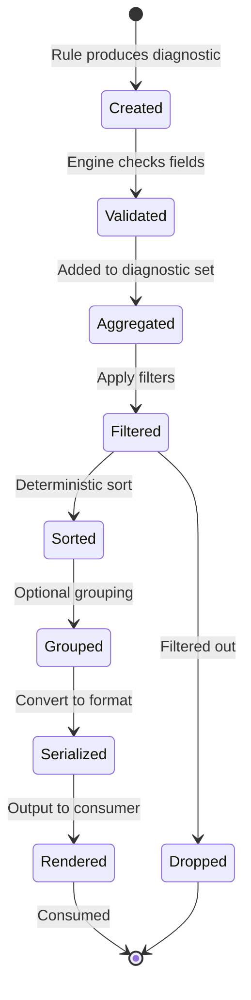

# behave-lint — Diagnostic Engine Design

> **Status:** Canonical diagnostic engine specification.
> **Audience:** Core maintainers, reporter authors, IDE integrators,
> and tooling partners.
> **Scope:** The complete architecture for how issues detected by
> behave-lint are represented, processed, filtered, sorted, grouped,
> serialized, and rendered. This document does not define rules,
> implementation code, or folder structure.
> **Dependencies:** This document follows VISION.md, SPECIFICATION.md,
> ARCHITECTURE.md, API.md, and RULE_ENGINE.md. Inconsistencies, if
> any, are reported in **Appendix A**.

---

## Table of Contents

1. [Philosophy](#1-philosophy)
2. [Diagnostic Lifecycle](#2-diagnostic-lifecycle)
3. [Diagnostic Model](#3-diagnostic-model)
4. [Severity Model](#4-severity-model)
5. [Categories](#5-categories)
6. [Suggestions](#6-suggestions)
7. [Auto-Fix Relationship](#7-auto-fix-relationship)
8. [Filtering](#8-filtering)
9. [Sorting](#9-sorting)
10. [Grouping](#10-grouping)
11. [Serialization](#11-serialization)
12. [Reporting](#12-reporting)
13. [Documentation Integration](#13-documentation-integration)
14. [Performance](#14-performance)
15. [Compatibility](#15-compatibility)
16. [Future Evolution](#16-future-evolution)

---

## 1. Philosophy

### Purpose of Diagnostics

Diagnostics are the **output** of behave-lint — the reason the tool
exists. Every other subsystem (parsing, rules, configuration, CLI)
exists to produce diagnostics. A diagnostic is a structured message
that tells a user: *something in your feature file may be wrong,
here is where, here is why, and here is how to fix it.*

The quality of diagnostics determines the quality of the tool. A
linter that finds real issues but presents them poorly is less useful
than a linter that finds fewer issues but presents them clearly. The
diagnostic engine is designed to make every diagnostic **immediately
actionable** — a user who reads a diagnostic should know what to do
without reading documentation.

### What Makes Good Diagnostics

Good diagnostics share five qualities:

- **Precise location:** The user can navigate to the exact line and
  column where the issue exists. Multi-line issues have end positions.
- **Clear message:** The message states what is wrong in one
  sentence, using the vocabulary of the domain (Gherkin: feature,
  scenario, step, tag, table).
- **Actionable guidance:** The suggestion tells the user how to fix
  the issue, or explicitly states that manual judgment is required.
- **Traceable identity:** The rule ID and doc URL let the user find
  comprehensive documentation, examples, and community discussion.
- **Machine-readable:** The diagnostic is structured data, not free
  text. IDEs, CI systems, and analysis tools can consume it without
  parsing prose.

### Conceptual Comparison

#### Ruff

Ruff produces diagnostics as structured objects with rule ID,
message, location (line, column), and optional fix.

**Similarities:** Structured diagnostics with stable rule IDs,
severity levels, and optional fix information. Diagnostics are
immutable once created. Output formats include JSON, console, and
GitHub annotations.

**Differences:** Ruff's diagnostics are tied to Python AST nodes;
behave-lint's are tied to Gherkin model elements (Feature, Scenario,
Step). Ruff's messages are terse (optimized for terminal width);
behave-lint's messages are slightly more verbose because Gherkin
concepts need context (e.g., "Duplicate scenario name 'Login'" vs.
"unused variable").

#### ESLint

ESLint produces diagnostics as objects with rule ID, severity,
message, location, and optional fix. ESLint's diagnostic model is
the most influential in the JavaScript ecosystem.

**Similarities:** Severity levels (error, warning — ESLint does not
have "info" by default). Immutable diagnostics. Rich fix
information including text replacements. Rule IDs are stable and
namespaced.

**Differences:** ESLint diagnostics include `source` (the source
line of code); behave-lint diagnostics include `suggestion` (a
human-readable fix description) but not the source line (the user
has the file open). ESLint's `fix` property contains a text edit
(range + replacement text); behave-lint's fix information is
metadata-level (safe/unsafe) in v1, with text edits deferred to
v1.1+.

#### Roslyn

Roslyn (the .NET compiler platform) has the most sophisticated
diagnostic system in any language toolchain. Diagnostics include
severity, location (with syntax tree path), diagnostic descriptor
(ID, title, message, category, default severity, custom tags), and
optional code fixes.

**Similarities:** Diagnostic descriptors are metadata-driven (like
behave-lint's RuleMetadata). Diagnostics are immutable. Categories
drive filtering and IDE behavior. Code fixes are separate from
diagnostics (a diagnostic references a fix, it does not contain one).

**Differences:** Roslyn diagnostics include a syntax tree path
(behave-lint uses file path + line/column). Roslyn supports custom
tags for IDE integration (e.g., "unnecessary", "style");
behave-lint uses the tag system from RULE_ENGINE.md Section 4.
Roslyn's diagnostic descriptors are compile-time constants;
behave-lint's are runtime metadata objects.

#### Clippy

Clippy (Rust linter) produces diagnostics with a lint level
(error/warning), message, span (location), and optional
suggestions. Clippy's diagnostics are known for their educational
quality — they often include multi-part explanations.

**Similarities:** Lint levels map to severity. Educational
suggestions (Clippy's "help" messages map to behave-lint's
`suggestion` field). Stable lint names.

**Differences:** Clippy's diagnostics are compiler diagnostics
(integrated into rustc); behave-lint's are standalone. Clippy can
show multi-part diagnostics (note, help, warning) for a single
issue; behave-lint uses a single message + suggestion pair in v1
(multi-part is a future possibility).

#### SonarLint

SonarLint produces diagnostics with severity (blocker, critical,
major, minor, info), type (bug, vulnerability, code smell,
security hotspot), effort to fix, and tags.

**Similarities:** Rich metadata per diagnostic. Type/category
classification. Effort estimation (future in behave-lint).

**Differences:** SonarLint has 5 severity levels; behave-lint has 4
(error, warning, info, off). SonarLint's diagnostics include
technical debt metrics; behave-lint does not (future possibility).
SonarLint is server-connected; behave-lint is standalone in v1.

### Design Validation

**Why this philosophy?** Diagnostics are the product. Every design
decision in the diagnostic engine optimizes for the user's
experience: precise location, clear message, actionable guidance,
traceable identity, and machine readability. These five qualities
are the minimum bar for every diagnostic produced by behave-lint.

**Alternatives considered:**

- *Minimal diagnostics (ID + message + line):* Rejected because it
  lacks location precision (no column, no end position) and
  actionability (no suggestion, no doc URL).

- *Maximal diagnostics (every possible field):* Rejected because it
  increases complexity without proportional value. The current field
  set is the minimum that satisfies the five qualities.

**Trade-offs:** The diagnostic model is richer than minimal (Ruff)
but leaner than maximal (Roslyn). This balances expressiveness with
simplicity.

**Long-term impact:** The diagnostic model is designed to grow —
new fields can be added with defaults without breaking existing
consumers. The five-quality philosophy ensures that growth is
purposeful, not accidental.

---

## 2. Diagnostic Lifecycle

### Overview

A diagnostic passes through defined stages from creation to
archival. Each stage is a pure transformation — the diagnostic is
never mutated, only filtered, sorted, or serialized.



### Creation

Diagnostics are created by rules during execution (RULE_ENGINE.md
Section 2). A rule calls `self.diagnostic()` (or the
`diagnostic_factory` in the rule context) to create a diagnostic.
The factory pre-fills `rule_id`, `category`, and `severity` from the
rule's metadata, ensuring that diagnostics are always correctly
attributed.

The creator provides:

- `message`: What is wrong (required).
- `node`: The `behave-model` element that has the issue (required).
  The factory extracts `file_path`, `line`, and `column` from the
  node.
- `suggestion`: How to fix it (optional).
- `end_line`, `end_column`: For multi-line issues (optional).

### Validation

After creation, the engine validates each diagnostic (RULE_ENGINE.md
Section 12):

- `rule_id` matches the producing rule's metadata.
- `severity` is a valid `Severity` enum member.
- `message` is non-empty.
- `file_path` is non-empty.
- `line` is a positive integer.
- `category` matches the producing rule's metadata.

Invalid diagnostics are dropped with a warning. Valid diagnostics
proceed to aggregation.

### Aggregation

The engine aggregates diagnostics from all rules into a single
diagnostic set. Aggregation is a simple concatenation — no
deduplication or merging is performed at this stage. Deduplication
is a separate, optional stage (Section 8).

### Filtering

After aggregation, diagnostics are filtered (Section 8). Filters
remove diagnostics that should not appear in the output:

- Severity threshold.
- Inline disable comments.
- File-level exclusions.
- Rule-level exclusions (safety net).

### Sorting

After filtering, diagnostics are sorted deterministically (Section
9). The sort order is stable and documented, ensuring that output
is the same regardless of rule execution order or parallelism.

### Grouping

After sorting, diagnostics may be grouped (Section 10). Grouping is
a presentation concern — it is performed by the reporting layer,
not the diagnostic engine. The diagnostic engine provides the sorted
list; reporters group as needed.

### Serialization

Diagnostics are serialized to the target output format (Section 11).
The diagnostic engine provides a canonical representation; reporters
transform it to JSON, SARIF, Markdown, console, or other formats.

### Rendering

Serialized diagnostics are written to the output destination
(stdout, file, GitHub annotations, IDE). Rendering is the final
stage — the diagnostic has been transformed from an in-memory object
to a consumable representation.

### Archiving (Future)

A future version may support diagnostic archiving — persisting
diagnostics across runs for trend analysis (Section 16). Archiving
would serialize diagnostics to a stable format (JSON) and store them
with run metadata (timestamp, configuration hash, file set).

### Design Validation

**Why a staged pipeline?** Each stage has a single responsibility
(creation, validation, filtering, sorting, etc.). Stages are
composable — a new stage (e.g., deduplication) can be inserted
without modifying existing stages. The pipeline is deterministic —
the same input produces the same output at every stage.

**Why no mutation?** Immutability prevents accidental modification
during filtering, sorting, or serialization. It also ensures that
the same diagnostic set can be consumed by multiple reporters
without interference (ARCHITECTURE.md Section 9).

**Alternatives considered:**

- *Streaming (emit as produced):* Diagnostics could be streamed to
  reporters as they are produced. Rejected for v1 because sorting
  requires the full set. Streaming is a future optimization for
  large projects (Section 14).

- *Single-pass (filter + sort + serialize in one pass):* More
  efficient but less composable. Rejected because it prevents
  adding new stages (e.g., deduplication, grouping) without
  restructuring.

**Trade-offs:** Buffering all diagnostics in memory has a memory
cost proportional to the number of issues. For typical projects
(hundreds of diagnostics), this is negligible. For projects with
thousands of diagnostics, streaming may be needed (Section 14).

**Long-term impact:** The staged pipeline supports future stages
(deduplication, archiving, trend analysis) without restructuring.
Each stage is independently testable.

---

## 3. Diagnostic Model

### Overview

The diagnostic model defines every field that a diagnostic carries.
The model is a frozen dataclass (immutable) — once created, a
diagnostic cannot be modified. The field set is a superset of the
fields defined in ARCHITECTURE.md Section 9 and API.md Section 4.
Fields marked **(existing)** are defined in prior documents. Fields
marked **(new)** are introduced in this document as design
refinements that do not contradict prior documents.

### Core Fields (Existing)

| Field | Type | Required | Source | Description |
|---|---|---|---|---|
| `rule_id` | `str` | Yes | ARCHITECTURE.md, API.md | Stable rule identifier (e.g., `BC001`). |
| `severity` | `Severity` | Yes | ARCHITECTURE.md, API.md | One of: `ERROR`, `WARNING`, `INFO`, `OFF`. |
| `message` | `str` | Yes | ARCHITECTURE.md, API.md | Human-readable description of the issue. |
| `file_path` | `str` | Yes | ARCHITECTURE.md, API.md | Path to the `.feature` file. Relative or absolute as provided by the user. |
| `line` | `int` | Yes | ARCHITECTURE.md, API.md | 1-based line number where the issue starts. |
| `column` | `int \| None` | No | ARCHITECTURE.md, API.md | 1-based column number. |
| `end_line` | `int \| None` | No | ARCHITECTURE.md, API.md | End line for multi-line issues. |
| `end_column` | `int \| None` | No | ARCHITECTURE.md, API.md | End column for multi-line issues. |
| `suggestion` | `str \| None` | No | ARCHITECTURE.md, API.md | Human-readable fix suggestion. |
| `doc_url` | `str \| None` | No | ARCHITECTURE.md, API.md | URL to rule documentation. |
| `category` | `Category` | Yes | ARCHITECTURE.md, API.md | Rule category (6 concern-based categories). |

### Extended Fields (New — Optional, Defaulted)

These fields are designed in this document to enrich diagnostics for
IDE integration, documentation, and future features. They are
**optional with defaults** — their addition does not break existing
consumers. They do not contradict prior documents (prior documents
define a subset; this document defines the full set).

| Field | Type | Required | Default | Description |
|---|---|---|---|---|
| `context_element` | `str \| None` | No | `None` | The Gherkin element type where the issue was found (`"feature"`, `"scenario"`, `"step"`, `"tag"`, `"table"`, `"background"`, `"rule"`, `"example"`). |
| `context_name` | `str \| None` | No | `None` | The name or text of the context element (e.g., scenario name, step text). Helps users identify the issue without opening the file. |
| `tags` | `list[str]` | No | `[]` | Free-form tags from the rule's metadata. Used for filtering and grouping. |
| `can_fix` | `bool` | No | `false` | Whether an auto-fix is available for this diagnostic. Derived from the rule's `AutoFixCapability`. |
| `fix_safety` | `str \| None` | No | `None` | Fix safety level: `"safe"`, `"unsafe"`, or `None` (no fix). |
| `fix_preview` | `str \| None` | No | `None` | Preview of the fix (future — text diff or description). `None` in v1. |
| `source_line` | `str \| None` | No | `None` | The source line text from the feature file. Included only when `--verbose` is set (to avoid storing large strings by default). |

### Future Fields (Reserved)

| Field | Type | Target | Description |
|---|---|---|---|
| `fix_id` | `str \| None` | v1.1+ | Unique identifier for the fix (for IDE code actions). |
| `fix_text_edit` | `TextEdit \| None` | v1.1+ | Structured text edit (range + replacement) for programmatic application. |
| `timestamp` | `str` | v2.0+ | ISO 8601 timestamp when the diagnostic was created (for archiving). |
| `metadata` | `dict` | v2.0+ | Extensible key-value metadata for plugins and custom analysis. |
| `related_diagnostics` | `list[str]` | v2.0+ | IDs of related diagnostics (for multi-issue patterns). |

### Field Design Principles

#### Immutability

All fields are set at creation time and never modified. The
diagnostic is a frozen dataclass. This ensures that filtering,
sorting, and serialization do not accidentally modify diagnostic
content. It also allows the same diagnostic set to be consumed by
multiple reporters without interference.

#### 1-Based Line and Column

Line and column numbers are 1-based, matching Gherkin convention and
editor conventions. 0-based numbering is an internal implementation
detail that should never leak to users. `column` defaults to `1`
when not specified (start of line).

#### Optional End Position

`end_line` and `end_column` are optional. When omitted, the issue
is assumed to be on a single line at the start position. When
present, they define a range that IDEs can highlight.

#### Path Preservation

`file_path` is stored as provided by the user — relative or
absolute. The engine does not normalize paths, preserving the user's
path format in output. This matches API.md Section 12: "The tool
does not normalize paths (to preserve the user's path format in
output)."

### Design Validation

**Why extend the diagnostic model beyond the existing 11 fields?**
The existing fields (from ARCHITECTURE.md and API.md) are the
minimum for console and JSON output. IDE integration, documentation
generation, and future features (LSP, AI) benefit from richer
context: element type, element name, tags, fix metadata. These
fields are optional with defaults, so existing consumers are
unaffected.

**Why not include all fields from the start?** Some fields (fix_id,
fix_text_edit, timestamp, metadata) require infrastructure that does
not exist in v1 (fix execution, archiving, plugin metadata). They
are reserved to prevent naming collisions and signal intent.

**Alternatives considered:**

- *Flat model (only existing 11 fields):* Sufficient for v1 console
  output but insufficient for IDE integration and future features.
  Rejected as too minimal.

- *Nested model (separate objects for location, fix, context):* More
  structured but harder to serialize and consume. Rejected for v1 —
  a flat model is easier for reporters and IDEs to consume. Nested
  models may be introduced for complex future fields (fix_text_edit).

**Trade-offs:** A flat model with many optional fields is slightly
harder to document than a nested model. It is easier to serialize
and consume, which matters more (every reporter and IDE consumer
must parse the model).

**Long-term impact:** The extended model supports IDE integration,
documentation generation, and future features without breaking
changes. New fields are additive (optional with defaults).

---

## 4. Severity Model

### Severity Levels

behave-lint defines four severity levels, matching API.md Section 4
and ARCHITECTURE.md Section 9:

| Level | Value | Semantics | Exit Code Impact |
|---|---|---|---|
| `ERROR` | `"error"` | The issue is definitively wrong. It will cause runtime errors, test failures, or incorrect behavior. Must be fixed. | Non-zero exit (1). |
| `WARNING` | `"warning"` | The issue is likely wrong or represents a best-practice violation. Should be fixed but is not urgent. | Zero exit by default. |
| `INFO` | `"info"` | The issue is informational. It does not indicate a problem but may be useful for awareness. Never affects exit code. | Zero exit. |
| `OFF` | `"off"` | The rule is disabled. No diagnostics are produced at this severity. | N/A (no diagnostics). |

### Severity vs. Category

Severity and category are **independent dimensions**:

- **Category** classifies *what kind* of issue it is (correctness,
  style, complexity, etc.). Category is fixed per rule.
- **Severity** classifies *how urgent* the issue is. Severity is
  configurable per rule (users can override the default).

A correctness rule can be downgraded to `WARNING` by a user who
wants to treat correctness issues as non-blocking. A pedantic rule
can be upgraded to `ERROR` by a user who wants strict enforcement.
This flexibility is a key feature.

### Severity Customization

Users override severity per rule in configuration:

```toml
[tool.behave-lint]
severity = { BC001 = "error", BS001 = "info" }
```

Or via the `severity_overrides` field of `Config` (API.md Section 4).

### Future Severity Levels

The severity model is designed to accommodate future levels without
breaking changes:

- **`HINT`** (future): A suggestion that is even softer than `INFO`.
  Used for educational diagnostics (e.g., "Consider using a Data
  Table for multiple test cases"). Never affects exit code. Would be
  added in a minor version (API.md Section 4: "New members may be
  added in minor versions").

- **`STYLE`** (not planned): Some linters (ESLint) have a separate
  style severity. behave-lint uses the `STYLE` category instead,
  keeping severity as an urgency dimension only. No plan to add a
  `STYLE` severity.

### Severity in Output

Each output format maps severity to its conventions:

| Format | ERROR | WARNING | INFO | OFF |
|---|---|---|---|---|
| Console | `error` (red) | `warning` (yellow) | `info` (blue) | N/A |
| JSON | `"error"` | `"warning"` | `"info"` | N/A |
| SARIF | `error` | `warning` | `note` | N/A |
| GitHub | `error` | `warning` | `notice` | N/A |
| Markdown | **Error** | **Warning** | **Info** | N/A |

### Design Validation

**Why four levels?** Four levels (error, warning, info, off) are
the standard across modern linters (Ruff, ESLint, Clippy). They
cover the full range from "must fix" to "disabled" without
overwhelming the user with granularity. More levels (e.g., SonarLint's
five) increase configuration complexity without proportional value.

**Why is severity configurable per rule?** Different teams have
different standards. A startup may treat all style issues as `INFO`;
a regulated industry may treat them as `ERROR`. Per-rule severity
overrides let teams customize without forking rules.

**Alternatives considered:**

- *Fixed severity per rule (not configurable):* Simpler but too
  rigid. Rejected because teams need flexibility.

- *Numeric severity (1-10):* More granular but harder to understand
  and configure. Rejected because named levels are clearer.

**Trade-offs:** Four named levels are coarse — some `WARNING`s are
more urgent than others. This is acceptable because the category
system provides secondary classification, and users can upgrade
specific rules to `ERROR` if they need stricter enforcement.

**Long-term impact:** The severity model is stable and extensible.
New levels (e.g., `HINT`) can be added in minor versions. Existing
configurations continue to work (unknown levels are handled
gracefully by consumers).

---

## 5. Categories

### Category System

Categories classify diagnostics by **concern** — what kind of issue
is being reported. The category system is defined in
SPECIFICATION.md, ARCHITECTURE.md, API.md, and RULE_ENGINE.md. It is
stable and closed (no new categories without a major version bump).

| Category | Code | Description | Default Severity |
|---|---|---|---|
| Correctness | `C` | Definitively wrong structures. | `ERROR` |
| Style | `S` | Stylistic conventions. | `WARNING` |
| Complexity | `X` | Overly complex specifications. | `WARNING` |
| Consistency | `K` | Cross-file consistency. | `WARNING` |
| Pedantic | `P` | Strict best practices (opt-in). | `OFF` |
| Step Definitions | `D` | Cross-reference with step defs. | `WARNING` |

### Categories vs. Tags

The user's Phase 05 request suggested categories like "Feature,
Scenario, Step, Tags, Tables, Project, Configuration, Documentation,
Performance, Security, Maintainability, Style, Best Practices,
Accessibility." These are **element-type and concern-type
classifications**, not the concern-based categories used by
behave-lint.

As explained in RULE_ENGINE.md Section 5, behave-lint uses:

- **Categories** (6, concern-based, closed) as primary
  classification — these determine default severity, execution
  order, and documentation grouping.
- **Tags** (open, element-type and free-form) as secondary
  classification — these provide additional filtering and grouping
  without expanding the closed category set.

### Tag System

Tags are free-form strings attached to rules (and propagated to
diagnostics). Suggested tags include:

**Element-type tags:** `feature`, `scenario`, `step`, `tag`,
`table`, `background`, `rule` (Gherkin Rule), `example` (Examples
table), `doc-string`.

**Concern-type tags (user's suggestions mapped):**

| User's suggested category | Mapping |
|---|---|
| Feature | Tag: `feature` |
| Scenario | Tag: `scenario` |
| Step | Tag: `step` |
| Tags | Tag: `tag` |
| Tables | Tag: `table` |
| Project | Tag: `project` (cross-file rules) |
| Configuration | Tag: `configuration` |
| Documentation | Tag: `documentation` |
| Performance | Future tag: `performance` (if performance rules are added) |
| Security | Future tag: `security` (if security rules are added) |
| Maintainability | Covered by category: `Complexity` |
| Style | Covered by category: `Style` |
| Best Practices | Covered by category: `Pedantic` |
| Accessibility | Future tag: `accessibility` (if a11y rules are added) |

This dual classification (categories + tags) is more expressive than
either alone and does not contradict existing documents.

### Future Category Extensions

New categories require a major version bump (they are part of the
public API). Potential future categories:

- **Security** (`N`): Rules that detect security-relevant patterns
  in specifications (e.g., hardcoded credentials in examples). Would
  require a major version bump.
- **Performance** (`F`): Rules that detect performance-relevant
  patterns (e.g., excessively large example tables). Would require a
  major version bump.

These are **not** planned for v1. The tag system provides interim
classification without expanding the category set.

### Design Validation

**Why 6 closed categories?** Categories are part of the public API
— they drive configuration, CLI filtering, execution order, and
documentation. A closed set ensures stability. The 6 categories
cover the full range of concerns for Gherkin linting without
overlap.

**Why map the user's suggestions to tags instead of categories?**
The user's suggestions include element types (Feature, Scenario,
Step) and concerns (Security, Performance, Accessibility). Element
types are orthogonal to concerns — a correctness rule can check
scenarios, and a style rule can also check scenarios. Tags capture
this orthogonality. Adding element types as categories would create
a confusing matrix (is "Duplicate Scenario Name" a Correctness rule
or a Scenario rule?).

**Alternatives considered:**

- *Open category set (add categories in minor versions):* Rejected
  because categories are part of the public API and configuration.
  Adding categories would break user configurations that reference
  categories by name.

- *Flat tags (no categories, only tags):* Rejected because tags do
  not have default severities or execution order. Categories provide
  structure that tags cannot.

**Trade-offs:** The closed category set may feel limiting. Tags
compensate. If a genuinely new concern emerges (e.g., Security), a
major version bump is required — this is intentional, as it forces
explicit communication to users.

**Long-term impact:** The category + tag system is stable and
extensible. Tags can grow freely; categories grow only with major
versions. This balance ensures stability for configuration while
allowing fine-grained classification.

---

## 6. Suggestions

### Purpose

A suggestion is a **human-readable fix recommendation** attached to
a diagnostic. It tells the user how to resolve the issue. Not all
diagnostics have suggestions — some issues require human judgment
and cannot be automatically resolved.

### Suggestion Types

#### Simple Suggestion

A one-sentence instruction:

> Rename one of the scenarios to be unique within the feature.

This is the most common type. It tells the user what to do without
showing the exact change.

#### Detailed Guidance

A multi-sentence explanation for complex issues:

> This scenario has 25 steps, which exceeds the recommended maximum
> of 10. Consider splitting this scenario into multiple smaller
> scenarios, each testing a single behavior. Alternatively, move
> common setup steps to a Background block.

Detailed guidance is used when the fix is not obvious or involves
multiple options.

#### Educational Explanation

A suggestion that explains *why* the issue matters, not just how to
fix it:

> Duplicate scenario names can cause confusion in test reports and
> make it difficult to identify which scenario failed. Rename one
> of the scenarios to be unique within the feature.

Educational explanations are used for pedantic and style rules
where the user may not understand why the issue matters.

#### Link to Documentation

When a suggestion is too complex for a one-line message, the
diagnostic includes a `doc_url` that links to comprehensive
documentation:

> See https://behave-lint.dev/rules/BC001 for examples and
> migration guidance.

The `doc_url` field is always present when the rule provides
documentation. The suggestion may reference it explicitly.

### Suggestion Format

Suggestions are plain text — no markdown, no HTML, no code blocks.
This ensures they render correctly in all output formats (console,
JSON, IDE hover, SARIF). The message and suggestion are separate
fields:

- **`message`**: What is wrong (factual statement).
- **`suggestion`**: How to fix it (actionable guidance).

This separation lets reporters display them differently (e.g.,
message in red, suggestion in green in console output).

### When Not to Suggest

A diagnostic should not include a suggestion when:

- The issue requires **human judgment** (e.g., "Is this scenario
  testing too many behaviors?"). The message describes the issue;
  the user decides what to do.
- The issue is **informational** (severity `INFO`). Suggestions are
  for actionable issues.
- The fix is **unsafe** and the user has not requested unsafe fixes.
  In this case, the suggestion can describe the fix but should
  include a warning that it may change semantics.

### Design Validation

**Why separate message and suggestion?** They serve different
purposes: the message describes the problem, the suggestion
describes the solution. Reporters can display them differently
(color, formatting, position). IDEs can show the message as a
diagnostic and the suggestion as a code action description.

**Why plain text?** Markdown and HTML would not render correctly in
all output formats. Console output does not support markdown. SARIF
has its own formatting (markdown in `message.text`). Plain text is
the lowest common denominator and can be upgraded by reporters.

**Alternatives considered:**

- *Markdown suggestions:* Richer formatting but inconsistent across
  output formats. Rejected for the diagnostic model; reporters may
  add formatting during rendering.

- *Structured suggestions (steps):* A list of steps to fix the
  issue. Rejected as too complex for v1. The `doc_url` provides
  comprehensive guidance for complex issues.

**Trade-offs:** Plain text suggestions are less expressive than
markdown. This is acceptable because the suggestion is a hint, not
comprehensive documentation. The `doc_url` provides the full
documentation.

**Long-term impact:** The suggestion model supports future
enhancements (structured suggestions, multi-step fixes) without
breaking changes — new optional fields can be added.

---

## 7. Auto-Fix Relationship

### Overview

Auto-fix is the process of automatically applying fixes to
diagnostics. The diagnostic engine defines the relationship between
diagnostics and fixes; the rule engine (RULE_ENGINE.md Section 9)
defines the fix execution mechanism.

### Fix Capability Metadata

Each diagnostic carries fix metadata (from the producing rule's
`AutoFixCapability`):

| Field | Value | Description |
|---|---|---|
| `can_fix` | `false` | No fix available. |
| `can_fix` | `true`, `fix_safety = "safe"` | Safe fix available. Applied with `--fix`. |
| `can_fix` | `true`, `fix_safety = "unsafe"` | Unsafe fix available. Applied with `--unsafe-fixes`. |

### Safe vs. Unsafe Fixes

- **Safe fixes** do not change the semantic meaning of the
  specification. Examples: normalizing keyword casing, removing
  trailing whitespace, normalizing table cell padding. Safe fixes
  can be applied automatically in CI and pre-commit.

- **Unsafe fixes** may change the semantic meaning. Examples:
  removing unused tags, merging duplicate scenarios, renaming
  scenarios. Unsafe fixes require explicit opt-in
  (`--unsafe-fixes`) because they may change test behavior.

### Preview Mode

`--fix --dry-run` (future) shows what would be changed without
modifying files. The output includes a unified diff for each file
that would be modified. No files are written. This lets users
review fixes before applying them.

### Conflict Resolution

When two rules produce fixes for the same location in a file:

1. Fixes are applied in rule execution order (category, then rule
   ID). The first fix for a location wins.
2. Subsequent fixes for the same location are skipped. A warning is
   emitted for each skipped fix.
3. The output includes a summary of applied and skipped fixes.

### Fix Ordering

Fixes are applied per file, from bottom to top (highest line first).
This prevents line number shifts from invalidating subsequent fixes.
Within the same line, fixes are applied in rule execution order.

### Rollback Strategy

If a fix application fails (file is read-only, disk is full):

1. The file is left in its original state (the fix is not applied).
2. A warning is emitted.
3. The engine continues with other files.
4. The exit code reflects the failure (2 = internal error).

Fixes are applied atomically per file — the entire fixed content is
written at once, or not at all. No partial writes.

### Audit Trail

When fixes are applied, the engine records:

- Which rules produced fixes.
- Which files were modified.
- How many fixes were applied vs. skipped.
- Which fixes were unsafe.

This audit trail is included in the output (verbose mode) and can
be used for CI compliance tracking.

### Design Validation

**Why carry fix metadata on the diagnostic?** IDEs need to know
whether a diagnostic is fixable to display code action indicators
(lightbulb icon). Without fix metadata on the diagnostic, the IDE
would need to query the rule engine separately, adding latency and
complexity.

**Why first-fix-wins for conflicts?** Merging multiple fixes for
the same location is complex and error-prone. First-fix-wins is
simple, predictable, and easy to explain. The user is warned about
skipped fixes and can re-run to apply them if the first fix
resolved the conflict.

**Alternatives considered:**

- *Fix merging:* Combine multiple fixes for the same location into
  a single fix. Rejected as too complex and potentially incorrect
  (the fixes may be contradictory).

- *Fix prioritization by safety:* Safe fixes take priority over
  unsafe fixes. Considered for v1.1+. Not in v1 because it adds
  complexity without clear benefit (conflicts are rare).

**Trade-offs:** First-fix-wins may leave some issues unfixed (the
skipped fixes). The user is warned and can re-run. This is
acceptable because conflicts are rare in practice.

**Long-term impact:** The fix model supports future features
(interactive fixes in LSP, fix validation, fix providers) without
breaking changes. The metadata is stable; the execution mechanism
can evolve.

---

## 8. Filtering

### Purpose

Filtering removes diagnostics that should not appear in the output.
Filters are applied after aggregation and before sorting. Filtering
is non-destructive — filtered-out diagnostics are dropped from the
output set but the original diagnostic set is not modified
(immutability).

### Built-in Filters

#### Severity Threshold

Diagnostics below the configured failure severity do not affect the
exit code but are retained in the output. The failure severity is
configurable:

- Default: `ERROR` diagnostics cause non-zero exit.
- `--fail-on warning`: `WARNING` and above cause non-zero exit.
- `--fail-on info`: All diagnostics cause non-zero exit (rarely
  used).

This filter affects exit code, not output. All diagnostics (above
`OFF`) are always included in the output unless explicitly filtered.

#### Inline Disable Comments

Diagnostics suppressed by inline comments in feature files are
removed:

```gherkin
# behave-lint: off BC001
Scenario: Login successful
  Given I am on the login page
# behave-lint: on BC001
```

Supported comment forms:

- `# behave-lint: off` — disables all rules for the next block.
- `# behave-lint: off BC001` — disables specific rule for the next
  block.
- `# behave-lint: off BC001,BS001` — disables multiple rules.
- `# behave-lint: on` — re-enables all rules.
- `# behave-lint: on BC001` — re-enables specific rule.

The `off` comment applies to the next Gherkin block (Feature,
Scenario, Background, Rule, Example). The `on` comment re-enables
rules after the block.

#### File-Level Exclusions

Diagnostics from files matching exclusion patterns are removed:

```toml
[tool.behave-lint]
exclude = ["features/legacy/**", "**/wip.feature"]
```

Exclusion patterns use glob syntax. Files are excluded before rules
run (the files are not analyzed), so this filter is a safety net
for diagnostics that might slip through.

#### Rule-Level Exclusions

Diagnostics from disabled rules are never produced (rules are not
executed). This filter is a safety net — if a rule is disabled but
somehow produces diagnostics, they are filtered out.

### Custom Filters (Future)

A future version may support custom filter predicates:

```toml
[tool.behave-lint.filters]
ignore_large_tables = { rule = "BX003", condition = "rows > 100" }
```

Custom filters are not implemented in v1. The filtering architecture
is designed to accommodate them.

### Design Validation

**Why filter after aggregation?** Filtering requires the full
diagnostic set (e.g., inline disable comments need to know which
diagnostics were produced for a block). Filtering before aggregation
would require rules to know about disable comments, violating rule
isolation.

**Why retain below-threshold diagnostics in output?** Users may
want to see warnings and info messages even if they do not affect
the exit code. Removing them would hide useful information. The
severity threshold affects only the exit code, not the output.

**Alternatives considered:**

- *Filter at the rule level (rules check disable comments):*
  Rejected because it violates rule isolation (rules should not
  need to know about comments or configuration beyond their own
  parameters).

- *No inline disable comments:* Rejected because users need a way
  to suppress specific diagnostics without disabling the rule
  globally. Inline comments are the standard mechanism (ESLint,
  Ruff, flake8 all support this).

**Trade-offs:** Inline disable comments add complexity to the
filtering stage. This is acceptable because they are a standard
feature that users expect.

**Long-term impact:** The filtering architecture supports future
filters (custom predicates, file-specific overrides) without
restructuring. Filters are composable — each filter is independent.

---

## 9. Sorting

### Sort Order

Diagnostics are sorted deterministically after filtering. The sort
order is stable and documented (ARCHITECTURE.md Section 9, API.md
Section 12):

1. **File path** (lexicographic, ascending).
2. **Line number** (ascending).
3. **Column number** (ascending, if present; `None` sorts before
   any value).
4. **Rule ID** (lexicographic, ascending).

This order ensures that:

- Diagnostics are grouped by file in the output.
- Within a file, diagnostics appear in line order (top to bottom).
- Multiple diagnostics on the same line are ordered by column.
- Multiple diagnostics at the same position are ordered by rule ID.

### Why This Order?

**File first:** Users navigate diagnostics by file. Grouping by
file matches the mental model of opening a file and fixing issues
top to bottom.

**Line second:** Within a file, issues should appear in the order
they appear in the file. This lets users fix issues as they read
the file, without jumping around.

**Column third:** Multiple issues on the same line are ordered left
to right, matching reading direction.

**Rule ID fourth:** When two rules find an issue at the exact same
position, the rule ID provides a deterministic tiebreaker. This
ensures that output is the same regardless of rule execution order
or parallelism.

### Determinism

The sort is **deterministic** — the same diagnostic set always
produces the same sorted output, regardless of:

- Rule execution order (parallel execution may complete in any
  order).
- File system ordering (directory listing order varies by OS).
- Thread scheduling.

This is a core requirement (ARCHITECTURE.md Section 1:
"Deterministic output regardless of rule execution order or
parallelism").

### Design Validation

**Why not sort by severity?** Severity-based sorting would group
all errors first, then warnings, then info. This seems useful but
is worse in practice: the user would jump between files to fix
errors, then jump again for warnings. File-first sorting lets the
user fix all issues in one file before moving to the next.

**Why not sort by category?** Category-based sorting would group
correctness issues first, then style, etc. Same problem as
severity: the user jumps between files. Category is a secondary
concern; file and line are primary.

**Alternatives considered:**

- *Severity-first sorting:* Rejected (see above).
- *Category-first sorting:* Rejected (see above).
- *Configurable sort order:* Adds complexity without clear benefit.
  The file-first order is the standard for all linters (Ruff, ESLint,
  Clippy). Rejected for v1.

**Trade-offs:** File-first sorting means the user sees all
severities for a file before moving to the next. A user who wants
to fix only errors must scan the output. This is acceptable because
the output includes severity indicators and the `--quiet` flag can
suppress non-error diagnostics.

**Long-term impact:** The sort order is stable and documented.
Changing it would be a breaking change (users and CI pipelines
depend on deterministic output). Configurable sort order is a
future possibility but not planned for v1.

---

## 10. Grouping

### Purpose

Grouping organizes diagnostics into clusters for presentation.
Grouping is a **presentation concern** — it is performed by the
reporting layer, not the diagnostic engine. The diagnostic engine
provides the sorted list; reporters group as needed.

### Grouping Dimensions

Reporters can group diagnostics by:

| Dimension | Description | Use case |
|---|---|---|
| File | All diagnostics for a file. | Console, Markdown, HTML. |
| Rule | All diagnostics from a rule. | Statistics, rule-focused review. |
| Severity | All diagnostics at a severity level. | CI summary, error-first review. |
| Feature | All diagnostics within a feature. | Feature-focused review. |
| Scenario | All diagnostics within a scenario. | Scenario-focused review. |
| Category | All diagnostics in a category. | Category-focused review. |
| Execution | Diagnostics grouped by execution run. | Trend analysis (future). |
| Custom | User-defined grouping. | Future. |

### Default Grouping by Format

| Format | Default grouping |
|---|---|
| Console | File (with file headers). |
| JSON | Flat list (no grouping). |
| Markdown | File (with file headers). |
| SARIF | Flat list (SARIF is inherently flat). |
| GitHub | Flat list (GitHub annotations are per-line). |

### Nested Grouping

Reporters may nest groups. For example, a Markdown reporter might
group by file, then by severity within each file:

```
## features/login.feature

### Errors

- BC001: Duplicate scenario name (line 15)
- BC002: Empty feature (line 1)

### Warnings

- BS001: Missing feature description (line 1)
```

Nested grouping is a reporter decision — the diagnostic engine does
not prescribe nesting.

### Design Validation

**Why is grouping a presentation concern, not an engine concern?**
Different output formats need different grouping. Console groups by
file; SARIF is flat; statistics group by rule. If the engine
prescribed grouping, reporters would need to ungroup and regroup,
wasting work. The engine provides a sorted flat list; reporters
group as needed.

**Alternatives considered:**

- *Engine-level grouping:* The engine groups and reporters render
  groups. Rejected because it limits reporter flexibility (a
  reporter might want a different grouping than the engine
  provides).

- *No grouping (always flat):* Rejected because console and
  Markdown output benefit from grouping by file.

**Trade-offs:** Each reporter must implement its own grouping. This
is acceptable because grouping logic is simple (a `groupby` on the
sorted list) and reporters are already format-specific.

**Long-term impact:** The separation of sorting (engine) and
grouping (reporter) allows reporters to innovate in presentation
without engine changes. Future reporters (HTML dashboard, IDE) can
group as needed.

---

## 11. Serialization

### Canonical Representation

The diagnostic engine provides a **canonical representation** — the
in-memory `Diagnostic` object with its fields. This representation
is format-agnostic. Reporters transform it to their target format.

### JSON Serialization

JSON is the primary machine-readable format. The JSON schema is
versioned independently of the tool version.

**Schema:**

```json
{
  "schemaVersion": "1.0.0",
  "summary": {
    "totalFiles": 45,
    "filesWithIssues": 18,
    "totalDiagnostics": 30,
    "errorCount": 3,
    "warningCount": 12,
    "infoCount": 15,
    "rulesExecuted": 25,
    "durationMs": 320.5,
    "cacheHits": 44,
    "cacheMisses": 1
  },
  "diagnostics": [
    {
      "ruleId": "BC001",
      "severity": "error",
      "message": "Duplicate scenario name: 'Login successful'",
      "filePath": "features/login.feature",
      "line": 15,
      "column": 1,
      "endLine": null,
      "endColumn": null,
      "suggestion": "Rename one of the scenarios to be unique.",
      "docUrl": "https://behave-lint.dev/rules/BC001",
      "category": "correctness",
      "contextElement": "scenario",
      "contextName": "Login successful",
      "tags": ["scenario"],
      "canFix": false,
      "fixSafety": null
    }
  ]
}
```

**Design decisions:**

- **`schemaVersion`:** Independent of tool version. Allows the JSON
  schema to evolve without tying it to semver of the tool. Breaking
  schema changes increment the major schema version.
- **`camelCase` field names:** Standard for JSON APIs. The Python
  field names are `snake_case`; the JSON serialization converts.
- **`null` for optional fields:** Explicit `null` rather than
  omission. This ensures that consumers can distinguish "field not
  present" from "field is null" if needed in the future.

### SARIF Serialization

SARIF (Static Analysis Results Interchange Format) is the industry
standard for sharing static analysis results. behave-lint maps
diagnostics to SARIF `result` objects:

| Diagnostic field | SARIF field |
|---|---|
| `rule_id` | `result.ruleId` |
| `severity` | `result.level` (error → `error`, warning → `warning`, info → `note`) |
| `message` | `result.message.text` |
| `file_path` | `result.locations[0].physicalLocation.artifactLocation.uri` |
| `line` | `result.locations[0].physicalLocation.region.startLine` |
| `column` | `result.locations[0].physicalLocation.region.startColumn` |
| `end_line` | `result.locations[0].physicalLocation.region.endLine` |
| `end_column` | `result.locations[0].physicalLocation.region.endColumn` |
| `category` | `result.rule.tags` (SARIF property) |
| `suggestion` | `result.fixes[0].description.text` (if fixable) |
| `doc_url` | `result.rule.helpUri` |

SARIF output includes a `run` object with tool information, rule
metadata, and results. The SARIF schema version is 2.1.0 (the
current standard).

### Markdown Serialization

Markdown output is human-readable and suitable for documentation
and CI reports:

```markdown
# behave-lint Report

## Summary

- Files analyzed: 45
- Files with issues: 18
- Errors: 3
- Warnings: 12
- Info: 15

## features/login.feature

| Severity | Rule | Line | Message |
|---|---|---|---|
| error | BC001 | 15 | Duplicate scenario name: 'Login successful' |
| warning | BS001 | 1 | Missing feature description |

## features/cart.feature

| Severity | Rule | Line | Message |
|---|---|---|---|
| error | BC001 | 22 | Duplicate scenario name: 'Add item' |
```

### GitHub Code Scanning

GitHub code scanning output uses the `::error` / `::warning` /
`::notice` annotation format:

```
::error file=features/login.feature,line=15::BC001: Duplicate scenario name: 'Login successful'
::warning file=features/login.feature,line=1::BS001: Missing feature description
```

GitHub annotations are flat (one per line) and do not support
grouping. The reporter maps severity to the appropriate annotation
level.

### Future Serialization Formats

| Format | Target | Description |
|---|---|---|
| Protobuf | v2.0+ | Binary format for high-performance serialization. |
| XML | v2.0+ | For enterprise integration (rare in Python ecosystem). |
| REST API | v2.0+ | For server mode (remote execution). |
| HTML | v1.1+ | Rich HTML report with interactive filtering. |

### Design Validation

**Why a canonical representation?** A single in-memory
representation that all reporters consume ensures consistency. If
the diagnostic model changes, all reporters are affected equally.
Without a canonical representation, each reporter would define its
own model, leading to inconsistency.

**Why is the JSON schema versioned independently?** The JSON schema
is a public API (consumed by CI systems, IDEs, analysis tools).
Tying it to the tool version would mean that every minor tool
release potentially breaks JSON consumers. Independent versioning
allows the schema to evolve at its own pace.

**Alternatives considered:**

- *Reporter-defined serialization (no canonical model):* Each
  reporter defines its own serialization. Rejected because it leads
  to inconsistency (different reporters might represent the same
  diagnostic differently).

- *Single output format (JSON only):* Simpler but insufficient.
  SARIF is required for GitHub/GitLab integration. Console is
  required for terminal use. Markdown is required for CI reports.

**Trade-offs:** Maintaining multiple serializers requires effort.
Each serializer is simple (field mapping), but there are multiple
to maintain. This is acceptable because each format serves a
distinct audience.

**Long-term impact:** The canonical representation supports future
formats (protobuf, XML, REST) without changing the diagnostic model.
New serializers are additive.

---

## 12. Reporting

### Console

Console output is the primary output for terminal use. It must be:

- **Readable:** Clear formatting with color (when supported).
- **Concise:** One line per diagnostic (with optional verbose mode
  for more detail).
- **Navigable:** File path and line number are prominent so users
  can navigate to the issue.

**Default format:**

```
features/login.feature:15:1: error BC001: Duplicate scenario name: 'Login successful'
  Suggestion: Rename one of the scenarios to be unique.
  See: https://behave-lint.dev/rules/BC001

features/cart.feature:22:1: error BC001: Duplicate scenario name: 'Add item'
```

**Verbose format** (with `--verbose`):

```
features/login.feature:15:1: error BC001: Duplicate scenario name: 'Login successful'
  Category: correctness
  Element: scenario "Login successful"
  Suggestion: Rename one of the scenarios to be unique.
  Documentation: https://behave-lint.dev/rules/BC001
  Fixable: no
```

**Color:** Color is enabled by default when stdout is a TTY.
Disabled with `--no-color` or when piped. Colors:

- Error: red
- Warning: yellow
- Info: blue
- File path: cyan
- Rule ID: magenta

### Markdown

Markdown output is suitable for CI reports, documentation, and
review tools. It groups diagnostics by file and includes a summary
table. See Section 11 for the format.

### GitHub

GitHub code scanning output uses annotation syntax (Section 11).
This format is consumed by GitHub Actions to display diagnostics
inline in pull requests. The reporter maps severity to annotation
level (error, warning, notice).

### CI/CD

For CI/CD pipelines, the key output properties are:

- **Exit code:** 0 (no issues), 1 (issues at or above failure
  severity), 2 (internal error).
- **Machine-readable output:** JSON or SARIF for programmatic
  processing.
- **Summary:** A concise summary (counts by severity) for CI logs.
- **Annotations:** GitHub/GitLab annotations for inline display.

### IDEs

IDE integration (future, via LSP) requires:

- **Precise location:** Line, column, end line, end column for
  squiggly underlines.
- **Severity mapping:** error → red squiggly, warning → yellow
  squiggly, info → blue squiggly.
- **Hover information:** Message, suggestion, doc URL.
- **Code actions:** Fix metadata (can_fix, fix_safety) for
  lightbulb indicators.
- **Quick fixes:** Fix preview and application (v1.1+).

The diagnostic model provides all fields needed for IDE integration.
The LSP server (future) will consume diagnostics and translate them
to LSP diagnostic objects.

### Future Dashboards

A future HTML dashboard (v1.1+) would provide:

- Interactive filtering by severity, category, rule, file.
- Trend charts (diagnostics over time, if archiving is enabled).
- Rule statistics (most common issues, fix rate).
- File heat maps (files with most issues).

The diagnostic model supports all these features through its
structured fields.

### Design Validation

**Why is console the primary format?** Most users interact with
behave-lint via the terminal (CLI, pre-commit, CI logs). Console
output must be excellent because it is the first thing users see.

**Why not default to JSON?** JSON is for machines, not humans.
Defaulting to JSON would provide a poor first-run experience. Users
who want JSON opt in with `--output json`.

**Alternatives considered:**

- *Single format (console only):* Insufficient for CI and IDE
  integration. Rejected.

- *Auto-detect format:* Detect whether stdout is a TTY and choose
  console vs. JSON. Rejected as surprising — users should
  explicitly choose the output format.

**Trade-offs:** Maintaining multiple output formats requires effort.
Each format is simple (field mapping + formatting), but there are
multiple to maintain. This is acceptable because each format serves
a distinct audience.

**Long-term impact:** The reporting architecture supports future
formats (HTML dashboard, IDE integration) without changing the
diagnostic model. New reporters are additive.

---

## 13. Documentation Integration

### Per-Diagnostic Documentation

Every diagnostic should support **deep linking to documentation**.
The `doc_url` field provides a direct link to the rule's
documentation page. This link is included in:

- Console output (verbose mode).
- JSON output (as `docUrl`).
- SARIF output (as `rule.helpUri`).
- IDE hover information (future).

### Documentation Content

The rule's documentation page (RULE_ENGINE.md Section 11) includes:

- **Description:** What the rule checks.
- **Motivation:** Why the rule exists.
- **Examples:** Before/after Gherkin code.
- **References:** Links to Gherkin syntax, Behave docs, best
  practices.
- **Fix information:** Whether the rule is fixable, safety level,
  fix description.
- **Configuration:** Default severity, available parameters, example
  configuration.
- **Related rules:** Other rules in the same category or checking
  similar patterns.
- **Version history:** When the rule was introduced, what changed,
  migration guide.
- **Deprecation:** If deprecated, why and what replaces it.

### Diagnostic-to-Documentation Link

The `doc_url` field is populated from the rule's metadata
(`RuleMetadata.doc_url`). If the rule does not provide a `doc_url`,
the engine generates a default URL based on the rule ID:

```
https://behave-lint.dev/rules/<rule_id>
```

This ensures that every diagnostic has a documentation link, even
if the rule author did not provide one.

### Why It Matters Section

Each rule's documentation includes a "Why it matters" section that
explains the real-world impact of the issue. This helps users
prioritize fixes:

> Duplicate scenario names cause confusion in test reports. When
> two scenarios have the same name, it is unclear which one failed.
> This is especially problematic in CI, where test reports are
> consumed automatically.

### How to Fix Section

Each rule's documentation includes a "How to fix" section with
step-by-step guidance and examples:

> **Before:**
> ```gherkin
> Scenario: Login
>   Given I am on the login page
>
> Scenario: Login
>   Given I am on the login page with valid credentials
> ```
>
> **After:**
> ```gherkin
> Scenario: Login with default page
>   Given I am on the login page
>
> Scenario: Login with valid credentials
>   Given I am on the login page with valid credentials
> ```

### Design Validation

**Why is documentation linked from diagnostics?** Users who
encounter an unfamiliar diagnostic need immediate access to
documentation. A link in the diagnostic output lets them learn
about the rule without leaving their workflow (IDE, CI log).

**Why generate a default doc_url?** Not all rule authors (especially
plugin authors) will provide a `doc_url`. Generating a default
ensures that every diagnostic has a link, even if it 404s (the
link can be populated later).

**Alternatives considered:**

- *No doc_url (documentation is separate):* Rejected because users
  need immediate access to documentation from diagnostic output.

- *Inline documentation (full docs in the diagnostic):* Rejected
  because it would bloat the diagnostic object and duplicate
  documentation. A link is sufficient.

**Trade-offs:** The doc_url may 404 if the documentation page does
not exist (e.g., for plugin rules without hosted documentation).
This is acceptable — the link is a best-effort convenience.

**Long-term impact:** The documentation integration model supports
future features (AI explanations, interactive docs) — the doc_url
can point to dynamic content in the future.

---

## 14. Performance

### Memory

The diagnostic engine buffers all diagnostics in memory. The memory
cost is proportional to the number of diagnostics:

| Project size | Estimated diagnostics | Estimated memory |
|---|---|---|
| 10 files | ~20 | < 1 MB |
| 100 files | ~200 | < 5 MB |
| 1,000 files | ~2,000 | < 20 MB |
| 5,000 files | ~10,000 | < 50 MB |

Each diagnostic is a small object (~200 bytes for the core fields,
~500 bytes with extended fields). Even for large projects, the
memory cost is modest.

### Serialization Performance

| Format | 1,000 diagnostics | 10,000 diagnostics |
|---|---|---|
| JSON | < 50ms | < 500ms |
| SARIF | < 100ms | < 1s |
| Console | < 10ms | < 100ms |
| Markdown | < 20ms | < 200ms |

Serialization is O(n) in the number of diagnostics. For most
projects, serialization is negligible compared to parsing and rule
execution.

### Large Repositories

For repositories with 5,000+ feature files:

- **Diagnostic creation** is O(n × r) where n is files and r is
  rules. Parallelized for single-file rules.
- **Aggregation** is O(d) where d is total diagnostics. Simple
  concatenation.
- **Filtering** is O(d) per filter. Filters are applied in sequence.
- **Sorting** is O(d log d). The sort key is a tuple of (file_path,
  line, column, rule_id), which is fast to compare.
- **Serialization** is O(d) per format.

The dominant cost is rule execution (parsing + analysis), not
diagnostic processing. The diagnostic engine is not a bottleneck.

### Streaming (Future)

For projects with very large diagnostic sets (>50,000 diagnostics),
streaming may be needed:

- **JSON streaming:** Emit diagnostics as a JSON array stream,
  writing each diagnostic to the output as it is processed, rather
  than buffering the entire JSON string.
- **Console streaming:** Print diagnostics as they are sorted
  (requires incremental sorting or accepting unsorted output).
- **SARIF streaming:** SARIF supports streaming via the
  `sarifLog` object with incremental `runs`.

Streaming is not implemented in v1 because sorting requires the
full set. Future implementations may use a two-pass approach: first
pass collects and sorts, second pass streams the sorted output.

### Lazy Rendering

Reporters can use lazy rendering to avoid formatting diagnostics
that are not displayed:

- **Console with `--quiet`:** Only render error diagnostics.
- **JSON with `--fields`:** Only serialize requested fields (future).
- **IDE:** Only render diagnostics for the open file.

Lazy rendering is a reporter optimization, not an engine
optimization. The engine always produces the full sorted set;
reporters choose what to render.

### Incremental Generation (Future)

For watch mode (future), the engine may generate diagnostics
incrementally:

- Only re-run rules for changed files.
- Merge new diagnostics with cached diagnostics for unchanged files.
- The merge preserves sort order (insert new diagnostics into the
  sorted list at the correct position).

Incremental generation is not implemented in v1 but the diagnostic
model (immutable, sortable) supports it.

### Design Validation

**Why buffer all diagnostics?** Sorting requires the full set. The
alternative — streaming unsorted diagnostics — would produce
non-deterministic output, violating a core requirement. Buffering is
the simplest correct approach.

**Why not optimize the diagnostic engine?** The diagnostic engine
is not the bottleneck. Parsing (behave-model) and rule execution
are the dominant costs. Optimizing the diagnostic engine would
provide marginal benefit.

**Alternatives considered:**

- *Streaming from creation:* Diagnostics are streamed to reporters
  as they are created. Rejected because sorting requires the full
  set. Would produce non-deterministic output.

- *On-disk buffering:* Buffer diagnostics on disk instead of in
  memory. Rejected for v1 — memory is sufficient for typical
  projects. May be needed for extreme cases (>100k diagnostics).

**Trade-offs:** Buffering in memory limits the maximum diagnostic
set size. For typical projects (hundreds to thousands of
diagnostics), this is not a problem. For extreme cases, streaming
or on-disk buffering may be needed (future).

**Long-term impact:** The performance architecture supports future
optimizations (streaming, incremental generation, on-disk buffering)
without changing the diagnostic model. The model is designed for
both buffered and streaming consumption.

---

## 15. Compatibility

### Schema Versioning

The JSON diagnostic schema is versioned independently of the tool
version:

- **Schema version:** Semver (e.g., `1.0.0`).
- **Breaking changes:** Removing a field, changing a field name or
  type, changing the structure. Requires a major schema version
  bump.
- **Non-breaking changes:** Adding a new field (with default
  `null`), adding a new severity level, adding a new category.
  Minor schema version bump.
- **The schema version is included in JSON output** as
    `schemaVersion`.

### Backward Compatibility

Within a major schema version:

- Existing fields are not removed.
- Existing field names and types do not change.
- New fields may be added (with `null` defaults).
- Consumers must handle unknown fields gracefully (forward
  compatibility).

### Deprecation

Fields may be deprecated:

- A deprecated field remains in the schema with its original value.
- A `deprecated` note is added to the schema documentation.
- The field is not removed until the next major schema version.
- Consumers are encouraged to migrate to the replacement field.

### Migration

When a major schema version is released:

- A migration guide is published.
- The old schema version is supported for one minor tool version
  (output in old format via `--schema-version 1`).
- Automated migration tools are provided if feasible.

### SARIF Compatibility

SARIF output follows the SARIF 2.1.0 specification. SARIF
compatibility is maintained as long as the SARIF specification does
not change. If a new SARIF version is released, behave-lint may
support both versions (selectable via configuration).

### Design Validation

**Why independent schema versioning?** The JSON schema is a public
API consumed by external tools (CI systems, IDEs, dashboards).
Tying it to the tool version would mean that every minor tool
release potentially breaks consumers. Independent versioning allows
the schema to evolve at its own pace.

**Why not use the tool version as the schema version?** The tool
version reflects all changes (rules, CLI, engine, schema). The
schema version reflects only serialization changes. Most tool
releases do not change the schema. Independent versioning avoids
unnecessary schema version bumps.

**Alternatives considered:**

- *No schema versioning:* Rejected because external consumers need
  to know which schema version they are consuming.

- *Tool version as schema version:* Rejected (see above).

**Trade-offs:** Independent schema versioning adds a version number
to maintain. This is acceptable because it provides clarity to
consumers and decouples schema evolution from tool evolution.

**Long-term impact:** The schema versioning strategy ensures that
external consumers can rely on stable JSON output. Breaking changes
are explicit and communicated. Non-breaking changes are safe.

---

## 16. Future Evolution

### LSP Integration

The Language Server Protocol (LSP) is the standard for IDE
integration. behave-lint will provide an LSP server (v2.0+) that:

- Publishes diagnostics to the IDE as the user types.
- Provides code actions (quick fixes) for fixable diagnostics.
- Provides hover information (message, suggestion, doc URL).
- Supports document formatting (via behave-format integration).

The diagnostic model provides all fields needed for LSP:
location (line, column, end line, end column), severity, message,
code actions (fix metadata), documentation links.

### AI Explanations

Future versions may support AI-generated diagnostic explanations:

- **Contextual explanations:** An AI model analyzes the diagnostic
  and the surrounding code to provide a tailored explanation.
- **Fix suggestions:** An AI model suggests a fix based on the
  diagnostic and the project context.
- **Educational content:** An AI model generates a tutorial-style
  explanation for users who are learning Gherkin.

The diagnostic model supports this — the AI model consumes the
diagnostic fields and produces enriched output. No model changes
are needed.

### Interactive Fixes

In IDE mode, fixes can be interactive:

- The user sees a list of available fixes for a diagnostic.
- The user selects a fix and sees a preview.
- The user accepts or rejects the fix.
- Multiple fixes can be applied in sequence.

The fix metadata on the diagnostic (`can_fix`, `fix_safety`)
supports this. The fix application mechanism is defined in
RULE_ENGINE.md Section 9.

### Cloud Diagnostics

Future versions may support cloud-based diagnostic storage:

- Diagnostics are uploaded to a cloud service for trend analysis.
- Teams can view diagnostic trends over time.
- CI runs can compare diagnostic counts across branches.

The diagnostic model is serializable (JSON) and self-contained
(all context is in the diagnostic). Cloud storage is a
distribution and analysis layer, not a model change.

### Analytics

Diagnostic analytics (future) would provide:

- **Rule effectiveness:** Which rules find the most issues? Which
  rules have the highest fix rate?
- **Trend analysis:** Are issues increasing or decreasing over
  time?
- **Hot spots:** Which files have the most issues?
- **Team metrics:** Which teams have the most outstanding issues?

Analytics require diagnostic archiving (Section 2) and a storage
backend. The diagnostic model supports analytics through its
structured fields.

### Trend Analysis

Trend analysis compares diagnostic sets across runs:

- **New issues:** Diagnostics in the current run that were not in
  the previous run.
- **Resolved issues:** Diagnostics in the previous run that are not
  in the current run.
- **Persistent issues:** Diagnostics in both runs.

Trend analysis requires stable diagnostic identity (rule ID + file
+ line + message). The diagnostic model provides this.

### Design Validation

** Why design for future evolution?** The diagnostic model is the
foundation for all output and integration. Designing for future
features (LSP, AI, cloud, analytics) ensures that the model can
support them without breaking changes. Adding fields later would
require schema migration.

**Why not implement these features now?** Each future feature
requires significant infrastructure (LSP server, AI model, cloud
backend). The v1 diagnostic model provides the foundation; the
features are built on top.

**Alternatives considered:**

- *Minimal model (no future fields):* Simpler but would require
  schema-breaking changes when future features are added. Rejected.

- *Maximal model (all future fields now):* More complete but
  includes fields that may never be used. Rejected — reserved
  fields are sufficient to prevent naming collisions.

**Trade-offs:** Designing for evolution adds optional fields and
reserved fields that are unused in v1. This is acceptable because
the cost is low (optional fields with defaults) and the benefit
(years of stable evolution) is high.

**Long-term impact:** The diagnostic model supports years of
evolution (LSP, AI, cloud, analytics) without breaking changes.
Each future feature extends the model at the appropriate extension
point.

---

## Appendix A: Consistency Check

The following consistency checks were performed against VISION.md,
SPECIFICATION.md, ARCHITECTURE.md, API.md, and RULE_ENGINE.md:

1. **Diagnostic fields (core):** DIAGNOSTIC_ENGINE.md defines the
   same 11 core fields as ARCHITECTURE.md Section 9 and API.md
   Section 4 (`rule_id`, `severity`, `message`, `file_path`,
   `line`, `column`, `end_line`, `end_column`, `suggestion`,
   `doc_url`, `category`). **Consistent.**

2. **Severity levels:** DIAGNOSTIC_ENGINE.md defines 4 levels
   (error, warning, info, off) matching API.md Section 4 and
   ARCHITECTURE.md Section 9. **Consistent.**

3. **Categories:** DIAGNOSTIC_ENGINE.md defines 6 concern-based
   categories matching all prior documents. Element-type and
   concern-type suggestions from the user's request are mapped to
   tags (matching RULE_ENGINE.md Section 5). **Consistent.**

4. **Diagnostic lifecycle:** DIAGNOSTIC_ENGINE.md defines the
   lifecycle (Created → Validated → Aggregated → Filtered → Sorted
   → Grouped → Serialized → Rendered) matching ARCHITECTURE.md
   Section 9 (Created → Collected → Filtered → Sorted → Grouped →
   Serialized). The additional stages (Validated, Rendered) are
   refinements that do not contradict the existing lifecycle.
   **Consistent (refinement).**

5. **Sorting:** DIAGNOSTIC_ENGINE.md defines the same sort order as
   ARCHITECTURE.md Section 9 and API.md Section 12 (file path,
   line, column, rule ID). **Consistent.**

6. **Immutability:** DIAGNOSTIC_ENGINE.md states diagnostics are
   immutable, matching ARCHITECTURE.md Section 9 and API.md
   Section 4. **Consistent.**

7. **Auto-fix capability:** DIAGNOSTIC_ENGINE.md defines
   `AutoFixCapability` (NONE, SAFE, UNSAFE) matching
   ARCHITECTURE.md Section 7, API.md Section 4, and
   RULE_ENGINE.md Section 9. **Consistent.**

8. **Extended fields (new):** DIAGNOSTIC_ENGINE.md introduces
   optional fields (`context_element`, `context_name`, `tags`,
   `can_fix`, `fix_safety`, `fix_preview`, `source_line`) that are
   not in prior documents. These are additive (optional with
   defaults) and do not contradict existing fields. **Consistent
   (superset).**

9. **Future fields (reserved):** DIAGNOSTIC_ENGINE.md reserves
   future fields (`fix_id`, `fix_text_edit`, `timestamp`,
   `metadata`, `related_diagnostics`). These do not contradict
   prior documents. **Consistent (reserved).**

10. **Schema versioning:** DIAGNOSTIC_ENGINE.md defines independent
    JSON schema versioning, matching ARCHITECTURE.md Section 9
    ("The schema version is independent of the tool version").
    **Consistent.**

11. **SARIF mapping:** DIAGNOSTIC_ENGINE.md maps diagnostics to
    SARIF 2.1.0, consistent with SPECIFICATION.md (SARIF output
    requirement). **Consistent.**

12. **Grouping as presentation concern:** DIAGNOSTIC_ENGINE.md
    states grouping is a presentation concern performed by the
    reporting layer, matching ARCHITECTURE.md Section 9.
    **Consistent.**

**No inconsistencies detected.**
