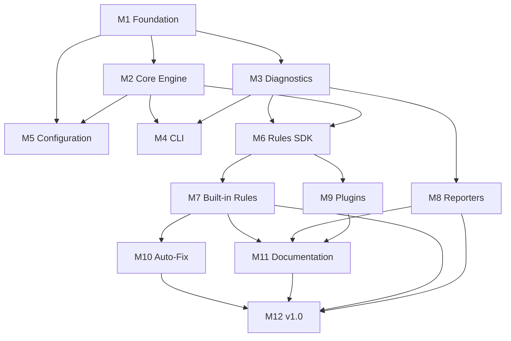

# behave-lint — Implementation Roadmap

> **Status:** Canonical implementation roadmap.
> **Audience:** Core maintainers, contributors, project managers, and
> engineering teams implementing behave-lint.
> **Scope:** The master implementation plan that converts all design
> documentation into a sequenced, risk-minimizing, value-delivering
> roadmap. This document does not define implementation, code, folder
> structure, or concrete rules.
> **Dependencies:** This document follows VISION.md, SPECIFICATION.md,
> ARCHITECTURE.md, API.md, RULE_ENGINE.md, DIAGNOSTIC_ENGINE.md,
> CONFIGURATION_SYSTEM.md, PLUGIN_SYSTEM.md, COMPONENT_DESIGN.md,
> REPOSITORY_DESIGN.md, and RULE_TAXONOMY.md. Inconsistencies, if any,
> are reported in **Appendix A**.

---

## Table of Contents

1. [Executive Summary](#1-executive-summary)
2. [Milestones](#2-milestones)
3. [Epics](#3-epics)
4. [Work Packages](#4-work-packages)
5. [Dependency Graph](#5-dependency-graph)
6. [Risk Analysis](#6-risk-analysis)
7. [Release Strategy](#7-release-strategy)
8. [Quality Gates](#8-quality-gates)
9. [Parallelization](#9-parallelization)
10. [Success Criteria](#10-success-criteria)
11. [Future Roadmap](#11-future-roadmap)

---

## 1. Executive Summary

### Implementation Strategy

behave-lint is implemented through **twelve milestones** that progress
from foundational infrastructure to a stable v1.0 release. The strategy
follows four principles:

- **Bottom-up construction:** Domain models and infrastructure are
  built before the application layer, which is built before the
  presentation layer. Each layer's dependencies are satisfied before
  the layer itself is implemented.
- **Earliest possible value:** The first milestone produces a
  runnable, if minimal, tool. Every subsequent milestone adds
  user-visible capability. There is no "big bang" release.
- **Risk front-loading:** The highest-risk work (behave-model
  integration, rule execution pipeline, plugin discovery) is
  scheduled in early milestones, when there is maximum time to react
  to surprises.
- **Always releasable:** After M2, every milestone produces a
  package that can be installed and run. Internal releases (alpha,
  beta) validate the tool with real users before v1.0.

### Why This Structure

The milestone sequence mirrors the architectural layering
(ARCHITECTURE.md Section 4): Infrastructure → Domain → Application →
Presentation. This is not coincidental — building from the bottom up
ensures that each milestone's code has all its dependencies available.
Building top-down would require stubs and mocks that are later
discarded, wasting effort and hiding integration risks.

The roadmap separates the **Rules SDK** (M6) from **Built-in Rules**
(M7) because the SDK is the extension contract and must be stable
before rules are written against it. Similarly, **Plugins** (M9) comes
after built-in rules because the plugin system reuses the same
discovery and registration infrastructure proven by built-in rules.

**Auto-Fix** (M10) is last before v1.0 because it is the highest-risk
feature (modifying user files) and benefits from maximum prior
validation of the rule engine and diagnostic model.

---

## 2. Milestones

### Overview

| Milestone | Name | Goal | Exit Criteria |
|---|---|---|---|
| M1 | Foundation | Repository, packaging, CI, project skeleton | `pip install -e .` works; CI green; pre-commit hooks active |
| M2 | Core Engine | Lint engine pipeline, file discovery, behave-model integration | `behave-lint features/` loads files and produces empty diagnostic set |
| M3 | Diagnostics | Diagnostic model, severity, filtering, sorting, deduplication | Diagnostics created, filtered, sorted, serialized to JSON |
| M4 | CLI | Argument parsing, exit codes, console output, help | Full CLI functional with console reporter |
| M5 | Configuration | Config loading, validation, merging, pyproject.toml support | Configuration loaded from pyproject.toml; defaults work with zero config |
| M6 | Rules SDK | Rule base class, metadata, context, visitor engine, registry | A custom rule can be written, registered, and executed |
| M7 | Built-in Rules | 15-25 stable rules across all six categories | All rules tested; golden tests pass; `behave-lint rules` lists them |
| M8 | Reporters | Console, JSON, Markdown, SARIF, GitHub Actions reporters | All output formats tested with golden files |
| M9 | Plugins | Plugin discovery, loading, isolation, entry points | External plugin discovered, loaded, rules executed |
| M10 | Auto-Fix | Fix coordinator, safe/unsafe fixes, conflict resolution | `--fix` applies safe fixes; `--unsafe-fixes` applies unsafe fixes |
| M11 | Documentation | User docs, rule docs, contributor guide, examples | Documentation site live; every rule documented |
| M12 | v1.0 | Release candidate, final polish, performance validation | All quality gates met; beta feedback addressed; stable release published |

### Milestone Validation

Each milestone answers four questions:

**Why now?** — The milestone is positioned where its dependencies are
satisfied and its risks are highest-priority.

**Why not earlier?** — Earlier placement would require stubs for
dependencies that don't exist yet.

**What risks does it reduce?** — Each milestone de-risks a specific
architectural concern.

**What future work does it unlock?** — Each milestone opens
capabilities for subsequent milestones.

---

## 3. Epics

### M1: Foundation

#### E1.1: Repository Setup

- **Purpose:** Establish the repository skeleton per
  REPOSITORY_DESIGN.md.
- **Scope:** Git repository, .gitignore, LICENSE, README.md,
  CONTRIBUTING.md, CODEOWNERS, issue/PR templates.
- **Dependencies:** None.
- **Deliverables:** Initialized repository with all meta-files.
- **Risks:** None — standard setup.
- **Estimated complexity:** Low.
- **Priority:** Critical.

#### E1.2: Packaging Configuration

- **Purpose:** Configure pyproject.toml with hatchling build backend.
- **Scope:** pyproject.toml with project metadata, dependencies
  (behave-model), dev dependencies (pytest, ruff, mypy), entry points
  (`behave-lint` CLI, `behave_lint.rules` group).
- **Dependencies:** E1.1.
- **Deliverables:** Installable package; `pip install -e .` works.
- **Risks:** behave-model version compatibility — mitigated by pinning
  a compatible range.
- **Estimated complexity:** Low.
- **Priority:** Critical.

#### E1.3: CI Pipeline

- **Purpose:** Automated testing, linting, and build validation.
- **Scope:** GitHub Actions workflow: lint (ruff), type-check (mypy),
  test (pytest, multi-Python), build (hatchling). Pre-commit hooks.
- **Dependencies:** E1.2.
- **Deliverables:** CI workflow that runs on every push and PR.
- **Risks:** CI environment differences — mitigated by testing on
  Windows, macOS, Linux.
- **Estimated complexity:** Low.
- **Priority:** Critical.

#### E1.4: Test Infrastructure

- **Purpose:** Establish test directory structure and shared fixtures.
- **Scope:** tests/ directory tree (unit, integration, golden,
  performance, regression, architecture), conftest.py, shared
  fixtures (feature_files, projects, configs, helpers).
- **Dependencies:** E1.2.
- **Deliverables:** Test infrastructure ready for all test types.
- **Risks:** None — standard setup.
- **Estimated complexity:** Low.
- **Priority:** High.

### M2: Core Engine

#### E2.1: Domain Model Integration

- **Purpose:** Integrate behave-model as the parsing and domain model
  layer.
- **Scope:** Project Loader component (C11) that invokes
  behave-model's `load_project` / `load_feature`. File Discovery
  component (C10) that finds .feature files in specified paths.
- **Dependencies:** M1.
- **Deliverables:** Ability to load .feature files into the project
  model; file discovery for directories and individual files.
- **Risks:** behave-model API surface may differ from expectations —
  mitigated by early integration testing.
- **Estimated complexity:** Medium.
- **Priority:** Critical.

#### E2.2: Lint Engine Pipeline

- **Purpose:** Implement the pipeline orchestrator (C03).
- **Scope:** Pipeline stages: file discovery → load → (rules
  placeholder) → diagnostic collection → output. Rule execution is
  stubbed (no rules yet). The pipeline must handle partial failures
  (some files fail to load — continue with others).
- **Dependencies:** E2.1.
- **Deliverables:** `behave-lint features/` runs end-to-end and
  produces an empty diagnostic set.
- **Risks:** Pipeline error handling complexity — mitigated by
  ARCHITECTURE.md Section 14's "fail isolated" pattern.
- **Estimated complexity:** Medium.
- **Priority:** Critical.

#### E2.3: Error Handler

- **Purpose:** Implement the Error Handler component (C20).
- **Scope:** Error classification (config errors, parse errors, rule
  errors, internal errors), error routing, user-friendly messages,
  graceful degradation.
- **Dependencies:** E2.2.
- **Deliverables:** Structured error handling across all pipeline
  stages.
- **Risks:** Error taxonomy may be incomplete — mitigated by
  iterative refinement as new error cases surface.
- **Estimated complexity:** Medium.
- **Priority:** High.

#### E2.4: Logging and Profiling

- **Purpose:** Implement Logging Manager (C15) and Performance
  Monitor (C14).
- **Scope:** Structured logging via Python stdlib `logging`,
  configurable verbosity, timing/profiling infrastructure.
- **Dependencies:** M1.
- **Deliverables:** Logging and profiling available to all
  components.
- **Risks:** None — standard infrastructure.
- **Estimated complexity:** Low.
- **Priority:** Medium.

### M3: Diagnostics

#### E3.1: Diagnostic Model

- **Purpose:** Implement the Diagnostic dataclass and Severity enum
  per API.md Section 4 and DIAGNOSTIC_ENGINE.md Section 3.
- **Scope:** Diagnostic fields (rule_id, severity, message, file_path,
  line, column, end_line, end_column, suggestion, doc_url, category),
  Severity enum (ERROR, WARNING, INFO, OFF), Category enum (six
  categories).
- **Dependencies:** M1.
- **Deliverables:** Immutable Diagnostic objects; Severity and
  Category enums.
- **Risks:** None — well-specified by API.md.
- **Estimated complexity:** Low.
- **Priority:** Critical.

#### E3.2: Diagnostic Collector

- **Purpose:** Implement the Diagnostic Collector component (C07).
- **Scope:** Aggregation, filtering (by severity, category, file),
  sorting (by file, line, severity), deduplication.
- **Dependencies:** E3.1.
- **Deliverables:** Collected, filtered, sorted diagnostic set ready
  for reporting.
- **Risks:** Sorting determinism — mitigated by stable sort with
  tiebreaker rules (DIAGNOSTIC_ENGINE.md Section 9).
- **Estimated complexity:** Medium.
- **Priority:** Critical.

#### E3.3: Validation Engine

- **Purpose:** Implement the Validation Engine component (C17).
- **Scope:** Validate diagnostics at creation time (required fields,
  valid severity, valid rule_id format, valid file_path). Validate
  rules at registration time (metadata completeness, ID uniqueness).
- **Dependencies:** E3.1.
- **Deliverables:** Validation that catches malformed diagnostics and
  rules early.
- **Risks:** Over-validation could reject valid edge cases —
  mitigated by testing against real diagnostic patterns.
- **Estimated complexity:** Medium.
- **Priority:** High.

### M4: CLI

#### E4.1: Argument Parser

- **Purpose:** Implement the CLI Coordinator component (C01) —
  argument parsing.
- **Scope:** argparse-based parser supporting: paths, --format,
  --output, --select, --ignore, --severity, --fail-on, --fix,
  --unsafe-fixes, --statistics, --explain, --rules, --version,
  --help, --verbose, --quiet, --config.
- **Dependencies:** M2.
- **Deliverables:** Parsed arguments object passed to the lint engine.
- **Risks:** CLI complexity — mitigated by progressive disclosure
  (common flags first, advanced flags documented).
- **Estimated complexity:** Medium.
- **Priority:** Critical.

#### E4.2: Exit Code Manager

- **Purpose:** Determine exit codes per SPECIFICATION.md Section 10.
- **Scope:** Exit code 0 (no issues), 1 (issues found at or above
  fail-on threshold), 2 (configuration error), 3 (internal error).
- **Dependencies:** E4.1, E3.2.
- **Deliverables:** Correct exit codes for all scenarios.
- **Risks:** None — well-specified.
- **Estimated complexity:** Low.
- **Priority:** Critical.

#### E4.3: Console Reporter

- **Purpose:** Implement the default console output reporter.
- **Scope:** Colored output (ANSI codes), file-grouped diagnostics,
  summary line, statistics display. Respects --quiet and --verbose.
- **Dependencies:** E4.1, E3.2.
- **Deliverables:** Human-readable console output.
- **Risks:** Terminal compatibility (Windows ANSI support) —
  mitigated by stdlib colorama-free approach or conditional coloring.
- **Estimated complexity:** Medium.
- **Priority:** Critical.

#### E4.4: Help and Version

- **Purpose:** Implement help text and version display.
- **Scope:** `behave-lint --help` with usage, flags, examples.
  `behave-lint --version` with version and platform info.
- **Dependencies:** E4.1.
- **Deliverables:** Complete help and version output.
- **Risks:** None — standard.
- **Estimated complexity:** Low.
- **Priority:** High.

### M5: Configuration

#### E5.1: Configuration Manager

- **Purpose:** Implement the Configuration Manager component (C02).
- **Scope:** Configuration discovery (pyproject.toml in project
  root), loading, parsing, defaults. Config dataclass with all
  fields per CONFIGURATION_SYSTEM.md Section 5.
- **Dependencies:** M2.
- **Deliverables:** Configuration loaded from pyproject.toml or
  defaults; Config object available to all components.
- **Risks:** TOML parsing edge cases — mitigated by using stdlib
  tomllib (Python 3.11+).
- **Estimated complexity:** Medium.
- **Priority:** Critical.

#### E5.2: Configuration Validation

- **Purpose:** Validate configuration values.
- **Scope:** Validate rule IDs (format, existence), severity values,
  include/exclude patterns, override structure. Actionable error
  messages with file path and expected format.
- **Dependencies:** E5.1.
- **Deliverables:** Clear validation errors for invalid config.
- **Risks:** Validation rules may be too strict — mitigated by
  permissive defaults with explicit error messages.
- **Estimated complexity:** Medium.
- **Priority:** High.

#### E5.3: Configuration Merging

- **Purpose:** Implement configuration precedence (CONFIGURATION_SYSTEM.md
  Section 4).
- **Scope:** Merge order: defaults < pyproject.toml < environment
  variables < CLI flags. Override support for per-directory
  configuration.
- **Dependencies:** E5.1.
- **Deliverables:** Correctly merged configuration reflecting all
  sources.
- **Risks:** Precedence interactions — mitigated by exhaustive
  integration tests for all precedence combinations.
- **Estimated complexity:** Medium.
- **Priority:** High.

#### E5.4: Inline Disable Comments

- **Purpose:** Support `# behave-lint: off <rule-id>` comments in
  .feature files.
- **Scope:** Parse inline comments during or after loading; suppress
  diagnostics for disabled rules at specified scopes (line, scenario,
  feature, file).
- **Dependencies:** E2.1, E3.2.
- **Deliverables:** Inline disable/enable support.
- **Risks:** Comment parsing depends on behave-model exposing
  comments — mitigated by early API verification.
- **Estimated complexity:** Medium.
- **Priority:** Medium.

### M6: Rules SDK

#### E6.1: Rule Base Class

- **Purpose:** Implement the Rule base class and RuleMetadata per
  API.md Section 7 and RULE_ENGINE.md Section 4.
- **Scope:** Rule abstract base class with `check(context) ->
  list[Diagnostic]` method. RuleMetadata dataclass with all fields
  from RULE_TAXONOMY.md Section 5. RuleContext providing project
  model, configuration, file path, and query API access.
- **Dependencies:** M3.
- **Deliverables:** Subclassable Rule class; complete metadata
  schema; functional rule context.
- **Risks:** API stability — this is the extension contract. Mitigated
  by thorough design review against all immutable docs before
  implementation.
- **Estimated complexity:** High.
- **Priority:** Critical.

#### E6.2: Visitor Engine

- **Purpose:** Implement the Visitor Engine component (C06).
- **Scope:** Tree traversal abstractions using behave-model's visitor
  pattern. Node-type dispatching (Feature, Scenario, Step, Tag,
  Example, Background, Rule). Lazy visiting (skip node types with no
  interested rules).
- **Dependencies:** E2.1, E6.1.
- **Deliverables:** Rules can register interest in specific node
  types; visitor dispatches efficiently.
- **Risks:** behave-model visitor API compatibility — mitigated by
  early integration testing in M2.
- **Estimated complexity:** Medium.
- **Priority:** Critical.

#### E6.3: Rule Registry and Executor

- **Purpose:** Implement Rule Registry (C04) and Rule Executor (C05).
- **Scope:** Rule registration (built-in and plugin), ID uniqueness
  validation, metadata validation. Rule execution: single-file rules
  in parallel (thread pool), cross-file rules sequentially. Execution
  isolation (rule failure → log + skip).
- **Dependencies:** E6.1, E6.2.
- **Deliverables:** Rules registered, validated, and executed with
  parallelism and isolation.
- **Risks:** Parallel execution determinism — mitigated by stable
  merge order regardless of completion timing (ARCHITECTURE.md
  Section 15).
- **Estimated complexity:** High.
- **Priority:** Critical.

#### E6.4: Rule Metadata Registry

- **Purpose:** Implement the Rule Metadata Registry component (C16).
- **Scope:** Store and provide rule metadata for documentation, CLI
  (`behave-lint rules`, `behave-lint explain`), and validation.
  Separate from Rule Registry (design-time vs. runtime).
- **Dependencies:** E6.1.
- **Deliverables:** Metadata queryable by rule ID, category, tag.
- **Risks:** None — straightforward data store.
- **Estimated complexity:** Low.
- **Priority:** High.

### M7: Built-in Rules

#### E7.1: Correctness Rules

- **Purpose:** Implement correctness category rules (BC001–BC499).
- **Scope:** 5-8 rules: duplicate scenario names, empty feature
  files, invalid example table structure, scenario outline without
  examples, invalid tag syntax, duplicate feature names.
- **Dependencies:** M6.
- **Deliverables:** Tested correctness rules with golden tests.
- **Risks:** False positives — mitigated by extensive fixture testing.
- **Estimated complexity:** Medium.
- **Priority:** Critical.

#### E7.2: Style Rules

- **Purpose:** Implement style category rules (BS001–BS499).
- **Scope:** 4-6 rules: tag casing conventions, Given/When/Then
  keyword ordering, step phrasing style, comment style, feature
  description formatting.
- **Dependencies:** M6.
- **Deliverables:** Tested style rules with golden tests.
- **Risks:** Subjectivity of style rules — mitigated by configurable
  thresholds and clear documentation.
- **Estimated complexity:** Medium.
- **Priority:** High.

#### E7.3: Complexity Rules

- **Purpose:** Implement complexity category rules (BX001–BX499).
- **Scope:** 3-5 rules: too many steps in a scenario, too many
  scenarios in a feature, deeply nested backgrounds, excessive tag
  usage, overly long step text. All with configurable thresholds.
- **Dependencies:** M6.
- **Deliverables:** Tested complexity rules with configurable
  thresholds.
- **Risks:** Threshold defaults may not fit all projects — mitigated
  by configuration overrides.
- **Estimated complexity:** Medium.
- **Priority:** High.

#### E7.4: Consistency Rules

- **Purpose:** Implement consistency category rules (BK001–BK499).
- **Scope:** 2-3 rules: same step text with different keywords across
  files, inconsistent tag taxonomy, duplicate scenarios across files.
  These are cross-file rules.
- **Dependencies:** M6.
- **Deliverables:** Tested cross-file consistency rules.
- **Risks:** Cross-file analysis performance — mitigated by caching
  and efficient data structures.
- **Estimated complexity:** High.
- **Priority:** Medium.

#### E7.5: Pedantic Rules

- **Purpose:** Implement pedantic category rules (BP001–BP499).
- **Scope:** 2-3 rules: required feature description, required tags
  on scenarios, background step limit. All opt-in (default severity
  OFF).
- **Dependencies:** M6.
- **Deliverables:** Tested pedantic rules, disabled by default.
- **Risks:** Low — opt-in rules have minimal impact.
- **Estimated complexity:** Low.
- **Priority:** Low.

#### E7.6: Step Definition Rules

- **Purpose:** Implement step definition category rules (BD001–BD499).
- **Scope:** 2-3 rules: undefined steps (Gherkin step has no matching
  definition), unused step definitions, ambiguous definitions.
  Requires cross-referencing .feature files with Python step
  definition files via AST parsing.
- **Dependencies:** M6.
- **Deliverables:** Tested step definition cross-referencing rules.
- **Risks:** AST parsing of Python files for step definitions —
  mitigated by using stdlib `ast` module. behave-model may not expose
  step definition locations — mitigated by early API verification.
- **Estimated complexity:** High.
- **Priority:** Medium.

### M8: Reporters

#### E8.1: JSON Reporter

- **Purpose:** Implement JSON output format.
- **Scope:** Structured JSON with diagnostics array, metadata
  (version, timestamp, file count, diagnostic counts by severity).
  Schema documented and stable.
- **Dependencies:** M3.
- **Deliverables:** `--format json` produces valid JSON output.
- **Risks:** Schema stability — mitigated by versioning the schema.
- **Estimated complexity:** Low.
- **Priority:** High.

#### E8.2: SARIF Reporter

- **Purpose:** Implement SARIF output for GitHub Code Scanning.
- **Scope:** SARIF 2.1.0 format with results, rules, and tool
  metadata. Compatible with GitHub Actions code scanning.
- **Dependencies:** M3.
- **Deliverables:** `--format sarif` produces valid SARIF output.
- **Risks:** SARIF spec complexity — mitigated by referencing the
  SARIF spec and testing with GitHub's SARIF validator.
- **Estimated complexity:** Medium.
- **Priority:** Medium.

#### E8.3: Markdown Reporter

- **Purpose:** Implement Markdown output for GitHub Actions summaries
  and PR comments.
- **Scope:** Markdown table with diagnostics grouped by file. Summary
  section with counts.
- **Dependencies:** M3.
- **Deliverables:** `--format markdown` produces valid Markdown.
- **Risks:** None — straightforward formatting.
- **Estimated complexity:** Low.
- **Priority:** Medium.

#### E8.4: GitHub Actions Reporter

- **Purpose:** Implement GitHub Actions annotations output.
- **Scope:** `::error` and `::warning` commands for GitHub Actions
  log annotations. File, line, and message included.
- **Dependencies:** M3.
- **Deliverables:** `--format github-actions` produces annotations.
- **Risks:** None — well-documented GitHub Actions format.
- **Estimated complexity:** Low.
- **Priority:** Medium.

### M9: Plugins

#### E9.1: Plugin Discovery

- **Purpose:** Implement the Plugin Manager component (C09) —
  discovery.
- **Scope:** Discover plugins via `behave_lint.rules` entry points.
  Lazy loading — only import plugin modules when their rules are
  enabled.
- **Dependencies:** M6.
- **Deliverables:** Plugins discovered from installed packages.
- **Risks:** Entry point discovery edge cases — mitigated by testing
  with real plugin packages.
- **Estimated complexity:** Medium.
- **Priority:** High.

#### E9.2: Plugin Isolation

- **Purpose:** Isolate plugin failures from the core engine.
- **Scope:** Load failure isolation (import error → warning + skip),
  registration failure isolation (exception → warning + skip),
  execution isolation (rule exception → log + skip). Prefix collision
  detection.
- **Dependencies:** E9.1.
- **Deliverables:** Plugin failures never crash the engine.
- **Risks:** Incomplete isolation — mitigated by exhaustive failure
  mode testing.
- **Estimated complexity:** Medium.
- **Priority:** High.

#### E9.3: Plugin Documentation

- **Purpose:** Plugin rules documented via the same metadata schema.
- **Scope:** `behave-lint explain <plugin-rule-id>` displays plugin
  rule metadata. `behave-lint rules` lists plugin rules alongside
  built-in rules.
- **Dependencies:** E9.1, E6.4.
- **Deliverables:** Plugin rules fully integrated in CLI and docs.
- **Risks:** None — reuses existing infrastructure.
- **Estimated complexity:** Low.
- **Priority:** Medium.

### M10: Auto-Fix

#### E10.1: Fix Coordinator

- **Purpose:** Implement the Auto-Fix Coordinator component (C18).
- **Scope:** Coordinate fix application: collect fixes from rules,
  detect conflicts (overlapping edits), apply non-conflicting fixes,
  rollback on error. Support `--fix` (safe only) and `--unsafe-fixes`
  (safe + unsafe).
- **Dependencies:** M6, M7.
- **Deliverables:** `--fix` applies safe fixes to .feature files.
- **Risks:** File modification safety — mitigated by dry-run mode,
  backup files, and comprehensive testing. This is the highest-risk
  epic.
- **Estimated complexity:** High.
- **Priority:** Medium.

#### E10.2: Fix Conflict Resolution

- **Purpose:** Handle overlapping or contradictory fixes.
- **Scope:** Detect overlapping edit ranges. Apply non-overlapping
  fixes; skip conflicting ones with a warning. Deterministic
  application order (by rule priority, then by file position).
- **Dependencies:** E10.1.
- **Deliverables:** Conflict-free fix application.
- **Risks:** Edge cases in conflict detection — mitigated by
  extensive golden tests for fix scenarios.
- **Estimated complexity:** High.
- **Priority:** Medium.

### M11: Documentation

#### E11.1: User Documentation

- **Purpose:** Comprehensive user-facing documentation.
- **Scope:** Getting started guide, configuration guide, CLI
  reference, rule catalog (metadata-driven), FAQ, migration guide.
  MkDocs or Sphinx site.
- **Dependencies:** M7, M8.
- **Deliverables:** Documentation site deployed via GitHub Pages.
- **Risks:** Documentation drift — mitigated by metadata-driven rule
  docs (RULE_TAXONOMY.md Section 10).
- **Estimated complexity:** Medium.
- **Priority:** High.

#### E11.2: Contributor Guide

- **Purpose:** Documentation for contributors and rule authors.
- **Scope:** CONTRIBUTING.md expansion, rule authoring guide, plugin
  development guide, architecture overview for contributors, testing
  guide.
- **Dependencies:** M9.
- **Deliverables:** Complete contributor documentation.
- **Risks:** None — documentation only.
- **Estimated complexity:** Low.
- **Priority:** Medium.

#### E11.3: Examples

- **Purpose:** Example projects demonstrating behave-lint usage.
- **Scope:** Minimal example (zero-config), configured example
  (pyproject.toml with overrides), plugin example (custom rule
  package), CI example (GitHub Actions workflow).
- **Dependencies:** M9.
- **Deliverables:** Runnable example projects in examples/ directory.
- **Risks:** None — examples are self-contained.
- **Estimated complexity:** Low.
- **Priority:** Medium.

### M12: v1.0 Release

#### E12.1: Performance Validation

- **Purpose:** Validate performance targets per SPECIFICATION.md
  Section 13.
- **Scope:** Benchmark on 10, 100, 1000, 5000 file projects. Targets:
  <1s for 100 files, <5s for 1000 files, <30s for 5000 files. Memory
  profiling. Cache effectiveness validation.
- **Dependencies:** M7, M8.
- **Deliverables:** Performance report; optimizations if targets not
  met.
- **Risks:** Performance targets may not be met — mitigated by
  caching and parallel execution designed in from the start.
- **Estimated complexity:** Medium.
- **Priority:** High.

#### E12.2: Beta Feedback Integration

- **Purpose:** Collect and address beta user feedback.
- **Scope:** Bug reports, feature requests, documentation gaps, UX
  issues. Triage and prioritize for v1.0 or post-v1.0.
- **Dependencies:** M11.
- **Deliverables:** Resolved critical and high-priority beta issues.
- **Risks:** Scope creep from feedback — mitigated by strict v1.0
  scope boundary.
- **Estimated complexity:** Medium.
- **Priority:** High.

#### E12.3: Release Preparation

- **Purpose:** Final polish for stable release.
- **Scope:** Release notes, changelog, migration guide, PyPI
  publication, GitHub release, documentation deployment, announcement
  (blog, social, Behave community).
- **Dependencies:** E12.1, E12.2.
- **Deliverables:** `behave-lint 1.0.0` on PyPI.
- **Risks:** Release process errors — mitigated by dry-run release
  in RC phase.
- **Estimated complexity:** Low.
- **Priority:** Critical.

---

## 4. Work Packages

Work packages are the smallest unit of schedulable work. Each epic
contains 2-5 work packages. The following table summarizes key work
packages; full detail is available in the epic descriptions above.

| WP | Epic | Objective | Key Deliverable | Dependencies |
|---|---|---|---|---|
| WP-1.1 | E1.1 | Create repository meta-files | Initialized repo | None |
| WP-1.2 | E1.2 | Configure pyproject.toml | Installable package | WP-1.1 |
| WP-1.3 | E1.3 | Set up CI workflow | Green CI pipeline | WP-1.2 |
| WP-1.4 | E1.4 | Create test directory structure | Test infrastructure | WP-1.2 |
| WP-2.1 | E2.1 | Integrate behave-model loader | File loading works | M1 |
| WP-2.2 | E2.1 | Implement file discovery | Path scanning works | WP-2.1 |
| WP-2.3 | E2.2 | Implement pipeline orchestrator | End-to-end pipeline | WP-2.1 |
| WP-2.4 | E2.3 | Implement error handler | Error classification | WP-2.3 |
| WP-2.5 | E2.4 | Implement logging/profiling | Logging infrastructure | M1 |
| WP-3.1 | E3.1 | Implement Diagnostic/Severity/Category | Core domain objects | M1 |
| WP-3.2 | E3.2 | Implement diagnostic collector | Filtering/sorting | WP-3.1 |
| WP-3.3 | E3.3 | Implement validation engine | Runtime validation | WP-3.1 |
| WP-4.1 | E4.1 | Implement argument parser | CLI parsing | M2 |
| WP-4.2 | E4.2 | Implement exit code manager | Exit codes | WP-4.1, WP-3.2 |
| WP-4.3 | E4.3 | Implement console reporter | Console output | WP-4.1, WP-3.2 |
| WP-4.4 | E4.4 | Implement help/version | Help text | WP-4.1 |
| WP-5.1 | E5.1 | Implement config manager | Config loading | M2 |
| WP-5.2 | E5.2 | Implement config validation | Validation errors | WP-5.1 |
| WP-5.3 | E5.3 | Implement config merging | Precedence rules | WP-5.1 |
| WP-5.4 | E5.4 | Implement inline disable | Comment suppression | WP-2.1, WP-3.2 |
| WP-6.1 | E6.1 | Implement Rule base class + metadata | Rules SDK | M3 |
| WP-6.2 | E6.2 | Implement visitor engine | Tree traversal | WP-2.1, WP-6.1 |
| WP-6.3 | E6.3 | Implement rule registry + executor | Rule execution | WP-6.1, WP-6.2 |
| WP-6.4 | E6.4 | Implement metadata registry | Metadata store | WP-6.1 |
| WP-7.1 | E7.1 | Implement correctness rules | 5-8 rules | M6 |
| WP-7.2 | E7.2 | Implement style rules | 4-6 rules | M6 |
| WP-7.3 | E7.3 | Implement complexity rules | 3-5 rules | M6 |
| WP-7.4 | E7.4 | Implement consistency rules | 2-3 cross-file rules | M6 |
| WP-7.5 | E7.5 | Implement pedantic rules | 2-3 opt-in rules | M6 |
| WP-7.6 | E7.6 | Implement step definition rules | 2-3 cross-ref rules | M6 |
| WP-8.1 | E8.1 | Implement JSON reporter | JSON output | M3 |
| WP-8.2 | E8.2 | Implement SARIF reporter | SARIF output | M3 |
| WP-8.3 | E8.3 | Implement Markdown reporter | Markdown output | M3 |
| WP-8.4 | E8.4 | Implement GitHub Actions reporter | GH annotations | M3 |
| WP-9.1 | E9.1 | Implement plugin discovery | Entry point loading | M6 |
| WP-9.2 | E9.2 | Implement plugin isolation | Failure isolation | WP-9.1 |
| WP-9.3 | E9.3 | Integrate plugin docs | Plugin rule docs | WP-9.1, WP-6.4 |
| WP-10.1 | E10.1 | Implement fix coordinator | --fix works | M6, M7 |
| WP-10.2 | E10.2 | Implement conflict resolution | Safe fix application | WP-10.1 |
| WP-11.1 | E11.1 | Build documentation site | MkDocs site | M7, M8 |
| WP-11.2 | E11.2 | Write contributor guide | Contributing docs | M9 |
| WP-11.3 | E11.3 | Create example projects | Examples | M9 |
| WP-12.1 | E12.1 | Run performance benchmarks | Perf report | M7, M8 |
| WP-12.2 | E12.2 | Triage beta feedback | Resolved issues | M11 |
| WP-12.3 | E12.3 | Execute release process | v1.0 on PyPI | WP-12.1, WP-12.2 |

### Acceptance Criteria

Each work package has acceptance criteria defined by its epic's
deliverables and the milestone's exit criteria. The general pattern:

- **Code:** Implemented, reviewed, merged.
- **Tests:** Unit tests pass; integration tests pass where applicable.
- **Documentation:** Public API changes documented; changelog updated.
- **Quality:** No new linting or type-check errors introduced.

---

## 5. Dependency Graph

### Milestone Dependencies



### Critical Path

The **critical path** is the longest dependency chain that determines
the minimum project duration:

```text
M1 → M2 → M6 → M7 → M10 → M12
```

This path is 6 milestones long. Every milestone on this path must be
completed on schedule to avoid delaying v1.0. Milestones off the
critical path (M3, M4, M5, M8, M9, M11) can be delayed without
blocking v1.0, as long as they complete before M12.

### Parallel Tracks

Three parallel tracks diverge from M2 and M3:

- **Engine track:** M2 → M6 → M7 → M10 (critical path)
- **Output track:** M3 → M4 → M8 (can proceed in parallel with M6/M7)
- **Config track:** M2 → M5 (can proceed in parallel with M3/M6)

M9 (Plugins) branches from M6 and can proceed in parallel with M7
(Built-in Rules), as long as it completes before M11.

### Epic-Level Dependencies

Within milestones, key dependency chains:

- **M2:** E2.1 (loader) → E2.2 (pipeline) → E2.3 (error handler)
- **M6:** E6.1 (Rule class) → E6.2 (visitor) → E6.3 (executor)
- **M7:** All epics depend on M6 but are independent of each other —
  rules can be developed in parallel by different engineers.
- **M10:** E10.1 (coordinator) → E10.2 (conflict resolution)

---

## 6. Risk Analysis

### Technical Risks

| Risk | Probability | Impact | Mitigation |
|---|---|---|---|
| behave-model API insufficient (missing comments, step locations) | Medium | High | Early API verification in M2; fallback to AST parsing for step definitions |
| Parallel execution non-determinism | Low | High | Stable merge order; deterministic test fixtures |
| Auto-fix corrupts user files | Low | Critical | Dry-run mode, backup files, golden tests, safe/unsafe separation |
| Performance targets not met at scale | Medium | Medium | Caching designed from start; benchmark at every milestone |
| Plugin isolation incomplete | Medium | High | Exhaustive failure-mode testing; defensive try/except at all boundaries |

### Architecture Risks

| Risk | Probability | Impact | Mitigation |
|---|---|---|---|
| Layer boundary violations (skip-level imports) | Medium | Medium | Architecture tests in CI (import-direction checks) |
| API surface too large for v1 (maintenance burden) | Low | Medium | Minimal API per API.md; extension through interfaces, not exposure |
| Configuration complexity exceeds user tolerance | Low | Medium | Progressive disclosure; <15 top-level keys; sensible defaults |
| Rule SDK requires breaking changes after v1 | Low | Critical | Thorough design review against all immutable docs before implementation |

### Community Risks

| Risk | Probability | Impact | Mitigation |
|---|---|---|---|
| Low adoption (Behave ecosystem too small) | Medium | High | Zero-config defaults; pre-commit integration; Behave community outreach |
| behave-model becomes unmaintained | Low | Critical | Pin compatible version; maintain fork capability as contingency |
| Competing linter emerges | Low | Low | First-mover advantage; ecosystem integration; open governance |
| Plugin ecosystem never materializes | Medium | Low | v1 does not depend on external plugins; plugin system is additive |

### Maintenance Risks

| Risk | Probability | Impact | Mitigation |
|---|---|---|---|
| Rule maintenance burden grows faster than maintainer capacity | Medium | Medium | Rule lifecycle (experimental → stable) limits stable rule count; community contributions via plugins |
| Documentation drifts from implementation | Medium | Medium | Metadata-driven documentation; golden tests verify output |
| Test suite becomes slow | Low | Medium | Parallel test execution; separate performance test suite |

---

## 7. Release Strategy

### Alpha (0.1.0 – 0.4.0)

Alpha releases follow milestones M2 through M6. They are internal-only
(or limited distribution) and serve to validate the architecture.

- **0.1.0 (M2):** Loads files, produces empty output. Validates
  behave-model integration.
- **0.2.0 (M3+M4):** Produces diagnostics, CLI functional with
  console output. No rules yet — diagnostics are empty.
- **0.3.0 (M5+M6):** Configuration from pyproject.toml works. Rules
  SDK stable. First custom rule can be written and executed.
- **0.4.0 (M7 partial):** First correctness rules implemented.
  Tool produces real diagnostics on real feature files.

**Alpha criteria:** Architecture validated; no API stability promise;
breaking changes expected between alpha releases.

### Beta (0.5.0 – 0.9.0)

Beta releases are public. They are announced to the Behave community
and distributed via PyPI. Users are encouraged to try the tool and
report feedback.

- **0.5.0 (M7 complete):** All 15-25 built-in rules implemented.
  Golden tests pass. `behave-lint rules` lists all rules.
- **0.6.0 (M8):** All reporters implemented (console, JSON, SARIF,
  Markdown, GitHub Actions).
- **0.7.0 (M9):** Plugin system functional. External plugins can be
  discovered, loaded, and executed.
- **0.8.0 (M10):** Auto-fix functional. `--fix` and `--unsafe-fixes`
  work for applicable rules.
- **0.9.0 (M11):** Documentation site live. All rules documented.
  Examples available.

**Beta criteria:** Feature-complete for v1 scope; API stability
promise within beta (no breaking changes after 0.5.0 without
deprecation warning); public feedback actively solicited.

### Release Candidate (0.99.0 – 0.99.x)

RC releases follow M12. They are feature-frozen — no new features,
only bug fixes and documentation improvements.

- **0.99.0:** First RC. All v1 features implemented. Performance
  validated. Beta feedback triaged.
- **0.99.x:** Subsequent RCs address critical and high-priority bugs.

**RC criteria:** All quality gates met (Section 8); no open critical
bugs; performance targets met; documentation complete.

### Stable (1.0.0)

The stable release is published when all RC criteria are met and no
critical bugs have been reported for at least one week after the
final RC.

**Stable criteria:**

- All quality gates met.
- All exit criteria for M12 satisfied.
- No critical or high-priority open issues.
- Release notes, changelog, and migration guide complete.
- PyPI package, GitHub release, and documentation deployed.

### Patch Releases (1.0.x)

Patch releases fix bugs without adding features or changing behavior.
They follow Semantic Versioning (PATCH increment).

**Patch criteria:** Bug fix only; no new features; no API changes;
all tests pass; changelog updated.

### Long-Term Support

The latest stable minor release (e.g., 1.0.x, 1.1.x) receives bug
fixes. Security fixes are backported to the previous minor release
for one cycle. There is no formal LTS designation for v1 — the
project is too young. LTS may be considered after v2.0.

---

## 8. Quality Gates

### Per-Milestone Quality Gates

| Gate | M1 | M2 | M3 | M4 | M5 | M6 | M7 | M8 | M9 | M10 | M11 | M12 |
|---|---|---|---|---|---|---|---|---|---|---|---|---|
| Unit test coverage ≥ 80% | ✓ | ✓ | ✓ | ✓ | ✓ | ✓ | ✓ | ✓ | ✓ | ✓ | — | ✓ |
| Unit test coverage ≥ 90% (core) | — | ✓ | ✓ | — | ✓ | ✓ | — | — | — | ✓ | — | ✓ |
| Integration tests pass | — | ✓ | — | ✓ | ✓ | ✓ | ✓ | ✓ | ✓ | ✓ | — | ✓ |
| Golden tests pass | — | — | — | ✓ | — | — | ✓ | ✓ | — | ✓ | — | ✓ |
| Performance benchmarks | — | — | — | — | — | — | — | — | — | — | — | ✓ |
| Architecture tests pass | ✓ | ✓ | ✓ | ✓ | ✓ | ✓ | ✓ | ✓ | ✓ | ✓ | — | ✓ |
| No mypy errors | ✓ | ✓ | ✓ | ✓ | ✓ | ✓ | ✓ | ✓ | ✓ | ✓ | — | ✓ |
| No ruff violations | ✓ | ✓ | ✓ | ✓ | ✓ | ✓ | ✓ | ✓ | ✓ | ✓ | — | ✓ |
| API review | — | — | ✓ | — | — | ✓ | — | ✓ | ✓ | ✓ | — | ✓ |
| Documentation updated | ✓ | — | — | ✓ | ✓ | ✓ | ✓ | ✓ | ✓ | ✓ | ✓ | ✓ |

### Quality Gate Details

**Unit test coverage:** Measured by pytest-cov. Core components
(engine, rule engine, configuration, diagnostics) require 90%+.
Non-core components require 80%+.

**Integration tests:** End-to-end pipeline tests using real .feature
files and real behave-model parsing. Must pass on all supported
platforms (Windows, macOS, Linux) and Python versions (3.11, 3.12,
3.13).

**Golden tests:** Output stability tests comparing console, JSON,
Markdown, and SARIF output against expected files. Any change
requires explicit golden file update — prevents accidental output
changes.

**Performance benchmarks:** Run on benchmark projects (10, 100, 1000,
5000 files). Targets per SPECIFICATION.md Section 13. Memory usage
profiled.

**Architecture tests:** Verify import direction (no skip-level, no
circular), no global state, layer separation per ARCHITECTURE.md
Section 4.

**API review:** Manual review of public API changes by a maintainer.
Ensures stability, consistency, and documentation. Required for M3
(Diagnostic model), M6 (Rule SDK), M8 (Reporter SDK), M9 (Plugin
API), M10 (Auto-Fix API).

**Documentation:** Every public API change must update documentation.
Rule additions must include metadata-driven documentation. Milestone
completions must update the changelog.

---

## 9. Parallelization

### What Can Be Developed Simultaneously

After M1 (Foundation) and M2 (Core Engine) are complete, significant
parallelization is possible:

**Track A — Engine (critical path):** M6 (Rules SDK) → M7 (Built-in
Rules) → M10 (Auto-Fix). This track requires the most senior
engineers due to API stability concerns.

**Track B — Output:** M3 (Diagnostics) → M4 (CLI) → M8 (Reporters).
This track can proceed independently after M2. Reporters depend only
on the Diagnostic model (M3), not on the rule engine.

**Track C — Configuration:** M5 (Configuration) can proceed in
parallel with M3 and M6 after M2. Configuration depends on the lint
engine pipeline but not on diagnostics or rules.

**Track D — Plugins:** M9 (Plugins) branches from M6 and can proceed
in parallel with M7 (Built-in Rules). Plugin discovery reuses the
same registry infrastructure as built-in rules.

**Track E — Documentation:** M11 (Documentation) can start early
(drafting user guides, contributor docs) and finalize after M7-M9
complete. Documentation drafting is a parallel activity throughout
the project.

### What Must Be Sequential

- **M1 → M2:** Foundation must precede core engine (packaging,
  dependencies, test infrastructure).
- **M2 → M6:** Core engine must precede Rules SDK (pipeline must
  exist before rules can plug into it).
- **M6 → M7:** Rules SDK must be stable before built-in rules are
  written against it.
- **M7 → M10:** Auto-fix requires existing rules to produce fixes.
- **M7 + M8 + M9 → M11:** Documentation requires rules, reporters,
  and plugins to be functional.
- **M11 → M12:** Documentation must be complete before release.

### Suggested Team Organization

| Role | Track | Milestones |
|---|---|---|
| Senior Engineer 1 (Engine lead) | A | M2, M6, M7, M10 |
| Senior Engineer 2 (API lead) | B | M3, M4, M8 |
| Engineer 3 (Config/Infra) | C | M1, M5, M9 |
| Engineer 4 (Rules) | A | M7 (parallel rule development) |
| Engineer 5 (Docs/QA) | E | M11, quality gates, test infrastructure |
| Tech Writer (part-time) | E | M11, API docs, examples |

A team of 4-5 engineers can complete the roadmap in approximately
6-8 months. A solo developer would need 12-18 months, focusing on the
critical path and deferring non-critical milestones.

---

## 10. Success Criteria

### Per-Milestone Success Criteria

| Milestone | Success Criteria |
|---|---|
| M1 | `pip install -e .` succeeds; CI green on all platforms; pre-commit hooks pass |
| M2 | `behave-lint features/` loads a test project and exits with code 0; no crashes on malformed files |
| M3 | Diagnostics created, filtered by severity, sorted deterministically, serialized to JSON |
| M4 | `behave-lint --help` displays usage; `behave-lint features/` shows console output; exit codes correct |
| M5 | Zero-config run works; pyproject.toml config loaded and validated; invalid config produces actionable errors |
| M6 | A test rule subclassing Rule produces a diagnostic on a test feature file; `behave-lint rules` lists it |
| M7 | 15-25 rules implemented; all pass golden tests; `behave-lint rules` lists all; no false positives on clean files |
| M8 | All 5 output formats produce valid output; golden tests pass for each |
| M9 | External plugin package discovered, loaded, rules executed; plugin failure does not crash engine |
| M10 | `--fix` applies safe fixes; modified files pass re-linting; `--unsafe-fixes` applies unsafe fixes with warning |
| M11 | Documentation site live; every rule has a documentation page; examples runnable |
| M12 | Performance targets met; no critical bugs; v1.0.0 published to PyPI |

### Project-Level Success Criteria

- **Adoption:** 100+ GitHub stars within 3 months of v1.0.
- **CI integration:** Used in 10+ public Behave projects within 6
  months.
- **Performance:** Sub-second on 100-file projects (SPECIFICATION.md
  Section 13).
- **Stability:** No breaking API changes within v1.x.
- **Community:** 5+ external contributors within 6 months.
- **Plugin ecosystem:** 3+ community plugins within 6 months.

---

## 11. Future Roadmap

### Post-v1.0 Short-Term (v1.1 – v1.x)

- **Profiles and groups:** Activate the `extends` key and
  `[tool.behave-lint.groups]` section reserved in
  CONFIGURATION_SYSTEM.md Sections 6-7.
- **Additional rules:** Fill taxonomy gaps; promote experimental
  rules to stable based on real-world validation.
- **Prefix-based selection:** `select = ["BC"]` to select all
  correctness rules.
- **Cookiecutter template:** Plugin scaffolding template for quick
  rule package creation.
- **Pre-commit hook:** Official pre-commit-hooks repository entry.
- **Documentation enhancements:** Interactive rule explorer on
  documentation site.

### Medium-Term (v2.0 – v3.x)

- **LSP server:** Language Server Protocol implementation for
  real-time IDE feedback (VISION.md Section 2: three-year goal).
  Reuses the library API; communicates via JSON-RPC.
- **IDE extensions:** VS Code and PyCharm extensions wrapping the LSP
  server.
- **Watch mode:** File-watching mode for incremental re-linting on
  file changes. Reuses cache infrastructure.
- **New categories:** Security (`N`), Performance (`F`),
  Documentation (`G`) — major version change per RULE_TAXONOMY.md
  Section 12.
- **AI rule suggestions:** Analyze project patterns and suggest
  custom rules. AI-generated rules use the same metadata schema and
  lifecycle (RULE_ENGINE.md Section 15).
- **Rule marketplace:** Web platform for discovering and installing
  community rule packages. Taxonomy drives the marketplace UI.
- **Cloud rules:** Cloud-hosted rule sets fetched from a remote
  registry.

### Long-Term (v4.0 – v5+)

- **Industry packs:** Curated rule sets for healthcare, aviation,
  finance (e.g., `FDA001`, `FAA001`).
- **Compliance packs:** Rule sets enforcing regulatory compliance
  with documentation mapping rules to regulatory requirements.
- **Certification packs:** Quality certification with scoring system
  based on rule compliance.
- **Cross-runner support:** Shared rule definitions for Cucumber and
  SpecFlow via domain model abstraction (VISION.md Section 2:
  five-year goal).
- **AI rule engine:** Natural language rule definition, anomaly
  detection, AI-assisted scenario optimization.
- **Quality trend tracking:** Historical quality metrics across
  commits, integrated with dashboards.

### Reserved Space

| Future Feature | Roadmap Impact | Target Version |
|---|---|---|
| Profiles implementation | Activate `extends` key | v1.1+ |
| Groups implementation | Activate group config section | v1.1+ |
| LSP server | New package or module | v2.0+ |
| Watch mode | Engine extension | v2.0+ |
| New categories | Rule ID format extension | v2.0+ (major) |
| AI rules | New rule source | v3.0+ |
| Marketplace | Web platform | v3.0+ |
| Industry packs | New plugin prefixes | v4.0+ |
| Compliance packs | New tags, regulatory mapping | v4.0+ |
| Certification packs | Scoring metadata | v5.0+ |
| Cross-runner support | Domain model abstraction | v5.0+ |

---

## Appendix A: Consistency Check

| # | Check | Result |
|---|---|---|
| 1 | Milestone sequence follows ARCHITECTURE.md Section 4 layering (Infrastructure → Domain → Application → Presentation) | Consistent |
| 2 | Component inventory (C01–C20) from COMPONENT_DESIGN.md Section 2 covered by milestones | Consistent |
| 3 | API entry points from API.md Section 3 covered (CLI, library, Rule SDK, Reporter SDK, Plugin API, Config, Diagnostic, Error) | Consistent |
| 4 | Rule lifecycle (Proposed → Experimental → Stable → Deprecated → Removed) from RULE_ENGINE.md Section 2 supported by M6/M7 | Consistent |
| 5 | Severity model (ERROR, WARNING, INFO, OFF) from DIAGNOSTIC_ENGINE.md Section 4 implemented in M3 | Consistent |
| 6 | Configuration sources and precedence from CONFIGURATION_SYSTEM.md Sections 2-4 implemented in M5 | Consistent |
| 7 | Plugin discovery via entry points from RULE_ENGINE.md Section 14 implemented in M9 | Consistent |
| 8 | Auto-fix capability (SAFE, UNSAFE) from RULE_ENGINE.md Section 9 implemented in M10 | Consistent |
| 9 | Testing pyramid (unit, integration, golden, snapshot, performance, architecture) from ARCHITECTURE.md Section 18 reflected in quality gates | Consistent |
| 10 | Release strategy (alpha, beta, RC, stable) aligned with REPOSITORY_DESIGN.md Section 13 versioning | Consistent |
| 11 | Performance targets from SPECIFICATION.md Section 13 validated in M12 | Consistent |
| 12 | Output formats (console, JSON, SARIF, Markdown, GitHub Actions) from SPECIFICATION.md Section 12 implemented in M4/M8 | Consistent |
| 13 | Rule taxonomy (6 categories, ID ranges, metadata) from RULE_TAXONOMY.md supported by M6/M7 | Consistent |
| 14 | Future roadmap aligned with VISION.md Section 16 and SPECIFICATION.md Section 25 | Consistent |
| 15 | PLUGIN_SYSTEM.md: not found in repository. Plugin design covered in RULE_ENGINE.md Section 14, ARCHITECTURE.md Section 13 | Note: Not found |

**No inconsistencies detected.**
