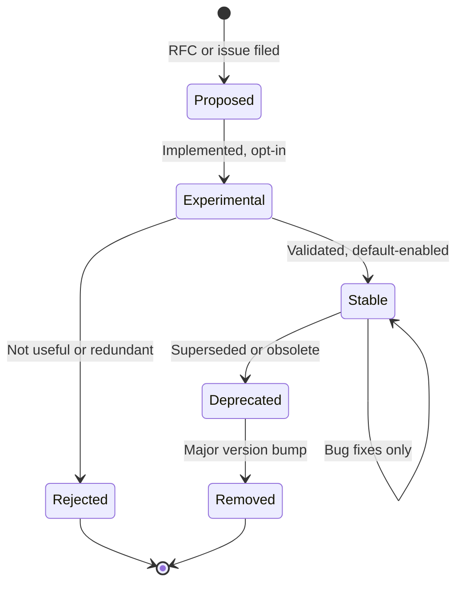
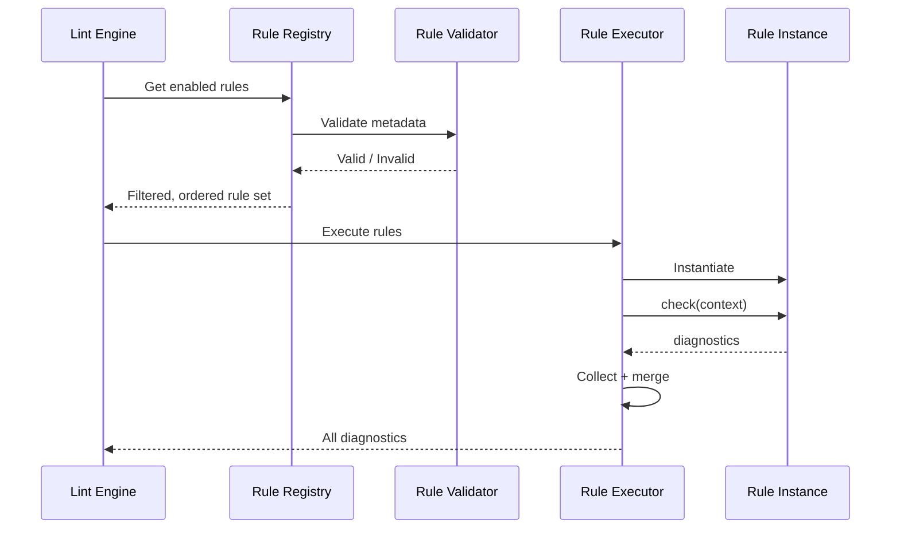
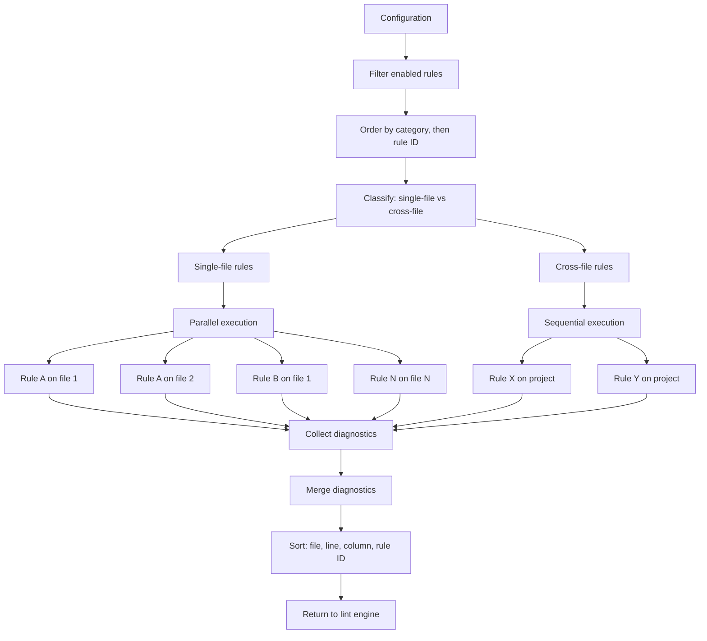

# behave-lint — Rule Engine Design

> **Status:** Canonical rule engine specification.
> **Audience:** Core maintainers, rule authors, plugin developers, and
> performance engineers.
> **Scope:** The complete lifecycle, execution model, and extension
> architecture of the behave-lint rule engine. This document defines
> *how rules are discovered, registered, validated, executed, and
> retired*. It does not define concrete rules, implementation code, or
> folder structure.
> **Dependencies:** This document follows VISION.md, SPECIFICATION.md,
> ARCHITECTURE.md, and API.md. Inconsistencies, if any, are reported in
> **Appendix A**.

---

## Table of Contents

1. [Philosophy](#1-philosophy)
2. [Rule Lifecycle](#2-rule-lifecycle)
3. [Rule Discovery](#3-rule-discovery)
4. [Rule Metadata](#4-rule-metadata)
5. [Rule Categories](#5-rule-categories)
6. [Rule Execution](#6-rule-execution)
7. [Rule Dependencies](#7-rule-dependencies)
8. [Rule Context](#8-rule-context)
9. [Auto-Fix](#9-auto-fix)
10. [Rule Configuration](#10-rule-configuration)
11. [Rule Documentation](#11-rule-documentation)
12. [Rule Validation](#12-rule-validation)
13. [Performance](#13-performance)
14. [Plugin Rules](#14-plugin-rules)
15. [Future Evolution](#15-future-evolution)

---

## 1. Philosophy

### Core Principle

The rule engine is the heart of behave-lint. Its job is simple to
state and difficult to execute: **given a parsed project model and a
set of enabled rules, produce a deterministic, complete set of
diagnostics — fast, safely, and extensibly.**

Every design decision in the rule engine follows from three
priorities, in strict order:

1. **Correctness.** The engine must never crash, never lose
   diagnostics, and never produce non-deterministic output.
2. **Performance.** The engine must scale to thousands of feature
   files and hundreds of rules without unacceptable latency.
3. **Extensibility.** The engine must accept new rules — built-in or
   plugin — without code changes to the engine itself.

### Conceptual Comparison

The behave-lint rule engine draws inspiration from several mature
static analysis platforms. Understanding the similarities and
differences clarifies the design.

#### Ruff

Ruff is a fast Python linter written in Rust. Its rule engine is
compiled, statically dispatched, and tightly coupled to its parser.

**Similarities:**

- Rules are identified by stable, string-based IDs (Ruff uses
  `E501`, `F841`; behave-lint uses `BC001`, `BS001`).
- Rules are categorized and selectable by category or individual ID.
- Rules carry metadata that drives documentation and configuration.
- The engine filters, orders, and dispatches rules against parsed
  input.

**Differences:**

- Ruff parses Python source code directly; behave-lint never parses
  — it consumes the `behave-model` project model. The rule engine
  receives already-parsed, already-validated domain objects.
- Ruff's rules are compiled into the binary; behave-lint's rules are
  Python objects discovered at runtime. This makes plugin rules
  trivial in behave-lint and impossible in Ruff (without recompiling).
- Ruff's performance comes from Rust and zero-copy parsing;
  behave-lint's performance comes from caching, lazy loading, and
  parallel execution within Python.
- Ruff conflates rule execution and AST traversal (rules are
  visitors); behave-lint separates them (rules use visitors but are
  not visitors — see ARCHITECTURE.md Section 8).

#### ESLint

ESLint is a JavaScript linter with a rich plugin ecosystem. Its rule
engine is dynamically extensible and visitor-based.

**Similarities:**

- Rules are objects with metadata (ID, description, default severity,
  category, fixable flag).
- Rules receive a context object and return diagnostics (ESLint
  "report" / behave-lint "diagnostic").
- Plugin rules are first-class — discovered, registered, and executed
  identically to built-in rules.
- Auto-fix is declared per-rule and applied by the engine, not by the
  rule itself.
- Rules are isolated — a failure in one rule does not crash others.

**Differences:**

- ESLint rules are visitor-based (the rule provides callbacks for AST
  node types); behave-lint rules receive the full feature or project
  model and decide how to traverse it. This gives behave-lint rules
  more flexibility (they can use visitors, query APIs, or direct
  attribute access) at the cost of slightly more boilerplate.
- ESLint's configuration is deeply nested and complex; behave-lint's
  configuration is flat and minimal (select, ignore, severity
  overrides, per-rule parameters).
- ESLint supports rule dependencies implicitly through autofix
  ordering; behave-lint makes dependencies explicit (future feature).

#### Clippy

Clippy is the Rust linter. Its rules are compiler lints integrated
into the Rust compiler.

**Similarities:**

- Rules are categorized (correctness, style, complexity, perf,
  pedantic).
- Rules have a lifecycle (experimental → stable → deprecated).
- Rules carry rich metadata for documentation.

**Differences:**

- Clippy is compiled into the compiler; behave-lint is a standalone
  tool.
- Clippy rules are Rust macros and compiler internals; behave-lint
  rules are Python objects.
- Clippy has no plugin system; behave-lint has a first-class plugin
  system.

#### SonarLint

SonarLint is a multi-language static analysis platform with IDE and
CI integration.

**Similarities:**

- Rules have rich metadata (severity, tags, remediation effort,
  security relevance).
- Rules are organized by concern (bugs, vulnerabilities, code
  smells, security hotspots).
- The engine supports both local (IDE) and server (CI) execution.

**Differences:**

- SonarLint is a commercial platform with a server component;
  behave-lint is a standalone open-source tool.
- SonarLint analyzes source code; behave-lint analyzes Gherkin
  specifications.
- SonarLint's rule engine is language-specific; behave-lint's is
  domain-specific (Gherkin only).

### Design Validation

**Why this philosophy?** The rule engine must balance three competing
forces: correctness (never crash, never lose data), performance (be
fast enough for interactive use), and extensibility (accept new rules
without engine changes). Prioritizing correctness above performance
and extensibility ensures that the tool is reliable first, fast
second, and flexible third. This ordering matches the values stated
in ARCHITECTURE.md Section 1: "Correctness over performance."

**Alternatives considered:**

- *Performance-first (Ruff model):* Optimize for speed above all.
  Rejected because behave-lint operates in Python (not Rust) and
  benefits more from caching and parallelism than from micro-
  optimization. The domain (Gherkin) is simpler than Python, so
  parsing is not the bottleneck.

- *Extensibility-first (ESLint model):* Maximize plugin flexibility
  with hooks, visitors, and shared context. Rejected because it
  increases coupling between rules and the engine, making correctness
  harder to guarantee. behave-lint chooses explicit isolation over
  rich inter-rule communication.

**Trade-offs:** Prioritizing correctness means the engine is slightly
slower than a performance-first design (it catches and logs errors
instead of letting them propagate). Prioritizing isolation means
rules cannot share computation (each rule traverses independently).
These trade-offs are acceptable for a linter where reliability
matters more than raw speed.

**Long-term impact:** The philosophy ensures that the engine can grow
to hundreds of rules and thousands of files without becoming
unreliable or unmaintainable. The isolation-first design means that
plugin rules (which may be buggy) cannot destabilize the tool.

---

## 2. Rule Lifecycle

### Overview

Every rule in behave-lint follows a defined lifecycle — from proposal
through implementation, validation, execution, and eventual
retirement. The lifecycle has two dimensions: the **development
lifecycle** (how a rule moves through maturity stages) and the
**execution lifecycle** (what happens when a rule runs).

### Development Lifecycle



**Proposed:** A rule is proposed via an RFC or GitHub issue. The
proposal includes the rule's purpose, category, expected severity,
and example diagnostics. No code exists yet.

**Experimental:** The rule is implemented and available but **opt-in**
— it is not in the default-enabled set. Users must explicitly select
it (`select = ["BC001"]`). Experimental rules may have unstable
behavior and may change diagnostics between minor versions. The rule
ID is reserved but the rule is marked `experimental = true` in
metadata.

**Stable:** The rule has been validated through real-world use. It is
default-enabled (if its severity is above `OFF`). Its diagnostics are
stable — behavior changes require a new rule ID. Bug fixes (where the
rule was not doing what it was supposed to) do not require a new ID.

**Deprecated:** The rule is superseded by a newer rule or is no longer
considered useful. It remains functional but emits a
`DeprecationWarning` when executed. Its metadata includes `deprecated
= true` and `replaced_by = "<new-rule-id>"` (if applicable).
Deprecated rules are removed from the default-enabled set.

**Rejected:** The rule was proposed but never implemented, or was
implemented experimentally and found to be not useful. The rule ID is
not reserved (can be reused for a different rule).

**Removed:** The rule is removed in a major version bump. Its rule ID
is **permanently retired** — no future rule may use the same ID. This
prevents silent semantic changes for users who reference the old ID.

### Execution Lifecycle

The execution lifecycle describes what happens to a rule during a
single lint run:



#### Registration

Rules are registered with the rule registry at startup:

1. **Built-in rules:** Registered at import time. Each built-in rule
   module registers its rule class with the registry.
2. **Plugin rules:** Discovered via Python entry points. The plugin
   loader scans installed packages for `behave_lint.rules` entry
   points and registers them.
3. **Registration data:** The registry stores the rule class, its
   metadata, and its source (built-in or plugin name).

Registration is idempotent — registering the same rule twice is a
no-op (not an error). This handles cases where a module is imported
multiple times.

#### Initialization

Before execution, the rule engine initializes each enabled rule:

1. **Instantiation:** The rule class is instantiated with no
   arguments. The constructor may set up internal state (caches,
   compiled patterns) but must not perform I/O or access the project
   model.
2. **Parameter injection:** If the rule declares `default_params`,
   the engine merges user-provided parameters (from configuration)
   with defaults and makes them available to the rule via the context
   object.
3. **Scope determination:** The engine reads the rule's scope
   (`SINGLE_FILE` or `CROSS_FILE`) to determine execution strategy.

#### Validation

After registration and before execution, the rule engine validates
each rule's metadata (see Section 12 for details). Invalid rules are
rejected with a warning. The tool continues without them.

#### Execution

The rule's `check()` method is called with a rule context (Section 8).
The method receives the parsed model (a feature for single-file rules,
the full project for cross-file rules) and returns a list of
diagnostics. The engine collects diagnostics from all rules.

#### Diagnostics

Diagnostics produced by the rule are:

1. **Validated:** Each diagnostic must have required fields (rule_id,
   severity, message, file_path, line, category). Invalid diagnostics
   are dropped with a warning.
2. **Stamped:** The engine ensures each diagnostic's `rule_id` and
   `category` match the rule's metadata. This prevents rules from
   producing diagnostics with incorrect IDs.
3. **Collected:** Diagnostics are added to the engine's diagnostic
   set.

#### Auto-Fix (Future)

If the rule declares auto-fix capability and the user requests fixes
(`--fix`), the engine invokes the rule's fix method after collecting
diagnostics. See Section 9.

#### Completion

After all rules have executed:

1. Diagnostics are merged into a single list.
2. Diagnostics are filtered (severity threshold, inline disables).
3. Diagnostics are sorted (file, line, column, rule ID).
4. The sorted list is returned to the lint engine.

#### Cleanup

After completion:

1. Rule instances are discarded (no persistent state between runs
   unless the `Linter` class is used, which reuses the registry but
   not rule instances).
2. The rule context is discarded.
3. Any per-run caches (not the persistent file cache) are cleared.

### Design Validation

**Why separate development and execution lifecycles?** The
development lifecycle governs how rules are introduced and retired
(affects users and configuration). The execution lifecycle governs
how rules run (affects engine internals). Separating them allows the
engine to evolve execution strategy without changing the rule
maturity model, and vice versa.

**Why discard rule instances after each run?** Rule instances may
hold per-run state (caches, counters). Discarding them ensures
determinism — the same input always produces the same output. The
`Linter` class (API.md Section 17) reuses the registry (which rules
exist) but creates fresh rule instances for each run.

**Alternatives considered:**

- *Persistent rule instances (singleton):* Reuse the same rule
  instance across runs. Rejected because it breaks determinism —
  a rule might accumulate state from a previous run.

- *Rule pooling:* Maintain a pool of rule instances. Rejected as
  unnecessary complexity. Rule instantiation is cheap (a constructor
  call); the cost is negligible compared to parsing and traversal.

**Trade-offs:** Discarding instances means rules cannot cache
expensive computations across runs (e.g., compiled regex patterns).
Rules may cache within a single run (using instance attributes). The
persistent file cache (Section 13) handles cross-run caching at the
engine level, not the rule level.

**Long-term impact:** The lifecycle model supports graceful evolution
— rules can be introduced experimentally, promoted to stable, and
deprecated without breaking user configuration. The permanent
retirement of rule IDs prevents silent semantic changes.

---

## 3. Rule Discovery

### Built-in Rules

Built-in rules are the rules that ship with behave-lint itself. They
are discovered at import time through explicit registration:

- Each built-in rule is a class that inherits from the `Rule` base
  class (API.md Section 7).
- The rule module registers the class with the rule registry at
  import time.
- The registry stores the rule class, its metadata, and its source
  (`"built-in"`).

Built-in rules are always available — no installation or
configuration is needed to discover them. They are enabled or
disabled through configuration.

### External Rules (Plugin Rules)

Plugin rules are rules provided by external Python packages. They are
discovered through Python entry points — the standard plugin
mechanism used by pytest, flake8, and other Python tools.

**Entry point group:** `behave_lint.rules`

**Discovery process:**

1. At startup, the plugin loader scans installed packages for
   `behave_lint.rules` entry points.
2. Each entry point is read (metadata only — no imports yet).
3. Entry points are sorted by package name for deterministic
   ordering.
4. When a plugin rule is enabled (via configuration), the entry
   point's module is imported (lazy loading).
5. The imported module provides either a `Rule` subclass directly or
   a registration function that returns a list of `Rule` subclasses.
6. Each rule class is registered with the same validation as built-in
   rules.

**Lazy loading:** Plugin modules are not imported until their rules
are needed. This means that installing a plugin package does not slow
down startup — only enabling the plugin's rules triggers the import.

### Future Marketplace

A future rule marketplace would allow:

- Discovering and installing community rules via `pip install`.
- Browsing rules by category, popularity, and compatibility.
- Rating and reviewing rules.
- Automatic compatibility checking.

The marketplace does not require changes to the discovery mechanism —
marketplace rules are standard Python packages discovered via entry
points. The marketplace is a distribution and discovery layer on top
of the existing entry-point mechanism.

### Version Compatibility

Each plugin must declare its compatible behave-lint version range
through Python package dependencies:

- `dependencies = ["behave-lint>=1.0,<2.0"]` in the plugin's
  `pyproject.toml`.
- The plugin API (Rule base class, RuleMetadata, context object) is
  stable within a major version.
- Plugins written for v1.x work with any v1.y (y >= x).
- A plugin that requires v2 features must declare `behave-lint>=2.0`.

The rule engine does not perform runtime version checking — it relies
on Python's package management to enforce compatibility. If a plugin
is incompatible, it will fail at import time with a standard
`ImportError` or `AttributeError`, which the engine catches and
reports as a plugin load error.

### Design Validation

**Why entry points?** Entry points are the Python standard for plugin
discovery. They are well-supported by pip, hatch, flit, and all
modern packaging tools. They require no custom infrastructure and are
well-understood by the Python community.

**Alternatives considered:**

- *File-based discovery:* Scan a directory for rule files. Rejected
  because it bypasses Python's package management, creates security
  concerns (arbitrary code from untrusted directories), and is
  non-standard.

- *Dynamic import paths:* Users configure module paths in
  configuration. Rejected because it is fragile (module paths change)
  and insecure (arbitrary code execution from configuration).

- *Hook specifications (pluggy):* Use pytest's plugin framework.
  Rejected for v1 because it adds a dependency and entry points are
  sufficient. May be considered if the plugin system needs
  sophisticated hook patterns in the future.

**Trade-offs:** Entry points require plugins to be installed via
`pip` — they cannot be loaded from arbitrary file paths. This is
acceptable because it aligns with Python packaging conventions and
ensures plugin isolation.

**Long-term impact:** The entry-point-based discovery mechanism
scales to hundreds of plugins and is compatible with a future
marketplace without changes.

---

## 4. Rule Metadata

### Purpose

Rule metadata is the **identity card** of a rule. It drives
configuration validation, documentation generation, CLI features
(`behave-lint rules`, `behave-lint explain`), diagnostic enrichment,
and plugin compatibility checking. Metadata is declared as a
`RuleMetadata` object on the rule class (API.md Section 4).

### Metadata Fields

| Field | Type | Required | Description |
|---|---|---|---|
| `rule_id` | `str` | Yes | Stable, unique identifier (e.g., `BC001`). |
| `name` | `str` | Yes | Short, human-readable, kebab-case name (e.g., `duplicate-scenario-name`). |
| `description` | `str` | Yes | One-paragraph description of what the rule checks. |
| `category` | `Category` | Yes | Rule category (see Section 5). |
| `default_severity` | `Severity` | Yes | Default severity when the rule is enabled. |
| `since` | `str` | Yes | Version when the rule was introduced (e.g., `"0.1.0"`). |
| `auto_fix` | `AutoFixCapability` | No | Auto-fix capability: `NONE`, `SAFE`, or `UNSAFE`. Defaults to `NONE`. |
| `experimental` | `bool` | No | Whether the rule is experimental. Defaults to `false`. |
| `deprecated` | `bool` | No | Whether the rule is deprecated. Defaults to `false`. |
| `replaced_by` | `str \| None` | No | Rule ID that replaces this one (if deprecated). |
| `doc_url` | `str \| None` | No | URL to rule documentation. |
| `tags` | `list[str]` | No | Free-form tags for filtering and grouping. |
| `aliases` | `list[str]` | No | Alternative names for the rule (for compatibility). |
| `dependencies` | `list[str]` | No | Rule IDs that must execute before this rule. |
| `conflicts` | `list[str]` | No | Rule IDs that conflict with this rule. |
| `examples` | `list[RuleExample]` | No | Before/after examples for documentation. |
| `author` | `str \| None` | No | Author or maintainer of the rule. |
| `min_version` | `str \| None` | No | Minimum behave-lint version required. |

### Field Details

#### `rule_id`

The rule ID is the **primary key** of a rule. It is stable, unique,
and permanent. Once a rule ID is assigned, it never changes — even if
the rule is deprecated or removed. Removed rule IDs are permanently
retired.

**Format:** `B<category-code><number>` for built-in rules (e.g.,
`BC001`, `BS001`, `BX001`). Plugin rules use a custom prefix (e.g.,
`ACME001`).

The category code is a single letter: `C` (Correctness), `S` (Style),
`X` (Complexity), `K` (Consistency), `P` (Pedantic), `D` (Step
Definitions). This matches SPECIFICATION.md Appendix A and
ARCHITECTURE.md Section 7.

#### `name`

A short, human-readable name in kebab-case. Used in documentation,
CLI output, and configuration (as an alternative to the rule ID for
user convenience). Names must be unique across all rules (built-in
and plugin).

#### `description`

A concise, one-paragraph description of what the rule checks and why
it matters. This text appears in `behave-lint explain <rule-id>`
output and in generated documentation. It should be understandable
by a developer who has never used the tool.

#### `category`

The rule's primary classification. Categories are defined in Section
5. The category determines the default severity, execution order, and
documentation grouping.

#### `default_severity`

The severity level when the rule is enabled without explicit severity
configuration. Users can override this per-rule via
`severity_overrides` in configuration.

Default severities by category:

| Category | Default severity |
|---|---|
| Correctness | `ERROR` |
| Style | `WARNING` |
| Complexity | `WARNING` |
| Consistency | `WARNING` |
| Pedantic | `OFF` |
| Step Definitions | `WARNING` |

#### `since`

The version of behave-lint in which the rule was introduced. This is
used for documentation (version history) and for migration guides.
Format: semver string (e.g., `"0.1.0"`, `"1.2.0"`).

#### `auto_fix`

Declares the rule's auto-fix capability:

- `NONE`: The rule cannot auto-fix. The issue requires human judgment.
- `SAFE`: The fix does not change semantics. Applied with `--fix`.
- `UNSAFE`: The fix may change semantics. Applied only with
  `--unsafe-fixes`.

This field is defined in v1 but auto-fix execution is implemented in
a future version (v1.1+). See Section 9.

#### `experimental`

When `true`, the rule is experimental. Experimental rules:

- Are not in the default-enabled set.
- May change behavior between minor versions.
- Are marked as experimental in `behave-lint rules` output.
- May be promoted to stable after validation.

#### `deprecated`

When `true`, the rule is deprecated. Deprecated rules:

- Remain functional.
- Emit a `DeprecationWarning` when executed.
- Are removed from the default-enabled set.
- Are marked as deprecated in `behave-lint rules` output.
- Include `replaced_by` if a successor rule exists.

#### `replaced_by`

The rule ID of the successor rule. Used in deprecation messages to
guide users to the replacement. If `None`, the rule is deprecated
with no replacement (it was removed because it was no longer
relevant).

#### `doc_url`

A URL to the rule's documentation page. Included in diagnostics
(when present) so users can click through to learn more. If not
provided, the engine generates a default URL based on the rule ID.

#### `tags`

Free-form tags that supplement the category. Tags are used for:

- Filtering in `behave-lint rules --tag <tag>`.
- Grouping in documentation.
- Plugin-specific classification.

Suggested tags include Gherkin element types: `feature`, `scenario`,
`step`, `tag`, `table`, `background`, `rule` (Gherkin Rule), `example`
(Examples table). These tags are **not** categories — they are
secondary classifiers that help users find relevant rules.

#### `aliases`

Alternative names for the rule. Used for backward compatibility when
a rule is renamed (which should be rare — rule IDs are stable).
Aliases allow old names to work in configuration without producing
errors.

#### `dependencies`

Rule IDs that must execute before this rule. The engine ensures
dependency order during execution. Circular dependencies are detected
at registration time and rejected. Dependencies are a future feature
— in v1, all rules are independent. See Section 7.

#### `conflicts`

Rule IDs that conflict with this rule. If two conflicting rules are
both enabled, the engine emits a warning. Conflicts are a future
feature. See Section 7.

#### `examples`

A list of `RuleExample` objects, each containing:

- `before`: Gherkin code that triggers the rule.
- `after`: Gherkin code after the fix (or "No fix available").
- `description`: Explanation of the example.

Examples are used in `behave-lint explain` output and in generated
documentation.

#### `author`

The author or maintainer of the rule. For built-in rules, this is
typically `"behave-lint"`. For plugin rules, this is the plugin
author's name or organization. Used in documentation and attribution.

#### `min_version`

The minimum behave-lint version required to run this rule. If the
running version is older, the rule is skipped with a warning. This
allows plugin rules to declare version requirements without relying
solely on Python package dependencies.

### Metadata Immutability

Metadata is immutable once a rule is stable. Changes to metadata
require:

- **Behavior change:** New rule ID (old rule deprecated, new rule
  introduced).
- **Documentation change (description, examples):** Minor version
  bump.
- **Severity change:** New rule ID (severity is part of the rule's
  contract).
- **Category change:** New rule ID (category is part of the rule's
  identity).

### Design Validation

**Why so much metadata?** Metadata drives every user-facing feature:
configuration (`select`, `ignore`, `severity_overrides`), CLI
(`behave-lint rules`, `behave-lint explain`), diagnostics (rule_id,
severity, category, doc_url), documentation (name, description,
examples, since), and plugin management (author, min_version). A rule
without rich metadata is a rule that cannot be discovered, configured,
or documented.

**Why is metadata immutable for stable rules?** Users build
configuration and CI pipelines around rule IDs and severities.
Changing a stable rule's severity or category would silently change
the user's CI behavior. Requiring a new rule ID for behavior changes
makes the change explicit and visible.

**Alternatives considered:**

- *Minimal metadata (ID + description only):* Rejected because it
  prevents CLI features, documentation generation, and plugin
  management.

- *External metadata (YAML/JSON files):* Rejected because it
  separates metadata from the rule implementation, creating a
  synchronization problem. Metadata on the rule class is always
  up-to-date.

**Trade-offs:** Rich metadata means more boilerplate per rule. This
is acceptable because the metadata is valuable and the boilerplate is
a one-time cost per rule.

**Long-term impact:** The metadata schema supports future features
(dependencies, conflicts, marketplace) without restructuring. New
fields can be added (with defaults) without breaking existing rules.

---

## 5. Rule Categories

### Category System

Categories are the **primary classification** of rules. They
determine default severity, execution order, documentation grouping,
and CLI filtering. The category system is defined in SPECIFICATION.md
and ARCHITECTURE.md and is stable.

| Category | Code | Description | Default Severity |
|---|---|---|---|
| Correctness | `C` | Definitively wrong structures that will cause runtime errors or test failures. | `ERROR` |
| Style | `S` | Stylistic conventions for readability and consistency. | `WARNING` |
| Complexity | `X` | Overly complex specifications that are hard to maintain. | `WARNING` |
| Consistency | `K` | Cross-file consistency requirements (e.g., same step text used differently). | `WARNING` |
| Pedantic | `P` | Strict best practices that are opt-in. Not for everyone. | `OFF` |
| Step Definitions | `D` | Cross-reference between Gherkin steps and Python step definitions. | `WARNING` |

### Why These Categories?

**Correctness** is the highest-priority category. Rules in this
category detect things that are definitively wrong — duplicate
scenario names, empty features, invalid tables. These issues will
cause runtime errors or test failures. The default severity is
`ERROR` because these issues must be fixed.

**Style** covers formatting and naming conventions. These rules
improve readability but do not affect correctness. The default
severity is `WARNING` because style issues should be fixed but are
not urgent.

**Complexity** detects overly complex specifications — too many
steps, too many scenarios, deeply nested backgrounds. These rules
help maintainability. The default severity is `WARNING`.

**Consistency** checks cross-file consistency — the same step text
used with different Given/When/Then keywords, inconsistent tag usage
across features. These rules require analyzing multiple files. The
default severity is `WARNING`.

**Pedantic** contains strict best-practice rules that are too
opinionated for the default set. Examples: requiring a description
for every feature, requiring tags on every scenario, banning
Background with more than 3 steps. The default severity is `OFF`
(users must explicitly opt in).

**Step Definitions** cross-references Gherkin steps with Python step
definitions. This category detects unused steps, undefined steps, and
step definition patterns that do not match any Gherkin steps. The
default severity is `WARNING`.

### Tags vs. Categories

The user's Phase 04 request suggested categories like "Feature,
Scenario, Step, Tags, Tables, Project, Style, Performance, Security,
Documentation." These are **element-type classifications**, not
concern-based categories. behave-lint uses **concern-based categories**
(matching SPECIFICATION.md and ARCHITECTURE.md) as the primary
classification and **element-type tags** as a secondary classification.

**Why not element-type categories?** Element-type categories (Feature,
Scenario, Step) describe *what* a rule examines, not *why* it matters.
A rule that checks for duplicate scenario names and a rule that checks
for missing scenario names both examine scenarios, but one is a
correctness issue and the other is a style issue. Concern-based
categories communicate severity and urgency; element-type tags
communicate scope.

Rules can have both: a rule in the Correctness category with a
`scenario` tag, or a rule in the Style category with a `step` tag.
This dual classification is more expressive than either alone.

**Consistency note:** The existing documents (SPECIFICATION.md,
ARCHITECTURE.md, API.md) all define six concern-based categories. This
document follows them. The user's suggested element-type categories
are incorporated as tags (Section 4). **No inconsistency.**

### Execution Order

Categories determine execution order. Rules are executed in category
order:

1. Correctness (highest priority — detect real errors first)
2. Style
3. Complexity
4. Consistency
5. Step Definitions
6. Pedantic (lowest priority — opinionated, opt-in)

Within each category, rules are ordered by rule ID (ascending). This
ordering is deterministic and documented.

### Design Validation

**Why concern-based categories?** Concern-based categories map
directly to severity and urgency. A user who wants to fix only real
errors can enable only Correctness. A user who wants comprehensive
checking can enable all categories. Element-type categories do not
support this workflow.

**Alternatives considered:**

- *Element-type categories (user's suggestion):* Feature, Scenario,
  Step, Tags, Tables, etc. Rejected as primary classification because
  they do not communicate severity or urgency. Incorporated as tags
  instead.

- *Flat category (no categories):* All rules in a single list.
  Rejected because it prevents category-based selection, ordering,
  and documentation grouping.

- *Many categories (10+):* More granular categories (e.g., separate
  "Naming", "Formatting", "Structure"). Rejected because six
  categories are sufficient and more categories increase
  configuration complexity without proportional benefit.

**Trade-offs:** Six categories may feel limiting for a large rule
set. Tags compensate by providing secondary classification. The
category set is closed (no new categories without a major version
bump), which ensures stability.

**Long-term impact:** The category system is stable and well-
understood. New rules fit into existing categories. If a genuinely
new concern emerges (e.g., Security), it would require a major
version bump to add — this is intentional, as categories are part of
the public API.

---

## 6. Rule Execution

### Execution Model

The rule engine executes rules in a **pipeline** with well-defined
stages:



### Execution Order

Rules are executed in a deterministic order:

1. **Category order:** Correctness → Style → Complexity →
   Consistency → Step Definitions → Pedantic.
2. **Rule ID order:** Within a category, rules are ordered by rule
   ID (ascending, lexicographic).
3. **Dependency order:** If a rule declares dependencies, the engine
   ensures dependencies execute first (future feature).

This order is **stable and documented**. Users can rely on it for
debugging (e.g., correctness diagnostics appear before style
diagnostics in the output).

### Traversal

Each rule receives the parsed model and decides how to traverse it.
The rule engine does not impose a traversal strategy. Rules may:

- Use `behave-model`'s visitor pattern to traverse the tree.
- Use `behave-model`'s query API to find specific elements.
- Access attributes directly (e.g., `feature.scenarios`).

This flexibility is intentional — different rules need different
traversal strategies. A rule that checks for duplicate scenario names
needs to iterate scenarios; a rule that checks step text needs to
traverse steps. Forcing a single traversal strategy would make some
rules awkward to write.

### Scheduling

The rule engine schedules rule execution based on scope:

- **Single-file rules:** Each (rule, file) pair is an independent
  work unit. The engine creates a work unit for each enabled
  single-file rule and each feature file. Work units are distributed
  across a thread pool.
- **Cross-file rules:** Each cross-file rule is a single work unit
  that receives the entire project. Cross-file rules are executed
  sequentially after all single-file rules complete.

### Parallel Execution

Single-file rules are executed in parallel using a thread pool:

- **Worker count:** Configurable (default: CPU core count).
- **Work unit:** (rule, file) pair. Each work unit is independent —
  no shared mutable state.
- **Thread safety:** Rules must be thread-safe. The engine provides
  each rule instance with its own context (no shared state between
  work units). Rules must not modify global state or shared
  resources.
- **Determinism:** Parallel execution is deterministic — results are
  merged in stable order (file, line, column, rule ID) regardless of
  completion timing.

**Why threads and not processes?** The project model is already in
memory (parsed by `behave-model`). Sharing it across processes would
require serialization, which is expensive. Threads share memory
directly. The GIL is not a significant bottleneck because rule
execution is primarily I/O-free (in-memory analysis, not file
reading or network access).

**Why not asyncio?** Rule execution is synchronous CPU work, not
I/O. asyncio would add complexity without benefit.

### Isolation

Rules are isolated from each other:

- **No shared state:** Each rule instance receives its own context.
  Rules cannot access other rules' state, diagnostics, or
  intermediate results.
- **No side effects:** Rules must not modify the project model. The
  engine provides read-only access. (Future: immutable wrappers or
  deep copies to enforce this technically.)
- **Failure isolation:** If a rule raises an exception, the engine
  catches it, logs the error, and continues with other rules. The
  failed rule produces no diagnostics for that run. The exception is
  reported in `--verbose` mode.
- **Output isolation:** Each rule produces its own diagnostics. The
  engine merges diagnostics from all rules but does not allow rules
  to modify or filter each other's diagnostics.

### Cancellation

The engine supports cancellation via `Ctrl+C` (SIGINT):

1. The engine stops dispatching new work units.
2. In-flight work units are allowed to complete (no hard kill).
3. Partial results (diagnostics from completed work units) are
   returned.
4. The engine exits with code 2 (interrupted).

**Why not hard-kill in-flight work units?** Hard-killing threads in
Python is unsafe (can leave the interpreter in an inconsistent
state). Allowing in-flight work units to complete is safer and the
delay is typically short (rule execution is fast).

### Timeouts (Future)

A future version may support per-rule timeouts:

- If a rule exceeds its timeout, the engine cancels it (by not
  collecting its diagnostics) and emits a warning.
- Timeouts are configurable per rule.
- Default timeout: 30 seconds per (rule, file) pair.

Timeouts are not implemented in v1 because rule execution is
typically fast (milliseconds). They may be added if plugin rules
prove to be slow.

### Retries

The engine does **not** retry failed rules. If a rule raises an
exception, it is logged and skipped. Retries would mask bugs in rules
and produce non-deterministic behavior (a rule might succeed on retry
but produce different diagnostics).

### Caching

The engine caches results at the file level (not the rule level):

- **Cache key:** File content hash + configuration hash +
  behave-model version + behave-lint version.
- **Cache value:** All diagnostics for that file under that
  configuration.
- **Cache scope:** Per-file for single-file rules. Per-project for
  cross-file rules.

See Section 13 for detailed caching design.

### Design Validation

**Why parallelize at the (rule, file) level?** This is the finest
granularity that preserves isolation. Each work unit is independent,
so no synchronization is needed. The alternative — parallelizing at
the file level (all rules for one file in one work unit) — would
reduce parallelism for small files and increase the impact of a
single rule failure.

**Why deterministic ordering with parallel execution?** Determinism
is a core value (ARCHITECTURE.md Section 1). Users must be able to
run the tool twice and get identical output. Parallel execution
changes the order of computation but not the order of results —
diagnostics are sorted after collection.

**Alternatives considered:**

- *Sequential execution:* Simpler but too slow for large
  repositories. Rejected for single-file rules. Cross-file rules
  remain sequential.

- *Process-based parallelism:* Would allow true parallelism (no GIL)
  but requires serialization of the project model. The serialization
  cost exceeds the benefit for in-memory analysis. Rejected.

- *Rule-level parallelism (all files for one rule in one work
  unit):* Would reduce parallelism when there are few rules. The
  (rule, file) granularity scales better.

**Trade-offs:** Thread-based parallelism is limited by the GIL for
CPU-bound work. However, rule execution is typically fast (mostly
attribute access and comparison), so the GIL is not a significant
bottleneck. The benefit of shared memory (no serialization) outweighs
the GIL limitation.

**Long-term impact:** The execution model supports future
optimizations (incremental execution, distributed execution) without
changing the rule interface. Rules are unaware of whether they
execute in parallel or sequentially.

---

## 7. Rule Dependencies

### Design Principle

In v1, **all rules are independent.** No rule depends on another
rule's execution, results, or state. This is a deliberate design
choice: independence enables parallel execution, failure isolation,
and deterministic ordering.

The metadata schema and engine architecture are designed to support
dependencies in the future, but the feature is not implemented in v1.

### Rule Prerequisites (Future)

A rule may declare `dependencies` — a list of rule IDs that must
execute before this rule:

- The engine performs a topological sort of the rule execution graph.
- Circular dependencies are detected at registration time and
  rejected.
- If a dependency is disabled (not in the enabled set), the dependent
  rule executes normally (dependencies are "soft" — they indicate
  ordering, not requirement).
- If a dependency fails (raises an exception), the dependent rule
  still executes (failure isolation is preserved).

**Use case:** A consistency rule that checks for duplicate step text
across files may depend on a correctness rule that validates step
syntax. The correctness rule should run first so that the consistency
rule does not report false positives on syntactically invalid steps.

### Rule Conflicts (Future)

A rule may declare `conflicts` — a list of rule IDs that conflict
with this rule:

- If two conflicting rules are both enabled, the engine emits a
  warning at startup.
- The engine does not prevent conflicting rules from running — it
  only warns.
- Conflicts are advisory, not enforced.

**Use case:** A pedantic rule that requires all scenarios to have
tags conflicts with a style rule that bans tags on certain scenario
types. Both rules can run, but the user should be aware that they
may produce contradictory diagnostics.

### Ordering

Execution order is determined by:

1. **Category order** (primary).
2. **Rule ID order** (secondary).
3. **Dependency order** (tertiary, future).

Dependencies override category and rule ID order when necessary. The
engine ensures that a rule's dependencies execute before the rule
itself, regardless of category or ID order.

### Conditional Execution (Future)

A future version may support conditional execution:

- A rule may declare a condition that must be true for the rule to
  execute. For example, a step-definition rule may declare that it
  only runs if step definitions are configured.
- Conditions are evaluated before the rule is instantiated.
- If the condition is false, the rule is skipped (not executed, not
  instantiated).

### Shared Context (Future)

A future version may support shared context between dependent rules:

- A rule may publish intermediate results (e.g., a set of parsed
  step patterns) to a shared context.
- Dependent rules can read the shared context.
- The shared context is read-only for dependent rules (the publishing
  rule writes, dependent rules read).

This feature is not implemented in v1 because it introduces coupling
between rules, which complicates isolation and parallelism. It may be
added if real-world use cases demonstrate a clear need.

### Design Validation

**Why are all rules independent in v1?** Independence is the simplest
model that enables parallel execution, failure isolation, and
deterministic ordering. Dependencies add complexity (topological
sorting, conditional execution, shared state) that is not justified
without proven use cases. The metadata schema supports dependencies
(fields exist) so the feature can be added without breaking changes.

**Alternatives considered:**

- *Mandatory dependencies from v1:* Would add complexity without
  clear benefit. No v1 rules need dependencies.

- *No dependency support ever:* Would limit future extensibility.
  Some rules (e.g., cross-file consistency) may benefit from running
  after correctness rules.

**Trade-offs:** Designing for dependencies without implementing them
adds metadata fields that are unused in v1. This is acceptable
because the fields are optional and default to empty.

**Long-term impact:** The dependency architecture can be activated in
a minor version (it does not change existing rule interfaces). Rules
that do not declare dependencies are unaffected.

---

## 8. Rule Context

### Purpose

The rule context is the **execution environment** provided to each
rule during execution. It contains all the data and services a rule
needs to perform its analysis. The context is read-only — rules must
not modify it.

### Context Contents

| Component | Type | Description |
|---|---|---|
| `feature` | `behave_model.Feature \| None` | The feature being analyzed (single-file rules). |
| `project` | `behave_model.Project \| None` | The full project model (cross-file rules). |
| `config` | `Config` | The resolved configuration object (immutable). |
| `rule_params` | `dict` | This rule's parameters (merged defaults + user config). |
| `severity` | `Severity` | The effective severity (after overrides). |
| `file_path` | `str` | Path to the current file (single-file rules). |
| `step_definitions` | `list \| None` | Parsed step definitions (if configured). |
| `diagnostic_factory` | `DiagnosticFactory` | Helper for creating diagnostics. |

### Read-Only Data

All data in the context is read-only:

- **`feature` / `project`:** The parsed model from `behave-model`.
  Rules must not modify it. The engine may enforce this with
  immutable wrappers in the future.
- **`config`:** The resolved `Config` object (frozen dataclass).
- **`rule_params`:** A frozen dict. Rules read parameters but cannot
  modify them.

### Configuration

The `config` object provides access to the full resolved
configuration. Rules can read any configuration value (not just their
own parameters) if they need context (e.g., a rule that checks step
definitions needs to know the `step_definitions` path).

### Project Metadata

The `project` object (for cross-file rules) provides:

- All features in the project.
- All scenarios across features.
- All steps across features.
- All tags used in the project.
- Project-level metadata (if `behave-model` provides it).

### Diagnostics

Rules do not have direct access to other rules' diagnostics. Each
rule creates its own diagnostics via the `diagnostic_factory`:

- `diagnostic_factory.create(message, node, suggestion=None)`:
  Creates a `Diagnostic` with the rule's ID, category, and effective
  severity pre-filled. The `node` parameter (a `behave-model` element)
  provides `file_path`, `line`, and `column`.

This helper ensures that diagnostics are always correctly attributed
to the producing rule and have consistent metadata.

### Utilities

The context may provide utility services in the future:

- **Pattern cache:** A cache for compiled regex patterns, shared
  across all invocations of the same rule (within a single run).
- **Step index:** A pre-built index of all steps in the project,
  available to cross-file rules.
- **Tag index:** A pre-built index of all tags and their usages.

These utilities are not part of v1 but the context is designed to
accommodate them.

### Design Validation

**Why a context object instead of passing arguments directly?** A
context object is extensible — new fields can be added without
changing the `check()` method signature. If the engine passed
individual arguments, adding a new argument would break all existing
rules.

**Why read-only?** Read-only access ensures determinism and
isolation. If rules could modify the model or configuration, the
engine could not guarantee that parallel execution produces the same
results as sequential execution.

**Alternatives considered:**

- *Global context:* A module-level context object. Rejected because
  it breaks isolation and testability.

- *Individual arguments:* Pass feature, config, params, etc. as
  separate arguments to `check()`. Rejected because it is not
  extensible (adding arguments breaks rules).

**Trade-offs:** The context object adds one level of indirection
(`context.feature` instead of `feature`). This is acceptable for the
extensibility benefit.

**Long-term impact:** The context object can grow to include new
services (pattern cache, step index) without breaking existing rules.
Rules that do not use the new services are unaffected.

---

## 9. Auto-Fix

### Status

Auto-fix is **designed but not implemented in v1.0**. The metadata
(`AutoFixCapability`) is defined in v1.0 so that rules are written
with auto-fix in mind. The fix execution mechanism is implemented in
v1.1+.

### Safety Model

Auto-fix safety is declared per-rule via `AutoFixCapability`:

| Capability | Description | CLI flag required |
|---|---|---|
| `NONE` | The rule cannot auto-fix. | N/A |
| `SAFE` | The fix does not change semantics. | `--fix` |
| `UNSAFE` | The fix may change semantics. | `--unsafe-fixes` |

**Safe fixes** are changes that preserve the semantic meaning of the
specification. Examples:

- Normalizing keyword casing (`GIVEN` → `Given`).
- Removing trailing whitespace.
- Normalizing table cell padding.

**Unsafe fixes** are changes that may alter the semantic meaning.
Examples:

- Removing unused tags.
- Merging duplicate scenarios.
- Renaming scenarios to be unique.

Unsafe fixes require explicit opt-in (`--unsafe-fixes`) because they
may change test behavior.

### Conflict Resolution

When two rules produce fixes for the same location in a file:

1. **Fix ordering:** Fixes are applied in rule execution order
   (category, then rule ID). The first fix for a location wins.
2. **Skip conflicting fixes:** Subsequent fixes for the same
   location are skipped. A warning is emitted for each skipped fix.
3. **User notification:** The output includes a summary of applied
   and skipped fixes.

**Why first-fix-wins?** Applying multiple fixes to the same location
would require merging, which is complex and error-prone. First-fix-
wins is simple, predictable, and easy to explain.

### Preview Mode

`--fix --dry-run` (future) shows what would be changed without
modifying files:

- Output includes a unified diff for each file that would be
  modified.
- No files are written.
- Exit code reflects whether fixes are available (0 = no fixes, 1 =
  fixes available).

### Partial Fixes

A rule may produce diagnostics for some issues and fixes for others.
For example, a rule that checks for missing feature descriptions can
diagnose all features without descriptions but can only auto-fix
features that have a comment that could be promoted to a description.

The fix method returns a list of fixes, one per fixable diagnostic.
Diagnostics without fixes remain in the output.

### Fix Ordering

Fixes are applied in the following order:

1. **By file:** Fixes are grouped by file path.
2. **By line:** Within a file, fixes are applied from bottom to top
   (highest line first). This prevents line number shifts from
   invalidating subsequent fixes.
3. **By rule:** Within the same line, fixes are applied in rule
   execution order.

### Rollback Strategy

If a fix application fails (e.g., file is read-only, disk is full):

1. The file is left in its original state (the fix is not applied).
2. A warning is emitted.
3. The engine continues with other files.
4. The exit code reflects the failure (2 = internal error for fix
   application).

The engine does not attempt to roll back partially applied fixes
within a file — fixes are applied atomically per file (the entire
fixed content is written at once, or not at all).

### Future Evolution

- **Fix providers:** A separate `FixProvider` interface that decouples
  fix logic from rule logic. A rule declares it is fixable; a fix
  provider implements the fix. This allows fix logic to be updated
  independently of rule logic.
- **Interactive fixes:** In LSP mode, the engine provides code actions
  that the user can accept or reject individually.
- **Fix validation:** After applying a fix, the engine re-lints the
  fixed file to verify that the fix did not introduce new issues.

### Design Validation

**Why design auto-fix metadata in v1 if execution is deferred?**
Rules need to declare their fix capability from day one so that the
metadata is available for documentation and future use. Adding
`AutoFixCapability` later would require updating all existing rules.

**Why safe vs. unsafe?** Users need to control the risk level of
automated changes. Safe fixes can be applied automatically in CI and
pre-commit. Unsafe fixes require human review. This two-tier model
is used by ESLint (`fixable` vs `suggestions`) and Ruff (`safe` vs
`unsafe`).

**Alternatives considered:**

- *Single fix tier:* All fixes are either safe or unsafe. Rejected
  because it forces users to either trust all fixes or review all
  fixes, with no middle ground.

- *Fix confidence score:* Each fix has a confidence score (0-100).
  Users configure a threshold. Rejected as too complex for v1. The
  safe/unsafe binary is simpler and sufficient.

**Trade-offs:** The safe/unsafe binary is coarse — some unsafe fixes
are riskier than others. This is acceptable for v1. A confidence
score may be added in the future as a refinement.

**Long-term impact:** The auto-fix architecture supports future
features (fix providers, interactive fixes, fix validation) without
restructuring. The metadata is stable; the execution mechanism can
evolve.

---

## 10. Rule Configuration

### Enable / Disable

Rules are enabled and disabled through the `select` and `ignore`
configuration keys:

```toml
[tool.behave-lint]
select = ["BC001", "BS001"]    # Enable specific rules
ignore = ["BX001"]              # Disable specific rules
```

**Semantics:**

- If `select` is non-empty, only the listed rules are enabled (plus
  any in `select` that are not in `ignore`).
- If `select` is empty (default), all default-enabled rules are
  enabled.
- `ignore` removes rules from the enabled set, regardless of
  `select`.
- Both `select` and `ignore` accept rule IDs and rule names (aliases
  are resolved).

### Severity Override

Users can override a rule's default severity:

```toml
[tool.behave-lint]
severity = { BC001 = "error", BS001 = "info" }
```

Or in the `severity_overrides` field of `Config` (API.md Section 4).

Severity overrides do not enable or disable rules — they only change
the severity of already-enabled rules. To disable a rule, use
`ignore` or set severity to `"off"`.

### Rule Parameters

Rules can declare configurable parameters:

```toml
[tool.behave-lint.rules.BX001]
max_steps = 10

[tool.behave-lint.rules.BX002]
max_scenarios = 50
```

Parameters are rule-specific. Each rule declares its `default_params`
(a dict of parameter names to default values). The engine merges
user-provided parameters with defaults and makes them available via
`context.rule_params`.

**Validation:** Parameter types are validated at load time. If a
parameter value is invalid (e.g., `max_steps = "ten"` instead of
`10`), a `ConfigError` is raised with an actionable message.

### Profiles (Future)

Profiles are predefined configuration bundles:

```toml
[tool.behave-lint]
extends = "strict"   # or "minimal", "recommended"
```

- **`recommended`** (default): All stable rules at their default
  severities.
- **`minimal`:** Only correctness rules.
- **`strict`:** All rules including pedantic, at elevated severities.

Profiles are not implemented in v1. The `Config` object and
`load_config()` function are designed to support profiles without API
changes (profiles are just preset configuration values).

### Groups (Future)

Users may define custom rule groups:

```toml
[tool.behave-lint.groups]
my-team-rules = ["BC001", "BS001", "BK001"]
```

Groups can be used in `select` and `ignore`:

```toml
[tool.behave-lint]
select = ["my-team-rules"]
```

Groups are not implemented in v1 but the configuration schema is
designed to accommodate them.

### Presets (Future)

Presets are plugin-provided configuration bundles. A plugin can ship
a preset that enables its rules with specific parameters:

```toml
[tool.behave-lint]
extends = "acme:strict"
```

Presets are not implemented in v1.

### Inheritance (Future)

Configuration inheritance allows a project to extend a parent
configuration:

```toml
[tool.behave-lint]
extends = "../pyproject.toml"
```

This is useful for monorepos where sub-projects share a base
configuration. Not implemented in v1.

### Design Validation

**Why `select` + `ignore` instead of a single enable/disable list?**
Two lists are more composable. A user can `select` a category (via
wildcard, future) and then `ignore` specific rules within that
category. A single list would require the user to enumerate all
desired rules, which is verbose and fragile.

**Why not per-rule `enabled = true/false`?** The `select`/`ignore`
model is simpler and matches ESLint and Ruff conventions. Per-rule
enable flags would require a section per rule in configuration,
which is verbose.

**Alternatives considered:**

- *Regex-based selection:* `select = ["BC.*"]` to select all
  correctness rules. Considered for v1.1+. Not in v1 because it
  adds complexity and the category-based selection is sufficient.

- *Category-based selection:* `select = ["correctness"]` to select
  all correctness rules. Considered for v1.1+. Not in v1 because the
  default-enabled set already covers this use case.

**Trade-offs:** The `select`/`ignore` model requires users to know
rule IDs. This is acceptable because rule IDs are stable and
documented (`behave-lint rules` lists them).

**Long-term impact:** The configuration model supports future
features (profiles, groups, presets, inheritance) without breaking
changes. New features are additive — they add new keys, not change
existing ones.

---

## 11. Rule Documentation

### Requirement

Every rule must have **complete, accurate, and useful documentation**.
Documentation is not an afterthought — it is part of the rule's
contract. A rule without documentation is incomplete.

### Documentation Sources

Rule documentation is derived from two sources:

1. **Rule metadata:** The `RuleMetadata` object provides structured
   data (ID, name, description, category, severity, examples, etc.).
2. **Rule documentation page:** A Markdown page (or generated page)
   that provides narrative documentation.

The `behave-lint explain <rule-id>` command renders documentation
from metadata. The documentation website renders from both metadata
and the documentation page.

### Documentation Components

Every rule's documentation must include:

#### Description

A concise, one-paragraph description of what the rule checks. From
`metadata.description`. This is the first thing a user sees in
`behave-lint explain` output.

#### Motivation

Why the rule exists. What problem does it solve? What anti-pattern
does it detect? This section helps users understand the value of the
rule and decide whether to enable it.

#### Examples

Before/after examples showing the rule in action. From
`metadata.examples`. Each example includes:

- **Before:** Gherkin code that triggers the rule.
- **After:** Gherkin code after the fix (or "No fix available").
- **Description:** What the example demonstrates.

Examples are the most important documentation component — they
communicate the rule's behavior more effectively than any prose.

#### References

Links to relevant resources:

- Gherkin syntax documentation.
- Behave documentation.
- Best practice guides.
- Related discussions or RFCs.

#### Fix Information

If the rule supports auto-fix:

- Whether the fix is safe or unsafe.
- What the fix does.
- Limitations of the fix.
- When the fix should not be applied.

From `metadata.auto_fix`.

#### Configuration

How to configure the rule:

- Default severity.
- Available parameters and their defaults.
- Example configuration in `pyproject.toml`.

#### Related Rules

Other rules that are related:

- Rules in the same category.
- Rules that check similar patterns.
- Rules that conflict with this one (from `metadata.conflicts`).

#### Version History

- When the rule was introduced (`metadata.since`).
- When the rule was deprecated (if applicable).
- What changed in each version (bug fixes, behavior changes).
- Migration guide (if the rule was replaced).

#### Deprecation

If the rule is deprecated:

- Why it was deprecated.
- What rule replaces it (`metadata.replaced_by`).
- When it will be removed.
- How to migrate.

### Documentation Generation

Documentation is generated from metadata for:

- `behave-lint explain <rule-id>` CLI output.
- `behave-lint rules` listing.
- JSON output (rule metadata in machine-readable form).
- Future: documentation website.

The generation is deterministic — the same metadata always produces
the same documentation output.

### Design Validation

**Why is documentation part of the rule's contract?** A rule that
cannot be understood cannot be used correctly. Documentation drives
adoption — users who understand a rule's purpose are more likely to
enable it and fix the issues it reports.

**Why derive documentation from metadata?** Deriving from metadata
ensures that documentation is always up-to-date. If the metadata
changes, the documentation changes automatically. Separate
documentation files would require synchronization, which is error-
prone.

**Alternatives considered:**

- *Separate documentation files:* One Markdown file per rule.
  Rejected as primary source because it diverges from metadata.
  Markdown files may supplement metadata for narrative content
  (motivation, references) but the structured data comes from
  metadata.

- *Docstrings:* Python docstrings on the rule class. Rejected as
  insufficient — docstrings cannot represent structured data
  (examples, version history, related rules).

**Trade-offs:** Metadata-derived documentation may be less narrative
than hand-written documentation. The `description` and `examples`
fields provide the narrative; the structured fields provide the
data. This combination is sufficient for most rules.

**Long-term impact:** The documentation model supports a future
documentation website with consistent, generated pages. New metadata
fields automatically appear in documentation without additional
work.

---

## 12. Rule Validation

### Purpose

Rule validation ensures that every registered rule — built-in or
plugin — meets the minimum requirements for correct execution.
Invalid rules are rejected before they can run, preventing confusing
errors during analysis.

### Validation Points

Validation occurs at three points:

1. **Registration time:** When a rule is registered with the
   registry.
2. **Configuration time:** When configuration is loaded and rules
   are selected.
3. **Execution time:** When a rule is about to be executed.

### Registration-Time Validation

At registration, the engine validates:

#### Missing Metadata

All required metadata fields must be present and non-empty:

- `rule_id`: Non-empty string, matches the naming convention.
- `name`: Non-empty string, kebab-case.
- `description`: Non-empty string.
- `category`: A valid `Category` enum member.
- `default_severity`: A valid `Severity` enum member.
- `since`: A valid semver string.

If any required field is missing or invalid, the rule is rejected
with a warning that lists the missing/invalid fields.

#### Duplicate IDs

Each rule ID must be unique across all registered rules (built-in and
plugin). If a duplicate ID is detected:

- The first registration wins.
- The duplicate registration is rejected with a warning.
- The warning includes the source of both registrations (e.g.,
  "built-in" vs. "plugin:acme-lint-rules").

This policy ensures that built-in rules are not accidentally
overridden by plugins. If a plugin intentionally overrides a built-in
rule (rare), the plugin should use a different rule ID.

#### Duplicate Names

Rule names must also be unique (names are used as aliases in
configuration). Duplicate names produce a warning but do not reject
the rule (the rule ID is the primary key; names are secondary).

#### Invalid Categories

The `category` field must be a valid `Category` enum member. If the
category is invalid (e.g., a plugin uses a string instead of the
enum), the rule is rejected.

#### Version Incompatibilities

If the rule declares `min_version` and the running behave-lint
version is older, the rule is rejected with a warning:

```
Rule ACME001 requires behave-lint >= 1.2.0 (running 1.0.0).
```

#### Broken Dependencies (Future)

If the rule declares `dependencies` and a dependency is not
registered, the rule is rejected with a warning:

```
Rule BK001 depends on BC001, but BC001 is not registered.
```

Circular dependencies are detected via topological sort. If a cycle
is found, all rules in the cycle are rejected.

### Configuration-Time Validation

When configuration is loaded:

#### Unknown Rule IDs

If `select` or `ignore` references a rule ID that is not registered,
a warning is emitted with a fuzzy-match suggestion:

```
Warning: Unknown rule 'BC01' in select. Did you mean 'BC001'?
```

The tool continues — unknown rule IDs do not cause a fatal error.
This is forward-compatible (a future version may have the rule) and
backward-compatible (a deprecated rule ID in configuration does not
break the tool).

#### Invalid Severity Overrides

If `severity_overrides` references an unknown rule ID, a warning is
emitted. If the severity value is invalid (not a `Severity` member),
a `ConfigError` is raised.

#### Invalid Rule Parameters

If a rule's parameters in configuration are invalid (wrong type,
unknown parameter name), a `ConfigError` is raised with an
actionable message:

```
ConfigError: Invalid parameter 'max_steps' for rule 'BX001'.
Expected int, got str ("ten").
```

### Execution-Time Validation

Before a rule is executed:

#### Diagnostic Validation

After the rule's `check()` method returns, the engine validates each
diagnostic:

- `rule_id` must match the rule's metadata.
- `severity` must be a valid `Severity` member.
- `message` must be non-empty.
- `file_path` must be non-empty.
- `line` must be a positive integer.
- `category` must match the rule's metadata.

Invalid diagnostics are dropped with a warning. The rule's valid
diagnostics are retained.

### Design Validation

**Why validate at three points?** Each point catches a different
class of error:

- Registration-time validation catches structural errors (missing
  metadata, duplicate IDs) that would cause confusing behavior.
- Configuration-time validation catches user errors (unknown rule
  IDs, invalid parameters) that would cause the tool to not do what
  the user expects.
- Execution-time validation catches runtime errors (invalid
  diagnostics) that would cause confusing output.

**Why are most validation failures warnings, not errors?** The tool's
philosophy is "fail isolated" (ARCHITECTURE.md Section 14). A single
invalid rule should not prevent the tool from running. Warnings
inform the user; the tool continues with valid rules.

**Alternatives considered:**

- *Strict mode (all validation failures are fatal):* Rejected because
  it provides poor user experience — a single misconfigured plugin
  would prevent any feedback.

- *No validation:* Rejected because invalid rules would produce
  confusing errors during execution (e.g., KeyError on missing
  metadata).

**Trade-offs:** Warning-based validation means that invalid rules
are silently skipped (with a warning). Users who do not read warnings
may not notice. This is acceptable because the alternative (fatal
errors) is worse.

**Long-term impact:** The validation architecture supports future
strict mode (`--strict` flag that treats warnings as errors) without
restructuring.

---

## 13. Performance

### Performance Targets

| Repository size | Target time | Target memory |
|---|---|---|
| 10 files | < 0.5s | < 50 MB |
| 100 files | < 2s | < 100 MB |
| 1,000 files | < 10s | < 500 MB |
| 5,000 files | < 30s | < 1 GB |

Targets assume a warm cache (no parsing needed for unchanged files).
Cold-cache times are dominated by `behave-model` parsing.

### Large Projects

For repositories with 5,000+ feature files:

- **File discovery** is O(n) and fast (directory listing).
- **Content hashing** is O(n) in file size, parallelized.
- **Parsing** is the dominant cost (~60% of total time). Only changed
  files are parsed (cache).
- **Rule execution** is parallelized for single-file rules (~30% of
  total time).
- **Output generation** is O(d) in diagnostic count (~10% of total
  time).

### Caching

The cache is the primary performance optimization:

- **Cache key:** File content hash + configuration hash +
  behave-model version + behave-lint version.
- **Cache value:** Diagnostics for that file under that
  configuration.
- **Cache location:** `.behave-lint-cache/` in the project root
  (configurable).
- **Cache invalidation:** Automatic when any cache key component
  changes.
- **Cache corruption:** Detected by checksum; corrupt entries are
  discarded and re-analyzed.

Cross-file rules are cached at the project level (project hash +
configuration hash).

**Why file-level caching?** File-level caching provides the best
granularity for incremental analysis. When a developer changes one
file, only that file is re-parsed and re-analyzed. Project-level
caching would require re-analyzing everything when any file changes.

### Incremental Execution

Incremental execution (future) will further optimize performance:

- **File-level incrementality:** Only re-run rules for files that
  changed since the last run.
- **Rule-level incrementality:** Only re-run rules that are affected
  by a file change (e.g., a cross-file rule that checks duplicate
  steps needs to re-run if any step changed).
- **Watch mode:** The engine is invoked repeatedly with changed
  files, reusing cached results for unchanged files.

### Lazy Evaluation

- **Rules:** Only enabled rules are loaded and instantiated.
  Disabled rules are never imported.
- **Plugins:** Plugin modules are imported lazily — only when their
  rules are enabled.
- **Reporters:** Only selected reporters are instantiated.
- **Step definitions:** Step definition files are parsed only if a
  step-definition rule is enabled.

### Parallelism

Single-file rules are executed in parallel (Section 6). The
parallelism is transparent to rules — rules are written as if they
execute sequentially. The engine handles distribution, collection,
and merging.

### Memory Optimization

- **Streaming output:** For large diagnostic sets, reporters can
  stream output instead of buffering everything in memory.
- **Lazy parsing:** Files are parsed only when needed (cache miss).
- **Object reuse:** The project model is shared across all rules
  (read-only). No deep copies are made.
- **Diagnostic deduplication:** Not performed (rules are expected to
  produce unique diagnostics). If deduplication is needed in the
  future, it will be opt-in.

### Profiling

In `--verbose` mode, the engine reports per-rule, per-file timing:

```
Rule timing:
  BC001  duplicate-scenario-name    0.045s  (45 files)
  BS001  missing-feature-description 0.032s  (45 files)
  BX001  too-many-steps              0.078s  (45 files)
  BK001  inconsistent-step-text      0.210s  (project)
```

This data helps users understand which rules are slow and optimize
their configuration.

### Design Validation

**Why is caching the primary optimization?** In real-world usage,
developers run the linter repeatedly on the same project with small
changes. Caching eliminates redundant work (parsing and analysis of
unchanged files). The cache hit rate is typically 90%+ for
incremental development.

**Why not optimize rule execution itself?** Rule execution is
typically fast (milliseconds per file). The bottleneck is parsing
(`behave-model`), which is outside the rule engine's control.
Caching eliminates the parsing bottleneck for unchanged files.

**Alternatives considered:**

- *No caching:* Simpler but too slow for interactive use. Rejected.

- *In-memory caching only:* Faster but does not persist across runs.
  Useful for watch mode (future) but insufficient for pre-commit and
  CI.

- *Content-addressed parsing cache:* Cache the parsed AST separately
  from diagnostics. This would allow sharing parsed ASTs across
  different configurations. Future optimization.

**Trade-offs:** File-level caching requires a cache directory on
disk. This is acceptable in all modern development environments. The
cache is gitignored by default.

**Long-term impact:** The caching architecture supports future remote
caching (share cache across CI runs) and distributed analysis (split
work across multiple machines).

---

## 14. Plugin Rules

### Overview

Plugin rules are rules provided by external Python packages. They
are first-class — discovered, registered, validated, and executed
identically to built-in rules. The only difference is distribution.

### SDK

Plugin authors use the same `Rule` base class as built-in rules
(API.md Section 7). A plugin rule:

- Inherits from `behave_lint.rules.Rule`.
- Declares `metadata` as a `RuleMetadata` object.
- Implements `check(self, context) -> list[Diagnostic]`.
- Declares `scope` as `RuleScope.SINGLE_FILE` or
  `RuleScope.CROSS_FILE`.
- Optionally declares `default_params` for configurable parameters.

No additional SDK is required for v1. The `Rule` base class and
associated types (`RuleMetadata`, `Severity`, `Category`,
`Diagnostic`, `AutoFixCapability`) constitute the SDK.

A future SDK package (`behave-lint-sdk`) may provide:

- Base classes for common rule patterns (e.g., `StepRule` for rules
  that check individual steps).
- Testing utilities (test fixtures, assertion helpers).
- Documentation generation tools.
- A plugin template for quick scaffolding.

### Registration

Plugins register rules via entry points:

```toml
# pyproject.toml of a plugin package
[project.entry-points."behave_lint.rules"]
acme-rules = "acme_lint_rules:register_rules"
```

The entry point points to either:

- A `Rule` subclass directly (for single-rule plugins).
- A registration function that returns a list of `Rule` subclasses
  (for multi-rule plugins).

### Isolation

- **Load failure isolation:** If a plugin module fails to import
  (missing dependency, syntax error), the engine emits a warning and
  continues without the plugin. Other plugins are unaffected.
- **Registration failure isolation:** If a plugin's registration
  function raises an exception, the engine emits a warning and
  continues without the plugin's rules.
- **Execution isolation:** Plugin rules execute in the same pipeline
  as built-in rules and are subject to the same failure isolation
  (exception → log + skip).
- **Configuration isolation:** Plugin configuration keys are
  namespaced under `[tool.behave-lint.plugins.<plugin-name>]`.

### Compatibility

- Plugins declare compatible behave-lint versions via Python package
  dependencies: `dependencies = ["behave-lint>=1.0,<2.0"]`.
- The plugin API (Rule base class, RuleMetadata, context object) is
  stable within a major version.
- Plugins written for v1.x work with any v1.y (y >= x).
- The engine does not perform runtime version checking — it relies
  on Python's package management.

### Security

- Plugins are loaded from installed packages only (entry points).
  The engine does not load plugins from arbitrary file paths.
- Plugin modules are imported only when their rules are enabled
  (lazy loading), reducing the attack surface.
- Plugin rules cannot access the file system, network, or subprocess
  beyond what the engine provides. (The engine does not provide file
  system or network access to rules.)
- Users are responsible for vetting plugins before installation
  (same trust model as any Python package).

### Lifecycle

Plugin rules follow the same development lifecycle as built-in rules
(Section 2). However, the lifecycle is managed by the plugin author,
not the behave-lint maintainers:

- **Experimental:** The plugin author marks rules as experimental.
- **Stable:** The plugin author promotes rules to stable.
- **Deprecated:** The plugin author deprecates rules.
- **Removed:** The plugin author removes rules in a major version of
  the plugin.

The engine respects the `experimental`, `deprecated`, and
`replaced_by` metadata fields regardless of whether the rule is
built-in or plugin.

### Design Validation

**Why are plugin rules identical to built-in rules?** Treating plugin
rules as first-class citizens ensures that the plugin ecosystem is as
capable as the core tool. If plugin rules had a different (reduced)
interface, plugins would be second-class and the ecosystem would
suffer.

**Why no separate plugin SDK for v1?** The `Rule` base class is
already the SDK. Adding a separate SDK package would add a dependency
and a synchronization point (the SDK must track the core API). The
core API is stable and sufficient for plugin development.

**Alternatives considered:**

- *Reduced plugin interface:* Plugins get a simplified interface with
  fewer capabilities. Rejected because it creates a two-tier system
  and limits plugin usefulness.

- *Sandboxed plugins:* Plugins run in a restricted environment with
  limited capabilities. Rejected for v1 because Python does not have
  a practical sandboxing mechanism. Future versions may explore
  permission models.

**Trade-offs:** Full-access plugins mean a malicious plugin could
do anything (it's a Python package). This is the same trust model as
any Python package — users vet plugins before installation.

**Long-term impact:** The first-class plugin model supports a
thriving ecosystem. The future SDK package will reduce boilerplate
without changing the core interface.

---

## 15. Future Evolution

### Cloud Rules

Future versions may support cloud-hosted rule sets:

- **Cloud rule registry:** A central registry of rules that can be
  downloaded and installed.
- **Cloud rule execution:** Rules execute on a remote server, with
  diagnostics returned to the client. Useful for very large
  repositories or resource-constrained environments.
- **Cloud configuration:** Configuration is stored in the cloud and
  synced across team members.

The rule engine's separation of discovery, registration, and
execution supports cloud rules — the discovery mechanism can be
extended to fetch rules from a remote registry without changing the
registration or execution model.

### Marketplace

A rule marketplace would allow:

- Discovering and installing community rules via `pip install` or a
  dedicated command (`behave-lint install <rule-package>`).
- Browsing rules by category, popularity, and compatibility.
- Rating and reviewing rules.
- Automatic compatibility checking.

The entry-point-based discovery mechanism is compatible with a
marketplace — marketplace rules are standard Python packages
discovered via entry points. The marketplace is a distribution and
discovery layer, not an execution layer.

### AI-Generated Rules

Future versions may support AI-assisted rule creation:

- **Rule suggestions:** Analyze a project's feature files and
  suggest custom rules based on detected patterns.
- **Natural language rules:** Define rules using natural language
  descriptions that are translated to rule implementations.
- **Anomaly detection:** Use ML to detect unusual patterns in
  feature files that may indicate issues.

The rule engine's metadata-driven design supports this — AI-generated
rules would be registered through the same interface as manual rules.
The `Rule` base class, `RuleMetadata`, and `check()` method are
language-agnostic (they describe structure, not implementation).

### Remote Execution

For very large repositories or distributed teams:

- **Remote caching:** Share the cache across CI runs and developers
  using a remote cache backend (e.g., S3, GCS).
- **Distributed analysis:** Split the file set across multiple
  workers (machines) for parallel analysis. The rule engine's
  parallel execution architecture extends naturally to distributed
  execution — each worker runs rules on a subset of files.
- **Server mode:** A long-running process that accepts lint requests
  over a protocol (HTTP, gRPC). Useful for IDE integration (avoid
  cold-start latency) and CI (avoid re-installation).

### Telemetry (Optional, Opt-In)

Future versions may support optional, opt-in telemetry:

- **Anonymous usage data:** Which rules are enabled, how many files
  are analyzed, execution time. No source code or diagnostic content
  is transmitted.
- **Crash reports:** Automatic crash reporting with stack traces
  (opt-in).

Telemetry is **not** implemented in v1 and will only be added with
explicit user opt-in. The architecture supports telemetry through
the logging system (Section 16 of ARCHITECTURE.md) without changing
the rule engine.

### Enterprise Packs

Enterprise packs are curated rule sets for specific industries or
organizations:

- **Regulated industries:** Rules for FDA, FAA, or other regulatory
  compliance (e.g., requiring traceability tags on all scenarios).
- **Organization-specific:** Custom rules for a specific
  organization's conventions.

Enterprise packs are distributed as plugins (entry points). The rule
engine does not distinguish between community plugins and enterprise
packs — both are discovered and executed identically.

### Design Validation

**Why design for future evolution?** Architecture that cannot evolve
becomes a liability. The rule engine's separation of discovery,
registration, validation, and execution supports future features
(cloud rules, marketplace, AI rules, remote execution) without
restructuring. Each future feature extends the engine at a specific
extension point without modifying existing components.

**Alternatives considered:**

- *YAGNI:* Do not design for future features until needed. Rejected
  because architectural decisions are expensive to reverse. Designing
  extension points is cheap; restructuring the engine is expensive.

- *Over-engineering:* Design for every conceivable future feature.
  Rejected because it adds complexity without clear benefit. The
  engine designs for *likely* future features (cloud, marketplace,
  AI) and leaves *unlikely* features as possibilities.

**Trade-offs:** Designing for evolution adds some complexity
(metadata fields for dependencies, conflicts, min_version that are
unused in v1). This is acceptable because the complexity is bounded
and the benefit (years of maintainable evolution) is significant.

**Long-term impact:** The rule engine's extension points are the
foundation for behave-lint's long-term evolution. Each future feature
(cloud rules, marketplace, AI rules, remote execution) can be
implemented by extending the engine at the appropriate extension
point without modifying the core execution pipeline.

---

## Appendix A: Consistency Check

The following consistency checks were performed against VISION.md,
SPECIFICATION.md, ARCHITECTURE.md, and API.md:

1. **Rule ID convention:** RULE_ENGINE.md uses `B<category><number>`
   (e.g., `BC001`) matching SPECIFICATION.md Appendix A and
   ARCHITECTURE.md Section 7. **Consistent.**

2. **Categories:** RULE_ENGINE.md defines 6 categories (Correctness,
   Style, Complexity, Consistency, Pedantic, Step Definitions)
   matching SPECIFICATION.md, ARCHITECTURE.md, and API.md.
   **Consistent.**

3. **Severity levels:** RULE_ENGINE.md defines 4 levels (error,
   warning, info, off) matching all prior documents. **Consistent.**

4. **Rule lifecycle:** RULE_ENGINE.md defines the lifecycle
   (Proposed → Experimental → Stable → Deprecated → Removed)
   matching ARCHITECTURE.md Section 7. **Consistent.**

5. **Rule scope:** RULE_ENGINE.md defines SINGLE_FILE and CROSS_FILE
   matching ARCHITECTURE.md Section 7 and API.md Section 7.
   **Consistent.**

6. **Auto-fix capability:** RULE_ENGINE.md defines NONE, SAFE, UNSAFE
   matching ARCHITECTURE.md Section 7 and API.md Section 4.
   **Consistent.**

7. **Plugin discovery:** RULE_ENGINE.md uses `behave_lint.rules` entry
   points matching ARCHITECTURE.md Section 13 and API.md Section 9.
   **Consistent.**

8. **Rule metadata fields:** RULE_ENGINE.md metadata fields are a
   superset of API.md's `RuleMetadata` (adding `tags`, `aliases`,
   `dependencies`, `conflicts`, `author`, `min_version`). These
   additional fields are compatible — they are optional with defaults
   and do not contradict API.md. **Consistent (superset).**

9. **Category vs. tag distinction:** The user's Phase 04 request
   suggested element-type categories (Feature, Scenario, Step, etc.).
   RULE_ENGINE.md incorporates these as **tags** (secondary
   classification) while keeping the existing concern-based
   **categories** as primary. This does not contradict existing
   documents. **Consistent.**

10. **Execution order:** RULE_ENGINE.md defines category order then
    rule ID order, matching ARCHITECTURE.md Section 7. **Consistent.**

11. **Caching:** RULE_ENGINE.md describes file-level caching matching
    ARCHITECTURE.md Section 15. **Consistent.**

12. **Dependencies:** RULE_ENGINE.md describes dependencies as a
    future feature, matching ARCHITECTURE.md Section 7 ("Dependencies
    are a future feature. In v1, all rules are independent.").
    **Consistent.**

**No inconsistencies detected.**
