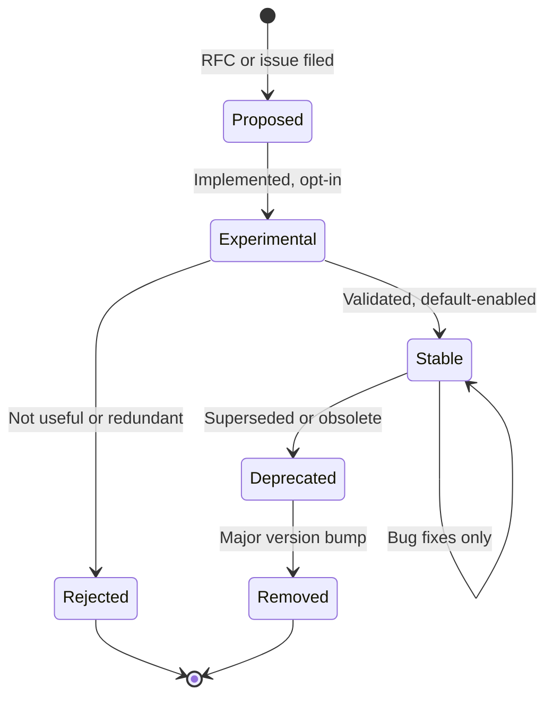

# behave-lint — Rule Taxonomy Design

> **Status:** Canonical rule taxonomy specification.
> **Audience:** Core maintainers, rule authors, plugin developers, QA
> architects, and documentation engineers.
> **Scope:** The complete classification system for all lint rules in
> behave-lint — identifiers, categories, severity, metadata, tags,
> groups, profiles, lifecycle, documentation, plugin integration, and
> future evolution. This document does not define concrete rules,
> implementation code, or rule logic.
> **Dependencies:** This document follows VISION.md, SPECIFICATION.md,
> ARCHITECTURE.md, API.md, RULE_ENGINE.md, DIAGNOSTIC_ENGINE.md,
> CONFIGURATION_SYSTEM.md, PLUGIN_SYSTEM.md, COMPONENT_DESIGN.md, and
> REPOSITORY_DESIGN.md. Inconsistencies, if any, are reported in
> **Appendix A**.

---

## Table of Contents

1. [Philosophy](#1-philosophy)
2. [Rule ID System](#2-rule-id-system)
3. [Categories](#3-categories)
4. [Severity Model](#4-severity-model)
5. [Rule Metadata](#5-rule-metadata)
6. [Rule Tags](#6-rule-tags)
7. [Rule Groups](#7-rule-groups)
8. [Profiles](#8-profiles)
9. [Rule Lifecycle](#9-rule-lifecycle)
10. [Documentation Strategy](#10-documentation-strategy)
11. [Plugin Taxonomy](#11-plugin-taxonomy)
12. [Future Evolution](#12-future-evolution)

---

## 1. Philosophy

### Why a Taxonomy Matters

A rule taxonomy is the **navigational map** of a linter. Without
it, rules are an undifferentiated list — users cannot find relevant
rules, cannot enable groups of rules, cannot understand severity at
a glance, and cannot trust that rule identifiers are stable across
versions. A well-designed taxonomy transforms a flat list into a
structured, discoverable, and trustworthy system.

The behave-lint taxonomy serves six constituencies:

- **End users** need to find rules that match their concerns, enable
  groups of rules, and understand severity without reading every
  rule's documentation.
- **CI engineers** need to configure quality gates by severity and
  category, and need stable rule IDs that do not change between
  versions.
- **Rule authors** need a clear placement system — knowing which
  category and ID range their rule belongs to.
- **Plugin authors** need a namespace system that prevents collisions
  with built-in rules and other plugins.
- **Documentation generators** need categories, tags, and metadata to
  produce organized, navigable rule references.
- **IDE integrators** need severity, category, and metadata to drive
  hover tooltips, code actions, and rule explorer UIs.

### Conceptual Comparison

| Tool | Key Idea | What behave-lint Adopts | What behave-lint Does Differently |
|---|---|---|---|
| **Ruff** | Prefix-based rule sets (`E501`, `F401`), selectors | Stable prefixed IDs (`BC001`), category-based selection | Categories map to concerns, not source tools |
| **ESLint** | Kebab-case names, `recommended`/`strict` presets | Profile presets, educational messages | Coded IDs as primary; kebab-case as aliases |
| **SonarLint** | Type/severity separation, quality profiles | Category vs. severity separation, profiles | BDD-specific categories (Step Definitions) |
| **Clippy** | Groups (correctness, style, complexity, pedantic, nursery) | Group names, nursery → experimental stage | Coded IDs with descriptive aliases |

### Design Validation

**Why multiple inspirations?** Each tool has strengths: Ruff's compact
IDs, ESLint's presets, SonarLint's type/severity separation, Clippy's
group names. Combining them produces a taxonomy familiar to users
from multiple ecosystems.

**Alternatives:** *Novel taxonomy* — rejected (familiarity reduces
learning curve). *Copy one tool* — rejected (BDD has unique concerns:
step definitions, scenario outlines, examples tables).

**Trade-offs:** Not identical to any one tool. Mitigated by clear
documentation and intuitive naming.

**Long-term impact:** Stable rule IDs and closed categories build
trust over years.

---

## 2. Rule ID System

### Identifier Format

Built-in rule IDs follow the format **`B<category><number>`**:

- **`B`** — the prefix for behave-lint built-in rules, distinguishing
  them from plugin rules.
- **`<category>`** — a single uppercase letter representing the rule
  category: `C` (Correctness), `S` (Style), `X` (Complexity), `K`
  (Consistency), `P` (Pedantic), `D` (Step Definitions).
- **`<number>`** — a zero-padded three-digit number assigned
  sequentially within the category (e.g., `001`, `002`, `150`).

**Examples:** `BC001` (Correctness rule #001), `BS001` (Style rule
#001), `BX001` (Complexity rule #001), `BD001` (Step Definitions rule
#001).

This format matches SPECIFICATION.md Appendix A, RULE_ENGINE.md
Section 4, and ARCHITECTURE.md Section 7.

### Number Ranges

Each category has a three-digit number space (001–999), yielding up
to 999 rules per category and 5,994 total built-in rules. The number
space is managed as follows:

| Range | Purpose | Example |
|---|---|---|
| `001`–`499` | Stable rules (released, default-enabled or opt-in) | `BC001`, `BS042` |
| `500`–`699` | Experimental rules (opt-in, may change) | `BX501`, `BP502` |
| `700`–`799` | Reserved for future categories within the prefix | — |
| `800`–`899` | Deprecated rules (retired IDs, not reusable) | `BS801` (deprecated) |
| `900`–`999` | Internal/reserved (parse errors, meta-rules) | `B000` (parse error) |

**`B000`** is a special reserved ID for parse errors, as defined in
SPECIFICATION.md Appendix A. It is not a rule — it is a diagnostic
code for errors that occur during parsing, before any rule executes.

### Plugin Rule IDs

Plugin rules use a **custom prefix** chosen by the plugin author:

- **Format:** `<prefix><number>` (e.g., `ACME001`, `FOO042`).
- **Prefix rules:** 2–5 uppercase letters, not starting with `B`
  (reserved for built-in rules).
- **Number space:** Managed by the plugin author. Plugins may use
  their own category letters or a flat numbering scheme.
- **Collision prevention:** The prefix uniquely identifies the plugin.
  Two plugins with the same prefix will produce a warning at load
  time (the second plugin's rules are not registered).

**Examples:** `ACME001` (ACME plugin rule #001), `FOO042` (FOO plugin
rule #042), `ENT001` (Enterprise pack rule #001).

### Reserved Ranges

| Range | Reservation | Reason |
|---|---|---|
| `B000` | Parse errors | SPECIFICATION.md Appendix A |
| `B001`–`B999` | Not used (missing category letter) | Ambiguous — all built-in IDs must include a category letter |
| `B<category>000` | Reserved per category | Future meta-rules or category-level errors |
| `B<category>800`–`B<category>899` | Deprecated rule IDs | Retired IDs are permanently reserved |
| `B<category>900`–`B<category>999` | Internal | Engine-internal diagnostics, not user-facing rules |

### Experimental Range

Experimental rules are assigned IDs in the `500`–`699` range within
their category. This makes experimental rules visually distinguishable
from stable rules (a user seeing `BX501` knows it is experimental).
When an experimental rule is promoted to stable, it receives a new ID
in the `001`–`499` range. The experimental ID is retired.

**Why reassign IDs on promotion?** Experimental rules may change
behavior between minor versions. A new ID at promotion time signals
that the stable rule has frozen behavior. Users who referenced the
experimental ID receive a deprecation warning pointing to the new ID.

### Deprecated Range

When a stable rule is deprecated, its ID moves to the `800`–`899`
range conceptually — the original ID (e.g., `BS001`) remains valid
but is marked as deprecated in metadata. The ID is permanently
retired when the rule is removed in a major version. No future rule
may reuse a retired ID.

### Enterprise Range

Enterprise packs (plugin rule sets for specific industries) use
plugin prefixes (e.g., `ENT`, `FDA`, `FAA`). There is no separate
built-in range for enterprise rules — enterprise packs are plugins,
not built-in rules. This maintains the separation between the core
tool and industry-specific extensions.

### Future Ranges

Future categories (if added in a major version) would use a new
category letter. For example, a future "Security" category might use
`B` + `N` (for iNtrusion/security) yielding `BN001`. The category
letter is part of the public API and requires a major version bump
to add or remove.

### Design Validation

**Why three-digit numbers?** Three digits provide 999 rules per
category — more than sufficient for a BDD linter (Ruff has ~800 rules
total across all categories). Two digits (99 per category) would be
too few for long-term growth. Four digits would be unnecessarily
verbose.

**Why separate experimental and stable ID ranges?** Visual
distinguishability. A user or reviewer seeing `BX501` immediately
knows the rule is experimental. This prevents accidental reliance on
unstable rules in CI configurations.

**Why reassign IDs on promotion from experimental to stable?**
Experimental rules may change behavior. A new ID at promotion time
creates a clean break — the stable rule's behavior is frozen from
the start. The alternative (keeping the same ID) would mean the same
ID has different stability guarantees at different times, which is
confusing.

**Alternatives considered:**

- *Four-digit numbers:* Rejected — unnecessarily verbose. Three
  digits provide ample space.
- *No separate experimental range:* Rejected — experimental rules
  would be indistinguishable from stable rules by ID alone.
- *Keep the same ID on promotion:* Rejected — the same ID would have
  different stability guarantees over time, breaking user trust.
- *Flat numbering (no category letter in ID):* Rejected — the
  category letter provides semantic grouping and is defined in
  SPECIFICATION.md as immutable.

**Trade-offs:** Reassigning IDs on promotion means users must update
configuration when a rule they use is promoted. This is acceptable —
the deprecation warning guides them, and promotion is infrequent.

**Long-term impact:** The ID system is stable, scalable (5,994
built-in rule slots), and visually informative. Plugin prefixes
prevent collisions. Retired IDs are permanently reserved, preventing
silent semantic changes.

---

## 3. Categories

### Category System

Categories are the **primary classification** of rules. Each rule
belongs to exactly one category. The category is immutable — it
cannot change after a rule is assigned. Categories are part of the
public API and require a major version bump to add or remove.

The six categories are defined in SPECIFICATION.md Section 8,
RULE_ENGINE.md Section 5, and ARCHITECTURE.md Section 7:

| Category | Code | Description | Default Severity |
|---|---|---|---|
| Correctness | `C` | Definitively wrong structures that cause runtime errors or test failures | `ERROR` |
| Style | `S` | Stylistic conventions for readability and consistency | `WARNING` |
| Complexity | `X` | Overly complex specifications that are hard to maintain | `WARNING` |
| Consistency | `K` | Cross-file consistency requirements | `WARNING` |
| Pedantic | `P` | Strict best practices, opt-in, not for everyone | `OFF` |
| Step Definitions | `D` | Cross-reference between Gherkin steps and Python step definitions | `WARNING` |

### Why Concern-Based Categories

behave-lint uses **concern-based categories** (what kind of problem)
rather than **element-type categories** (what part of the file), as
documented in RULE_ENGINE.md Section 5. A rule checking duplicate
scenario names and a rule checking missing scenario descriptions both
examine scenarios — but one is correctness (test ambiguity) and the
other is style (readability). Concern-based categories communicate
**urgency** and **default severity**. Element-type classification is
handled by **tags** (Section 6).

### Category Details

| Category | Code | Concerns | Default Severity | Scope |
|---|---|---|---|---|
| Correctness | `C` | Duplicate scenario names, empty features, invalid tables, outline without examples, invalid tag syntax | `ERROR` | Mostly single-file |
| Style | `S` | Tag casing, keyword ordering, step phrasing, comment style, description formatting | `WARNING` | Single-file |
| Complexity | `X` | Too many steps/scenarios, deep backgrounds, excessive tags, long step text | `WARNING` | Single-file, configurable thresholds |
| Consistency | `K` | Same step text with different keywords across files, inconsistent tag taxonomy, duplicate scenarios across files | `WARNING` | Cross-file |
| Pedantic | `P` | Required descriptions, required tags, background step limits, scenario outline requirements | `OFF` | Single-file or cross-file |
| Step Definitions | `D` | Undefined steps, unused definitions, ambiguous definitions, pattern complexity | `WARNING` | Cross-file (`.feature` + Python files) |

### Execution Order

Categories determine execution order (RULE_ENGINE.md Section 5):

1. Correctness (highest priority — detect real errors first)
2. Style
3. Complexity
4. Consistency
5. Step Definitions
6. Pedantic (lowest priority — opt-in, opinionated)

Within each category, rules are ordered by rule ID (ascending). This
ordering is deterministic and documented.

### Future Categories

New categories require a major version bump because the category
letter is part of the rule ID (a public API). Potential future
categories identified during design:

| Potential Category | Code | Rationale | When |
|---|---|---|---|
| Security | `N` | Security-adjacent rules (e.g., sensitive data in steps) | If security concerns emerge in the BDD ecosystem |
| Performance | `F` | Performance of the test suite itself (e.g., slow step patterns) | If performance analysis becomes a core feature |
| Documentation | `G` | Documentation quality of feature files as living docs | If documentation analysis is requested |

These are **not planned for v1**. They are documented to show that
the taxonomy can accommodate growth without restructuring.

### Design Validation

**Why six categories?** Six categories balance granularity with
simplicity. Fewer categories (e.g., three: correctness, style,
complexity) would merge distinct concerns (consistency and step
definitions would lose their identity). More categories (e.g., ten)
would increase configuration complexity without proportional benefit.

**Why is the category set closed?** Categories are part of the rule
ID (public API). Adding a category changes the ID format, which is a
breaking change. The closed set ensures stability.

**Why are categories immutable per rule?** Changing a rule's category
changes its ID (e.g., `BC001` → `BS001`), which breaks user
configuration. A rule that needs a different category must be
deprecated and replaced with a new rule under the new category.

**Alternatives considered:**

- *Element-type categories (Feature, Scenario, Step, Tags, Tables):*
  Rejected as primary classification — they describe what a rule
  examines, not why it matters. Incorporated as tags (Section 6).
  This decision is documented in RULE_ENGINE.md Section 5.
- *Flat list (no categories):* Rejected — prevents category-based
  selection, ordering, and documentation grouping.
- *Open category set:* Rejected — categories are part of the public
  API. An open set would allow plugins to define categories, leading
  to fragmentation and ID collisions.

**Trade-offs:** Six categories may feel limiting for a large rule
set. Tags compensate by providing secondary classification. The
closed set ensures long-term stability.

**Long-term impact:** The category system is stable, well-understood,
and sufficient for the foreseeable future. New concerns are handled
through tags or future major-version category additions.

---

## 4. Severity Model

### Severity Levels

behave-lint defines four severity levels, matching SPECIFICATION.md
Section 8, RULE_ENGINE.md Section 4, API.md Section 4, and
DIAGNOSTIC_ENGINE.md Section 4:

| Severity | Description | Exit Code Impact | Default For |
|---|---|---|---|
| `ERROR` | Definitively wrong. Must be fixed. | Exit 1 | Correctness rules |
| `WARNING` | Likely wrong. Should be reviewed. | Exit 0 (default) or 1 (configurable) | Style, Complexity, Consistency, Step Definitions |
| `INFO` | Suggestion. Optional. | Exit 0 | — (used for educational diagnostics) |
| `OFF` | Rule is disabled. No diagnostics produced. | No effect | Pedantic rules |

### Severity vs. Category

Severity and category are **independent dimensions**:

- **Category** classifies *what kind* of issue it is (correctness,
  style, complexity, etc.). Category is immutable per rule.
- **Severity** classifies *how urgent* the issue is. Severity is
  configurable per rule.

A rule's **default severity** is determined by its category
(RULE_ENGINE.md Section 4), but users can override it:

```toml
[tool.behave-lint]
severity = { BC001 = "warning", BS001 = "error" }
```

This design separates the intrinsic nature of the issue (category)
from its urgency in a specific project (severity). A team in early
adoption may downgrade all correctness rules to warnings; a regulated
team may upgrade all style rules to errors.

### Severity Philosophy

**Why four levels?** The four levels (`ERROR`, `WARNING`, `INFO`,
`OFF`) match the conventions of ESLint, Ruff, and SonarLint. They
cover the full range from "must fix" to "disabled" without
over-granularity.

**Why not five or more levels?** Additional levels (e.g., SonarLint's
five) create decision fatigue. Four is sufficient: `ERROR` = must fix,
`WARNING` = should fix, `INFO` = consider fixing, `OFF` = don't check.

**Why is `OFF` a severity, not a separate flag?** Setting severity
to `OFF` is the simplest way to disable a rule. It avoids a separate
`enabled`/`disabled` flag that would need its own configuration key
and interaction rules with `select`/`ignore`. This matches ESLint's
model (severity `0` = off) and Ruff's model (rules can be set to
`OFF`).

### Custom Severity (Future)

SPECIFICATION.md Section 8 notes: "Custom severity levels may be
supported (e.g., `critical` for security-adjacent rules)." Custom
severities are **not implemented in v1** but the design reserves
space:

- A future `CRITICAL` severity (above `ERROR`) could be used for
  security-adjacent rules that should fail CI unconditionally.
- A future `HINT` severity (below `INFO`) could be used for
  educational suggestions that never appear in default output.

Custom severities would be added in a minor version (they are
additive and do not break existing configuration).

### Severity in Diagnostics

Each diagnostic carries a severity (DIAGNOSTIC_ENGINE.md Section 3)
— the **effective severity** after applying user overrides. The
diagnostic engine uses severity for filtering (below `fail-on` = not
fatal), sorting (error before warning before info), and output (color
coding, JSON field, SARIF mapping).

### Design Validation

**Why separate severity from category?** Combining them (e.g., all
correctness rules are always errors) removes user flexibility. A
team adopting behave-lint incrementally may want correctness rules at
warning severity initially, then upgrade to error once the codebase
is clean. Separating severity from category enables this workflow.

**Why is default severity determined by category?** Most users never
configure severity. The default severity should reflect the intrinsic
urgency of the category. Correctness issues are urgent (error);
style issues are not (warning); pedantic issues are opt-in (off).
Category-based defaults provide sensible behavior out of the box.

**Alternatives considered:**

- *Five+ severity levels:* Rejected — decision fatigue, insufficient
  benefit.
- *No `OFF` severity (separate enable/disable flag):* Rejected —
  adds configuration complexity. `OFF` as a severity is simpler.
- *Per-project severity presets:* Future enhancement (profiles,
  Section 8). Not needed for v1.

**Trade-offs:** Four levels may be too few for some use cases (e.g.,
distinguishing "critical security" from "regular error"). Mitigated
by the future `CRITICAL` severity and by tags (Section 6) which
allow filtering by concern.

**Long-term impact:** The severity model is stable and familiar to
users from other linters. Custom severities can be added
additively without breaking existing configuration.

---

## 5. Rule Metadata

### Metadata Overview

Every rule carries a **metadata object** (`RuleMetadata`) that serves
as its identity card. Metadata drives configuration validation,
documentation generation, CLI features (`behave-lint rules`,
`behave-lint explain`), diagnostic enrichment, and plugin
compatibility checking.

The metadata fields defined in RULE_ENGINE.md Section 4 are the
foundation. This document extends the metadata schema with additional
fields for taxonomy purposes. Fields marked **(existing)** are
defined in RULE_ENGINE.md. Fields marked **(new)** are introduced in
this document.

### Complete Metadata Schema

| Field | Type | Required | Source | Description |
|---|---|---|---|---|
| `rule_id` | `str` | Yes | Existing | Stable, unique identifier (e.g., `BC001`) |
| `name` | `str` | Yes | Existing | Short, human-readable, kebab-case name |
| `title` | `str` | Yes | New | One-line summary for CLI and documentation |
| `description` | `str` | Yes | Existing | One-paragraph description of what the rule checks |
| `category` | `Category` | Yes | Existing | Rule category (one of six) |
| `default_severity` | `Severity` | Yes | Existing | Default severity when enabled |
| `motivation` | `str` | Yes | New | Why the rule exists — the problem it solves |
| `examples` | `list[RuleExample]` | Yes | Existing | Before/after examples for documentation |
| `tags` | `list[str]` | No | Existing | Free-form tags for filtering and grouping |
| `references` | `list[str]` | No | New | External references (URLs, book sections, standards) |
| `can_fix` | `AutoFixCapability` | No | Existing | Auto-fix capability: `NONE`, `SAFE`, `UNSAFE` |
| `configurable` | `bool` | No | New | Whether the rule accepts parameters. Defaults to `false` |
| `since` | `str` | Yes | Existing | Version when the rule was introduced |
| `deprecated` | `bool` | No | Existing | Whether the rule is deprecated |
| `deprecated_version` | `str \| None` | No | New | Version in which the rule was deprecated |
| `replaced_by` | `str \| None` | No | Existing | Rule ID that replaces this one |
| `aliases` | `list[str]` | No | Existing | Alternative names for backward compatibility |
| `dependencies` | `list[str]` | No | Existing | Rule IDs that must execute before this rule |
| `conflicts` | `list[str]` | No | Existing | Rule IDs that conflict with this rule |
| `experimental` | `bool` | No | Existing | Whether the rule is experimental |
| `doc_url` | `str \| None` | No | Existing | URL to rule documentation |
| `author` | `str \| None` | No | Existing | Author or maintainer |
| `min_version` | `str \| None` | No | Existing | Minimum behave-lint version required |
| `estimated_fix_cost` | `FixCost` | No | New | Estimated effort to fix: `TRIVIAL`, `LOW`, `MEDIUM`, `HIGH` |
| `performance_impact` | `PerformanceImpact` | No | New | Execution cost: `NEGLIGIBLE`, `LOW`, `MEDIUM`, `HIGH` |
| `educational_value` | `EducationalValue` | No | New | Pedagogical value: `NONE`, `LOW`, `MEDIUM`, `HIGH` |

### New Field Details

| Field | Purpose | Why Added |
|---|---|---|
| `title` | One-line summary for CLI/docs (between `name` and `description`) | CLI `behave-lint rules` needs a concise label |
| `motivation` | Why the rule exists (distinct from `description` which says what) | `behave-lint explain` benefits from dedicated motivation |
| `references` | External URLs, book sections, standards | Enables "Further Reading" in generated docs |
| `configurable` | Whether the rule accepts parameters | CLI/docs need to indicate which rules have parameters |
| `deprecated_version` | Version when deprecated | Needed for migration guides and CLI deprecation messages |
| `estimated_fix_cost` | Effort to fix: `TRIVIAL`, `LOW`, `MEDIUM`, `HIGH` | IDE/CI dashboards can prioritize remediation |
| `performance_impact` | Execution cost: `NEGLIGIBLE`, `LOW`, `MEDIUM`, `HIGH` | `--statistics` can show cost alongside execution time |
| `educational_value` | Pedagogical value: `NONE`, `LOW`, `MEDIUM`, `HIGH` | `education` profile selects high-value rules at `INFO` |

### Metadata Immutability

Metadata is immutable for stable rules (RULE_ENGINE.md Section 4).
Changes require:

- **Behavior change:** New rule ID (old deprecated, new introduced).
- **Documentation change (description, examples, motivation):** Minor
  version bump.
- **Severity change:** New rule ID (severity is part of the contract).
- **Category change:** New rule ID (category is part of the identity).

New metadata fields can be added in minor versions (they are optional
with defaults and do not break existing rules).

### Design Validation

**Why extend metadata?** RULE_ENGINE.md fields cover operational needs
(execution, filtering, validation). New fields serve **taxonomy and
documentation** needs — fix cost, performance impact, educational
value, references. These enrich the rule's identity without changing
the execution model.

**Why optional with defaults?** Existing rules and plugins written for
v1.0 do not have these fields. Optional with defaults ensures backward
compatibility.

**Alternatives:** *No extension* — rejected (taxonomy needs richer
metadata). *External metadata files* — rejected (RULE_ENGINE.md
Section 4: synchronization problem). *Required new fields* — rejected
(breaks existing plugins).

**Trade-offs:** More boilerplate per rule. Acceptable — metadata is
valuable and boilerplate is a one-time cost.

**Long-term impact:** Supports future features (IDE rule explorer,
remediation prioritization, educational mode) without restructuring.

---

## 6. Rule Tags

### Tag System

Tags are **secondary classifiers** that supplement categories. A rule
has exactly one category but zero or more tags. Tags are free-form
strings, but a **recommended tag vocabulary** is defined to ensure
consistency.

Tags serve three purposes:

1. **Filtering:** `behave-lint rules --tag scenario` shows all rules
   tagged with `scenario`.
2. **Documentation grouping:** The documentation generator can group
   rules by tag within categories.
3. **IDE integration:** IDE rule explorers can filter by tag.

### Recommended Tag Vocabulary

#### Gherkin Element Tags

These tags identify which Gherkin element a rule examines. They
correspond to the element-type categories suggested in the user's
Phase 10 request, incorporated as tags per RULE_ENGINE.md Section 5.

| Tag | Description |
|---|---|
| `feature` | Rules that examine the Feature element |
| `scenario` | Rules that examine individual scenarios |
| `scenario-outline` | Rules specific to Scenario Outlines |
| `background` | Rules that examine Background blocks |
| `step` | Rules that examine individual Given/When/Then steps |
| `tag` | Rules that examine tags |
| `examples` | Rules that examine Examples tables |
| `table` | Rules that examine data tables |
| `doc-string` | Rules that examine Doc Strings |
| `rule` | Rules that examine the Gherkin Rule element |
| `comments` | Rules that examine comments |

#### Quality Characteristic Tags

These tags identify which quality characteristic a rule addresses.

| Tag | Description |
|---|---|
| `readability` | Rules that improve readability |
| `maintainability` | Rules that improve maintainability |
| `organization` | Rules that improve project organization |
| `naming` | Rules that enforce naming conventions |
| `formatting` | Rules that enforce formatting conventions |
| `bdd` | Rules specific to BDD methodology |
| `accessibility` | Rules that improve accessibility of specifications |
| `documentation` | Rules that improve documentation quality |
| `performance` | Rules related to test suite performance |
| `security` | Rules related to security concerns |
| `consistency` | Rules that enforce consistency |

#### Lifecycle Tags

These tags indicate the rule's maturity or special status.

| Tag | Description |
|---|---|
| `experimental` | Rule is experimental (also set in metadata) |
| `preview` | Rule is in preview (between experimental and stable) |
| `deprecated` | Rule is deprecated (also set in metadata) |
| `new` | Rule was recently added (within the last minor version) |

#### Domain Tags

These tags identify the domain or methodology the rule relates to.

| Tag | Description |
|---|---|
| `gherkin` | Rules about Gherkin syntax |
| `behave` | Rules specific to the Behave framework |
| `cucumber` | Rules applicable to Cucumber-style BDD |
| `agile` | Rules related to agile/BDD practices |

### Tag Rules

- **Tags are optional:** A rule may have zero tags.
- **Tags are not unique:** Multiple rules can share the same tag.
- **Tags are not categories:** Tags do not affect severity, execution
  order, or ID assignment.
- **Tags are additive:** New tags can be added at any time without a
  version bump (they are not part of the public API in the same way
  categories are).
- **Plugin tags:** Plugins may define their own tags. Plugin tags
  should be prefixed with the plugin name to avoid collisions (e.g.,
  `acme:compliance`).

### Design Validation

**Why tags in addition to categories?** Categories are a single
dimension (concern). Tags add multiple dimensions (element type,
quality characteristic, lifecycle, domain). A rule like "Duplicate
scenario name" has category `C` (Correctness) and tags `scenario`,
`naming`, `bdd`. This multidimensional classification is more
expressive than either alone.

**Why a recommended vocabulary rather than a fixed set?** A fixed set
would require a version bump to add tags. A recommended vocabulary
allows organic growth while providing consistency. Plugins can define
their own tags without waiting for core approval.

**Why not use categories for element types?** This is explicitly
addressed in RULE_ENGINE.md Section 5: element-type categories
describe *what* a rule examines, not *why* it matters. Concern-based
categories communicate urgency; element-type tags communicate scope.

**Alternatives considered:**

- *No tags (categories only):* Rejected — single-dimensional
  classification is insufficient for a growing rule set.
- *Fixed tag set (closed vocabulary):* Rejected — too rigid. New tags
  would require version bumps.
- *Hierarchical tags (tag taxonomy):* Rejected — adds complexity
  without clear benefit. Flat tags with a recommended vocabulary are
  simpler and sufficient.

**Trade-offs:** Free-form tags may lead to inconsistency (e.g.,
`scenario` vs. `scenarios`). Mitigated by the recommended vocabulary
and by code review enforcement.

**Long-term impact:** Tags provide a flexible secondary
classification that grows with the rule set. The recommended
vocabulary ensures consistency while allowing extension.

---

## 7. Rule Groups

### Group Concept

Rule groups are **named collections of rules** that can be enabled or
disabled as a unit. Groups are lighter than profiles (Section 8) —
they are simply named sets, not full configuration bundles.

Groups are a **future feature** (CONFIGURATION_SYSTEM.md Section 6
reserves the `[tool.behave-lint.groups]` section for v1.1+). The
taxonomy defines group names now to ensure consistency when the
feature is implemented.

### Standard Groups

| Group | Description | Rules Included | Default Severity |
|---|---|---|---|
| `recommended` | The recommended set for most projects | All stable rules except pedantic | Default severities |
| `strict` | All rules at elevated severity | All stable rules including pedantic | `ERROR` for all |
| `pedantic` | All pedantic rules | All rules in category `P` | `WARNING` |
| `complexity` | All complexity rules | All rules in category `X` | Default severities |
| `consistency` | All consistency rules | All rules in category `K` | Default severities |
| `step-definitions` | All step definition rules | All rules in category `D` | Default severities |
| `style` | All style rules | All rules in category `S` | Default severities |
| `correctness` | All correctness rules | All rules in category `C` | Default severities |
| `experimental` | All experimental rules | All rules with `experimental = true` | Default severities |
| `deprecated` | All deprecated rules | All rules with `deprecated = true` | Default severities |
| `fixable` | All rules with auto-fix capability | All rules with `can_fix != NONE` | Default severities |
| `safe-fixable` | All rules with safe auto-fix | All rules with `can_fix == SAFE` | Default severities |

### Group Semantics

- **Category groups** (`correctness`, `style`, `complexity`,
  `consistency`, `pedantic`, `step-definitions`) are equivalent to
  selecting all rules in that category. They provide a shorthand.
- **`recommended`** is the default-enabled set: all stable rules
  except pedantic. This is what users get with no configuration.
- **`strict`** enables all rules (including pedantic) at `ERROR`
  severity. This is for regulated environments or teams that want
  maximum enforcement.
- **`experimental`** enables all experimental rules. Useful for
  testing rules before they are promoted to stable.
- **`fixable`** and **`safe-fixable`** enable rules that can be
  auto-fixed. Useful with `--fix` to apply all available fixes.

### Custom Groups (Future)

Users may define custom groups:

```toml
[tool.behave-lint.groups]
team-conventions = ["BC001", "BS001", "BK002"]
critical-only = ["BC001", "BC002", "BC003"]
```

Custom groups are not implemented in v1 (CONFIGURATION_SYSTEM.md
Section 6).

### Design Validation

**Why define groups if they are a future feature?** Defining group
names now ensures that when the feature is implemented, the names are
consistent across documentation, CLI, and configuration. Users who
see `recommended` in documentation should be able to use it in
configuration once the feature ships.

**Why are category groups needed when `select = ["BC"]` could select
a category prefix?** Prefix-based selection (e.g., `select = ["BC"]`
to select all correctness rules) is a future enhancement
(CONFIGURATION_SYSTEM.md Section 6). Groups provide a named,
documented alternative that is more explicit and extensible.

**Alternatives considered:**

- *No groups (individual rules only):* Rejected — tedious for large
  rule sets. Users need bulk selection.
- *Groups in v1:* Rejected — the v1 rule set is small enough that
  individual selection is manageable. Groups become valuable at 50+
  rules.
- *Prefix-based selection only:* Considered for v1.1+ as an
  additional mechanism. Groups are more explicit and support
  non-category groupings (`fixable`, `experimental`).

**Trade-offs:** Defining groups before implementation means the names
are reserved but not functional. This is acceptable — the
CONFIGURATION_SYSTEM.md already reserves the `groups` section.

**Long-term impact:** Groups provide a scalable selection mechanism
as the rule set grows. Custom groups allow teams to define their own
conventions.

---

## 8. Profiles

### Profile Concept

Profiles are **predefined configuration bundles** that enable a
curated set of rules with specific severities and parameters. They
provide a one-line way to adopt a comprehensive rule set without
enumerating individual rules.

Profiles are **not implemented in v1** (CONFIGURATION_SYSTEM.md
Section 7) but the `extends` key is reserved and the profile names
are defined here for consistency.

### Standard Profiles

| Profile | Description | Target User | Rules | Severities |
|---|---|---|---|---|
| `default` | All stable rules at default severities | New users, most projects | All stable, non-pedantic | Category defaults |
| `recommended` | Stable rules plus selected pedantic at elevated severity | Teams wanting thorough checking | All stable + selected pedantic | Elevated (pedantic → warning) |
| `strict` | All rules including experimental at error severity | Regulated industries, strict CI | All rules | `ERROR` for all |
| `enterprise` | Comprehensive with step-definition and cross-file | Large organizations | All stable + step definitions + consistency | `ERROR` for correctness, `WARNING` for rest |
| `ci` | Optimized for CI pipelines | CI/CD pipelines | All stable, non-pedantic | `ERROR` for correctness, `WARNING` for rest, JSON output, cache enabled |
| `education` | Pedantic rules at info severity for learning | Learning Gherkin best practices | All pedantic + selected style | `INFO` for all |
| `legacy` | Reduced set for projects migrating from other tools | Projects new to linting | Correctness only | `WARNING` for correctness, rest off |
| `migration` | Rules for migrating between behave-lint versions | Users upgrading major versions | Deprecated rules at info | `INFO` for deprecated |

### Profile Composition

Profiles can extend other profiles (CONFIGURATION_SYSTEM.md Section
7):

```
strict extends recommended extends default
enterprise extends recommended
ci extends default
education extends default (with overrides)
```

This hierarchy avoids duplication — `strict` only needs to define
what it adds to `recommended` (pedantic rules, error severity).

### Profile Activation

```toml
[tool.behave-lint]
extends = "strict"
```

Profile settings are merged with project configuration. Project
configuration overrides profile settings (project > profile >
defaults).

### Profile Selection Logic

Each profile defines:

1. **Rule inclusion:** Which rules are enabled (by group, category,
   or individual ID).
2. **Severity overrides:** What severity each rule uses.
3. **Parameter overrides:** What parameters are set (e.g.,
   `max-steps = 5` for `strict`).
4. **Output configuration:** Output format, cache settings (for `ci`).

### Design Validation

**Why define profiles if they are a future feature?** Same rationale
as groups (Section 7): defining names now ensures consistency when
the feature ships. The `extends` key is already reserved in
CONFIGURATION_SYSTEM.md Section 7.

**Why these specific profiles?** Each profile targets a documented
persona from VISION.md Section 5:

- `default` → new users (Persona: Developer)
- `recommended` → teams (Persona: Tech Lead)
- `strict` → regulated industries (Persona: Compliance Officer)
- `enterprise` → large organizations (Persona: Engineering Manager)
- `ci` → CI engineers (Persona: CI Engineer)
- `education` → learners (Persona: Consultant)
- `legacy` → migrating projects (Persona: Maintainer)
- `migration` → upgrading users (cross-cutting)

**Why profile hierarchy?** Avoids duplication. `strict` does not
redefine everything in `recommended` — it extends it. This makes
profiles maintainable as the rule set grows.

**Alternatives considered:**

- *No profiles (rules only):* Rejected — tedious for large rule sets.
  CONFIGURATION_SYSTEM.md Section 7 already reserves the feature.
- *Profiles in v1:* Rejected — the v1 rule set is small. Profiles
  become valuable at 50+ rules.
- *Flat profiles (no hierarchy):* Rejected — leads to duplication
  and maintenance burden.

**Trade-offs:** Reserving `extends` without implementing it means the
key is accepted but ignored in v1. Users who set `extends` get a
warning ("profiles not yet supported") and the default rule set.

**Long-term impact:** Profiles provide a scalable configuration
mechanism. The profile hierarchy supports community-contributed
profiles (future marketplace).

---

## 9. Rule Lifecycle

### Lifecycle Stages

Rules progress through a defined lifecycle, matching RULE_ENGINE.md
Section 2 and SPECIFICATION.md Section 8:



### Stage Details

| Stage | ID Range | Key Properties |
|---|---|---|
| **Proposed** | None | RFC filed with purpose, category, severity, examples. No code yet. Community vetting. |
| **Experimental** | `500`–`699` | Opt-in only. May change behavior between minor versions. `experimental = true`. Not in any profile. May produce false positives. |
| **Stable** | `001`–`499` | Default-enabled (if severity > `OFF`). Frozen behavior — changes require new rule ID. Bug fixes do not require new ID. Included in `default` profile. |
| **Deprecated** | Original ID retained | Functional but emits `DeprecationWarning`. Removed from default set. `deprecated = true`, `replaced_by` set. Scheduled for removal in next major version. |
| **Removed** | Permanently retired | Removed in major version. ID can never be reused. Listed in MIGRATION_GUIDE.md with replacement. |

**Promotion:** Experimental → stable assigns a new ID in `001`–`499`.
The experimental ID is retired with a deprecation warning.

**Stability guarantee:** A stable rule's diagnostics for a given input
do not change between minor versions.

### Compatibility

- **Configuration:** Deprecated rules remain configurable. Removed
  rules produce an error with a migration message.
- **Inline disable:** Comments for removed rules produce a warning.
- **Plugin rules:** Follow the same lifecycle, managed by the plugin
  author (RULE_ENGINE.md Section 14).

### Design Validation

**Why a formal lifecycle?** Ensures rules are vetted before becoming
defaults, breaking changes are communicated, and users have time to
migrate. Inspired by Rust's stability model.

**Why reassign IDs on promotion?** Experimental rules may change
behavior. A new ID creates a clean break — the stable rule's behavior
is frozen from the start.

**Why permanently retire removed IDs?** Reusing a removed ID would
silently change behavior — `select = ["BC001"]` would enable a
different rule than intended.

**Alternatives:** *No lifecycle* — rejected (unvetted rules in
defaults). *Two stages only* — rejected (no cautious introduction).
*Keep same ID on promotion* — rejected (different stability over
time).

**Trade-offs:** Process overhead (RFC, promotion, deprecation).
Acceptable — correctness and stability are top priorities.

**Long-term impact:** Supports graceful evolution without breaking
user configuration.

---

## 10. Documentation Strategy

### Per-Rule Documentation

Every rule is documented through its metadata. The metadata drives:
CLI `--explain` output, online documentation pages, IDE hover
tooltips, and JSON output metadata.

### Documentation Structure

Each rule's documentation page contains: header (ID, title, category,
severity badges), description, motivation, before/after examples,
configuration (if `configurable`), auto-fix info (if `can_fix !=
NONE`), related rules (by tag/category), references, migration (if
deprecated), FAQ, and metadata table (since, deprecated version,
author, tags, aliases, performance impact, fix cost, educational
value).

### Naming Convention

- **URL:** `/rules/<rule-id>/` (e.g., `/rules/BC001/`).
- **File:** `docs/rules/BC001.md` (future documentation site).
- **Title:** `<rule-id>: <title>` (e.g., `BC001: Duplicate Scenario
  Name`).

### Cross-References

Rules are cross-referenced by category, tags, conflicts, dependencies,
and replacement (if deprecated).

### Migration and Auto-Fix Documentation

Deprecated rules update MIGRATION_GUIDE.md with deprecated ID,
replacement ID, configuration changes, and before/after examples.
Auto-fixable rules document fix description, safety level (`SAFE`/
`UNSAFE`), and before/after examples.

### FAQ

Each rule's FAQ addresses: why not enabled by default (pedantic), how
to disable per-file, what to do if disagreeing, and known false
positives.

### Design Validation

**Why metadata-driven?** Always accurate — generated from the same
source that drives rule behavior. Inspired by Ruff's rule catalog and
Clippy's educational messages.

**Why per-rule FAQ?** Reduces support burden — common questions
answered in docs rather than GitHub issues.

**Alternatives:** *Hand-written docs* — rejected (drifts from
behavior). *No FAQ* — rejected (repeated issues). *Wiki* — rejected
(unversioned, REPOSITORY_DESIGN.md Section 8).

**Trade-offs:** Documentation quality depends on metadata quality.
Mitigated by requiring complete metadata at rule introduction.

**Long-term impact:** Supports a future MkDocs/Sphinx documentation
site via structured metadata.

---

## 11. Plugin Taxonomy

### Plugin Rule Integration

Plugin rules are **first-class citizens** — same metadata schema,
lifecycle, and execution pipeline as built-in rules (RULE_ENGINE.md
Section 14). The taxonomy extends to plugins with minimal differences.

### Plugin Naming and IDs

- **Package:** `behave-lint-<name>` (e.g., `behave-lint-acme-rules`).
- **Rule ID prefix:** 2–5 uppercase letters, not starting with `B`
  (e.g., `ACME`, `FOO`, `ENT`). Format: `<prefix><number>`.
- **Collision prevention:** Prefix uniquely identifies the plugin.
  Duplicate prefixes produce a warning; second plugin's rules are not
  registered.

### Plugin Categories and Tags

Plugin rules use the **same six categories** — no custom categories
allowed (closed set, Section 3). Plugin rules that don't fit neatly
use the closest category and tags for secondary classification.

Plugin tags are prefixed with the plugin name (e.g., `acme:compliance`)
to prevent collisions with built-in tags and other plugins.

### Plugin Documentation, Versioning, and Isolation

Plugin rules use the same metadata schema. `behave-lint explain
<plugin-rule-id>` displays metadata including the `author` field.
Plugin authors maintain their own documentation via `doc_url`.

Plugins declare compatibility via Python package dependencies
(`behave-lint>=1.0,<2.0`). The plugin API is stable within a major
version.

Plugin isolation (RULE_ENGINE.md Section 14): load failure,
registration failure, and execution isolation — all emit warnings and
continue without the affected plugin.

### Plugin Lifecycle

Plugin rules follow the same lifecycle (Section 9), managed by the
plugin author. The engine respects `experimental`, `deprecated`, and
`replaced_by` metadata regardless of source.

### Design Validation

**Why same categories for plugins?** Seamless integration — plugin
rules can be selected by category, ordered with built-ins, and appear
in the same documentation grouping.

**Why prefix plugin tags?** Prevents collisions with built-in tags and
other plugins.

**Why no custom categories?** Categories are part of the rule ID
(public API). Custom letters could collide with future built-in
categories.

**Alternatives:** *Custom plugin categories* — rejected (fragments
taxonomy). *Automatic tag prefixing* — rejected (explicit is clearer).
*Plugin-specific severities* — rejected (complicates filtering).

**Trade-offs:** Restricting to six categories may force imperfect
fit. Mitigated by tags. Benefit (seamless integration) outweighs cost.

**Long-term impact:** Plugin ecosystem is consistent and navigable
using the same mental model as built-in rules.

---

## 12. Future Evolution

### Short-Term (v1.1–v1.x)

- **Profiles and groups implementation:** The `extends` key and
  `[tool.behave-lint.groups]` section are activated. Standard
  profiles (Section 8) and groups (Section 7) become functional.
- **Additional rules:** New rules added per category, filling gaps
  in the taxonomy. Each new rule follows the lifecycle (Section 9).
- **Prefix-based selection:** `select = ["BC"]` to select all
  correctness rules (shorthand for the `correctness` group).
- **Cookiecutter template:** A plugin template for quick scaffolding,
  including recommended tag usage and metadata boilerplate.
- **Documentation site:** MkDocs or Sphinx site with per-rule pages
  generated from metadata.

### Medium-Term (v2.0–v3.x)

- **New categories:** If needed, new categories (e.g., Security `N`,
  Performance `F`, Documentation `G`) are added in a major version.
  Each new category gets a letter and a number range.
- **AI rule suggestions:** Analyze a project's feature files and
  suggest custom rules based on detected patterns. AI-generated rules
  would be registered through the same interface as manual rules
  (RULE_ENGINE.md Section 15).
- **Rule marketplace:** A web platform for discovering and installing
  community rules. Marketplace rules are standard Python packages
  discovered via entry points. The taxonomy (categories, tags,
  metadata) drives the marketplace UI.
- **Cloud rules:** Cloud-hosted rule sets that can be downloaded and
  installed. The discovery mechanism extends to fetch rules from a
  remote registry.

### Long-Term (v4.0–v5+)

- **Industry packs:** Curated rule sets for specific industries
  (healthcare, aviation, finance). Distributed as plugins with
  industry-specific prefixes (e.g., `FDA001`, `FAA001`).
- **Compliance packs:** Rule sets that enforce regulatory compliance
  (e.g., requiring traceability tags on all scenarios for FDA
  compliance). Compliance packs include documentation that maps each
  rule to a specific regulatory requirement.
- **Certification packs:** Rule sets that certify a project meets a
  quality standard (e.g., "BDD Quality Certified"). Certification
  packs include a scoring system based on rule compliance.
- **Organization packs:** Custom rule sets for specific organizations.
  Organization packs use the organization's prefix and may include
  custom tags (e.g., `acme:policy`).
- **AI rule engine:** AI-assisted rule creation, anomaly detection,
  and natural language rules. AI-generated rules use the same
  metadata schema and lifecycle as manual rules.

### Reserved Space

| Future Feature | Taxonomy Impact | When |
|---|---|---|
| Profiles implementation | Activate `extends` key | v1.1+ |
| Groups implementation | Activate `[tool.behave-lint.groups]` | v1.1+ |
| New categories | New category letters in rule IDs | v2.0+ (major version) |
| AI rules | AI-generated rules use existing taxonomy | v3.0+ |
| Marketplace | Taxonomy drives marketplace UI | v3.0+ |
| Industry packs | New plugin prefixes (FDA, FAA, etc.) | v4.0+ |
| Compliance packs | New tags (`compliance`, `regulatory`) | v4.0+ |
| Certification packs | New tags (`certification`), scoring metadata | v5.0+ |

### Design Validation

**Why design future evolution now?** The taxonomy must accommodate
years of growth. Designing extension points (new categories, new
tags, new profiles, plugin prefixes) is cheap; restructuring the
taxonomy is expensive. VISION.md Section 16 defines a 5–10 year
roadmap.

**Why are new categories a major version change?** Categories are
part of the rule ID (public API). Adding a category adds a new letter
to the ID format, which is a breaking change. This is intentional —
categories are stable and changes are communicated clearly.

**Why not allow open categories for plugins?** Open categories would
fragment the taxonomy and risk ID collisions. The closed set ensures
consistency. Plugins use tags for secondary classification.

**Alternatives considered:**

- *YAGNI (no future design):* Rejected — the taxonomy must support
  10+ years of evolution. Designing extension points is cheap.
- *Open category set:* Rejected — risks fragmentation and ID
  collisions. Closed set with tags for secondary classification.
- *No industry/compliance packs:* Rejected — VISION.md Section 16
  identifies enterprise ecosystem expansion as a long-term goal.

**Trade-offs:** Designing for evolution adds some complexity
(reserved ranges, future category letters, future tags). This is
acceptable because the complexity is bounded and the benefit (years
of maintainable evolution) is significant.

**Long-term impact:** The taxonomy ensures that behave-lint can grow
from a v1 linter with 50 rules to a v5+ platform with hundreds of
rules, plugin ecosystem, marketplace, and industry packs — all within
the same classification system.

---

## Appendix A: Consistency Check

| # | Check | Result |
|---|---|---|
| 1 | Rule ID convention `B<category><number>` matches SPECIFICATION.md Appendix A, RULE_ENGINE.md Section 4, ARCHITECTURE.md Section 7 | Consistent |
| 2 | 6 categories match SPECIFICATION.md Section 8, RULE_ENGINE.md Section 5, API.md Section 4 | Consistent |
| 3 | 4 severity levels match SPECIFICATION.md, RULE_ENGINE.md, API.md, DIAGNOSTIC_ENGINE.md | Consistent |
| 4 | Lifecycle (Proposed → Experimental → Stable → Deprecated → Removed) matches RULE_ENGINE.md Section 2, SPECIFICATION.md Section 8 | Consistent |
| 5 | Metadata extends RULE_ENGINE.md Section 4 with optional fields (superset, backward-compatible) | Consistent (superset) |
| 6 | Tags vs. categories distinction matches RULE_ENGINE.md Section 5 | Consistent |
| 7 | Profiles as future feature matches CONFIGURATION_SYSTEM.md Section 7 | Consistent |
| 8 | Groups as future feature matches CONFIGURATION_SYSTEM.md Section 6 | Consistent |
| 9 | Plugin rules as first-class citizens matches RULE_ENGINE.md Section 14 | Consistent |
| 10 | `behave_lint.rules` entry points match RULE_ENGINE.md Section 3, ARCHITECTURE.md Section 13 | Consistent |
| 11 | Auto-fix `NONE`/`SAFE`/`UNSAFE` matches RULE_ENGINE.md, API.md, ARCHITECTURE.md | Consistent |
| 12 | Category-based execution order matches RULE_ENGINE.md Section 5, ARCHITECTURE.md Section 7 | Consistent |
| 13 | Metadata immutability for stable rules matches RULE_ENGINE.md Section 4 | Consistent |
| 14 | Permanent ID retirement matches RULE_ENGINE.md Section 2, SPECIFICATION.md Section 8 | Consistent |
| 15 | PLUGIN_SYSTEM.md: not found in repository. Plugin design covered in RULE_ENGINE.md Section 14, ARCHITECTURE.md Section 13 | Note: Not found |

**No inconsistencies detected.**

---

## Appendix B: Glossary

| Term | Definition |
|---|---|
| **Taxonomy** | The classification system for all lint rules. |
| **Rule ID** | Stable, unique identifier. `B<category><number>` for built-in, `<prefix><number>` for plugins. |
| **Category** | Primary classification (one of six concern-based categories). |
| **Tag** | Secondary classifier supplementing categories. |
| **Severity** | Urgency level: `ERROR`, `WARNING`, `INFO`, `OFF`. |
| **Rule Group** | Named collection of rules for bulk selection (future). |
| **Profile** | Predefined configuration bundle (future). |
| **Rule Metadata** | Identity card of a rule — drives config, docs, CLI, IDE. |
| **Lifecycle** | Proposed → Experimental → Stable → Deprecated → Removed. |
| **Plugin Prefix** | 2–5 letter prefix for plugin rule IDs (e.g., `ACME`). |
| **Enterprise Pack** | Curated plugin rule set for specific industries. |
| **Compliance Pack** | Plugin rule set enforcing regulatory compliance. |
| **Certification Pack** | Plugin rule set certifying quality standards. |
